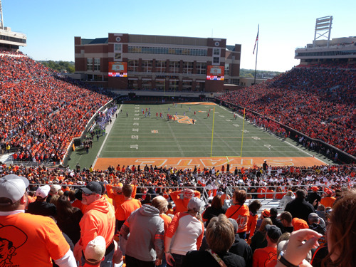  
풋볼 경기가 열리고 있는 OSU의 분 피켄스 스테이디엄(Boone Pickesns Stadium)

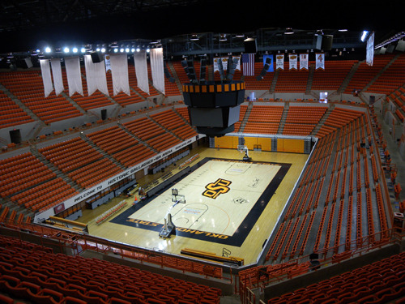  
OSU의 실내 농구경기장 갤러거 아이바 아레나(Gallagher-Iba Arena)

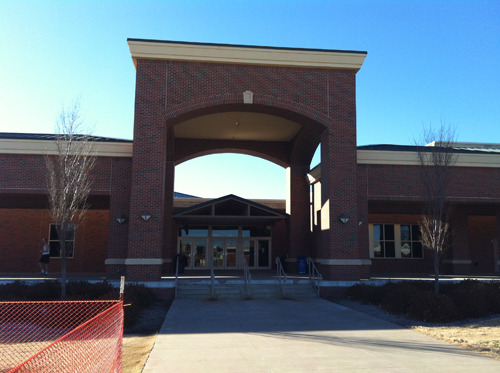  
각종 스포츠와 레크리에이션 시설이 들어 있는 콜빈 리크리에이션 센터(Colvin Recreation Center)

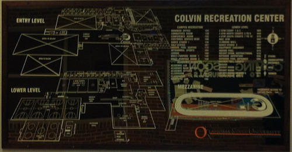  
콜빈 리크리에이션 센터의 내부 구조도

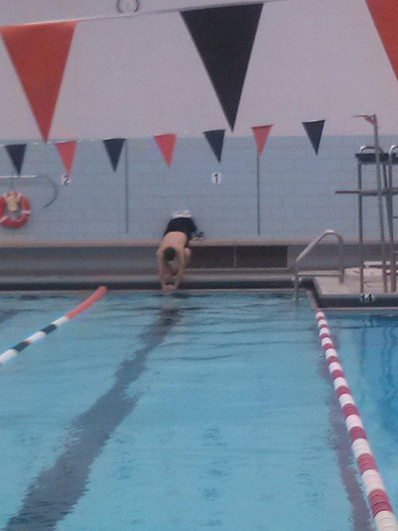  
콜빈센터의 수영장에서

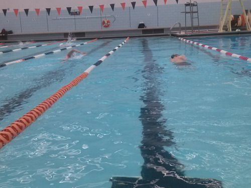  
콜빈센터의 수영장에서

근황(3)-부러운 학생들, 그리고 건강 챙기기

저 같은 촌놈은 그저 ‘일 열심히 하는 것’이 최상의 건강관리라고 믿어 왔는데, 도시에 뿌리를 내리고 살면서부터 생각이 바뀌었습니다. 특히 주변에 ‘고롱고롱하시는’ 노인네들이 눈에 띄면서 ‘건강은 관리하는 것’이라는 생각을 갖게 되었지요. 한두 가지 운동이라도 꾸준히 하는 것보다 더 좋은 건강관리법은 없다는 깨달음을 갖게 된 것이지요. 일정한 양의 운동을 일정한 시각에 꾸준히 하는 것은 자칫 게을러지기 쉬운 마음을 다잡을 수도 있게 한다는 점에서, ‘일거양득’이지요. 그런데 30~40대 젊은이들 가운데 운동부족으로 인한 만성질환자가 다른 연령대에 비해 많다는 소식이 얼마 전 국내신문에 보도되었더군요. 한창 열심히 일할 나이 대이니 운동할 여가가 없겠지요. 그러나 어떻게 해서라도 일정한 시간을 마련하여 운동은 해야 합니다. 집 주변이나 산길 걷기는 돈 한 푼 안 드는 운동이고, 약간의 돈이 들긴 하지만 수영이나 테니스, 배드민턴, 탁구 등도 아주 좋은 운동이지요. 저는 30대에 들어서면서 아침마다 걷기와 달리기를 해왔고, 40대에 들어서는 테니스를 해왔으며, 지금은 아침마다 수영을 하고 있습니다. 아주 이른 시각, 아무도 몸을 담그지 않은 물에서 1시간 정도 수영을 하고나면 하루의 출발이 상쾌합니다. 아주 늙어질 때까지 수영은 계속할 수 있을 것 같아서 기분이 더 좋습니다.

미국의 OSU에 와서 놀란 것은 체육시설들이 환상적이란 사실입니다. 아메리칸 풋볼 전용인 ‘분 피켄스 스테이디엄(Boone Pickens Stadium)’은 7만 명의 관객을 수용할 수 있다니, 우리의 국립경기장보다 훨씬 큰 규모이지요. 그밖에도 실내 농구장, 야구장, 복싱장, 레슬링장, 테니스장, 잔디 축구장 등 없는 시설이 없군요. 그 뿐 아니라 레슬링의 영웅을 추모하는 스포츠 박물관인 ‘명예의 전당[Hall of Fame]’이 있어 스포츠에 대한 이들의 열기를 알 수 있게 하네요. 그러나 이것들보다 훨씬 부러운 것이 바로 엄청난 규모의 레크리에이션 시설이지요. 이 학교의 한 켠에 큰 건물 두 동이 서 있는데요. 콜빈 레크리에이션 센터(Colvin Recreation Center)와 세레티안 웰니스 센터(Seretean Wellness Center)가 그것들입니다. 그 안에는 대규모 피트니스 센터, 카펫이 깔린 런닝 트랙, 실내외 수영장, 라켓볼장, 복싱 및 레슬링 연습실, 댄스스포츠 연습실 등등. 저로서는 이름조차 알 수 없는 각종 스포츠 종목들을 위한 시설과 공간들이 망라되어 있지요.

하루 강의를 끝낸 학생들이 간편한 옷차림으로 달려가는 데가 바로 이곳입니다. 이곳에서 마음껏 하루의 피로를 풀고 저녁식사를 한 뒤 밤공부에 몰입하기 위해서지요. 내가 가장 부러워 하는 것이 바로 이 점입니다. 우리나라 대학생들은 강의 끝나기 무섭게 좋은 자리 잡으러 도서관으로 달려가는데, 이곳 학생들은 체육관으로 달려간단 말입니다. 자리 잡으러 체육관으로 달려가는 게 아니라 빨리 몸을 풀고 와서 공부하려는 생각 때문이지요. 우리나라 대부분의 대학들은 아예 체육관 시설이 없거나, 있다 해도 언제나 무료로 이용할 수가 없지요. 그리고 체육관에서 몸이나 풀고 있을 시간이 어디에 있냐고 항변할 수도 있을 겁니다. 그러나 저도 이미 그런 대학시절을 거쳐 온 몸 아닌가요? 이곳 학생들을 보면서 우리나라 대학생들이 불쌍하다는 생각을 새삼 하게 되었습니다. 그런데, 놀라운 것은 이 학교엔 자기네 돈으로 지은 체육시설들이 하나도 없다는 점입니다. 모두 선배들이 돈을 희사하여 지어준 시설들이지요. 이들이 후배들을 위해 체육시설에 투자하는 돈은 상상을 초월할 정도로 엄청납니다.[자세한 것은 다른 데서 말씀드리지요.] 이런 시설들을 맘껏 이용하여 체력 단련을 하면서 공부에 몰두하는 미국의 대학생들이 부럽고, 그렇지 못한 우리나라 대학생들이 불쌍하다고 생각되는 건 어쩔 수 없군요.

저도 지금 이런 체육시설 덕을 톡톡히 보고 있는 중입니다. 이곳에 도착한 며칠 뒤부터 체육관을 이용하고 있습니다. 저는 주로 실내 수영장을 이용합니다. 무엇보다 늘 물이 흘러넘치게 함으로써 수질을 최상급으로 유지하는 점이 좋군요. 우리나라 대부분의 수영장처럼 소독약을 쓸 필요가 없으니, 수영장에서 불쾌한 소독약 냄새를 걱정할 필요가 없지요. 혼자 차지하기 미안할 정도로 레인이 넓고 바닥 또한 복판 쪽을 깊게 만들어 깊고 넓은 호수를 건너는 듯하니 수영을 하면서 기분이 좋아지는 점도 빼놓을 수 없네요. 수영장 밖에 항상 관리자가 붙어 앉아 수영객들의 안전을 보살피는 모습도 보기에 좋고요. 저는 아침 6시 반~7시에 수영을 시작합니다. 서울에서는 5시 반이면 어김없이 물에 들어갔는데요, 물속에서 주로 대화를 나누면서 걸어다니는 아주머니들이나 할머니들이 오기 전에 잽싸게 하루 운동량을 채워야 한다는 강박관념에 ‘1.8km 이상을 쉬지 않고 헤어나가는 1시간 수영’을 마치고 나면 녹초가 되다시피 했는데, 이곳에서는 그럴 필요가 없으니 마냥 즐기고 있는 셈이지요. 강박관념 속에 쫓기듯이 하는 운동과 느긋하게 즐기며 하는 운동 사이의 차이를 지금 진하게 깨닫고 있는 중입니다.

최근에는 수영 외에 걷기운동도 시작했습니다. 우리가 살고 있는 아파트 뒤쪽에 이 대학 소유의 크로스컨트리(cross country) 경기장이 있어요. 큰 규모의 야산과 넓은 초지를 다듬어 구불구불 길을 내고 길바닥엔 짧은 잔디를 덮었거나 분쇄한 나무 조각들을 깔아 폭신하게 만든 길이지요. 경기 당일만 폐쇄하고 1년 내내 주민들에게 개방하는 공간입니다. 숲을 뚫고 달리는, 오르락내리락 7마일 길입니다. 큼직한 기러기들도, 솔방울만한 참새도, 엄마 꽁무니만 쫓아다니는 염소도, 사나운 거위도, 오동통한 사슴도, 부지런한 청설모도, 장난꾸러기 강아지도 만날 수 있는 길입니다. 1~2시간이 걸리는 코스. 숲을 통과하고 나면 넓은 초지가 펼쳐지고 그 한복판에 참한 나무 한 두 그루가 사색에 잠긴 듯 그림자를 길게 드리우고 서 있는 모습에 저절로 힐링이 되는 곳입니다. 이 코스를 통과하고 나면 마음속에서 엉크러져 있던 생각들이 정리되고, 새로운 아이디어가 생겨나기도 하는, 희한한 경험을 하고 있습니다. 왜 아리스토텔레스와 그의 제자들이 산책을 하면서 지식을 전수하고 토론을 펼쳤는지 알 수 있을 것 같군요. 굳이 ‘소요학파’라는 이름을 붙일 필요도 없는 일이었겠지요. 아리스토텔레스 아닌 누구라도 소요(逍遙)의 가치야 알 수 있는 일 아니겠어요? 걷다 보면 생각이 정리된다는 것을 최근에 다시 체험하게 되었습니다. 칼로리가 소모되어 육체적으로 건강해지는 것 뿐 아니라 생각을 정리해주고 마음을 편안하게 만들어주는 것도 걷는 일의 효용가치라는 점을 다시금 깨닫습니다.

이제 잠시 후면 귀국하는데요. 소독약 냄새로 메스꺼워지는 그 수영장에 다시 나가야 하는 일, 어깨가 부딪칠 정도로 붐비는 산책로의 대열에 다시 합류해야 하는 일, 강의 끝나면 체육관 대신 도서관으로 달려가는 학생들을 안타깝게 바라보아야 하는 일 등이 저를 가장 괴롭히는 일들일 것 같네요. 즐겁게 수영하면서 건강을 유지하고, 걸으면서 생각을 정리하는 일이 우리 한국인들에겐 아직 사치일까요? 무슨 수를 쓰든, 관리들을 잘 하셔서 새해에는 부디 건강하시기 바랍니다.

갑오년 벽두에

백규 드림

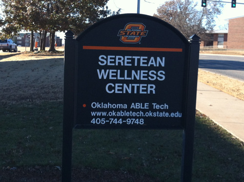  
세레티안 웰니스 센터 간판

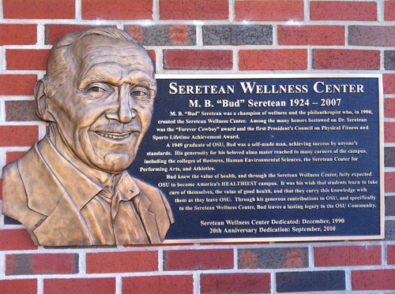  
거액을 기부하여 스포츠 시설을 세운 세레티안

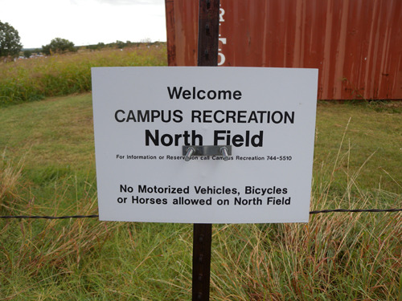  
크로스 컨트리 경기장 입구 표지판

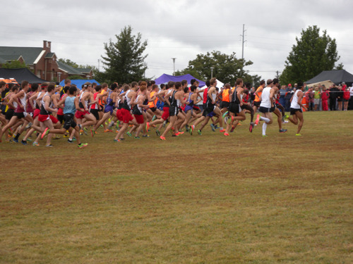  
크로스 컨트리 경기 시작 모습

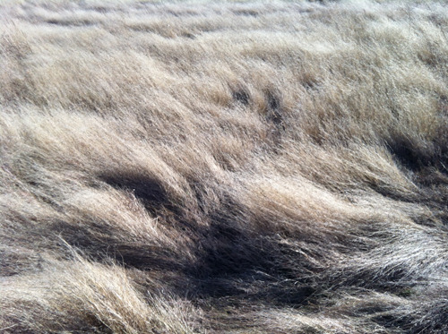  
산책길에 만나는 겨울 풀의 물결

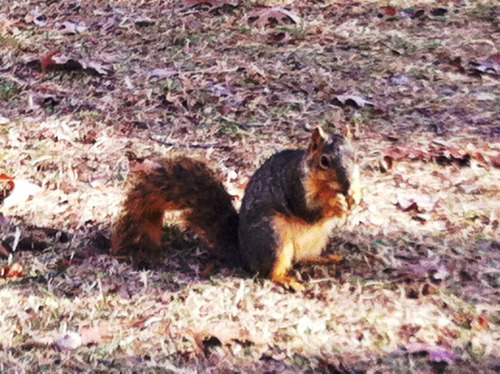  
산책길에 만나는 청설모

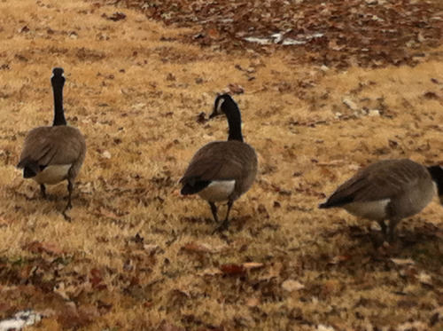  
산책길에 만나는 기러기들[캐나디언 구스,Canadian Goose]

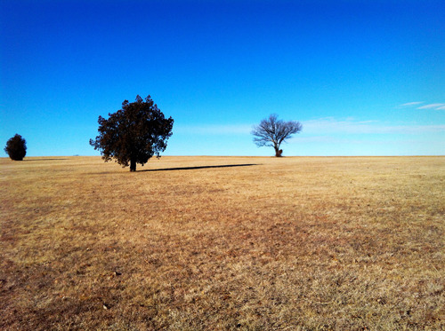  
산책길의 평화, 그리고 힐링

공유하기

게시글 관리

**백규서옥\_Blog ver.**