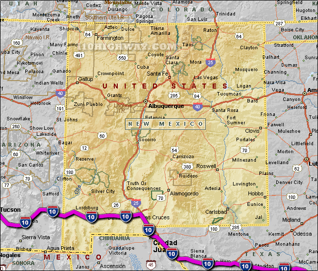  
오클라호마와 텍사스를 거쳐 뉴멕시코로 연결되는 I-40을 비롯한 각종 도로들

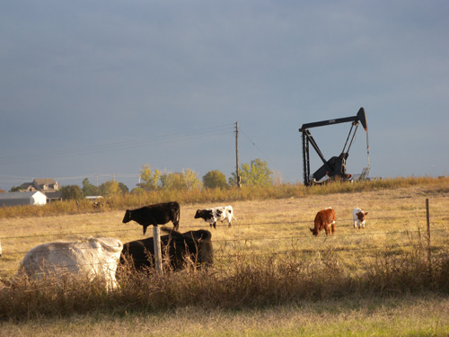  
오클라호마의 길가에서 흔히 보이는, 목장과 유전이 어우러진 모습

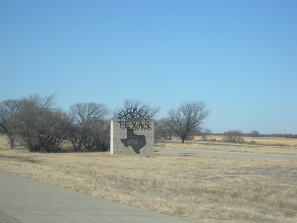  
오클라호마에서 텍사스로 들어가는 입구

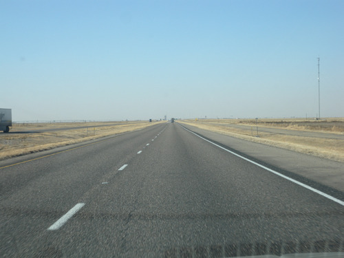  
텍사스의 도로

뉴멕시코의 남성미, 오클라호마의 여성미

‘아름다움이란 절대적으로 완전하고 변경할 수 없는 것이 아니라 역사적인 시기나 장소에 따라 다양한 모습을 가질 수 있다.’

걸출한 철학자이자 미학자이며 인기있는 소설가 움베르토 에코가 그의 저서 <<미의 역사>> 머리말에서 강조한 미학의 원리다. 그렇다. 아름다움이란 그렇게 상대적인 것이다. 에코 뿐 아니라 현대 미학자들 가운데 아름다움의 상대성을 부인하는 자는 아무도 없으리라. 아름다움에 관해 겨우 아마추어 수준의 인식을 갖고 있는 백규에게조차 ‘미의 상대성론’은 부담감 없는 상식이다.

\*\*\*

오클라호마 체류 기간 끝 부분에 뉴멕시코를 다녀오기로 했다. 머나먼 길을 운전하여 텍사스를 거쳐야 갈 수 있는 곳이라서 더 매력적이었다. 오클라호마 인디언들을 대충 만나 보았으니, 그곳에 옛 모습을 유지하며 살고 있다는 푸에블로(Pueblo) 인디언들을 보고 싶다는 것이 표면적인 이유였으나, ‘주마간산(走馬看山)’ 격으로나마 세 개 주의 인상(印象)을 비교해보고 싶은 것이 내심의 욕구였다. 무엇보다 ‘역마살’을 사랑하는 내가 ‘새로운 길을 만나는 일’을 마다할 리 없으니, 그야말로 ‘일타삼피(一打三被), 일석삼조(一石三鳥), 혹은 One Serve, Triple Purposes’의 쾌거 아닌가.

오클라호마의 중심을 서남쪽으로 뚫고, 텍사스의 팬 핸들(Panhandle)을 가로질러, 앨버커키(Albuquerque)와 산타페(Santa Fe), 반들리어(Bandlier), 타오(Taos) 등 뉴멕시코의 북부 일대를 돌아오는, 총연장 2천 마일에 가까운 장도(壯途)였다. 오클라호마 주는 우리나라[남한] 면적의 두 배인 181,195㎢, 텍사스 주는 7.8배인 696,241㎢, 뉴멕시코 주는 3.5배인 315.194㎢이니, ‘눈물겹도록’ 광활한 땅 아닌가. 비록 그 면적의 작은 부분들만을 거치는 노정이었으나, 그 장대함을 느끼기엔 충분했다.

2014. 1. 19. 오전 8시 스틸워터 출발. 타고 가던 35번 하이웨이를 오클라호마 시티에서 40번으로 갈아타면서 쾌속의 질주를 계속했다. 르노(El Reno), 엘크(Elk), 세이어(Sayre) 등 오클라호마 구간을 지나자 풍광이 바뀌면서 I-40은 텍사스로 접어들었다. 주 경계를 넘어 텍사스 경내의 전망대 겸 휴게소에 들어서니 사방에 돌투성이의 언덕들과 까마득하게 늘어선 야산들이 보였으나, 그로부터 빠져나와 잠시 달리자 이내 오클라호마와 별반 다를 바 없는 텍사스의 벌판이 펼쳐졌다. 그렇게 텍사스의 팬 핸들 지역을 몇 시간 동안 달리자 ‘옛 66번 도로(Historic Route 66)’ 상의 핵심도시 ‘아마리요(Amarillo)’가 나오고, 그로부터 두어 시간 더 달려 뉴멕시코에 들어섰다.

‘매혹의 땅 뉴 멕시코에 오신 것을 환영합니다[Welcome to New Mexico, Land of Enchantment]’라고 도로를 가로질러 세운 경계표지가 인상적이었으나, 그보다 먼저 눈에 들어온 것은 확연히 달라진 풍광이었다. 오클라호마에서 텍사스까지 끝없이 펼쳐지던 벌판들, 비옥해 보이진 않았으나 온갖 식물들을 키워내던 땅은 어디론가 사라지고 척박한 돌투성이의 땅에 깔리듯 생명을 이어가고 있는 사막식물들의 삶터가 무한대로 펼쳐지고 있었다. 텍사스와 뉴멕시코를 변별(辨別)하는 표지야말로 경계표지가 아니라 이런 경관의 변화였다.

경계표지를 지나자마자 만난 ‘글렌리오 뉴멕시코 관광 비지터 센터[Glenrio Visitor Center NMDOT]’에서 대기하고 있던 직원은 지나가는 관광객들에게 늘 그렇게 해왔다는 듯, 우리의 인사에 응답을 하는 둥 마는 둥 지도를 펼치면서 묻지도 않는 관광명소들을 일사천리로 설명했다. 관광 비수기이긴 했으나, 우리가 보고자 한 포인트들은 가까스로 겨울철 폐장을 하루 이틀 앞두고 있었으니, 그나마 다행이었다. 이곳이 바로 시간 변경대인 듯 직원은 우리 시계의 시침을 한 시간 뒤인 3시로 되돌리라고 했다.

미국에는 동부 시간[Eastern Time], 중부 시간[Central Time], 산악 시간[Mountain Time], 태평양 시간[Pacific Time] 등 네 개의 시간대가 존재하는데, 우리가 출발한 오클라호마는 텍사스와 함께 중부 시간대에 속해 있었고 뉴 멕시코는 산악 시간대에 속해 있었던 것이다. 아, 먼 곳을 가는 길에 한 시간 벌었구나! 쾌재를 불렀으나, 태양은 이미 저 멀리 지평선 바로 위에 걸려 있었다. 한 시간을 벌긴 했으나, 앨버커키까지 세 시간이 넘어 걸린다는 비지터 센터의 직원 말에 오후 4시쯤 도착하여 느긋하게 숙소를 정하리라 생각한 우리의 계획이 멋지게 빗나갔음을 알게 되었고, 가끔씩 속도제한[Speed Limit] 상한선 75마일을 넘기며 달려 나갔다.

비지터 센터를 나온 우리는 목적지인 앨버커키(Albuquerque)까지 3~4백 마일을 더 달려야 했다. 엔디(Endee), 바드(Bard), 투쿰카리(Tucumcari) 등 연도의 대소 도시들을 지나고 앨버커키에 도착하기까지 주변에 펼쳐지는 풍광을 표현할 말이 달리 떠오르지 않았다. ‘황량함’이란 말 은 사전에 나오겠지만, 그 말도 결국 우리 인식의 한계만 드러낼 뿐이었다. 약간씩 오르내리는 구릉들을 제외하고 산은 보이지 않았다. 저 멀리 지평선에 아련히 보이는 것이 바로 버날리요(Bernalillo) 카운티와 샌도발(Sandoval) 카운티에 걸친 샌디아 산맥[Sandia Mountains]일 것인데, 그마저 저녁 어스름과 아련히 피어오르는 안개에 가려 보이지 않다가 앨버커키에 들어서기 위해 넘을 때에야 그 산맥의 존재를 깨달을 수 있었다.

말하자면 이곳을 포함하여 뉴멕시코 전역의 평균 높이가 해발 1710m이고, 가장 낮은 지역도 852.6m에 달하니 뉴멕시코에 들어오면서 우리는 내내 1천 미터가 훨씬 넘는 산길을 타고 있는 셈이었다. 이 넓은 땅을 덮고 있는 것은 거무튀튀한 돌들, 그 사이에 모습을 내민 블랙 그래머(Black Grama), 아리스티다 퍼푸리아(Aristida Purpurea), 크레오소트 부쉬(Creosote Bush) 등 사막식물들 뿐이었다. 사람이나 짐승이 깃들만한 교목은 한 그루도 보이지 않고, 기껏 쥐나 프레이리독 같은 작은 짐승들이나 몸을 숨길만한 식물들이 듬성듬성 성장을 멈춘 채 사막의 맨살을 가려주고 있었다.

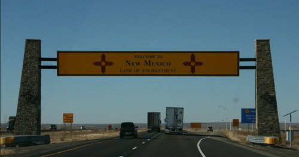  
텍사스에서 뉴멕시코로 들어가는 입구

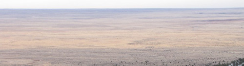  
끝없이 펼쳐진 뉴멕시코의 평원

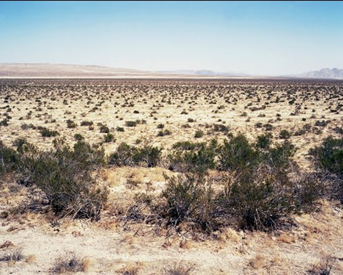  
뉴멕시코의 황량한 대지

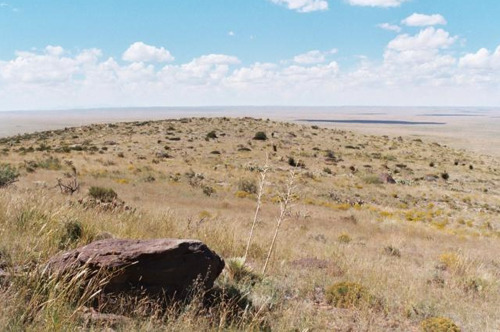  
뉴멕시코의 황량한 대지

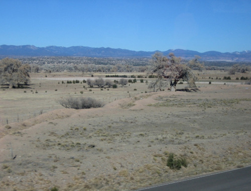  
뉴멕시코의 황량한 대지

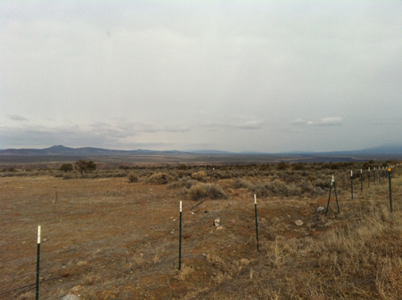  
뉴멕시코의 황량한 대지

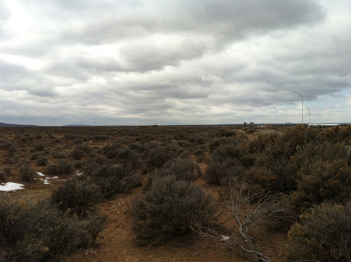ㅏ  
Rio Grande 강과 George Bridge 주변에 펼쳐진 사막지대

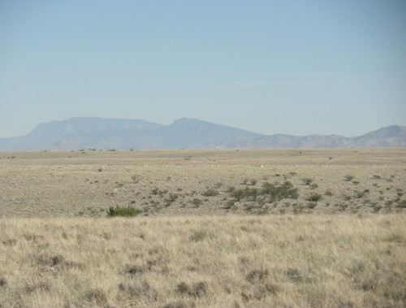  
샌디아 산맥Sandia Mountains)과 앨버커키(Albuquerque) 사이의 사막지대

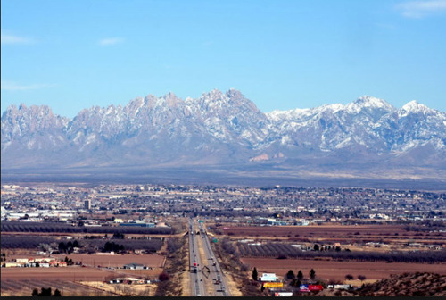  
샌디아 산맥의 보호를 받고 있는 앨버커키 시가지

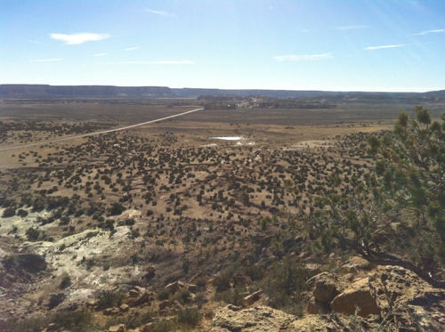  
앨버커키 인근 스카이시티 가는 길에 만난 황량한 평원

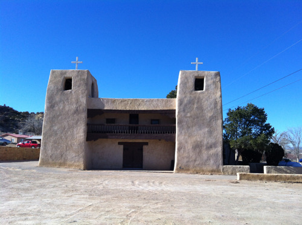  
스카이시티 가는 길에 만난 어도비 건축양식의 천주교 성당

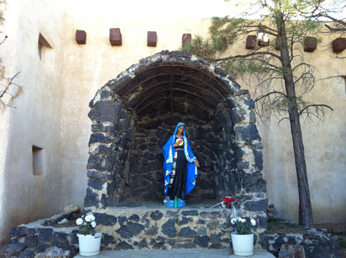  
성당 옆쪽에 마련된 성모상

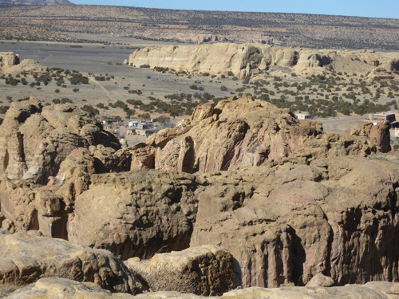  
애코마(Acoma) 푸에블로(Pueblo) 스카이시티에서 내려다 본 관광안내소

  
뉴멕시코를 달리며 찍은 황량한 모습

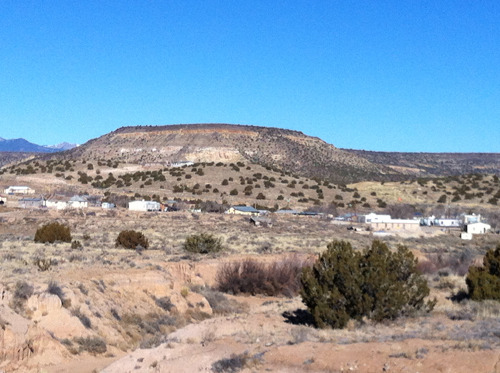  
뉴멕시코의 황량한 벌판

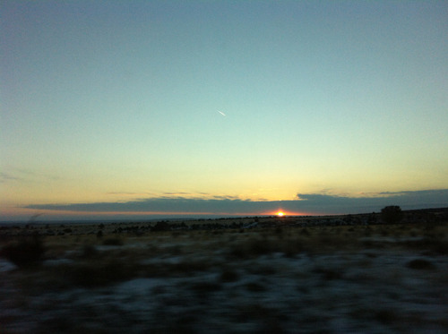  
뉴멕시코의 끝없는 지평선 너머로 아련한 여운을 남기면서 해가 지고 있다.

해발 1,619.1 m의 고지대에 위치한 앨버커키에 도착하자 붕 뜬 것처럼 정신이 멍해졌다. 그만큼 기압이 낮은 때문일 것이다. 1박을 한 다음날 찾은 곳은 스카이 시티(Sky City). 예의 그 광활한 평원 한 복판에 잔구 형태의 돌덩어리들과 엄청난 규모의 돌산이 서 있고, 그 위에 만들어진 애코마 푸에블로(Acoma Pueblo) 인디언들의 공동체가 바로 그곳이었다. 황량한 벌판에 서 있는 돌 주거지. ‘그로테스크의 미학’이라고나 할까. 그곳에서 상상되는 그들의 삶 역시 우리의 상식을 배반하는 모습이었다.

그 다음 날 만난 아름다운 산타 페(Santa Fe) 역시 2,134 m 의 고도(高度)를 자랑하는 도시였다. 앨버커키보다 기압이 더 낮은 때문일까, 자동차에 넣어 갖고 온 과자 봉지가 팽팽하게 부풀어 있었다. 산타페 산맥에 안겨 넓은 평원을 내려다보고 있는 대도시. 이곳 역시 뉴멕시코의 주 건축양식인 어도비(Adobe) 일색의 건물들로 가득 차 있었다. 앨버커키도, 스카이시티도, 산타페도, 타오(Taos)도, 그 도시들 사이사이에서 만나는 주택들도 대부분 어도비 양식이었다. 어도비란 모래, 진흙, 물, 막대기, 짚, 동물의 배설물 등 섬유질이나 유기질 재료 등을 섞어서 벽돌을 만들고 햇볕에 말리는 공법으로 짓는 건축양식이다. 볼그레한 땅 색깔과 어울리게 지은 어도비 건축물들이야말로 자연에 맞추어 살려는 이 지역 주민들의 미학이 만들어낸 결과였다. 직선과 기하학에만 익숙해 있던 내게 곡선과 흙빛의 따사로움을 갖춘 이 건축양식이 첨엔 좀 생소했지만, 눈에 익을수록 ‘미학이란 결국 자연과의 위대한 조화에서 벗어날 수 없다’는 평범한 이치의 깨달음으로 연결되었고, 결국엔 정겨움을 느끼는 수준으로까지 발전하게 되었다. 

비록 일부분이나마 뉴멕시코의 광활한 대지를 누비고 나서야 그곳에 차원 높은 아름다움이 숨어 있음을 깨닫게 된 것이었다. 사실 따지고 보면 그럴 듯한 나무 한 그루 자라지 않는 돌투성이의 사막이 아름다울 수는 없다. 수만 년 웅웅거리며 쓸어오는 바람결 외에 움직임 하나 없는 이 벌판을 전통 미학의 기준으론 ‘추하다’고 보는 게 정상일 것이다. 그러나 나는 왜 이 벌판을 달리면서 감동과 함께 ‘울고 싶다’는 느낌을 갖게 되었을까. 나는 이미 오클라호마 북부의 오세이지(Osage) 인디언 구역에서 대초원[Tall Grass Prairie]을 만나 연암 박지원의 ‘호곡장(好哭場)’을 떠올린 바 있다. 광대한 요동 들판을 걸어가던 박지원은 그곳을 ‘가히 울어볼 만한 곳’이라 말하고, 인간 7정(七情)의 발로에 대한 새로운 해석을 제시하기도 했다.

대초원 앞에 선 나도 연암선생이 느꼈던 그 심정을 이곳에서 다시 떠올리게 되었다. “기쁨이 극에 달하면 울게 되고, 노여움이 사무치면 울게 되고, 즐거움이 극에 달하면 울게 되고, 사랑이 사무치면 울게 되고, 미움이 극에 달해도 울게 되고, 욕심이 사무쳐도 울게 되니, 답답하고 울적한 감정을 확 풀어 버리는 것으로 소리 쳐 우는 것보다 더 빠른 방법이 없다. 울음이란 천지간에 있어 뇌성벽력에 비할 수 있는 것이니, 북받쳐 나오는 감정이 이치에 맞아 터지는 것이 웃음과 다를 게 뭐겠는가.”라는 연암 선생의 논리야말로 뉴멕시코의 대평원 앞에 선 내 감정을 그대로 설명하고 있지 않은가.

이런 감정적 여과를 거치고 나서야, 뉴멕시코 대자연의 ‘추함’은 결국 ‘아름다움’으로 바뀌는 것이었다. 극도의 추함이 아름다움과 합치될 수도 있다는 미학의 상대성이야말로 뉴멕시코의 황량한 사막으로부터 터득하게 되는 진리 아닌가.

\*\*\*

잠시 오클라호마에 체류하면서 평원의 아름다움에 눈을 떴고, 텍사스를 보고 나서 그 아름다움의 선함을 확인할 수 있었다. 그러나 뉴멕시코의 사막 벌판을 만나면서 새로운 미학을 덤으로 깨닫게 되었다. 오클라호마의 평원에는 나무가 많고, 돌보다는 기름 진 흙이 많다. 기름 진 흙으로 나무를 키워내는 것이야말로 ‘여성성(女性性)’의 본질 아닌가. 오클라호마의 대지를 달리다 보면 식물을 키우고 인간을 길러내는 ‘지모신(地母神)’의 속삭임을 듣게 된다.

이와 달리 돌투성이의 사막, 뉴멕시코의 대지에서는 쩌렁쩌렁 울리는 거친 남성의 포효를 들었다. 뉴멕시코를 달리면서 눈물 나는 감동으로 긴장하다가 오클라호마에 들어오면 마음이 푸근해지고 따뜻해지는 이유를 비로소 알게 된 것이다. 숭고와 비장의 남성 미학적 공간에서 부드럽고 우아한 모성 미학의 공간으로 입사[入社, initiation]했기 때문이리라. 다른 시간대 즉 Mountain Time에서 Central Time으로 넘어가면서 미학적 차이까지 경험하게 된 내 가슴에 희열이 넘치는 순간이다.

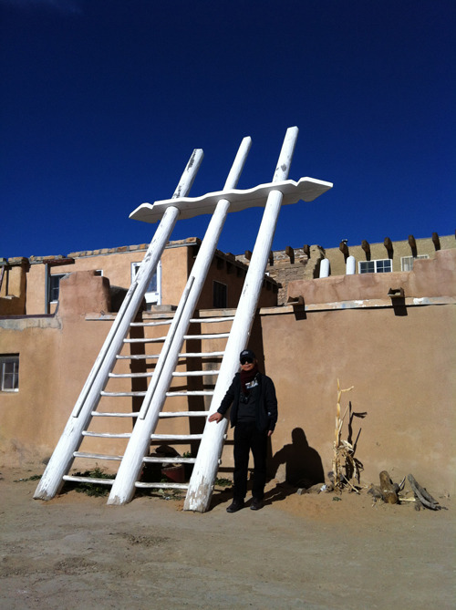  
애코마 푸에블로 인디언 스카이시티의 광장에서  
(기우 제의에 쓰이는 사다리-세 개의 기둥은 빗줄기를, 상부의 가로막대는 구름을 각각 상징한다 함.   
비가 부족한 이곳의 상황을 보여주는 물건임)

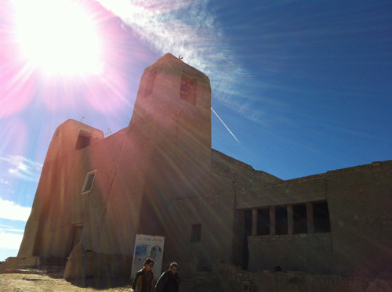  
스카이시티에 있는 성당[16세기에 스페인 사람들이 지은 것으로 알려져 있음)

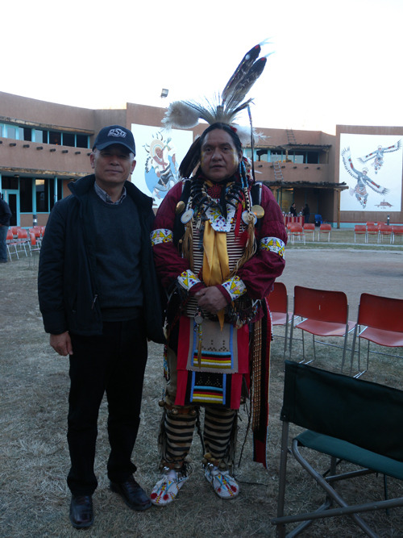  
앨버커키의 푸에블로 문화센터(Indian Pueblo Cultural Center)에서   
공연을 마친 푸에블로 남성 무용수와 함께

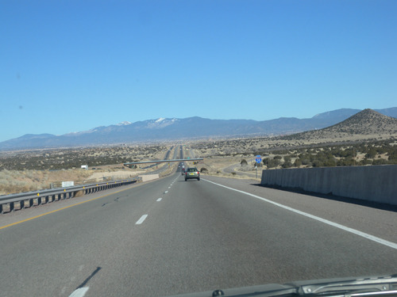  
앨버커키를 떠나 산타페에 들어가는 중. 멀리 보이는 것이 산타페 산맥이며   
그 앞에 널리 퍼진 것이 산타페 시가지임.

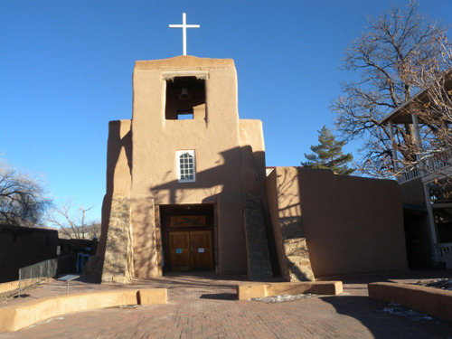  
산타페 시내의 산 미구엘(San Miguel) 성당. 미국 최초의 어도비 양식 성당임.

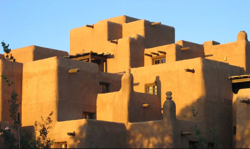  
어도비 양식의 호텔 산타 페

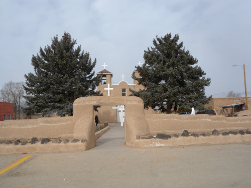  
타오(Taos) 시내 어도비 양식의 '아씨시의 성 프란체스코 성당'

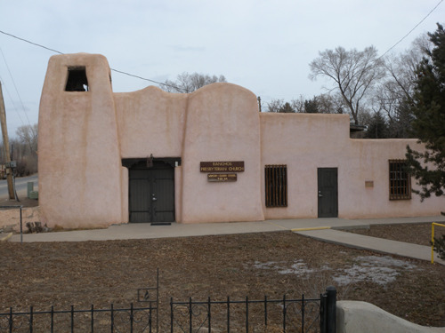  
타오 시내의 '랜처 장로교회[Rancho's Presbyterian Church)

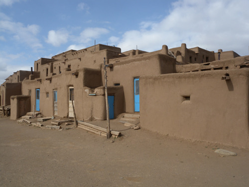  
타오 시 외곽에 어도비 양식으로 지어진 푸에블로 인디언들의 전통 가옥

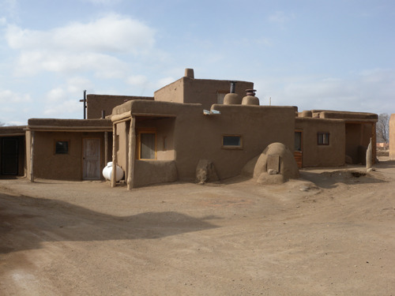  
푸에블로 인디언의 전통가옥. 앞에 있는 둥근 것이 빵을 굽는 화덕임.

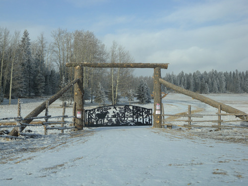  
타오(Taos)로부터 로건(Logan) 가는 길에 지나온 Angel Fire Mountain 속의 농장 입구

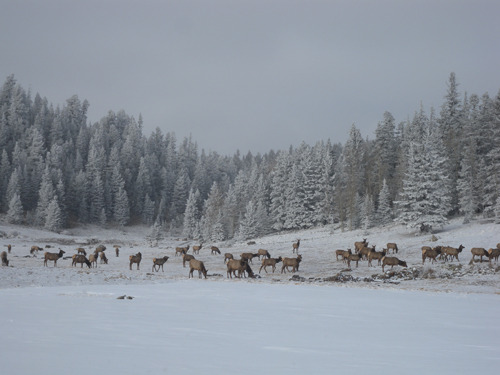  
타오(Taos)에서 로건(Logan) 가는 길에 지나온 Angel Fire Mountain 속에서 만난 사슴떼.   
환상 속의 한 장면 같지요?

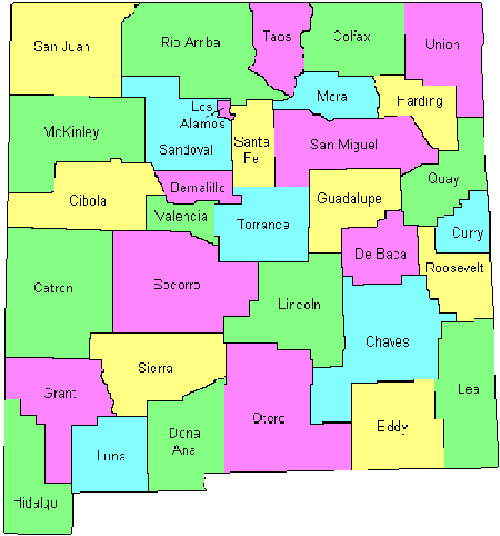  
뉴멕시코의 카운티들

공유하기

게시글 관리

**백규서옥\_Blog ver.**