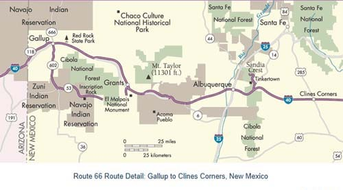

애코머 푸에블로 등 앨버커키 인근 도시들이 표시된 지도

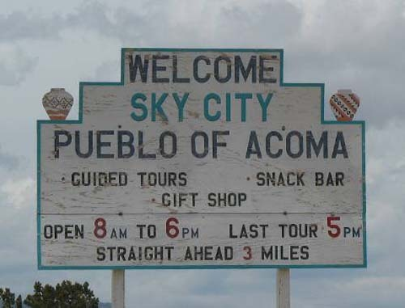  
스카이 시티 이정표

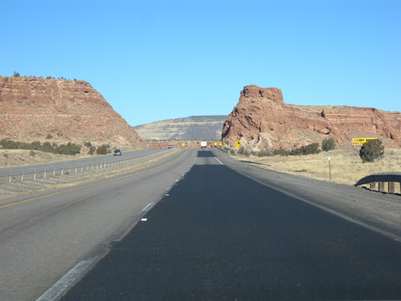  
스카이 시티 가는 길

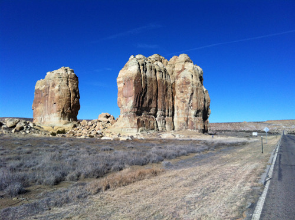  
스카이 시티 입구의 돌기둥들

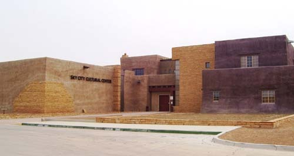  
스카이 시티 컬츄럴 센터

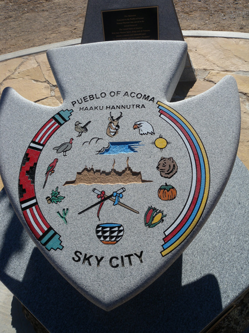  
스카이 시티 문장(紋章)

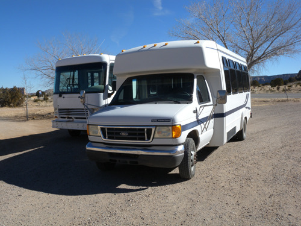  
컬츄럴 센터에서 스카이 시티로 출발하는 셔틀 버스들

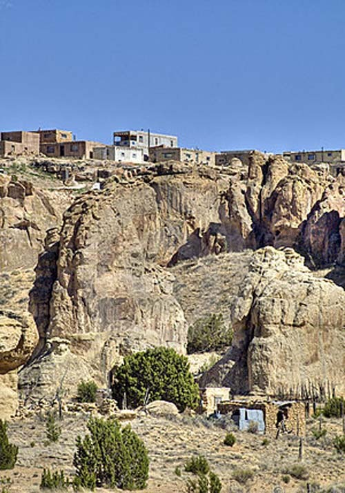  
밑에서 올려다 본 메사의 주택들

뉴멕시코의 앨버커키와 스카이 시티, 그리고 푸에블로 인디언

내 나이 또래의 한국인으로서 ‘푸에블로(Pueblo)’란 이름을 기억 못하는 사람은 없을 것이다. 한참 오만했던 북한이 간첩들을 활발하게 남파하여 우리나라를 흔들다가 급기야 청와대 폭파와 요인 암살을 목적으로 김신조 등 무장공비들을 내려 보낸 것이 1968년 1월 17일. 그 바로 일주일 후인 1968년 1월 23일엔 원산 앞바다에서 미국 정보 수집함 ‘푸에블로 호’가 북한에 의해 나포되었다. 필자 나이 당시 11살. 간첩들이 내 고향 동네의 훌륭한 청장년 두 명을 밤에 죽이고 내뺀 사건으로 몸서리치고 있던 차, 김신조와 푸에블로 호 사건은 ‘북괴’에 대한 불신과 증오의 대못을 내 마음에 박고 말았다. 그 ‘푸에블로’란 명칭의 원조를 미국에 와서 만난 것이다.

그간 틈 날 때마다 인디언들을 찾아 다녔으나, 시간부족•역부족을 느낄 뿐이었다. 미국 전역에 564개, 오클라호마에만 39개 종족의 인디언들이 살고 있는데, 나 혼자 어느 세월에 그들을 다 만난단 말인가. ‘문명화된 5개 종족[The 5 Civilized Tribes/체로키(Cherokee), 치카샤(Chickasaw), 촉토(Choctaw), 세미놀(Seminole), 크리크(Creek)]’을 포함 10개 정도의 인디언 종족들을 만나면서 힘과 의지의 소진(消盡)을 절감하게 되었고, 바깥으로 눈을 돌리던 중 뉴멕시코에 ‘푸에블로 인디언’이 있다는 정보를 얻게 되었다.

사실 오클라호마에서 만나는 인디언들은 그들의 정체성[identity]을 의심할 정도로 미국화[Americanization]되었다는 것이 그간 내린 내 판단이다. 내 느낌으로 이 점은 이른바 ‘문명화’되었다는 5개 종족 뿐 아니라 여타 종족들의 경우도 마찬가지였다. 모두 영어를 사용하고 미국인들의 생활양식으로 살며 미국 정치체제 속의 일원으로서 ‘아메리칸 드림(American Dream)’의 실현을 추구하는 인디언들에게서 그들만의 종족적 정체성을 찾으려 한다면, 참으로 어리석은 일일 것이다. 인디언들을 만난다면서 박물관이나 찾아다니는 내 모습을 발견하고 좌절을 느낀 것은 그런 깨달음의 자연스런 귀결이었다. 물론 박물관은 한 종족이나 민족, 국가의 ‘과거•현재•미래가 통합되어 숨 쉬고 있는 생명의 공간’이라는 것이 내 지론이긴 하다. 그러나 분명 주변에 인디언들이 살아서 어슬렁거리고 있는데, 왜 나는 한사코 ‘화석화된 것처럼’ 보이는 박물관만 찾아다니는가. 그런 회의가 엄습한 것이다.

생각해 보라. ‘미국화 된 인디언들’은 외모만 인디언의 모습을 띠고 있을 뿐, 문명사회나 주류사회의 일원으로 편입되고자 하는 욕망이 누구보다 강하다. 그건 미국사회의 여타 마이너리티들인 유색인들이 그런 욕망을 갖고 노력하는 것과 똑 같다. 재미 한인들에게 미국화 되지 말고 ‘한국인으로서의 정체성을 견지(堅持)하라’는 정신 나간 주문을 할 수 없는 것은 인디언들에게도 마찬가지인 것이다. 그런 관점에서 인디언 문화와 역사의 탐사에 나선 내 행로가 암초를 만난 것은 분명하다. 새로운 돌파구를 찾을 필요가 절실할 때 홀연 나타난 것이 뉴멕시코의 푸에블로 인디언들이었다.

그들을 만나러 앨버커키로 가는 하이웨이의 주변은 키 낮은 식물들과 크고 작은 돌들이 깔린 사막지대였다. 그리고 몇 마일씩 간격을 두고 다양한 이름의 푸에블로 인들이 살고 있는 구역이 우리의 시야를 거쳐 지나갔다. 푸에블로 인디언들의 종류가 이렇게도 많단 말인가. 뉴멕시코에 오기 전만 해도 ‘푸에블로’는 단일민족인 줄 알았던 내 무지가 여지없이 무너져 내리는 현장이었다. 오밤중이나 되어서야 앨버커키에 도착, 호텔에 1박을 하면서 다음 날 가기로 한 ‘스카이 시티’의 기록들을 점검했다. 그 동안은 매혹적인 이름에 정신이 팔려 그곳이 ‘애코머 푸에블로(Acoma pueblo)’ 인디언들만의 거주구역임을 모르고 있었던 것이다. 그저 그곳에 가면 푸에블로 인디언들을 만날 수 있으리라는 막연한 기대 하나만 갖고 왔을 뿐이었다. 그러나 차를 타고 오면서 많은 푸에블로 인디언들이 있음을 알게 되었고, 스카이 시티에 살고 있다는 ‘애코머 푸에블로’도 그들 중 하나일 뿐임을 비로소 깨닫게 된 것이다. 그래서 일단 이 지역에서는 스카이 시티의 애코머 푸에블로 인디언들을 만나는 것에 초점을 두기로 한 것이다.

애코머 푸에블로 인디언들은 앨버커키에서 서쪽으로 60 마일쯤 떨어진 곳의 스카이 시티, 애코미터(Acomita), 맥카티스(McCartys) 등 세 마을에 살고 있었다. 원래 푸에블로가 점유해온 땅은 500만 에이커에 달하는데, 실제로 현재는 그 면적의 단 10%만 소유하고 있었다. 그 가운데 스카이 시티가 바로 ‘올드 애코머(Old Acoma)’의 원래 거주지다. 미국정부의 2010년 통계에 따르면, 5000명 정도의 애코머 인들이 종족적 정체성을 갖춘 사람들로 확인되며, 그들이 이 지역을 800년 이상 계속 점유해온 것이라 한다.

그렇다면 ‘푸에블로’나 ‘애코머’란 말들은 과연 어디서 나온 것일까. 앨버커키에 와서 들은 바에 의하면, ‘푸에블로’란 ‘마을[village]’이나 ‘작은 도시[town]’를 가리키는 스페인 말이며, 미국 서남부의 사람들 혹은 그곳의 독특한 건축을 가리키는 뜻이라고도 한다. 그리고 ‘애코머’란 말도 스페인어에서 나왔는데, ‘항상 있었던 장소[the place that always was]’ 혹은 ‘화이트 락의 주민들[People of the White Rock]’을 뜻한다고 한다. 뉴멕시코 샌 후안 카운티(San Juan County)의 나바호(Navajo) 인디언 정착지가 바로 화이트 락 캐년(White Rock Canyon)인데, 그렇다면 원래 그곳에 살던 애코마 푸에블로 인들이 나바호 인들을 피해 이곳으로 온 것인지 현재 필자의 짧은 지식으로서는 알 수가 없다. 어쨌든 애코머 푸에블로 사람들은 건축물이나 농사짓는 양식, 혹은 도자기 등에 나타나는 예술성으로 미루어 아나사지(Anasazi), 모골론(Mogollon), 기타 다른 고대 부족들로부터 갈라져 나온 종족으로 추정된다고 한다.

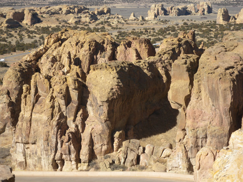  
메사(mesa)에서 내려다 본 경관

스카이시티와 애코머 푸에블로 인디언들의 삶과 역사를 설명하고 있는 가이드

스카이시티와 애코머 푸에블로 인디언들의 삶과 역사를 설명하고 있는 가이드

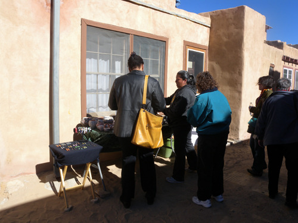  
메사의 주택가 골목에서 물건을 팔고 사는 모습

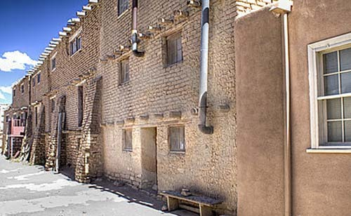  
스카이 시티의 주택들

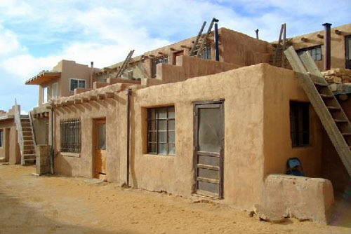  
전통 어도비 양식의 주택들

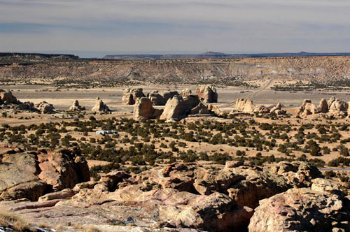  
메사에서 내려다 본 황야

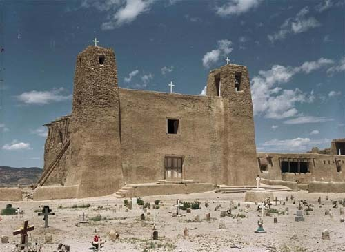  
스카이 시티의 '성 이스테반 델 로이 성당(San Esteban Del Roy Mission)'과 앞 뜰의 공동묘지

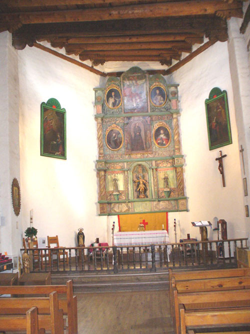  
 '성 이스테반 델 로이 성당(San Esteban Del Roy Mission)의 내부

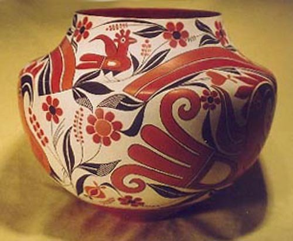  
애코머 푸에블로 인들의 도자기

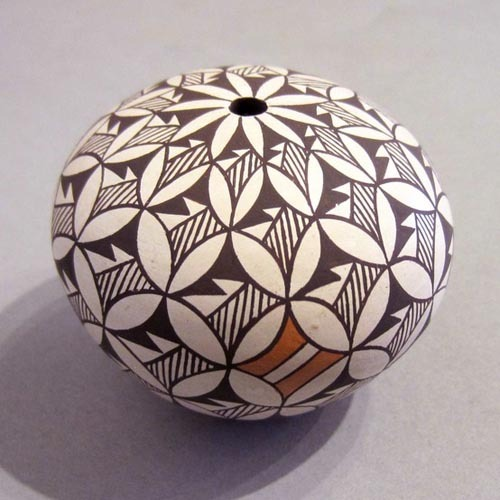  
애코머 푸에블로 인들의 도자기

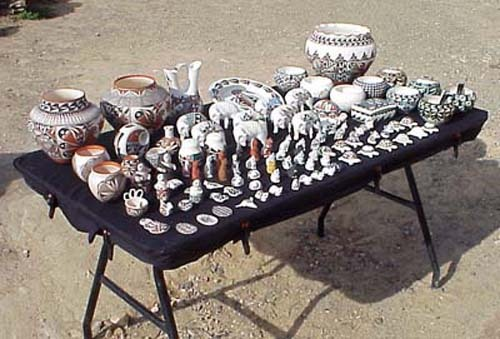  
마을 앞 좌판에 팔려고 늘어놓은 도자기들

아침 일찍 앨버커키의 숙소에서 나온 우리는 복잡한 산길 60마일을 달려 넓게 펼쳐진 분지 속의 스카이 시티에 산다는 애코머 푸에블로 인들을 찾았다. ‘스카이 시티 컬츄럴 센터(Sky City Cultural Center)’에 당도하여 긴 시간을 기다리고 난 11시 반에야 가이드 투어에 참여할 수 있었다. 애코머 푸에블로 인들이 살아온 메사(mesa) 즉 ‘꼭대기가 평평하고 주위가 벼랑인 돌 잔구’는 높이가 365피트[111.3m]나 되는데, 길은 잘 나 있었지만, 관광객들이 개인적으로 그곳에 접근할 수는 없었다. 반드시 셔틀버스로 이동하여 가이드의 안내를 받도록 되어 있었다.

셔틀버스를 타고 센터로부터 돌덩어리들 사이를 10분 정도 달려 올라가니 오랜 옛날부터 있어 온 듯 메사 위엔 애코머 푸에블로 인들의 전통 주거지가 조성되어 있었다. 모든 집들이 어도비 양식으로 지어진 것은 물론이고, 대체로 3열 3층으로 이루어진 아파트 양식의 건물들이었는데, 모두 남향이었다. 이 건물들을 보며 이른바 어도비 양식의 핵심을 이해할 수 있었다. 즉 서까래, 풀 짚, 회반죽 등으로 덮은 지붕을 대들보가 가로질러 밖으로 삐죽삐죽 나오게 한 다음 어도비 벽돌로 벽면을 마무리하는 공법이었다. 1층 집의 지붕은 2층 집의 바닥이 되고, 2층 집의 지붕은 3층 집의 바닥이 되니, 실로 멋진 ‘상호의존적 건축법’이라 하지 않을 수 없었다. 그런 집들의 사이사이에 조성된 광장에서 각종 전통 행사들이 열렸으리라. 

2층이나 3층집을 오르내릴 땐 반드시 나무 사다리를 사용했다. 만약 위에서 사다리를 치워버리면 그 집에 올라갈 수 없으니, 그것은 일종의 ‘외적에 대한 자위(自衛) 수단’이기도 했다. 지금처럼 차가 다닐 수 있는 길이 나기 전에는 평지에서 메사를 오르내리던 통로라 해야 기껏 돌 표면을 파서 만든 가파른 계단뿐이었을 것이니, 그곳만 막으면 외적들이 메사 위의 주택가로 올라올 수가 없었을 것이다. 뿐만 아니라 대부분의 집들 앞에는 그들의 전통 빵을 굽는 흙 화덕이 만들어져 있고, 개중에는 최근에 빵을 구은 듯 그을음이 밖으로까지 번져 나온 경우도 보였다. 서남쪽 벼랑 위엔 엄청난 크기와 규모의 어도비 건축물 ‘성 이스테반 성당[San Esteban Del Roy Mission]’이 있고, 그 앞마당엔 공동묘지가 조성되어 있었다. 사진은 성당의 겉면만 찍을 수 있었고, 그나마 공동묘지 근처에서는 카메라를 조작조차 못하게 막는 것으로 보아, 성당 내부나 공동묘지가 그들에겐 성역(聖域)임을 알 수 있었다.

그들의 종교나 신앙에 관한 궁금증은 전형적인 애코머 푸에블로 인디언인 가이드의 설명으로 대부분 해소되었다. 그는 “애코머 인들의 전통 신앙은 인간의 삶과 자연 사이의 조화를 강조한다는 것, 태양은 창조주 신을 대리하는데, 공동체를 둘러 싼 산들과 그 위에 떠 있는 태양 그리고 그 아래의 땅이 균형을 이루어 애코머의 세계를 형성한다는 것, 전통 종교 의례는 충분한 강우를 비는 데 중심이 있었으므로 날씨에 많이 좌우된다는 것, 그런 제의에서 카치나(kachina) 댄서들이 춤을 춘다는 것, 푸에블로 거주지에는 종교 의례를 행하는 방 즉 카이바(kiva)들이 있다는 것, 각 푸에블로의 지도자는 공동체 종교의 지도자이거나 추장의 지위를 갖고 있는데, 추장은 태양을 관찰하여 종교의례의 스케줄을 짜는 지침으로 사용한다는 것, 많은 애코머 인들이 가톨릭 신도들이며 그들의 행사에 가톨릭 정신과 전통 종교가 혼합된 모습이 보인다는 것, 아직도 많은 제의들이 살아 있는데, 9월에는 그들의 수호신인 스테판 성인(Saint Stephen)을 기리는 축제가 있다는 것, 그날에는 메사가 대중들에게 개방되어 2천명 이상의 순례객들이 축제에 참여한다는 것” 등을 열심히 설명했다.

성당에 이르기 전 중앙 광장에는 세 개의 흰 색 통나무들을 엮고 위쪽에 가로막대를 댄 ‘사다리 모양의 제구(祭具)’ 두 개가 가옥에 비스듬히 걸쳐져 있었는데, 가이드에게 용도를 물으니 일종의 ‘기우제의(祈雨祭儀)’에 쓰이는 물건들이라고 했다. 즉 세 개의 통나무는 ‘빗줄기’를, 위쪽에 댄 가로막대는 비구름을 상징한다는 것이었다. 사막지대에서 늘 물이 모자라 고통을 받던 그들의 삶을 여실히 보여주는 제구였다. 말하자면 가톨릭과 전통 제의가 공존하던 신앙의 형태를 현장에서 확인하게 된 것이었다.

그렇다면 이들의 가족 형태는 어떨까. 모계사회인 애코머 인들에게는 대략 20개의 클랜(Clan)들이 있었고, 오늘날에는 19개의 클랜들이 살아 있으며, 각각의 클랜에 따른 상징동물들이 있었다. 클랜의 상속에 대하여 물으니 서로 다른 클랜 출신의 남녀가 결혼하여 아이를 낳을 경우 모계사회인 만큼 아이의 클랜은 어머니의 것을 따른다고 했다. 이들의 결혼은 모노가미(monogamy) 즉 일부일처제로서 이혼은 매우 드물며, 사람이 죽은 경우 4일 낮밤을 새운 뒤 매장한다고 했다.

가이드를 따라 이동하는 곳곳에 애코머 여인들이 좌판을 벌이고 앉아 있었다. 주로 그들이 직접 구은 도자기와 비드(bead) 및 수예 등 전통 수공예품들이었다. 아이들도 자신들이 만든 아기자기한 도자기들을 갖고 나와 파는 것을 보며, 공예기법이 부모로부터 자녀들에게 전수되는 양상을 확인할 수 있었다. 강요는 하지 않았으나, 이들 좌판에 연결되도록 가이드의 이동경로는 교묘하게 짜여 있었다. 카지노 등의 독점 사업으로 쉽게 돈을 버는데 만족하지 않고 자신들의 본거지에서 조상으로부터 물려받은 기술을 바탕으로 자립하고자 하는 그들의 의지가 매우 바람직하게 느껴지는 순간이었다.

\*\*\*

애코머 인들에게서 미국화(Americanization)의 냄새를 맡을 수는 없었다. 물론 현재 메사의 전통가옥에 사는 주민들은 극히 일부분이고 도시로 나가 사는 사람들이 대부분이었다. 그리고 가이드가 보여준 것처럼 그들 역시 미국인인 만큼 영어를 유창하게 구사하고 있긴 하지만, 자신들의 정체성만큼은 어떻게든 붙잡고 있으려는 그들의 노력이 돋보였다. 스페인이 지배하던 멕시코의 한 부분이었으므로 미국의 다른 지역과 달리 이 지역은 가톨릭이 지배적인 종교였다. 그들의 지배를 받아 가톨릭을 받아들이면서도 자신들의 전통 신앙을 버리지 않은 애코머 푸에블로 인들이었다. 인근 부족들과의 교역을 통해 부를 축적하고 자신들의 안전을 지키기 위해 메사의 고지대에 거주하는 지혜를 발휘하기도 했다. 어도비라는 건축양식을 통해 주변 자연환경과 조화를 이루는 생활미학을 구현하고 뉴멕시코의 지역 미학으로 승화시킨 점은 무엇보다 먼저 강조되어야 할 그들의 공로였다. 그들은 아름다운 도자기와 각종 수공예품들을 직접 생산하여 지금도 외부인들에게 팔고 있었다. 또한 아직도 5천에 가까운 애코머 인들이 자신들의 정체성을 지키며 이 지역 혹은 그 인근에 살고 있으며, 외부와의 통로를 열어놓은 채 자신들의 미래를 가꾸고 있었다. 애코머 푸에블로 인들이 비록 이 사회 마이너리티들 가운데 하나이지만, 그들이 뿜어내는 삶의 의지와 미래지향적 성향을 확인하게 된, 소중한 경험이었다.

  
기우제의에 사용하던 도구[세 개의 기둥은 빗줄기를 가로막대는 구름을 상징함]

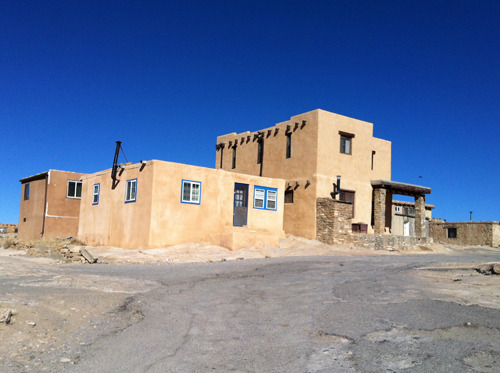  
이 도시의 전형적인 어도비 양식 주택

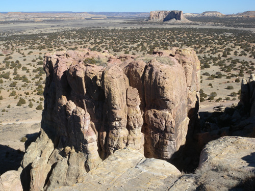  
메사에서 내려다 본 아래쪽 경관

  
메사의 주택가 좌판에 어린이들이 자신들의 작품을 진열하고 있다.

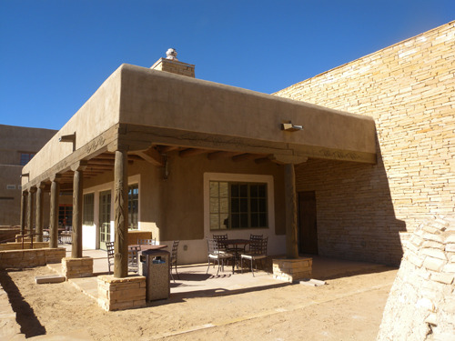  
컬츄럴 센터의 식당

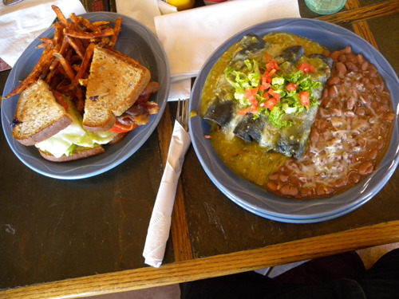  
식당에서 주문한 푸에블로 전통음식[멕시코 풍 음식이었음]

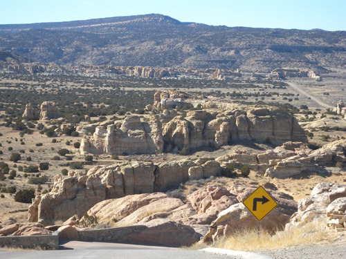  
애코머 스카이 시티 가는 길 표지판

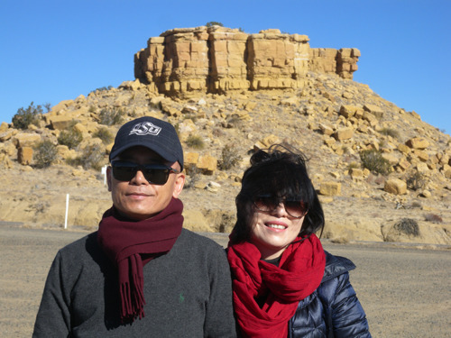  
애코머 스카이 시티 건너편 언덕에서

공유하기

게시글 관리

**백규서옥\_Blog ver.**