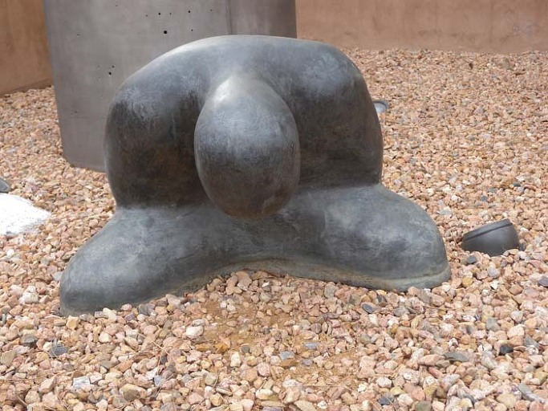

  
데이비드 킴볼 앤더슨(David Kimball Anderson) 작 <Big Mind: Bowing, Black Robe>,   
뉴멕시코 주 산타페의 'New Mexico Museum of Art' 소장

설날 인사

작년 여름 저희가 이곳에 도착했을 땐 땡볕 더위에 외출조차 못할 정도였습니다.

시각이 늘 그 자리에 있을 것으로 착각하며 게으름을 부릴 때도 많았는데,

벌써 갑오년 설을 맞이하였습니다.

먼저 저를 아껴 주시고 자주 백규서옥을 찾아주시는 손님 여러분께 세배 올립니다.

갑오년 새해에도 큰 복 받으시고, 가내 두루 평안하시길 빕니다.

지금 설인지 뭔지 알지도 못하는 미국 사람들 틈에 끼어 있긴 하지만,

저희들은 늘 조상과 후손을 생각하고 나라의 장래까지 걱정하며

‘살얼음 밟듯’ 남의 땅에서 한동안 잘 지냈습니다.

국태민안(國泰民安)이야말로 저희 같은 민초들의 한결같은 바람 아니겠는지요?

정치하시는 분들, 옳은 판단으로 정신 좀 바짝 차리시고,

국가의 공직에 있는 분들, 한 결 같이 바른 마음을 가지시고,

기업하시는 분들, 한 눈 팔지 말고 열심히 노력해 주신다면,

밑에 있는 저희들이야 무슨 걱정이 있겠습니까?

‘위기가 기회’라는 평범한 진리가

새해에는 ‘남북통일의 결정적 계기’로 구현되리라 믿어봅니다.

궤도를 벗어나 방황하는 우리의 이웃들이 화해와 화평의 큰 장에서

함께 할 수 있으리라 믿어봅니다.

모쪼록 건강하시고

가내 두루 평안하시길 빕니다.

감사합니다.

갑오년 첫날 아침

미국에서

백규 인사드림

공유하기

게시글 관리

**백규서옥\_Blog ver.**