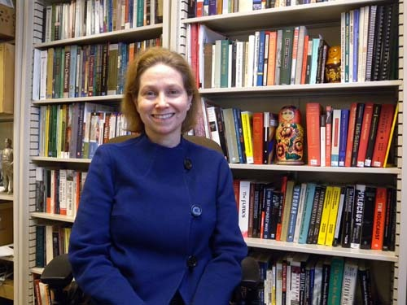
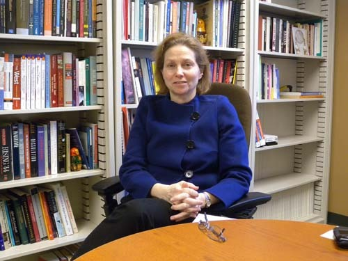
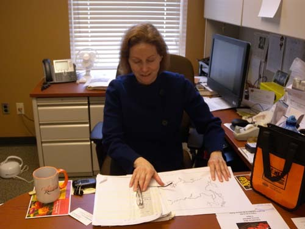
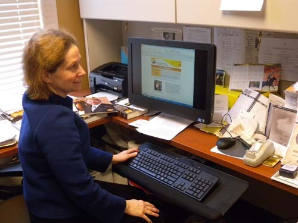
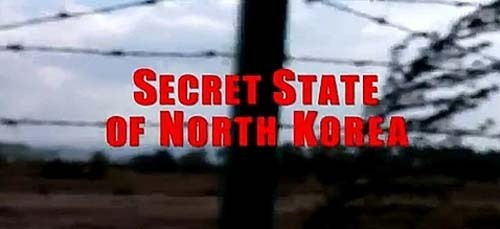
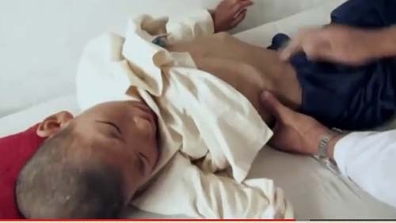
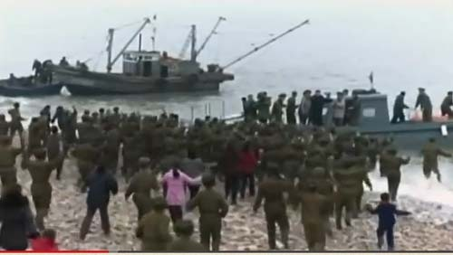

  
연구실에서 포즈를 취한 림멜 교수

한국의 통일을 열망하는 러시아 역사 전문가, 림멜(Lesley A. Rimmel) 교수

미국에 있는 동안 꽤 많은 미국의 지식인들을 만났다. 주로 교수나 강사, 박물관의 큐레이터들, 박사과정에 있는 학생 등인데, 그 가운데는 오가는 도중 우연히 만나는 사람들도 있었고, 지금까지 비교적 자주 만나는 사람들도 있다. 한국도 마찬가지지만, 대부분의 미국 지식인들이 타인들 특히 외국인들을 낯설어 하며 자신들만의 울타리에 갇혀 지내는 것 같은데, 알고 보면 그렇지 않은 경우도 적지 않다. 자신의 전공을 통해 얻은 통찰력으로 남을 이해하기도 하고, 남에 대한 관심이나 이해를 통해 전공에서 만난 문제들을 풀기도 한다.

12월 중순의 어느 날 점심시간. 브레이크 룸에서 커피를 데우고 있는데, 평소 눈인사 정도를 나누던 여 교수 한 분이 반갑게 인사를 건네며 말을 걸어왔다. 며칠 전 PBS에서 방영된 ‘비밀의 국가 북한[Secret State of North Korea]’란 다큐멘터리를 보았느냐고 물었다. 그 순간 나는 참으로 많이 부끄러워졌다. 방영된다는 소식을 뉴스로 듣긴 했으나 까맣게 잊고 있었던 것이다. 동족의 끔찍한 참상들이 미국인들의 눈앞에 발가벗겨진 채 드러난 모양이구나! 집에 돌아가자마자 포털사이트에서 그 방송을 확인했고, 며칠 후에는 다운로드해서 직접 보기도 했다.

내가 알고 있거나 짐작하고 있는 사실들의 반복에 불과했지만, 미국인들에겐 충격으로 다가왔을 내용이었다. 특히 군사조직에 가까울 정도의 병영국가 체제, 대한민국과 미국을 주된 표적으로 무력을 앞세운 협박, 몽땅 쇼 윈도우의 컨셉으로 꾸며진 평양, 비참하고 끔찍한 정치범 수용소들, 살아남을 힘마저 상실한 아이들과 일반국민들의 참상 등. 내게 북한의 현실을 일깨워 준 림멜 교수에게 달리 할 말은 없었으나, 그렇다고 가만히 있을 순 없었다. 그녀를 만나 South Korean들의 입장을 말하지 않으면 내 자존심이 허락지 않을 것 같았다. 오늘 드디어 림멜 교수의 연구실에서 장시간 만나 한반도의 현실을 설명하고, 그녀의 관심사에 관해 대화를 나누었다. 그리고 그 대화들 가운데 한 부분을 이곳에 올리기로 했다.

                                                      연구실에서 필자와 대담 중인 림멜 교수

\*\*\*

앞서 말한 바와 같이 림멜 교수는 ‘자신의 전공을 통해 얻은 통찰력으로 남을 이해하게 된’ 대표적 미국 지식인이다. 명문 예일 대학 역사과를 우등으로 졸업한 그녀는 이듬 해 ‘국제 교육 교류 위원회[Council on International Educational Exchange]’의 수혜자로 선발되어 상트 페테르부르그의 레닌그라드 주립대학[Leningrad State University]에서 ‘러시아어 프로그램’을 이수했으며, 컬럼비아 대학교에서 석사학위를, 펜실베이니아 대학교에서 ‘키로프(Kirov) 살해와 소비에트 사회: 1934-35년 레닌그라드에서의 선전과 여론[The Kirov Murder and Soviet Society: Propaganda and Popular Opinion in Leningrad, 1934-35]’이라는 논문으로 박사학위를 받은 수재였다.

1995-96년에는 펜실베이니아 대학에서 강사로 재직했고, 1998년 가을학기부터 이곳 OSU에 자리를 잡고 주로 러시아•중앙아시아•근대 유럽을 중심으로 하는 과목들을 강의해 왔으며, 20여 종에 가까운 수상 및 그랜트(Grant) 수혜 경력을 갖고 있는 탁월한 교수임을 최근에서야 알게 되었다. 그 가운데는 풀브라이트(1991-92), 앨리스 폴 어워드(Alice Paul Award/1991), 국제 교류 연구 기금(International Research and Exchanges Board Grant/1991-92) 등을 비롯, 일일이 헤아리기 어려울 정도로 많은 수혜를 받은 학자임을 확인하게 되었다. 그녀의 주된 관심사는 스탈린 시대 소련 역사에서 ‘통치체제를 유지하기 위한 수단으로서의 폭력’이었고, 전쟁을 비롯한 집단 폭력이나 지하경제와 같은 국제적 기층민중의 현실 등에도 진지한 관심을 기울여 왔다.

그렇다면 그녀는 왜 북한사회를 중심으로 하는 한국의 현실에 관심을 갖는 걸까. 북한 얘기를 꺼내자 그녀는 김정은을 입에 올리며 스탈린보다 훨씬 잔인한 그의 성격을 강하게 비판했다. 이야기 도중 책장 위에 올려놓았던 스탈린의 ‘배불뚝이 동상’을 꺼내더니 ‘김일성-김정일-김정은’의 체형(體形)이 스탈린과 똑같지 않으냐고 내게 물었다. 국민들을 배고프고 괴롭게 하면서 자신의 배를 불린 ‘전형적인 독재자의 모습’을 스탈린에게서 찾을 수 있고, 한반도의 김씨 3대는 바로 그 아류라는 것이었다.

말하자면 스탈린 시대를 중심으로 러시아 역사를 긴 세월 연구해 온 그녀로서 ‘국민 착취 및 학대의 전형적인 독재자’로 스탈린을 꼽은 것은 당연한 일이었지만, 체형과 인간성의 유사성까지 들면서 김씨 3대를 스탈린보다 더 잔인하고 독한 인물들로 규정하고 있는 점은 흥미로웠다. 그나마 스탈린은 자기 당대에 끝이 났지만, 김씨 왕조는 대물림을 하고 있으므로 훨씬 지독한 인물들이라는 것이었다. 그러고 보니 스탈린이나 김씨 3대 등 ‘배불뚝이 독재자들’을 ‘주민을 학대하고 착취하는 악마적 지도자’의 시각적 상징으로 해석할 수도 있음을 그녀의 설명으로 깨달을 수 있었다. 스탈린의 독재가 결국 소련 해체의 단서로 작용한 것처럼 그보다 더 잔인한 모습으로 한반도 북쪽에 군림하고 있는 김씨 3대 특히 김정은의 폭력성이 조만간 체제의 전복으로 이어질 수 있다고 보는 것이 그녀의 관점이었다.

  
연구실에서 필자와 대담 중인 림멜 교수

  
연구실에서 필자에게 설명 중인 림멜 교수

\*\*\*

주변에 입양된 한국의 고아들을 언급함으로써 나를 부끄럽게 했지만, 이내 한국인 친구들이나 한국과의 친분을 강조함으로써 나로 하여금 친밀감을 갖게 한 그녀. 그러나 잠시 후 그녀는 삼성•현대•기아•엘지•대한항공 등 미국을 비롯한 세계에서 두각을 나타내고 있는 한국의 기업들을 죽 나열하고 그들의 장점까지 거론했으며, 자신이 사용하고 있는 삼성 폰을 보여주기도 했다. 그 뿐인가. 한국의 박정희•전두환 대통령을 독재자로, 김영삼•김대중 대통령을 민주주의 정착기의 대통령으로, 그 사이에 있는 노태우 대통령을 과도기로 각각 규정하는 등 한국 대통령들의 이름과 공적을 꿰고 있었으며, 반기문 총장, 김용 세계은행 총재 등 세계에서 활약하는 한국인 명사들의 이름을 줄줄 외움으로써 한국인인 나를 적잖이 놀라게 했다.

상당수의 한국인들은 산업화의 결정적 초석을 놓은 박정희 대통령을 존경하고 있으며, 그 여파로 박근혜 대통령도 정계의 전면에 등장할 수 있었다고 내가 설명하자 그 말을 수긍하면서 박근혜 대통령에 대해 물어왔다. 세대에 따라 약간씩 차이는 있지만, 전체적으로 믿음직하다는 평가를 받아 비교적 높은 지지를 받고 있다고 말하자, 동북아시아의 큰 나라들이나 미국도 내지 못한 여성 대통령을 선출했다는 점과 함께 여성의 리더십이 나라를 흥하게 하는 선례를 한국이 만들 것이라는 고무적 관측까지 내놓는 것이었다. 북한이 매우 폭력적으로 나오는 것도 국제사회에서 보여주는 한국의 다양한 활약이나 선전(善戰)에 불쾌감을 느끼는 데 큰 원인이 있을 수 있다는 그 나름의 분석을 보여주기도 했다.

\*\*\*

학자로서 자신이 전공한 학문을 바탕으로 현존하는 체제의 미래를 예측하는 것만큼 신나는 일은 없을 것이다. 걸출했던 역사철학자 E. H. 카는 ‘역사가와 사실 사이의 상호작용’ 즉 ‘과거와 현재의 부단한 대화’가 역사라고 했다. 그 대화는 역사적 사실에 대한 역사가의 온당한 해석 행위이고, 그런 해석을 통해 역사의 객관성은 확보될 수 있다고 보았다. 스탈린 시대에 생겨난 역사적 사건들의 해석을 통해 단순히 그 시대의 규명에나 그치고 만다면, 그것을 진정한 역사가의 안목이라고 할 수는 없다. 그런 점에서 한국인 학자를 만나자마자 북한을 지배하고 있는 김씨 3대 혹은 북한의 미래까지 내다보는 통찰을 림멜 교수는 내게 보여준 것이리라. 여지없이 엄정한 시각을 실제로 존재했던 역사적 사실들의 해석에서 얻어내는 존재들이라는 점에서 제대로 된 역사학자들을 만나는 일이 내겐 큰 즐거움이고, 그 즐거움을 림멜 교수와의 만남에서 비로소 확인할 수 있었다.

  
컴퓨터 자료를 보여주며 설명하고 있는 림멜 교수

  
림멜 교수가 현재 사용하고 있는 삼성 폰

  
2013. 12. 14. PBS에서 방영한 '비밀의 국가 북한' 타이틀 화면[방송화면 캡쳐]

  
영양실조에 걸린 북한의 어린이[방송화면 캡쳐]

  
군 진지를 순시하는 김정은에게 달려가며 충성을 과시하고 있는 인민군들[방송화면 캡쳐]

공유하기

게시글 관리

**백규서옥\_Blog ver.**