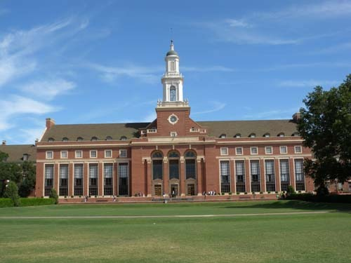
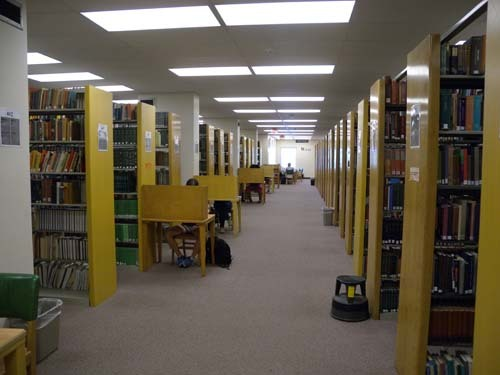
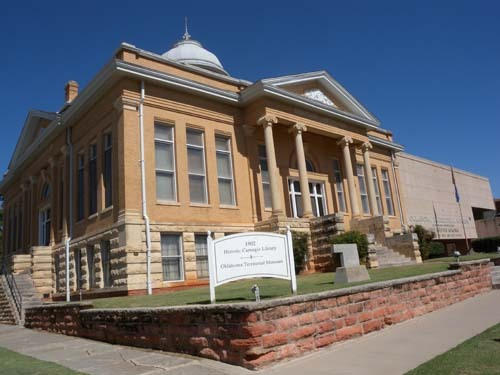
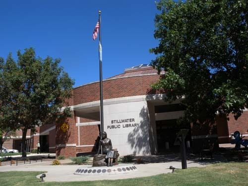
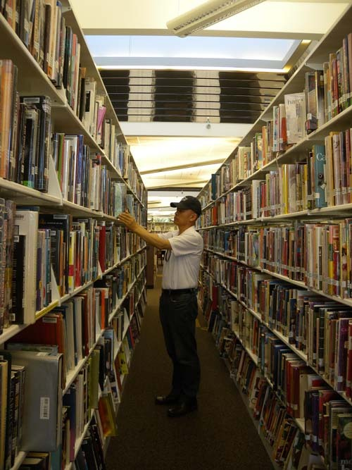
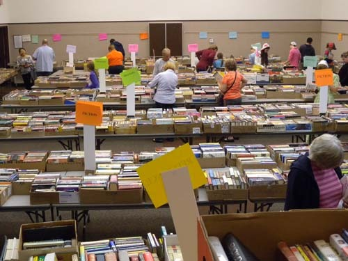

  
OSU의 중앙도서관

  
OSU 중앙도서관의 서고

  
오클라호마주 거쓰리시티(Guthrie City)의 카네기 도서관  
(오클라호마 주에서 가장 먼저 세워졌음)

  
오클라호마주(Oklahoma State) 스틸워터(Stillwater)의 시립도서관

부럽기만 한 미국의 도서관들

15년 전 미국의 유명대학에 잠시 머물고 있을 때, ‘도서관의 하드웨어와 소프트웨어’가 대학의 질을 좌우한다는 점을 뼈저리게 느낀 바 있다. 당시의 내 의식수준으로 그들의 도서관 시스템은 환상 그 자체였다. 도서관에 신청만 하면 미국 전역, 아니 유럽의 대학 도서관에 있는 자료들까지 입수해 빌려주는 그들의 제도가 신기하기만 했다. 그런 상황에서 도서관이 교수와 학생들에게 연구와 공부의 중심이 되는 것은 자연스러운 일이었다.

그로부터 15년이 지난 지금 나는 또 다른 미국의 대학에 와 있다. 그런데 웬만한 자료들이 거의 모두 디지털화 된 지금의 상황이 도서관 시스템에 그대로 반영되어 있음을 발견하게 되었다. 연구 자료를 신청하면 세계 전역의 디지털 자료까지 일일이 찾아내어 이메일로 서비스해주는 환상적인 체험을 즐기고 있는 중이다. 지난 15년 동안 한국의 대학들은 장서 숫자의 확충이나 새 건물들의 건립에 치중해 온 것이 사실이다. 대학평가의 주요 항목 가운데 장서량이 절대적이기 때문일 것이다. 해외 대학 도서관들과 자료를 교환하기는커녕 국내 대학도서관들 사이에서도 자료교환이 이루어지지 않고 있다. 좋은 자료를 많이 소장하고 있는 것으로 착각하는 큰 대학들이 그 제도에 응할 리 없기 때문이다.

미국이 대학의 도서관들만 훌륭한 건 아니다. 작으면 작은 대로 크면 큰 대로 각 지역에는 공공도서관들이 있고, 질 좋고 풍부한 장서를 자랑한다. 수시로 독서 관련 이벤트를 여는 등 도서관은 그 지역의 문화센터 역할도 톡톡히 해내고 있다. 그 뿐인가. 도서관마다 새로운 도서들이 수시로 들어오니 오래 된 책들이나 복권(複卷)들은 퇴출시키는데, 그걸 주민 상대로 공짜에 가까운 가격[수십 센트에서 1불 혹은 2불]으로 판매하는 행사를 주기적으로 연다. 많은 사람들이 흡사 ‘선물 받아 기쁘다’는 표정으로 좋은 책들을 한 아름씩 안고 가는 모습을 부럽게 바라본 경험은 15년 전이나 지금이나 마찬가지다.

퇴근 무렵 직장인들이 책을 한 아름 안고 와서 반납한 뒤 새로운 책들을 빌려가는 모습, 마트 가는 길에 들러 책을 반납하고 빌려가는 아주머니들, 손자・손녀들과 손을 잡고 도서관에 들러 독서삼매에 빠져 드는 할아버지・할머니들, 도서관에 비치된 고급 서적들을 꺼내 놓고 읽어가며 과제물 작성하기에 바쁜 고등학생들, 설치해 놓은 컴퓨터들을 통해 각종 인터넷 정보를 검색하고 출력하는 데 몰두하는 일반인들... 대학 도서관에 가보아야 미국 대학들의 경쟁력을 알 수 있고, 지역의 공공 도서관에 가보아야 미국의 힘을 느낄 수 있다는 것이 변함없는 내 지론이다.

누구나 아는 바와 같이, 카네기(Andrew Carnegie)는 20세기 미국 최고의 부자였다. 스코틀랜드 계 미국인이었던 그는 미국사회의 발전을 위해 자신의 재산을 아낌없이 쓴 인물이지만, 무엇보다 놀라운 건 도서관을 짓는 일에 헌신했다는 점이다.

그는 1883년부터 1926년까지 전 세계에 2,509개의 도서관을 지어주었다. 그 가운데 1,689개는 미국에, 660개는 영국과 아일랜드에, 125개는 캐나다에, 나머지는 오스트레일리아・뉴질랜드・세르비아・피지 등에 각각 세워졌다. 1919년 미국 전역에 3,500개의 공공 도서관이 있었는데, 이 가운데 절반 이상이 카네기가 지어준 것이라니, 얼마나 놀랄만한 일인가.

돈과 권력을 자손들에게 넘겨 줄 욕심으로 독직(瀆職)의 죄를 지어왔고 지금도 짓고 있는 우리나라 전직 대통령들, 수단과 방법을 가리지 않고 부를 세습하기 위해 애쓰는 이 나라의 재벌들이 우리의 현주소다. 그들이 어렸을 적에 카네기의 전기를 단 한 페이지만 읽어 봤어도 자신들이 갖고 있는 부를 어떻게 써야 하는지 알았을 텐데. 단돈 한 푼 책이나 도서관에 기증하지 못하는 현실을 보며, ‘참 돈 쓸 줄 모르는’ 그들이 안타까울 뿐이다.

\*\*\*

내가 시골에서 태어나 자라던 때는 우리 사회에 책이 몹시도 귀하던 시절이었다. 당시 초등학교에도 도서관은커녕 읽을 만한 낱권의 책조차 없었다. 서울의 어떤 독지가가 기증했다는 수십 권의 동화책들이 전부였는데, 그나마 늘 자물쇠가 채워진 채 교무실 한 구석을 지키고 있었다. 그럼에도 책을 좋아하게 된 것은 내게 더할 수 없는 행운이었다. 그렇게 60년대~70년대의 학창시절 내내 지적인 궁핍의 상황은 지속되었다.

정치적・문화적으로 격동의 시대였던 80년대. 책의 생산량과 국민들의 독서량이 막 늘어나려는 찰나 프로 야구가 시작되었고, 컬러 TV의 방송이 시작되었다. 사람들은 책을 잡는 대신 한층 야해진 영화, TV 드라마, 프로 스포츠에 빠져들었다. 도서관이래야 잡동사니들을 다 합쳐서 100만권을 소장하는 대학들이 거의 없었고, 공공도서관 없는 지역들도 수두룩했다. 도서관은 그저 ‘있으면 좋고, 없어도 그만’인 시대가 우리 사회에서 최근까지 지속되었다. 도서관이란 한낱 ‘독서실’, 그것도 ‘시험 때나 잠시 찾아가는 공부방’이란 것이 우리 학창 시절의 일반적 인식이었다. 그러니 독서열풍은커녕 책이 뭣에 쓰는 물건인지에 대한 기본 상식을 지닌 국민들도 그리 많지 않았다.

우리 국민의 화끈한 성품대로 시절은 순식간에 디지털 시대로 넘어갔다. 정신 나간 교육부 인사들이 이젠 종이 책을 없애고 아이들 교과서도 ‘이북[e-book]’으로 바꾸겠다고 나섰다. 종이 책을 ‘아날로그 시대의 뒤쳐진 산물’로, ‘이북’을 ‘디지털 시대 발전의 산물’로 동일시하는 인사들이 나라의 정책을 좌우하는 시대가 되었다. 공짜로 주어지는[아니, 사실은 아주 비싼 값으로 주어지는] 단말기를 손에 넣자마자 아이들은 게임을 즐기기에 바빠 그것을 교과서로 쓰는 시간은 하루에 단 몇 분, 길어봐야 한 두 시간에 불과했다. 그게 손아귀에 들어가는 순간 그나마 ‘개꼬리만 하던’ 독서시간은 아예 사라져 버려, 다시 ‘독서 시대’의 영광을 되돌리기엔 불가능해졌다. 독서의 습관을 처음부터 가져 보지 못한 기성세대와, 디지털에 사로잡힌 신세대가 어우러진 이 나라의 현실이 걱정이다.

지금 우리가 국민소득 2만 불을 가까스로 넘겼다고는 하나, 국민의식이 변하지 않고는 3~4만불 대의 선진국 대열에 올라서기 어렵다. 그러나 교육을 통하지 않고는 국민의식을 변화시킬 수 없고, 지금 같은 교육열만으로 세계와 경쟁할만한 인재를 길러내기란 쉽지 않다. 아이들이 스스로 생각하고 올바로 행동에 옮길 수 있는 아이디어와 능력은 기본적으로 독서를 통한 ‘자발적 공부’에 의해서만 얻어질 수 있다. 억지로 주입시킨다고 두뇌의 용량이 늘어나는 것은 아니기 때문이다.

자식 교육에 큰돈을 쏟아 부어야 하는 부정적 풍조를 고쳐야 나라가 산다. 그러기 위한 지름길이 바로 독서운동이다. 어머니나 주부들이 하루에 단 한 두 시간만이라도 조용히 앉아 책을 읽어보라. 아버지들이 퇴근 후 곧바로 집에 들어와 단정한 모습으로 책을 읽어보라. 휴일에 부모가 아이들의 손을 잡고 좋은 서점에 가서 몇 권의 책을 사주고, 책 읽은 아이들에게 칭찬이라도 건네 보라. 그 순간 아이들의 분위기는 달라질 것이다. 자신들은 책을 멀리하면서 아이들보고만 ‘공부하라, 책을 읽어라!’고 야단치는 것처럼 모순적인 행동은 없을 것이다. 부모들부터 바뀌면 아이들은 책을 가까이하게 될 것이고, 아이들이 책과 가까이만 할 수 있다면 사교육비로 큰 돈 쓸 필요는 없어지게 될 것이다.

\*\*\*

현재 우리나라에는 700개 정도의 공공도서관이 있다. 그러나 앞으로는 동네마다 한 개씩 도서관이 있어야 한다. 방과 후 학생들의 학습이나 독서, 어른들의 여가활용도 동네 도서관을 중심으로 이루어져야 한다. 그러려면 국가 예산만으로는 모자랄 것이다. 재벌들이나 돈을 많이 모은 사람들이 도서관 운동에 헌신해야 하는 것도 그 때문이다. 카네기가 자신의 재산을 기울여 도서관을 지어준 것도 도서관에 국가의 장래가 걸려 있다고 보았기 때문이다. 책을 왜 읽어야 되는지, 도서관이 왜 필요한지 알지 못하고 알려고도 하지 않는 국민이나 국가는 결코 흥할 수 없다. ‘책 읽는 민족에게 미래가 있고, 도서관이 우리 삶의 희망 공간임’을 이제 우리 스스로 깨달아야 한다. 그것만이 우리의 살 길이다.

 

  
오클라호마주(Oklahoma State) 스틸워터(Stillwater)의 시립도서관 서가

  
       오클라호마주(Oklahoma State) 스틸워터(Stillwater)의 시립도서관에서 매년 정기적으로   
주민들에게 도서관 서고에 있는 책[겹치는 책이나 퇴출시키는 책]을   
'몇 센트~1, 2 불' 정도의 싼 값으로 판매하는 행사장

                                                                               @@@@@

                                  \*\*\*이 글은 태안도서관에서 발간하는 <<천자만홍>> 14호에 특집으로 실렸습니다.

공유하기

게시글 관리

**백규서옥\_Blog ver.**

[저작자표시 비영리 변경금지
(새창열림)](https://creativecommons.org/licenses/by-nc-nd/4.0/deed.ko)