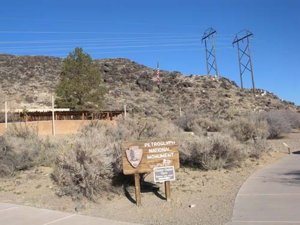  
'국립 암각화 유적지[Petroglyph National Monument]' 안내소 및 입구  
[여기서 암각화 현장까지는 자동차로 10분 이상 달려가야 함]

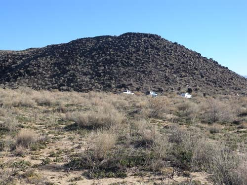  
건너편 길에서 잡은 '국립 암각화 유적지[Petroglyph National Monument]'

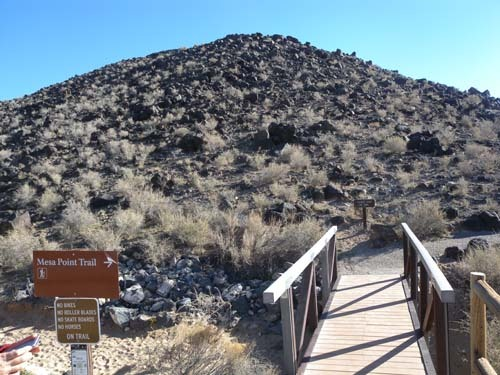  
'국립 암각화 유적지[Petroglyph National Monument]' 탐방로 입구

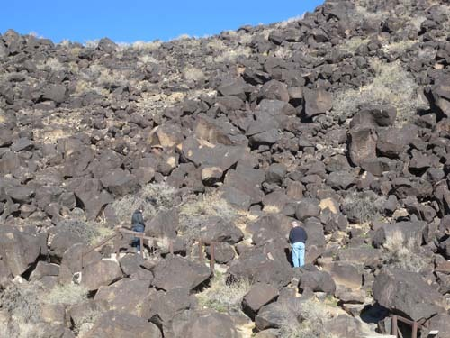  
'국립 암각화 유적지[Petroglyph National Monument]'에서 암각화들을 열심히 살피고 있는   
미국인 부부

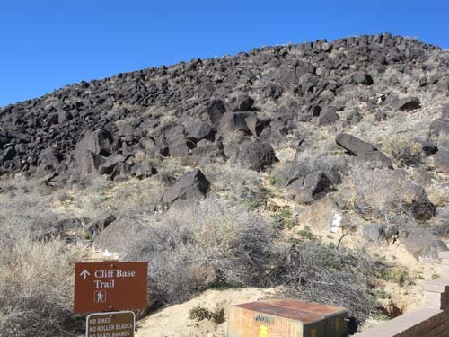  
'국립 암각화 유적지[Petroglyph National Monument]'의 벼랑길 탐방로

돌에 새긴 푸에블로 인들의 꿈

우리나라 울산의 천전리 각석[국보 147호]과 반구대 암각화[국보 285호]를 가보신 분들이 적지 않을 것이다. 수렵에 의존해 살던 수천 년 전인 선사시대의 우리 민족이 만들어낸 ‘생활예술’이 바로 그것들이다. 고래, 호랑이, 곰, 멧돼지, 거북, 사슴, 토끼 등 바다와 육지 동물들이 두루 등장하고, 20여명이 작지 않은 배를 타고 고래를 사냥하는 모습도 그려져 있다.

근처의 천전리 암각화에는 좀 더 추상화된 그림들이 등장한다. 연구자들의 분석에 따르면 마름모꼴이나 동심원 등으로 이루어져 있다는데, 그것들에 내포된 의미가 무엇인지는 분명치 않은 것 같다. 그러나 대상의 세밀 묘사에 치중한 사실화와 함께 내재된 의미를 암시하는 기호의 형상에 치중한 추상화가 같은 지역에 공존한다는 것은 선사시대에 이미 우리 조상들의 미학이 대단한 수준에 도달했음을 보여주는 증거일 것이다.

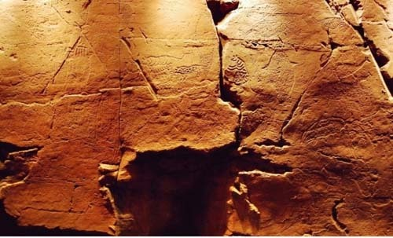  
울산 반구대 암각화

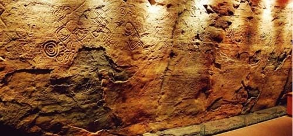  
울산 천전리 암각화[왼쪽의 동심원을 유심히 보아 두시지요.]

세계문화사적 관점에서 우리민족의 우수성이나 문화적 자존심을 선양하기 위해 그것들을 잘 보존하는 것만큼 중요한 일은 없을 것인데, ‘그냥 깔아뭉갤 것이냐 보존할 것이냐’를 두고 벌이는 말씨름에 귀한 시간을 허비하는 것 같아 안타까움을 금할 수 없다. 그런데, 이곳 뉴멕시코의 앨버커키에서 나는 그와 유사한 암각화들을 만났다. 물론 화질이나 형상화의 수준으로 우리나라 것들보다는 훨씬 못하지만.

\*\*\*

앨버커키 도착 사흘 째 되던 날, 빛나는 햇살은 시가지에 서린, 찬 기운을 녹여주고 있었다. 우리는 앨버커키를 따라 17마일[27km]이나 이어진 ‘국립 암각화 유적지[Petroglyph National Monument]’를 찾았다. 안내소를 통과하여 한참을 운전해 가니 앞쪽으로 푹 파인 분지가 나타났고, 분지의 뒤로 병풍처럼 생긴 고원(高原)이 펼쳐져 있었다. 총 넓이 7,236 에이커[29.28㎢]의 분지와 고원은 그로테스크의 미학으로 자신을 과시하고 있었다. 화산작용으로 생긴 분지는 시가지의 주택가를 향해 열려 있었고, 그 주변을 길게 둘러싸고 있는 가파른 벼랑엔 화산활동으로 생긴 현무암들로 뒤덮여 있었다. 분지 위쪽은 공사로 인해 폐쇄되어 있어 부득이 분지 앞쪽을 보는 것만으로 만족해야 했다. 저 시커먼 돌 더미들 사이에 무슨 의미 있는 것들이 숨어 있을까. 참으로 단순 소박한 황량함, 그리고 침묵만이 검은 돌들과 함께 그 공간을 메우고 있었다.

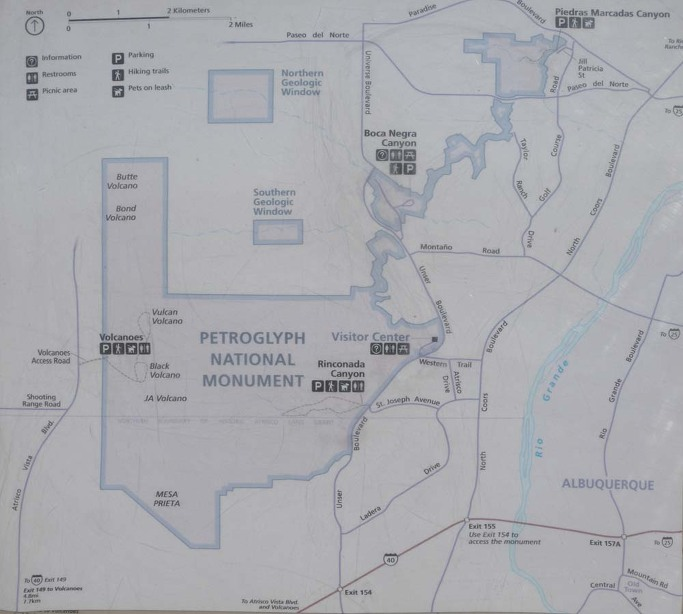  
'국립 암각화 유적지[Petroglyph National Monument]' 구역도

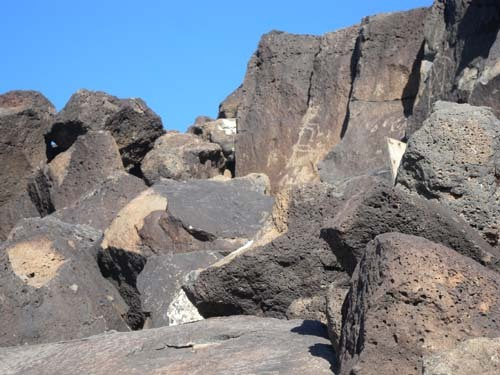  
'국립 암각화 유적지[Petroglyph National Monument]'의 모습

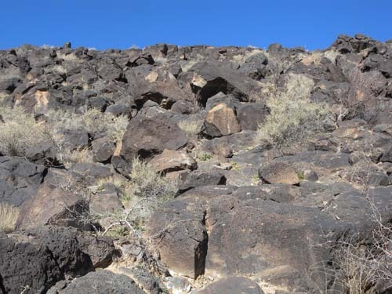  
'국립 암각화 유적지[Petroglyph National Monument]'의 모습

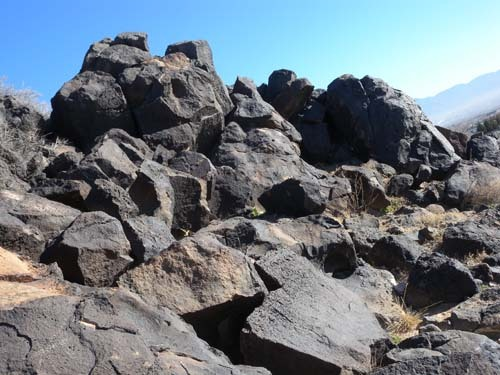  
'국립 암각화 유적지[Petroglyph National Monument]'의 모습

많은 것들이 포함되어 있는 공간인 ‘국립 암각화 유적지’. 다섯 개의 화산 분화구, 수백 개의 고고학적 현장, 고대 푸에블로 인들과 스페인 정착자들에 의해 그려진, 대략 24,000여 점의 그림들을 포함한 문화와 자연 자원들을 포함하고 있는 살아있는 박물관이었다.

정문을 통과하여 수백 미터를 전진, 산길 바로 앞의 작은 주차장에 차를 댔다. 나무다리를 건너 돌산에 들어서자마자 마치 푸에블로 인들이 그 사이에 숨어 있기라도 한 듯, 수많은 중얼거림이 돌들 사이에서 울려 나왔다. 그곳에 있는 돌들은 일종의 낙서장, 일기장, 혹은 소중한 게시판이자 광고판이었다. 푸에블로 인들이 돌에 새긴 자신들의 생각이나 소망이 바로 엊그제 올망졸망 유치원생들이 화판에 그린 그림들처럼 살아서 움직이고 있었다. 그림 가운데는 뱀이나 새 등 동물들도, 사람들도, 십자가도 있었으며, 알 수 없는 기호들도 적지 않았다. 어쩌면 그린 사람만이 알 수 있을 만큼, 그것들에 대한 의미의 해석이 쉽지 않았다. 예컨대 다음의 그림 같은 것들은 매우 복합적이면서도 상징적으로 보였다.

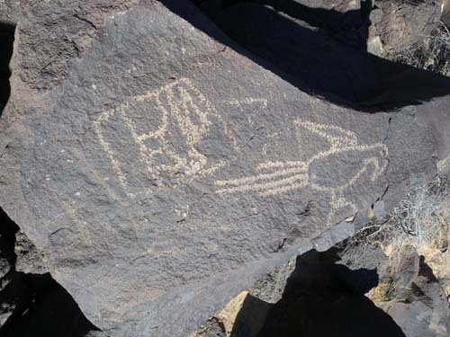  
'국립 암각화 유적지[Petroglyph National Monument]'-첫째 그림[본문 설명]

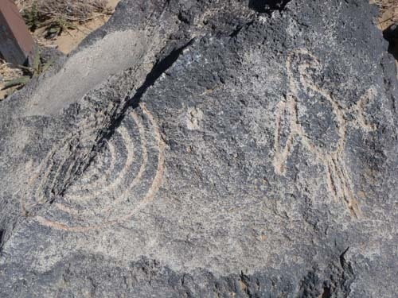  
'국립 암각화 유적지[Petroglyph National Monument]'-둘째 그림[본문 설명]

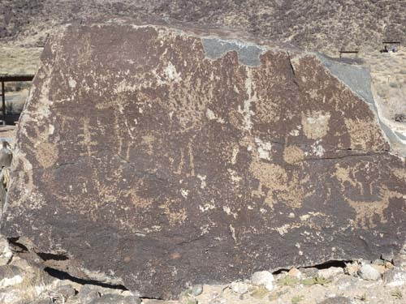  
'국립 암각화 유적지[Petroglyph National Monument]'-셋째 그림[본문 설명]

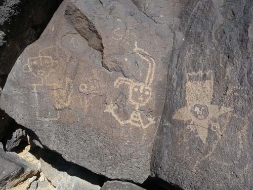  
'국립 암각화 유적지[Petroglyph National Monument]'-넷째 그림[본문 설명]

첫 번째, 두 번째 그림의 소재는 모두 독수리다. 그러나 첫 그림이 비교적 사실적임에 비해 둘째 그림은 약간 추상적이다. 일부 미국인 학자들은 이것을 앵무새[parrot]라 한다하나, 내가 볼 땐 턱없는 생각이다. 이들이 이 황야에서 살아가던 무렵에는 ‘사냥’이 주업이었을 것이다. 그럴 경우 그들이 바라본 독수리 같은 맹금류야 말로 사냥의 귀재가 아니었을까. 그간 돌아 본 10여 인디언 네이션들 대부분이 독수리를 상징동물로 채택하고 있었으며, 추장의 옷이나 모자 장식에도 독수리의 깃털이 주된 재료로 사용되고 있는 점을 확인했는데, 그건 그들이 독수리의 사냥 능력을 숭배해 왔다는 증거이리라. 어떤 인디언은 지금 미합중국의 상징 새가 독수리인데, 그것도 자기들의 것을 본뜬 결과라고 강변하며 웃었다.

우리가 바위에서 독수리 그림을 보고 있는 사이에도 하늘에는 독수리 한 마리가 유유히 선회하며 이곳을 내려다보고 있었다. 새 아래 왼쪽에는 작은 동물 한 마리가 들어 있는 네모 칸이 그려져 있다. 내 생각엔 이 그림은 아마도 땅 위의 작은 짐승들을 귀신같이 잡아내던 독수리의 사냥능력이 자신들에게 전이되기를 기원하며 행하던 ‘유감주술[類感呪術, homeopathic magic]’ 행위의 소산일 것이다. 두 번 째 그림에는 독수리와 동심원이 함께 등장한다. 그 동심원은 사실적이기만 한 다른 그림들에 비해 비교적 추상적인 성격을 지니고 있었다.

그렇다면 이 그림은 과연 무엇을 형상한 것일까. 동심원은 자아를 중심으로 번져가는 형상이다. 말하자면 ‘자아 중심의 세계 인식’을 드러내면서, 동시에 독수리로부터 받은 자신들의 힘과 권능이 주변 지역을 거쳐 결국 온 세상을 지배하게 되리라는 믿음이나 기원을 드러낸 것은 아닐까.

약간 복잡한 구도로 이루어져 있는 세 번째 그림에는 거북이, 말, 물고기, 작은 짐승들, 새 등이 등장한다. 말을 타고 땅 위의 짐승들을 사냥하던 모습이 그 내용인데, 집에 있던 부녀들이나 노인들이 사냥 나간 부족의 전사들이 ‘풍성한 포획’을 안고 돌아오길 기원하며 그린 그림으로 보인다. 네 번째 그림은 앞의 것들에 비해 추상도가 더 높은 경우다. 두 명의 인물과 알 수 없는 형상 등 세 개의 존재가 등장하는 것이 이 그림의 내용인데, 일종의 ‘추장 추대식’ 혹은 대관식을 형상한 내용으로 보인다. 즉 머리카락 한 올을 달고 있는 맨 왼쪽의 인물은 모자를 쓰지 않은 인물이고, 가운데 인물은 풍성한 머리칼 혹은 모자를 쓰고 있는 인물이며, 왼쪽의 추상적 존재는 독수리의 상징적 의미[아름다운 깃털, 밝고 지혜로운 눈, 용맹한 발톱]를 부각시킨 모습을 하고 있다. 즉 특이한 복장을 하고 있는 부족의 원로가 새 추장으로 선출된 인물에게 독수리의 권능이 실린 추장의 모자를 그에게 씌워 줌으로써 부족 통솔의 전권을 맡기는, 일종의 대관식 현장을 그린 내용일 것으로 추정된다.

그런가 하면 방울뱀[rattlesnake]을 그려놓은 단순화도 등장한다. 사막지대인 이 지역에 많이 서식하던 방울뱀으로부터 피해를 입는 주민들이 많았기 때문에, ‘조심하라’는 일종의 경고표지로 그려 놓았을 가능성이 크고, 독수리가 방울뱀을 잡아채는 그림에도 독수리의 힘으로 방울뱀을 제어해주길 기원하는 주민들의 염원이 내재되어 있는 것으로 보인다.

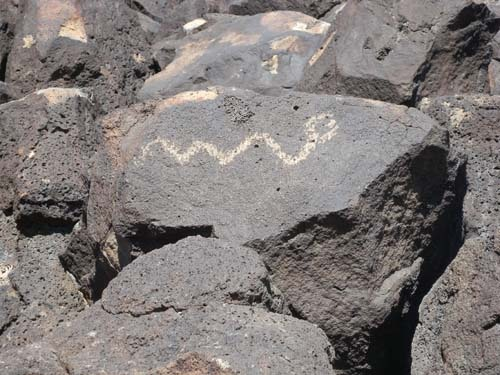  
'국립 암각화 유적지[Petroglyph National Monument]'의 방울뱀 그림

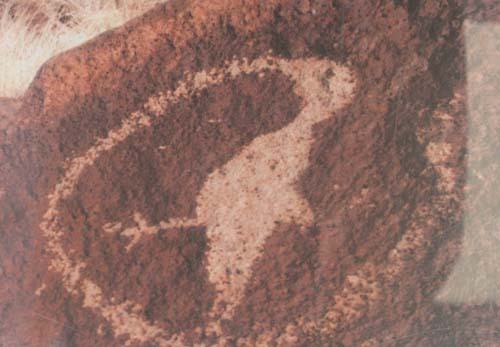  
'국립 암각화 유적지[Petroglyph National Monument]'의 뱀을 잡은 독수리 그림

\*\*\*

벼랑에 깔린 검정 일색의 화산암들은 천연의 캔버스였다. 일찍부터 이곳에 터를 잡고 살던 푸에블로 인들에게 이 산은 커뮤니티의 단합이나 시공을 초월한 커뮤니케이션(communication)에 결정적으로 기여한 현장이었다. 글자가 없던 시대에 이들이 사용할 수 있었던 것은 구체적이면서도 추상적인 형상이었고, 그것들은 자신들의 의사를 표현하던 훌륭한 기호였다. 구체적인 그림들 속에 동심원 등 추상화 단계의 기호들을 보여주는 것으로 미루어, 그들의 발전이 순조로웠다면, 글자의 고안에까지 이르렀을지도 모른다. 그러나 스페인 인들의 도래로 인해 자체의 발전은 종말을 고하고, 결국 거대 권력의 품 안으로 스며들게 됨으로써 푸에블로의 문화적 정체성은 한갓 ‘돌멩이들 위의 낙서’로 남아 백규 같은 호사가들을 위한 상상의 자료로나 기여하게 된 것이다.

울산의 반구대나 천전리의 예술을 주도했던 선사인들이 이곳까지 진출한 것으로 밝혀지길 기대하는 한국인들도 물론 있을 것이다. 그러나 세계 어느 곳에서나 만날 수 있는 암각화나 동굴화를 두고 동일 기원설을 주장하는 것도 사실 무리일 것이다. 글자의 바로 앞 단계가 추상화된 기호이고, 그 앞 단계가 구체적인 그림이었음을 감안하면, 어느 지역의 종족이나 부족에서도 발견할 수 있는 문화발전 단계의 보편적인 현상일 뿐. 굳이 이 지역의 그림에서 울산의 암각화를 떠올리며 흥분할 일만은 아니리라.

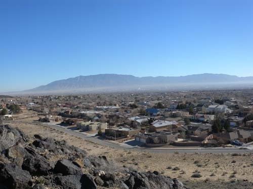  
'국립 암각화 유적지[Petroglyph National Monument]'에서 바라본 앨버커키 외곽의 주택가

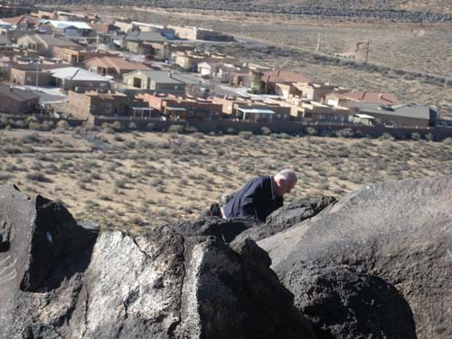  
'국립 암각화 유적지[Petroglyph National Monument]'에서 바라본 앨버커키 외곽의 주택가

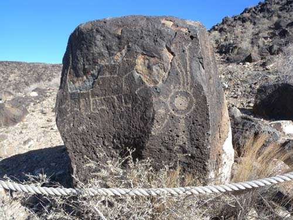  
'국립 암각화 유적지[Petroglyph National Monument]'의 암석과 암각화

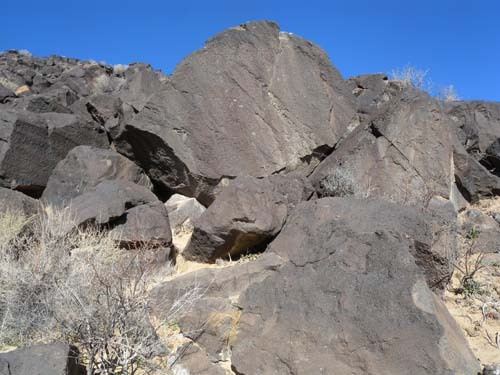  
'국립 암각화 유적지[Petroglyph National Monument]'의 바위산

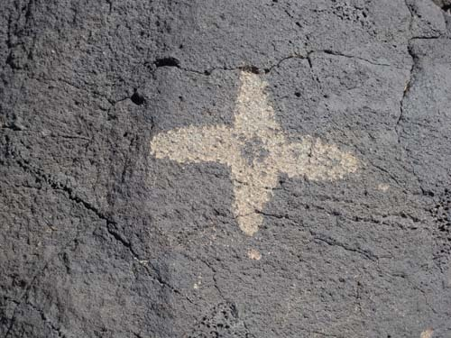  
'국립 암각화 유적지[Petroglyph National Monument]'의 십자가 그림.   
스페인 사람들이 온 이후에 그려진 것으로 보임.

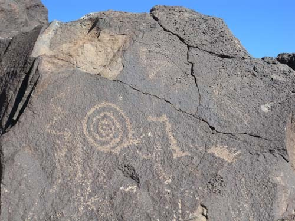  
'국립 암각화 유적지[Petroglyph National Monument]'의 동심원 그림

공유하기

게시글 관리

**백규서옥\_Blog ver.**

[저작자표시 비영리 변경금지
(새창열림)](https://creativecommons.org/licenses/by-nc-nd/4.0/deed.ko)