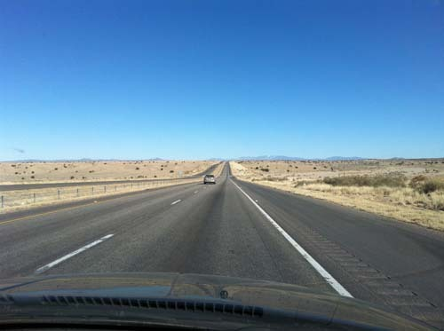  
앨버커키를 떠나 산타페로 가는 도중

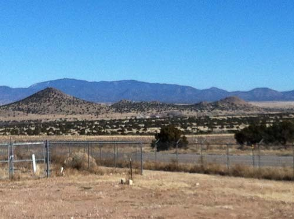  
산타페 입구 세리요스 힐스에서 만난 작은 오름들

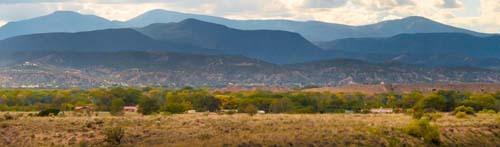  
세리요스 힐스에서 바라본 산타페 전경

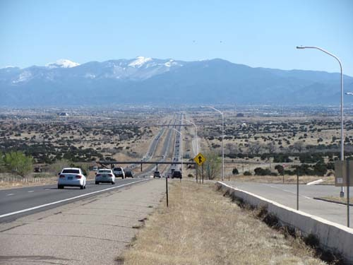  
세리요스 힐스를 지나 산타페로 들어가는 길

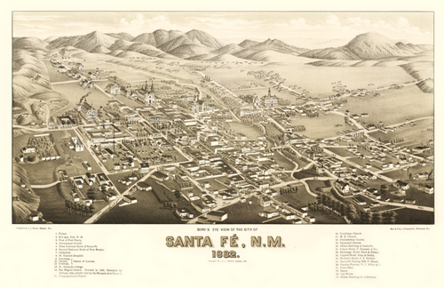  
1882년의 산타페 시가지 그림

환상과 낭만, 그리고 역사의 공간 산타페에 빠지다! [산타페-1]

큰 도시 앨버커키에서 산타페에 이르는 하이웨이 ‘I-25’ 역시 황량한 야산들을 끝없이 관통하는 길이었다. 뉴멕시코에 진입한 이래 키 작은 사막식물들과 작고 큰 화산 석들이 검게 그을린 채 다닥다닥 깔려 있는 야산들을 곧게 뚫고 나아가는 한 줄기 길이 대견하여 나 스스로 명명해본 것이 바로 ‘용감한 길’이었다. 그 길을 종횡무진 뚫고 돌아다니는 자그마한 자동차와 거기에 실린 내 실존적 자아가 사실은 ‘용감한 존재들’이었는데, 엉뚱하게도 나는 왜 그 길에만 자꾸 내 감정을 투사하려고 노력하는 것일까.

프로이트가 말한 일종의 '심리적 전이(psychological transference)' 현상으로 설명할 수 있는 사례일까. 미국에 온 이후 특히 ‘길’에 집착하는 나의 내면이 나 스스로도 흥미롭게 생각될 때가 많아졌다. 길은 예나 지금이나 그대로 있는 한갓된 공간일 뿐인데, 그 길이 마치 살아서 내 비위를 맞춰주기도 하고 심술을 부리기라도 하는 것처럼 생각되는 건 왜일까. 아마도 나의 내면에 일어나는 감정적 에너지를 쏟아 붓기에 가장 좋은 대상이나 공간이 바로 미국 남부 지역의 길들이었으리라.

산타페까지 60.3 마일의 그리 길지 않은 길이었으나, 기억하기 힘들 만큼 많은 푸에블로 인디언들의 집거지가 차창으로 스쳐 지나갔다.\* 지아 푸에블로(Zia Pueblo), 산타애나 푸에블로(Santa Ana Pueblo), 산 펠리페 푸에블로(San Felipe Pueblo), 산토 도밍고 푸에블로(Santo Domingo Pueblo) 등 푸에블로 인들은 거주하는 지역마다 구분되는 인종적 독자성을 지니고 있었다. 그래서 푸에블로 인들을 변별할 때는 거주 지역의 이름을 관치(冠置)하는 것이 통례인 듯 했다.

고개를 넘으니 멀리 산타페 산맥이 보이고, 그 앞쪽 넓은 분지에 한 손바닥으로 가릴 수 없을 만큼 넓게 퍼진 도회(都會)가 아름답게 형성되어 있었다. 잠시 언덕을 내려가자 길옆에 비지터 센터가 있고, 안으로 들어가니 젊은 여성 안내원이 호쾌한 웃음으로 맞아 주었다. 이곳이 바로 그 유명한 세리요스 힐스(Serrillos Hills)의 초입이자, 길 건너 산 속 ‘산토도밍고 푸에블로’의 인접지였다. 자료를 받은 다음 밖으로 나오니 앞 쪽에 제주도의 큰 오름을 연상케 하는 화산봉들이 여인네 젖가슴처럼 봉긋 솟아 있고, 산타페 진입을 위해 I-25에서 285로 갈아타는 턴파이크(Turnpike)가 우리의 선택을 기다리고 있었다.

산타페 카운티에 들어선 우리는 곧바로 산타페 시내 외곽의 신시가지를 거쳐 목표지점인 구시가지로 방향을 잡게 되었다. 거대한 가마솥의 한 가운데로 서서히 미끄러져 내려가듯 산타페 산맥 앞에 자리 잡은 산타페 시티는 거대한 분지로 이루어져 있었다. 비지터 센터에서 20분이나 달렸을까. 드디어 어도비 건물들 일색인, 조용하고 아름다운 산타페 알트 슈타트(Alt Stadt)의 ‘쌩얼’이 우리의 가슴에 살포시 안겨들었다.

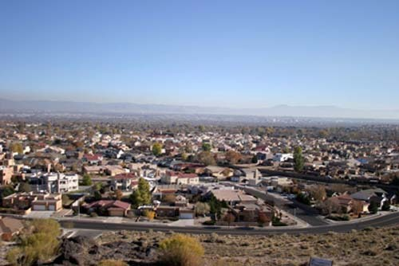  
넓게 퍼져 있는 산타페 신시가지의 주택들

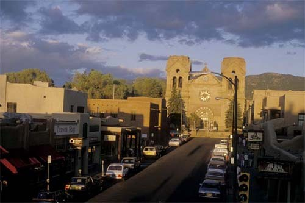  
산타페의 '프란시스코 대성당'과 구시가지 중심부

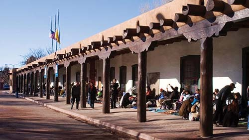  
주지사 궁(Palace of the Governors) 앞에서 좌판을 벌이고 있는 주민들과 물건을 사는 관광객들

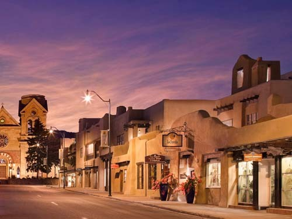  
산타페 구시가 중심부의 야경

\*\*\*

‘거룩한 믿음[Holy Faith]’을 뜻하는 스페인어 ‘Santa Fe’. 식민시대의 생생한 산물이 바로 이 도시다. 뉴멕시코 주도인 산타페는 주에서 네 번째로 큰 도시이자 산타페 카운티의 청사 소재지이며, 무엇보다 미국에서 가장 오래 된 캐피털 시티다. 2012년 기준으로 69,204명의 인구를 보유한 이곳은 카운티 전역을 포함하는 ‘표준 통계지역[Metropolitan Statistical Area]’의 으뜸 도시이기도 하다.

산타페의 완전한 명칭이 ‘La Villa Real de la Santa Fé de San Francisco de Asís’ 즉 ‘아씨시 프란시스코 성인의 로열 타운[The Royal Town of the Holy Faith of St. Francis of Assisi]’임을 알고 나서야 구시가의 높은 곳에 우뚝 서서 시가지를 굽어보고 있는 ‘아씨시의 성 프란체스코 바실리카 대성당[Cathedral Basilica of St. Francis of Assisi]’의 존재의미가 이해되었다. 대성당 뿐 아니라 시 청사 앞을 비롯한 시내의 곳곳에서 프란체스코 성인의 동상과 사진들을 보았는데, 그가 바로 산타페의 수호성인이었다. 그 점을 이해하고 나서야 왜 대성당이 내려다보이는 앞쪽에 중앙 광장과 주지사 집무실 및 공관을 포함한 공공기관들이 자리 잡고 있으며, 왜 그로부터 상가들과 각종 편의시설들이 방사상(放射狀)으로 펼쳐져 있는지를 깨닫게 되었다. 즉 '프란체스코 성인-대성당-아름다운 산타페'의 상관구조를 비로소 알게 되었던 것이다. 

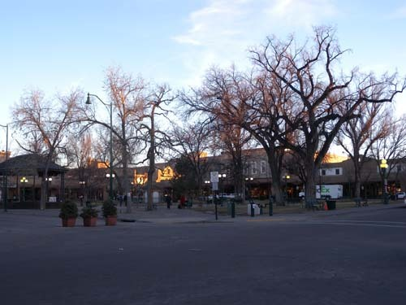  
산타페 광장의 모습

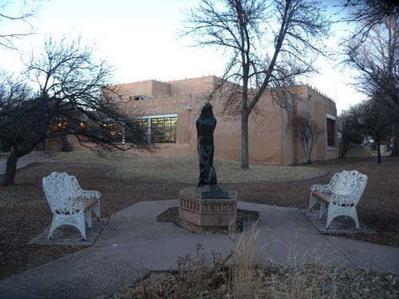  
산타페 시청 정원과 프란체스코 성인 동상

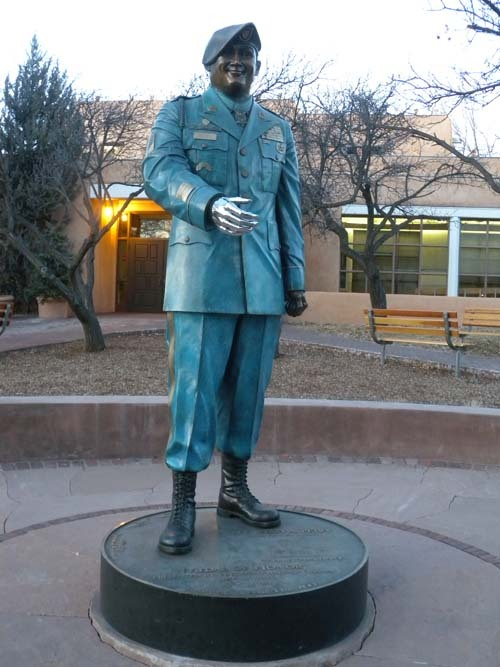  
"Hometown Hero" 2011. 7. 12. 오바마 대통령으로부터 훈장을 받은 레인저 상

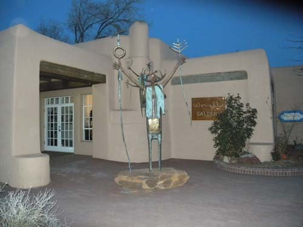  
산타페 시내에서 만난 멋진 화랑 입구

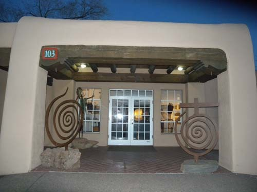  
또 다른 화랑 입구

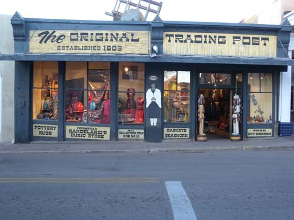  
길 건너편에서 발견한 인디언 기념품 가게

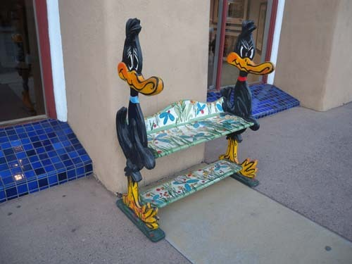  
길거리 상가에서 만난 독특한 디자인의 의자

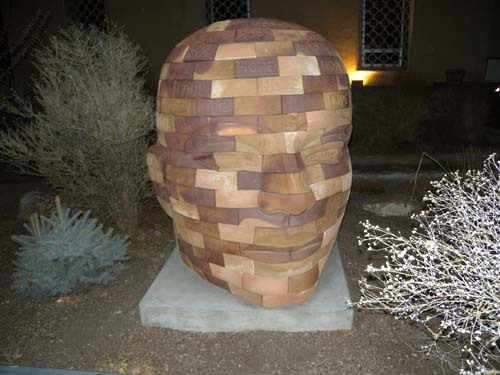  
길가 주택의 뜰에서 만난 인상적인 디자인의 두상

뉴멕시코 진입 후 며칠이 지나면서 고도(高度)의 변화에 무덤덤해지긴 했지만, 놀랍게도 뉴멕시코 주 전반의 평균 해발 고도는 1,000m에 가까웠고, 이 가운데 해발 2,134 m인 산타페는 미국에서 가장 높은 곳에 위치한 주도였다. 가끔씩 귀가 멍멍해지는 느낌을 받은 것도 특히 고도에 민감한 내 신체 구조로 보아 당연한 일이었다. 산타페의 면적은 96.9㎢인데, 그 가운데 96.7㎢가 땅이고 나머지 0.2㎢는 저수지나 강, 호수 등 물로 이루어져 있었다. ‘추운 겨울, 따뜻한 여름’이 이곳 날씨의 공식이라서인지 햇볕이 내리쪼임에도 구 시가지를 돌아보는 동안 우리는 달달 떨어야 했다. 한겨울인 12월의 평균온도 –0.9℃, 한여름인 7월의 평균온도는 21.2℃이며, 11월부터 이듬해 4월까지 6~8개월 동안 눈이 내린다고 하며, 6월~8월까지는 심한 비가 내린다고 한다.

1848년 멕시코와 미국이 전쟁을 끝내고 체결한 ‘과달루페 이달고 조약(Tratado de Guadalupe Hidalgo/Treaty of Guadalupe Hidalgo)’은 뉴멕시코의 역사적•정치적 향배를 결정한 분수령이었다. 멕시코에서 독립한 텍사스 공화국이 미국에 합병된 이듬해인 1846년에 일어난 것이 멕시코-미국의 전쟁이다. 전쟁에서 패한 멕시코의 평화협정 요청에 미국이 서명한 조약이 바로 ‘과달루페 이달고 조약’인데, 이 조약으로 멕시코는 현재 텍사스 주, 콜로라도 주, 애리조나 주, 뉴멕시코 주, 와이오밍 주의 일부, 캘리포니아 주, 네바다 주, 유타 주 등을 미국에 넘겨야 했다.

그 때 미국 땅으로 바뀐 뉴멕시코 땅을 밟으면서 나는 미국과 판이한 멕시코의 향기, 멕시코를 지배한 스페인의 향기가 섞인 묘한 분위기를 느끼게 되었다. 무엇보다 미국 남부에서 흔히 볼 수 있는 침례교 위주의 개신교 교회들 대신 웅장한 규모의 가톨릭 성당이 구시가의 중심부를 차지하고 있는 모습은 대부분 유럽의 도시들에서 쉽게 볼 수 있는 풍경이었다. 또한 푸에블로 인디언들의 전통음식이라는 것도 대부분 멕시코 음식 그 자체이거나 멕시코 풍미를 벗어나지 못한 것들이 대부분이었다. 옛날 인디언들의 식습관이라야 자연 재료의 상태에서 그리 멀지 않았던 것들일 것이니, 유럽풍, 멕시코 풍을 만나면서 그 정체성을 맥없이 포기할 수밖에 없었으리라. 이 지역의 어딜 가도 인디언 음식이라고 내오는 것들이 대부분 멕시코 음식 일색인 것도 바로 그 때문이었다.

\*뉴멕시코의 푸에블로 족들을 제시하면 다음과 같다. 애코머(Acoma Pueblo), 코치티(Cochiti Pueblo), 이즐레타(Isleta Pueblo), 히메즈(Jemez Pueblo), 케와(Kewa Pueblo)[산토 도밍고(Santo Domingo Pueblo)의 이전 이름], 라구나(Laguna Pueblo), 남베(Nambe Pueblo), 오케 오윙에(Ohkay Owingeh Pueblo), 피쿠리우스(Picuris Pueblo), 퍼와이키(Pojoaque Pueblo), 샌디아(Sandia Pueblo), 산 펠리페(San Felipe Pueblo), 산 일데폰소(San Ildefonso Pueblo), 산타애나(Santa Ana Pueblo), 산타 클라라(Santa Clara Pueblo), 타오(Taos Pueblo), 터수키(Tesuque Pueblo Santa Fe), 지아(Zia Pueblo), 주니(Zuni Pueblo) 등 20 개에 가깝다.

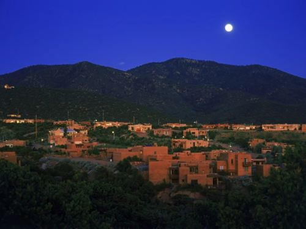  
산타페 시가지의 야경

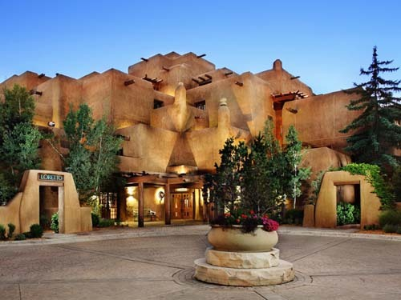  
호텔 로레토(Loretto)의 환상적인 모습

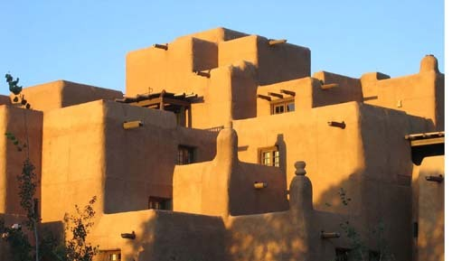  
호텔 라폰다(La Fonda) 외관의 전통미

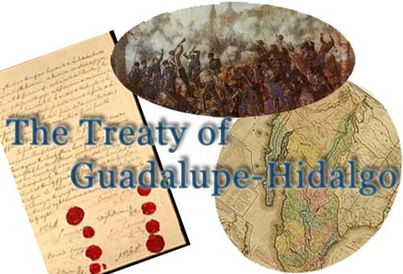  
미국-멕시코 간의 전쟁, '과달루페 이달고 조약' 협정문,   
그로 인해 변한 양국의 국경 등을 보여주는 자료들

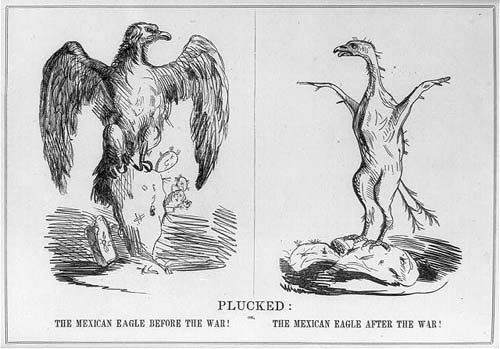  
미국-멕시코 전쟁에서 멕시코의 패배를 풍자한 그림[털 뽑힌 독수리]

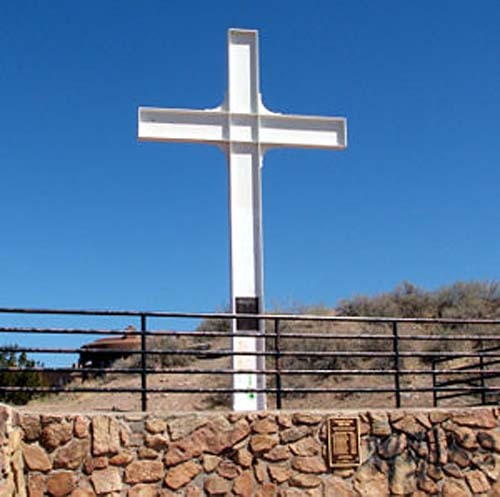  
산타페 '순교자들의 십자가'

공유하기

게시글 관리

**백규서옥\_Blog ver.**

[저작자표시 비영리 변경금지
(새창열림)](https://creativecommons.org/licenses/by-nc-nd/4.0/deed.ko)