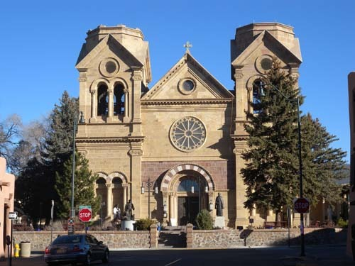  
'아씨시의 성 프란체스코 바실리카 대성당[Cathedral Basilica of St. Francis of Assisi]

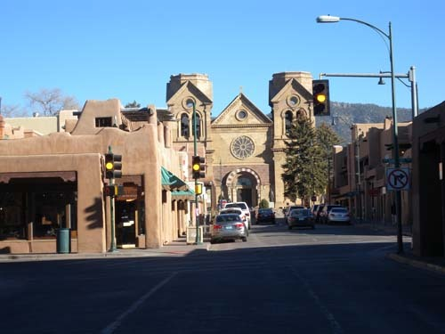  
산타페 광장에서 대성당으로 들어가는 길

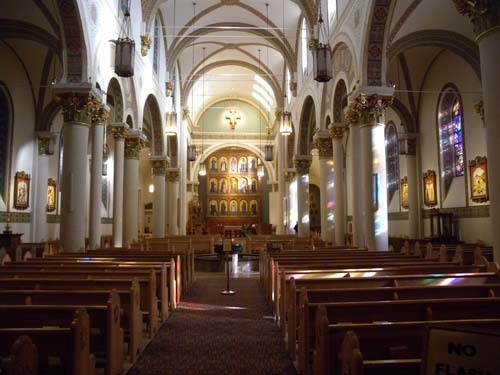  
대성당 내부

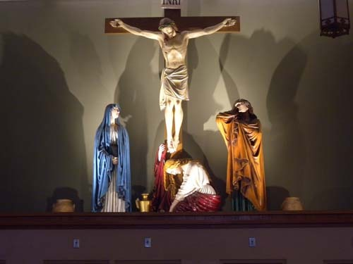  
대성당 안에서 만난 예수 수난상

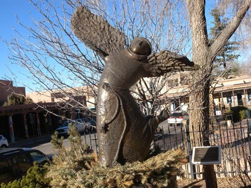  
대성당 앞뜰에서 만난 '물 위에서 춤 추는 프란체스코 성인'[Monika B. Kaden의 작품]

  
대성당 앞뜰에 서 있는 '가데리 데각위타[Kateri Tekakwitha, 1656-1680] 상'   
미국 최초의 인디언 여성 성인으로 추존되었음.

산타페의 가톨리시즘은 세속화된 미국을 정화시키는가? [산타페-2]

산타페의 구시가지에서 가장 중요한 포인트는 ‘아씨시의 성 프란체스코 바실리카 대성당[Cathedral Basilica of St. Francis of Assisi]’이었다. 사실 뉴멕시코의 어느 도시에서도 프란체스코 성인을 모신 성당들은 어렵지 않게 만날 수 있었다. 그리고 이 성당을 중심으로 시가지가 형성된 도시들도 적지 않았다. ‘산타페 로만 가톨릭 대 주교구[The Roman Catholic Archdiocese of Santa Fe]’의 모태 교회가 바로 이 성당인데, 이 성당의 뜰엔 눈길을 끄는 또 한 사람이 서 있었다. 여성 성인으로 추존된 인디언 출신의 가데리 데각위타(Kateri Tekakwitha, 1656~1680). 순결의 덕목과 육신의 고행을 실천함으로써 짧은 생애에 많은 기적을 이룬 그녀였다. 결국 1980년 요한 바오로 2세에 의해 시복(諡福)되고, 2012년에는 교황 베네딕트 16세에 의해 시성(諡聖)된 스물넷의 아름다운 그녀가 성스러운 미소를 머금은 채 그곳에 서 있었다.

프란체스코 대성당을 나온 후 지금은 홈리스들에 의해 점령된 산타페 광장으로부터 대성당 앞을 지나 잠시 걷자 스프링 모양의 계단으로 유명한 로레토 채플(Loretto Chapel)이 나왔다. 채플 입구에서 안내를 하던 린즐리(Richard M. Lindsley)씨는 우리가 한국에서 왔다고 하자 한국어 안내문 한 장을 꺼내 주면서 ‘북한의 참상’에 대해서 진심으로 많은 걱정을 해주었다. 그 날짜 신문에 보도된 북한의 실상에 관해 궁금한 게 많았던지 이것저것 질문을 하며 그들을 위해 기도하겠노라고 약속도 했다. 고마운 사람이었다.

1852년 가을 로레토 수녀회가 수많은 고난을 겪으며 켄터키로부터 산타페에 도착하여 이 성당의 전신인 로레토 학원을 건립한 역사가 한글판 소개문에는 실려 있었다. 특히 강조된 내용은 원형계단의 건축학적 특징이었다. 수녀들이 도착한 몇 년 뒤 로레토 학원이 완성되었고, 그 후 몇 년 뒤에 고딕 양식의 예배당이 완성되었다. 그러나 예배당 안의 마루와 성가대석을 연결하는 통로를 낼 수가 없는 것이 문제였다.

그 일이 성사되기를 염원하며 수녀들은 9일간의 기도를 드렸는데, 기도의 마지막 날 한 백발노인이 당나귀에 연장을 싣고 도착했다. 수녀원장을 만나 그 일을 해결해주겠노라고 말한 그는 톱 하나와 T자, 망치하나만을 갖고 즉시 작업에 착수하여 단시일에 이 원형 계단을 완성했다. 중심 지주도 없이 33개의 디딤판만으로 360도 원형의 계단을 완성하는 기적을 만들어낸 것이다. 당시 성 요셉에게 기도를 드린 수녀들은 이 불가사의한 일이 그 기도의 응답임을 믿었으며, 상당수는 그 늙은 목수를 성 요셉으로 믿기도 했다고 한다. 물론 그것은 수녀들이 보여준 지극한 신앙의 증거물이었다. 내 느낌에 바티칸 베드로 대성당의 발타키노와 같은 컨셉으로 보이는 이 원형계단의 의미를 어떻게 해석해야 하는가는 쉬운 문제가 아니었다.

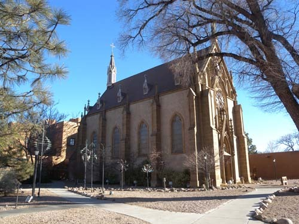  
로레토 성당[Loretto Chapel, Built in 1873]

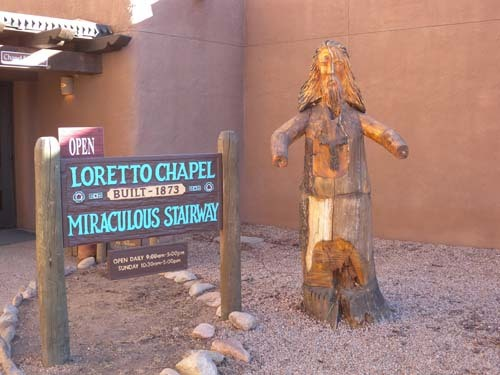  
로레토 성당 입구의 안내 표지와 전설에 등장하는 늙은 목수

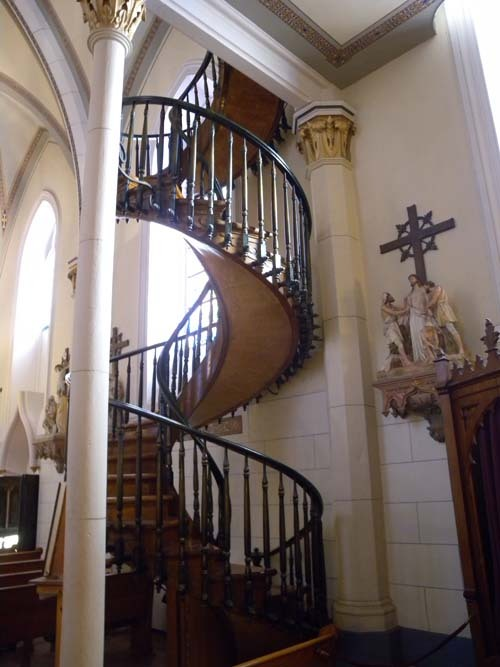  
채플 안에 있는 '기적의 계단'

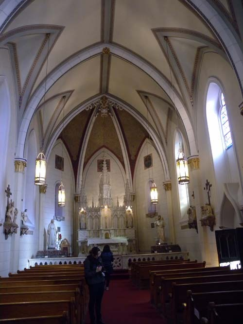  
로레타 채플 내부

그 다음으로 간 곳이 바로 최초의 어도비 건축 양식의 성당인 ‘산 미구엘 미션[San Miguel Mission]’이었다. 스페인 식민시대 멕시코의 성당이었던 ‘산 미구엘 미션’은 1610~1620년 사이에 지어진 것으로 추정되며, 현재 미국에서 가장 오래 된 교회로 꼽힌다고 한다. 이 성당은 1680년의 ‘푸에블로 반란’ 때 손상을 입었으나, 스페인 사람들이 이 지역을 재점령한 1710년에 재건축되어 스페인 병사들을 위한 예배당으로 사용된 곳이다. 그 후 수없이 보수가 이루어지고 재건축이 반복되면서 많이 가려지긴 했겠으나, 원래의 어도비 양식은 크게 손상되지 않은 채 노출되어 있었다. 내부 또한 아름다웠는데, 특히 제단 뒤쪽 나무로 만들어진 장식 벽[reredos]의 아름다움은 탁월했다. 더구나 그 장식들 속에 자리 한 미카엘 성인 상의 제작연대는 적어도 1709년까지 올라가는 것으로 알려져 있다. 미합중국의 국가 역사 유적으로 지정된 이 성당은 산타페를 영적으로 충만한 도시가 될 수 있도록 하는데 결정적인 역할을 하는 것 같았다.

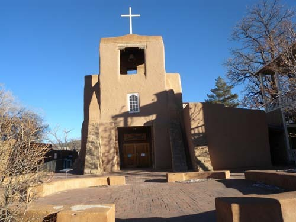  
산 미구엘 성당[San Miguel Mission]

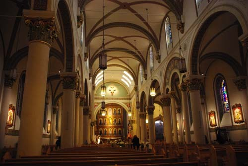  
미구엘 성당 내부

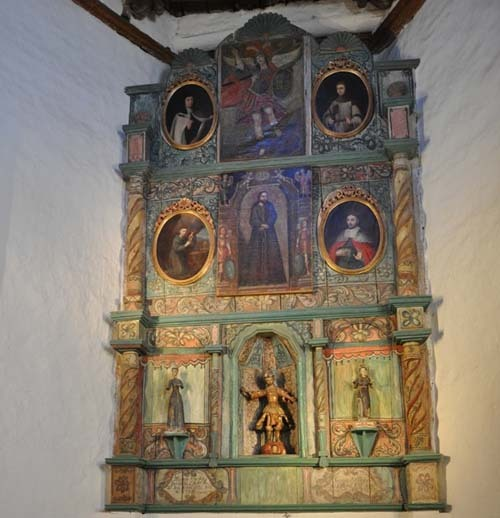  
미구엘 성당 제대 뒤의 장식벽[Reredos]. 아래쪽 중앙이 미카엘 성인 상

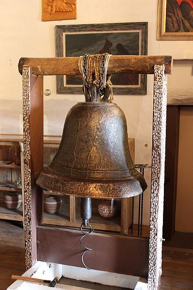  
산 미구엘 성당의 종

그 다음에 방문한 곳이 바로 이 지역 종교적 성향의 핵심인 ‘과달루페 성소[Santuario Guadalupe]’로서, 산타페 다운타운에서 가장 아름다운 교회로 꼽히는 곳이었다. 주 제단 뒤쪽의 벽장식은 모두 멕시코시티에서 가져온 것들이며, 내부 장식 모두는 멕시코 바로크 풍의 소박한 모습을 하고 있었다. 1531년 멕시코 아즈텍 종족 출신의 후안 데 디에고(Juan de Diego)에게 현신하여 성당을 지을 것을 명령한, 갈색 피부를 가진 원주민 형상의 성모가 바로 ‘과달루페 성모’다.

이 사건을 계기로 테페야크 언덕을 비롯한 각지에 성당들이 건립되면서 멕시코는 급격히 가톨릭 국가로 변모했다. 성모 현신의 이야기는 토착신앙에 물들어 가톨릭의 전파가 어렵던 당시 가톨릭 교단의 노력을 보여주는 일종의 ‘종교 설화’로 보이는데, 그 덕에 지금은 미국의 땅이 된 산타페에서 그 성모와 성당을 만날 수 있게 된 것이었다. 1775~1795년 프란체스코 선교사들에 의해 건립된 ‘과달루페 성소’는 3피트 정도의 두꺼운 벽을 가진 어도비 건축물이었고, 그 중심에 1783년 멕시코 거장 호세 데 알지바[Jose de Alzibar]의 과달루페 성모상이 있었다. 멕시코 전통 양식으로 조각•채색된 예술품의 정수로서 ‘리어다스(reredos)’라 불리는 제단 뒤쪽의 장식 벽, 19세기 진품 성구(聖具) 보관소, 각종 미술사적 자료들, 대주교 쟝 뱁티스트 레이미(Jean Baptiste Lamy)에게 봉헌된 도서 및 자료관, 성지에서 가지고 온 식물들을 심어놓은 정원 등, 이 성당을 이루는 핵심 부분들은 여전히 화려하면서도 경건함을 잃지 않고 있었다.

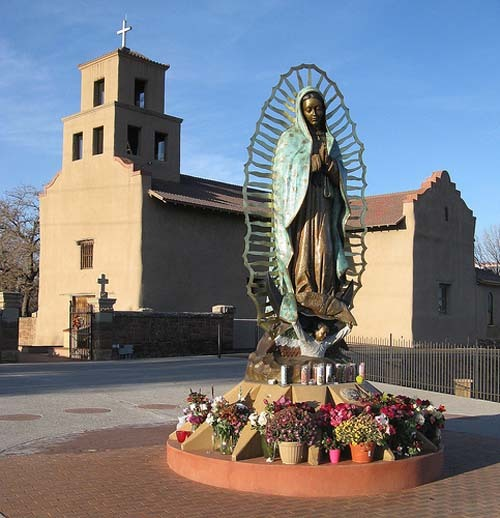  
과달루페 성소[Santuario Guadalupe] 성모 상

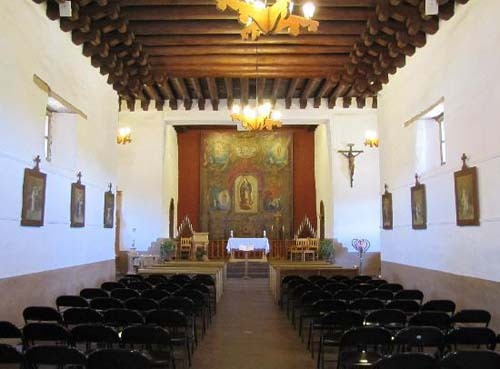

과달루페 성소의 내부

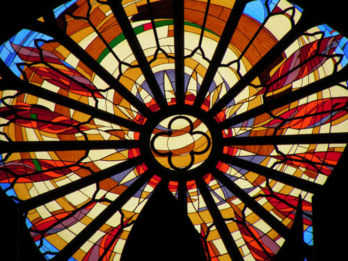  
과달루페 성소의 스테인드 글라스

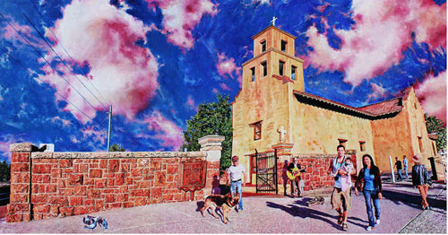

과달루페 성소 그림[Tom Mallon 작, Oil on Canvas 42"×22"]

산타페의 정신적 바탕은 이 도시의 수호성인 프란체스코의 행적을 중심으로 하는 가톨릭이지만, ‘이곳의 문화와 전통에 융합된’ 모습을 보여주고 있다는 점에서 유럽의 그것과 구별되는 느낌을 받았다. 특히 원주민 출신의 성인 가데리 데각위타나 과달루페 성모를 만난 후안 데 디에고 등 이 지역에 가톨릭을 정착시킨 결정적 존재들이 있었고, 로레토 성당•산 미구엘 성당•과달루페 성당 등 핵심적 성소들이 어도비 건축양식을 채용함으로써 지역 전통 친화적인 면모를 보여 주고자 한 점은 무엇보다 산타페만의 독보적인 모습이었다. 요소요소에 숨어서 빛을 발하는 가톨릭 교회들의 존재는 미국의 강한 세속성을 정화시켜 주고 있다는 점에서 산타페만의 매력일 수 있었다.

공유하기

게시글 관리

**백규서옥\_Blog ver.**

[저작자표시 비영리 변경금지
(새창열림)](https://creativecommons.org/licenses/by-nc-nd/4.0/deed.ko)