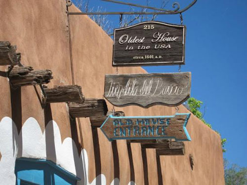  
올디스트 하우스(Oldest House)

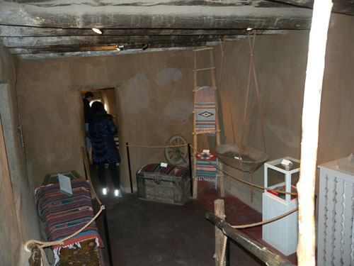  
올디스트 하우스의 내부

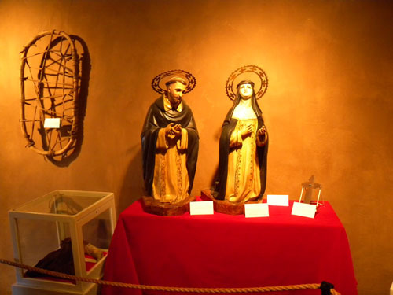  
올디스트 하우스 내부의 예배실

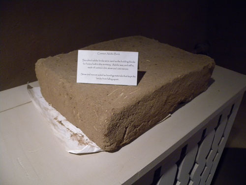  
올디스트 하우스의 건축에 쓰인 어도비 벽돌

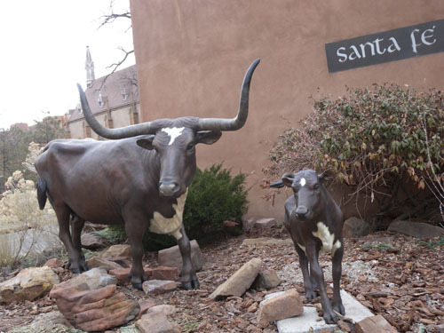  
시가지의 앤틱 가게 앞에 세워진 롱혼 캐틀(long horn cattle) 부자 상

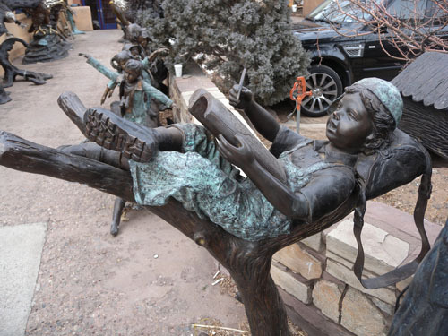  
시가지의 한 예술품 가게 앞에 놓인 '공부하는 아이' 상

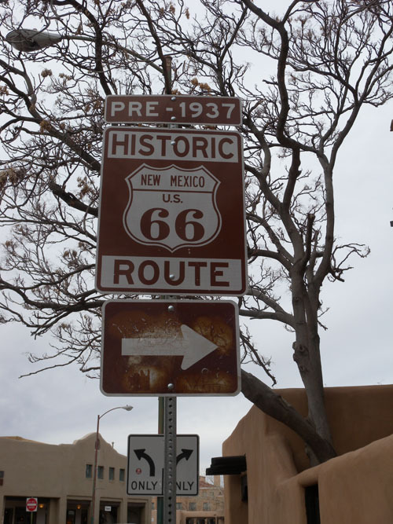  
옛 66번 도로에 대한 방향 표지판

예술과 역사의 도시 산타페와 박물관들[산타페-완]

우리는 산타페의 구 시가지로 들어왔고, 한동안 구 시가지를 뱅뱅 돌았으며, 구 시가지의 한켠에서 숙박도 했다. 구 시가지는 산타페 광장을 중심으로 방사상의 구조로 이루어져 있었다. 관광 비수기라서인지 광장은 홈리스들의 차지였고, 멀쩡하게 생긴 성인 남자들도 당당하게 한 푼을 구걸하면서 지나쳤다. 그러나 앞서 말한 상당수의 성당이나 교회들은 물론 박물관들도, 시 청사도, 숙박업소도, 선물가게도, 화랑도, 레스토랑도 대부분 어도비 양식의 대단한 보물급들이었다. 볼그레하고 따스한 어도비 건축물들이 우리의 마음까지 따스하게 만드는 곳이 산타페임을 걷는 동안 우리는 느껴 알 수 있었다.

앞의 글에서 빠뜨리긴 했지만, 올디스트 하우스(Oldest House)도 그냥 지나칠 수 없는 명소였고, 아침에 찾아간 앤틱 선물가게 또한 안팎이 예술로 뒤덮인 아름다움의 덩어리였다. 올디스트 하우스는 말 그대로 이 지역 뿐 아니라 미국에서 가장 오래 된 집으로 추정되는 건물이었다. 1598년 후안 데 오네이트(Juan de Onate)의 인도 아래 첫 스페인 정착자들과 함께 멕시코로부터 틀락스깔란(Tlaxcalans) 인디언들이 도착하여 산타페 강 위쪽의 고원에 정착했다. 그들의 집 가운데 하나로 보이는 것이 바로 이 건물이다. 건물 속에 박힌 나무들의 나이테로 미루어 이 집은 약 1650년대에 지어진 것으로 보이는데, 집의 구조로 보아서는 훨씬 더 오래 전인 1200년대로 거슬러 올라간다고 추정하는 사람도 있다고 한다.

어쨌든 이 집은 버려진 고대 푸에블로인들의 정착지 폐허 위에 지어진 것이 분명한 것 같았다. 비좁고 불편해 보이긴 했으나 당시의 방식대로 조촐하게 살림을 꾸리며 행복을 일궈나간 가족들의 모습을 상상할 수 있었다. 머리를 숙이고 다녀야 할 만큼 낮았으나, 작은 거실과 예배실, 식당, 창고, 농기구, 그리고 밝은 빛을 들이기 위한 창 등 기본적인 삶을 영위할 수 있도록 갖출 건 다 갖추고 있었다. 올디스트 하우스는 말하자면 생생하게 살아 있는 ‘새로운 개념의 박물관’인 셈이었다.

올디스트 하우스를 나와 ‘뉴멕시코 미술박물관[New Mexico Museum of Art]’ 가는 길엔 골동품이나 장식품들을 파는 가게들이 더러 있어 눈으로나마 산타페 시민들의 잔잔한 생활미학을 느껴볼 수 있었다. 산타페가 뉴멕시코에서 66번 도로의 핵심적 경유지임과 이곳이 미국 교통의 요지였다는 사실을 알려주는 표지도 만나는 등 길에 설치된 대부분의 표지들이 예술작품이었고, 역사의 알림판이기도 했다.

그렇게 느릿느릿 걸어 ‘뉴멕시코 미술박물관’에는 개관 시간인 10시에 도착할 수 있었다. 어도비 양식으로 지어진 박물관은 외관처럼 내부 또한 아름다웠다. 원래 ‘창작미술 박물관’으로 불리던 뉴멕시코 미술박물관은 이 지역에서 가장 오래된 박물관으로서, 산타페에 있는 네 개의 ‘국영 박물관들’ 가운데 하나이자 뉴멕시코 주 문화부에 의해 관리되는 여덟 개의 박물관들 가운데 하나이기도 했다. 아이삭 랩(Issac Rap)이 설계하여 1917년 건립된, 어도비 양식의 이 박물관은 원주민과 스페인의 설계양식이 종합된 가장 유명한 건축물들 가운데 하나로 인정되고 있었다. 이 박물관은 다량의 미술품들을 영구 소장하고 있을 뿐 아니라 전통미술과 현대미술작품들, 지역 예술품과 전국 혹은 세계 여러 나라의 미술작품들을 교체 전시하고 있기도 했다.

마침 르네상스부터 고야(Goya)에 이르는 시기의 스페인 미술품들이 특별 전시되고 있었다[Renaissance to Goya: prints and drawings from Spain]. 대부분 소품들이었지만, 2013년 12월 14일부터 2014년 3월 9일까지 3개월 간 열리는 이 특별전이야말로 산타페의 예술적 향취를 더해주는 특별 이벤트였다. 아직도 스페인 문화나 멕시코 문화의 잔영이 지역 곳곳에 산재되어 있는 이 도시에 들렀다가 우연히 고야 같은 대가의 미술품들을 무더기로 친견하게 된 것이 우리에게는 사실 분에 넘치는 호사였다. 직접 스페인에 가지 않고서야 그토록 많은 고야의 작품들을 어디에서 볼 수 있겠는가.

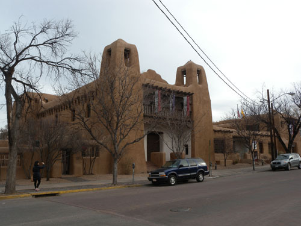  
뉴멕시코 미술 박물관 전경

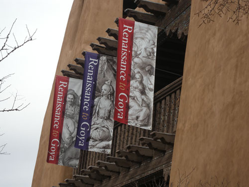  
뉴멕시코 미술박물관의 '르네상스에서 고야까지' 특별전 현수막

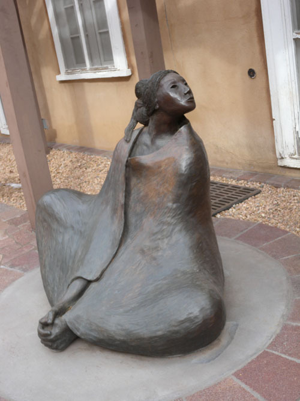  
뉴멕시코 미술박물관 소장, R.C.Gorman 작 'Seated Navajo Woman', 1978[Cast bronze]

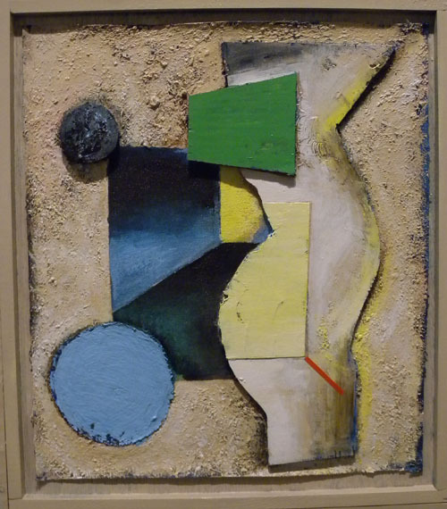  
뉴멕시코 미술박물관 소장, Don Robert Hazlitt 작 'Mom at Dawn', 1988  
[Mixed media on Canvas on board]

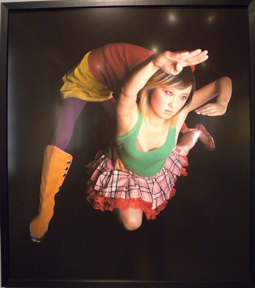  
뉴멕시코 미술박물관 소장, Min Kim Park 작 'Lynn 2009-From the Series Zummarella'  
[Pigment print]

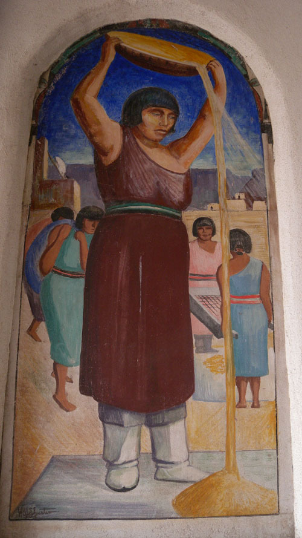  
뉴멕시코 미술박물관 소장, Will Shuster(1893-1969) 작 'Winnowing Wheat', 1934[Fresco]

이 박물관은 엄청난 컬렉션들을 갖고 있었다. 지난 100년 동안 활동해온 타오(Taos) 및 산타페 지역 미술 창작 집단의 작품으로부터 이 지역 혹은 세계 최첨단의 현대예술 작품들까지 두루 소장하고 있었다. 박물관에 갖추어진 2만여 점의 작품들 가운데 가장 두드러진 것들은 ‘싱코 삔또레스(Los Cinco Pintores)’ 즉 다섯 명의 화가들[The Five Painters]이 남긴 작품들, 타오 미술창작 집단[The Taos Society of Artists]의 작품들, 구스타브 바우만(Gustave Baumann)의 콜렉션, 루시 리파드(Lucy Lippard)의 컬렉션, 오키프(Georgia O’Keeffe)의 미술품 콜렉션 등을 포함한 창작 미술품들과, 여성 사진작가들의 작품을 모은 제인 리스 바우만(Jane Reese Baumann)의 콜렉션을 포함한 주요 미국인 작가들의 사진작품, 비디오 장치를 포함한 뉴미디어 등을 꼽을 수 있었다.

이 가운데 가장 두드러진 것이 1921년에 결성된 ‘로스 싱코 삔또레스(Los Cinco Pintores)’. 윌 슈스터(Will Shuster), 프레몬트 엘리스(Fremont Ellis), 월터 므룩(Walter Mruk), 죠지프 바코스(Jozef Bakos), 윌라드 내쉬(Willard Nash) 등 다섯 명의 화가가 그 멤버들인데, 그 해 12월 뉴멕시코 미술박물관은 그들의 작품을 함께 묶어 첫 전시회를 열었다. 다섯 사람은 모두 30세 이하의 젊은 예술가들로서 산타페의 신예들이었다. 이들은 그로부터 ‘싱코 삔또레스’로 불리면서 이 지역의 창작미술을 대표해왔고, 그 산파역을 한 것이 바로 이 박물관이었다. 산타페 시내를 배회하다 보면 멋지게 꾸민 화랑들을 심심치 않게 만나게 되는데, 이 박물관과 함께 이 지역 창작미술 활성화의 주역들이었다. 산타페가 예술품 거래의 양으로 미국 전역에서 3위 안에 드는 도시임을 감안하면, 그런 배경은 충분히 이해할만 했다.

뉴멕시코 미술 박물관을 나온 우리는 건너편에 있는 ‘뉴멕시코 역사박물관[New Mexico History Museum]’을 찾았다. 우리가 ‘뉴멕시코 미술 박물관’을 거쳐 왔다고 하자, 입구의 직원은 입장료를 할인해주며 ‘하나의 입장권으로 이 박물관과 주지사궁[Palace of the Governors]을 모두 볼 수 있다’고 말했다. 주지사 궁은 산타페 광장의 팰리스 애비뉴에 위치하고 있었다. ’산타페 역사구[Santa Fe Historic District]’안에 있는 주지사 궁은 수 세기 동안 뉴멕시코 주 정부의 중심 건물로서 미국의 가장 오래 된 공공건물이었다.

‘페드로 데 페랄타(Pedro de Pralta)’는 미국 남서부의 대부분을 지배하던 스페인 영토에 새로 임명된 주지사인데, 그가 바로 1610년에 이 건물의 건축을 시작한 것이다. 그 뒤 뉴멕시코의 지배자가 여러 번 바뀌는 과정에서 이 궁의 소유권도 함께 넘어갔다. 1680년 푸에블로 반란 이후, 또한 1693년에서 1694년까지 스페인이 이곳을 재정복함으로써 내내 스페인 소유로 있었고, 1821년 멕시코가 독립함으로써 멕시코 소유가 되었다가, 마지막으로 1848년 미국의 소유로 넘어간 것이다. 처음에 이 궁은 한 때 오늘날의 텍사스, 애리조나, 유타, 콜로라도, 네바다, 캘리포니아, 뉴멕시코를 포함한 스페인의 ‘뉴멕시코[Nuevo Mexico] 식민지’ 정부가 들어 있던 건물이다. 멕시코 독립전쟁 이후 뉴멕시코의 산타페 지역은 주지사 궁에서 관리되었으며, 이 궁은 뉴멕시코가 미국 땅으로 합병되면서 뉴멕시코의 첫 지역 의회 의사당으로 바뀌었다.

뉴멕시코 주 의회가 뉴멕시코 박물관을 세운 1909년에서 2009년까지 주지사 궁은 주 역사 박물관 역할을 하게 되었다. 2009년 주지사 궁 옆에 문을 연 뉴멕시코 역사박물관은 뉴멕시코 주 문화부가 관리하는 아홉 개의 뮤지엄들 가운데 하나다. 우리가 역사박물관을 보고 자연스럽게 주지사 궁으로 이동하게 된 것도 바로 그 때문이었다.

역사박물관에는 뉴멕시코 중심의 생활사 및 자연사 자료들이, 주지사 궁에는 역대 주지사들과 관련한 지배 주체의 변천 자료 등 정치사 관련 유물들과 각종 성화 및 성구 등 가톨릭 관련 유물들이 풍부하게 전시되어 있었다. 다만 아직 충분한 콜렉션들을 확보하지 못했다는 느낌을 받은 전자와 달리 후자에는 양적으로 충분하고 질적으로도 뛰어난 자료들이 많이 전시되어 있어 미국의 다른 지역에서 만날 수 없는 이 지역만의 특성을 분명히 인지할 수 있었다.

산타페에는 이 두 박물관 외에도 ‘죠지아 오키프 박물관[The Georgia O’Keeffe Museum], 아메리카 인디언 박물관 연구소[The Institute of American Indian Museum], 인디언 예술 문화 박물관[The Museum of Indian Arts and Cultures], 국제 민속 예술 박물관[The Museum of International Folk Arts]’ 등 뛰어난 박물관들이 있었다. 물론 컨셉이나 소장품들의 성격상 겹치는 것들도 적지 않겠지만, 사실은 다 보는 것이 바람직한 일이었다. 그러나 갈 길이 바쁜 나그네에게 이들 모두를 둘러보는 것은 벅찬 일이었다. 어디 ‘국 맛을 알기 위해 한 솥의 국을 모두 마셔야 하는가?’ 우리는 미련을 떨쳐 버리기 위해 점심을 먹는 둥 마는 둥 하고 산타페로부터 벗어나는 길을 재촉할 수밖에 없었다.

여러 번 주인이 바뀐, 무상한 역사의 도시이자 치밀한 계획도시이며 아름다운 어도비 건축물의 도시 산타페는 간단치 않은 역사와 두꺼운 예술의 적층(積層)을 토대로 한 현대판 이상향이었다. 어느 언론매체의 조사 결과처럼, 가장 인기 있는 예술의 도시이자 은퇴 후에 숨어 살기 좋은 전원도시가 바로 이곳이라고 하지 않는가.

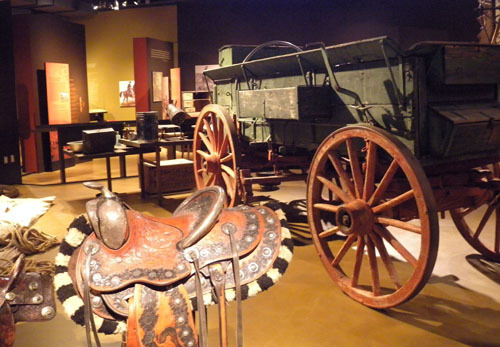  
뉴멕시코 역사박물관 소장품

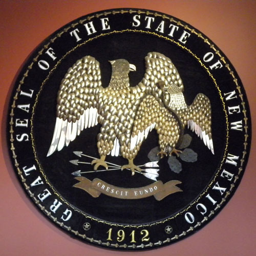  
뉴멕시코 역사박물관 소장품[뉴멕시코주 문장]

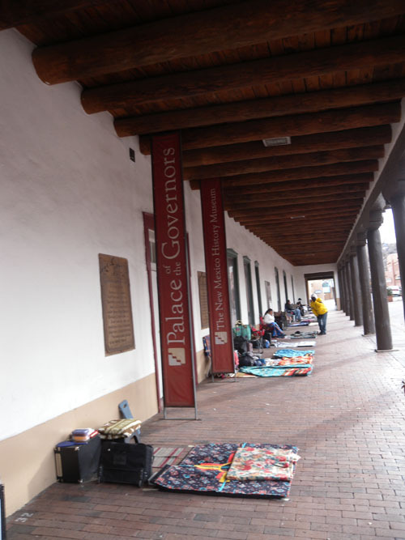  
주 지사 궁[the Palace of the Governors] 앞에서 좌판을 벌인 주민들

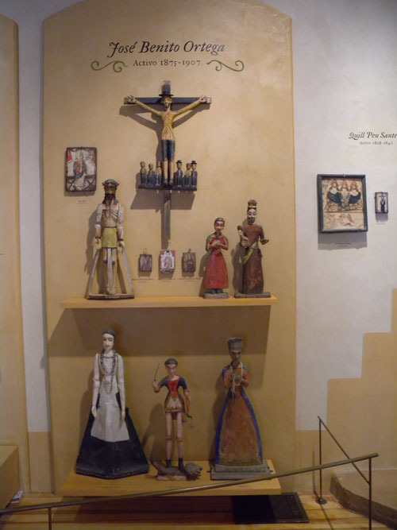  
주지사 궁 소장품들

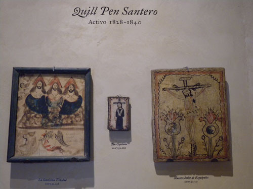  
주지사 궁 소장품들

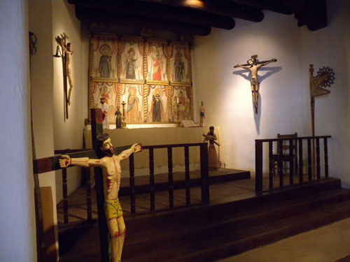  
주지사 궁 소장품들

공유하기

게시글 관리

**백규서옥\_Blog ver.**

[저작자표시 비영리 변경금지
(새창열림)](https://creativecommons.org/licenses/by-nc-nd/4.0/deed.ko)