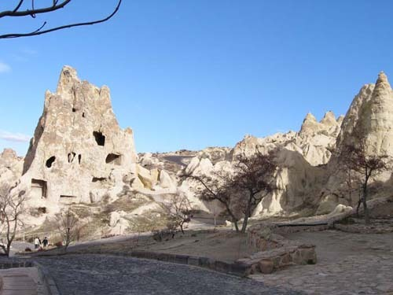  
터키 괴레메 지역의 오픈 에어 뮤지엄(Open Air Museum)

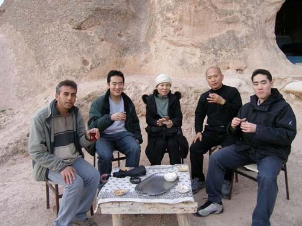  
터키 괴레메 로즈밸리(Rose Valley)의 한 암벽 동굴집을 찾아   
현장에서 만난 베컴, 허이준, 허이훈 형제 등과 차를 마시며[2005년 12월]

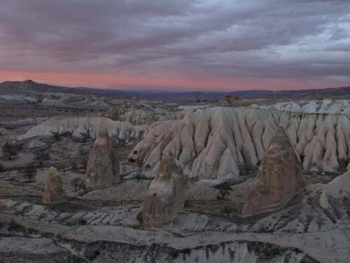  
터키 괴레메의 로즈밸리 지역

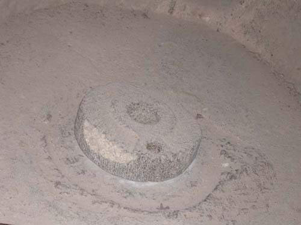  
터키 괴레메 인근 언더그라운드 시티(Underground City)의 거실에서 만난 맷돌 아래 짝

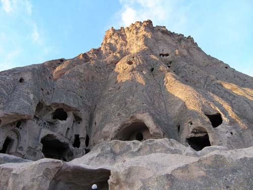  
터키의 셀르메 지역에서 만난 암벽 동굴들

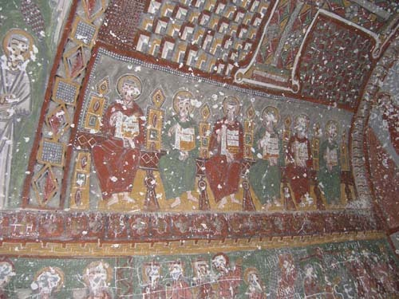  
터키 우흘라라 계곡의 암벽동굴 집에서 만난 프레스코화

암굴 속에 서린 생존 의지, ‘반델리어 국립 유적지[Bandelier National Monument]’의 말 없는 외침

9년 전 유럽 여행 중 터키 카파도키아의 괴레메 지역에서 만난 암굴 주거지는 지금까지도 큰 충격으로 남아 있다. 화산활동으로 생긴 다양한 모양의 암석과 암봉들에 침식작용으로 구멍이 뚫려 있었고, 많은 사람들이 오랫동안 그 안에 거주한 흔적들이 그 때까지도 생생하게 남아 있었다. 특히 카이마클르의 지하도시와 으흘라라 계곡, 셀르메 계곡 등 네브셰히르 코스에는 바로 어제까지 사람들이 살고 있었던 듯 온기까지 느껴졌다. 페르시아와 아랍인들의 침입으로부터 자신들을 방어하기 위해 6세기부터 10세기까지 8층 깊이[높이가 아닌]로 뚫린 카이마클르의 언더그라운드 시티(Underground City)에는 각 층을 연결하는 가파르고 좁은 통로가 설치되어 있었고, 각 세대마다 거실과 침실은 물론 와인을 제조하고 저장하던 시설, 공동 주방 및 식당, 교회 등은 물론 까페도 있었다. 으흘라라와 로즈 계곡 등 지상에 서 있는 암굴 주택들의 벽과 천정에는 기독교 관련 프레스코화들이 그득했다. 참으로 경이로운 일이었다. 그 정도는 아니지만, 그 놀라움을 미국에서도 경험하게 된 것이다.

산타페의 박물관들을 주마간산 격으로 스킴하고 멋지게 꾸민 이탈리아 식당에서 시장기를 달랜 후 우리는 ‘반델리어 국립 유적지[Bandelier National Monument]’를 향해 쾌속으로 달렸다. 욕심도 과하지! 그곳을 본 다음 우리는 부랴부랴 멀고 먼 귀로에 올라 뉴멕시코를 벗어날 작정이었던 것이다. 그러나 산타페에서 반델리어 가는 길은 지금까지의 어떤 길보다도 만만치 않았다. 84번[285번] 하이웨이를 타고 산타페로부터 한 시간 가까이 사막지대를 달리다가 퍼와이키(Pojoaque) 턴파이크에서 502번으로 갈아탄 다음 더욱 높아진 산록 도로를 통해 몇 십 분을 더 달렸다. 제법 큰 도시의 모습을 갖춘 로스 알라모스(Los Alamos)부터는 가파른 산길이었다. 길은 그런대로 넓었고 노면 상태 또한 괜찮았으나, 왼쪽은 천 길 낭떠러지! 잔뜩 구름 낀 하늘엔 커다란 독수리가 선회하고 있었다. 범접하기 어려울 정도의 음산한 분위기가 계곡 아래쪽으로부터 스멀스멀 기어오르고 있었다. ‘무슨 이유였는지 모르지만, 그 옛날 이곳에 정착하기 위해 등짐을 진 어른들과 올망졸망 어린 것들이 길도 없는 이 등성이들을 넘었겠구나! 넘다가 실족하여 저 아득한 낭떠러지로 떨어져 내린 삶들도 좀 많았으랴!’ 생각하니, 삶에 대한 집착과 허무 사이의 드넓은 간극에 갑자기 콧마루가 시큰해졌다.

구불구불 산길을 넘어 오후 3시가 다 되어서야 비지터 센터에 도착했다. 추운 겨울, 비수기라서인지 우리를 포함 이곳을 찾은 사람들은 손에 꼽을 정도였다. 긴 코스와 짧은 코스가 있었지만, 시간 때문에 우리는 짧은 코스를 택했다. 사실 짧다 해도 충분히 둘러보려면 1시간 반 정도나 걸리는 코스였다. 비지터 센터를 떠나 본격 트레일에 접어드니 거대한 넓이로 땅 밑을 파낸 두 종류의 유허(遺墟)가 나타났다. 이른바 ‘빅 키바(Big Kiva)’ 즉 푸에블로 인들의 지하 예배장이 아래쪽에 있었고, 그 위쪽에는 음식 저장고로 쓰이던 400개의 방을 가진 2층 구조물 즉 츄웨니[Tyuonyi]가 있었다. 그 주변에는 가옥으로 추정되는 지상 건축물들의 터가 많이 남아 있고, 거기서 올려다보니 주택 혹은 주택의 일부로 사용되던 벌집 모양의 암봉이 거대한 모습으로 버티고 있었다. 그곳이 바로 푸에블로 인들의 ‘암벽 주거지[Cliff Dwellings]’였다.

이 구역의 ‘암벽 주거지’는 두 군데였다. 하나는 짧은 코스에 있는 것들이고 또 하나는 그 위쪽의 ‘긴 주택[Long House]’들이었다. 우리는 짧은 코스의 것들을 보는 것으로 만족해야 했다. 이미 터키에서 정교하게 꾸며진 암굴(巖屈)들을 자세히 본 바 있는 내 입장에서 그리 놀랄 일은 아니었으나, 미국에도 이런 유형의 집들이 있을 줄은 꿈에도 몰랐던 것이다. 화산암[volcanic tuff]에 뚫린 동굴들은 그 자체가 좋은 집이나 안락한 방의 역할을 한 공간들이었다. 사다리를 타고 안에 들어가니 대부분의 벽들은 불 냄새가 느껴질 정도로 까맣게 그을려 있어 누군가 이 안에서 불을 피우고 살았음이 분명했다. 암벽을 둘러 일정한 간격을 두고 작은 구멍들이 나 있었는데, 이것은 통나무들을 그 구멍에 끼운 다음 암벽에 의지하여 지어낸 푸에블로 전통가옥들의 흔적이었다. 구멍의 숫자로 보아 전성기 때는 매우 많은 세대의 집들이 이곳에 있었던 것으로 보였다.

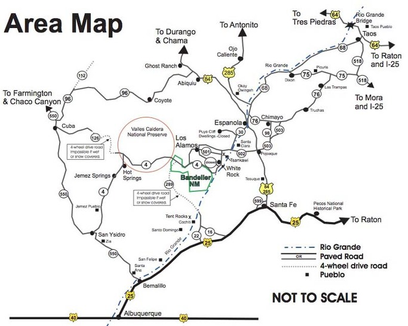  
반델리어 국립 유적지 가는 교통망

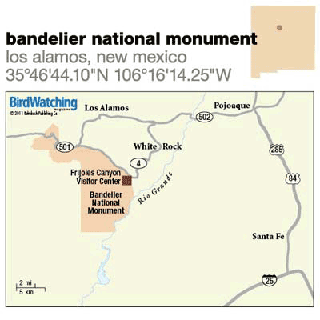  
반델리어 국립 유적지의 위치

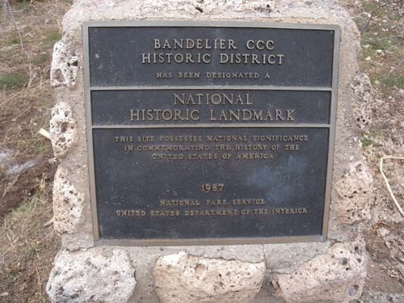  
반델리어 지역 표지판

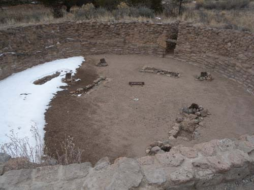  
반델리어 지역 푸에블로 인들의 합동 예배장 유허

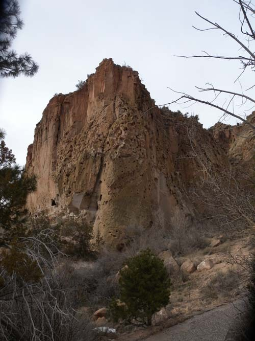  
동굴집들이 있던 거대한 암벽

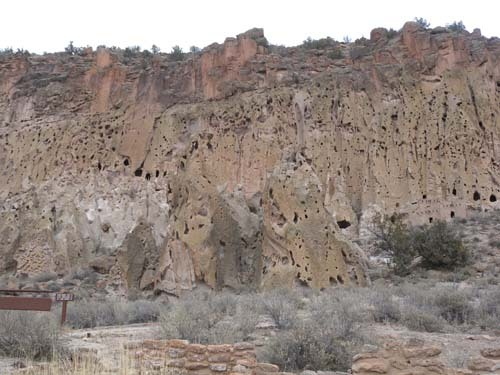  
동굴집들이 있던 거대한 암벽

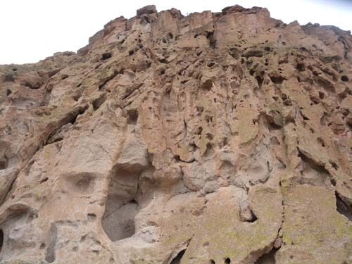  
동굴집들이 있던 거대한 암벽

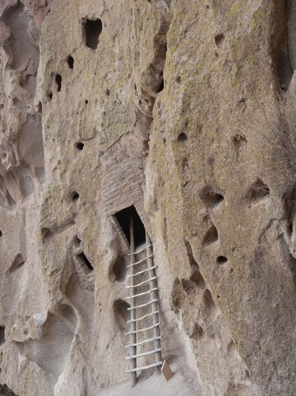  
동굴집으로 들어가기 위해 설치한 사다리

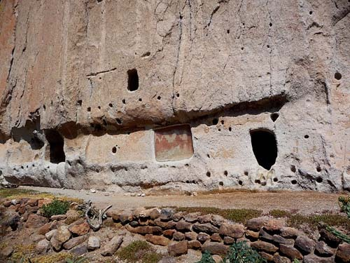  
암벽 동굴집들과 벽에 잇대어 집을 지었던 흔적으로 남아 있는 작은 구멍들,   
그리고 암벽화[pictograph]

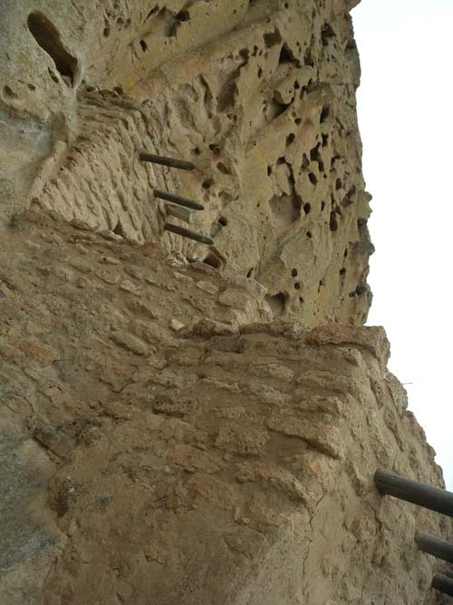  
암벽동굴집들과 그 주변에 덧붙여 지은 집의 유허

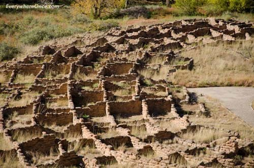  
암벽 동굴집 아래쪽에 있던 주택가의 유허

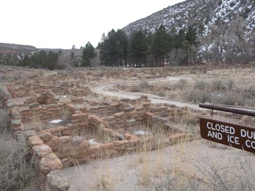  
암벽 동굴집 아래쪽에 있던 주택가와 각종 시설들의 유허

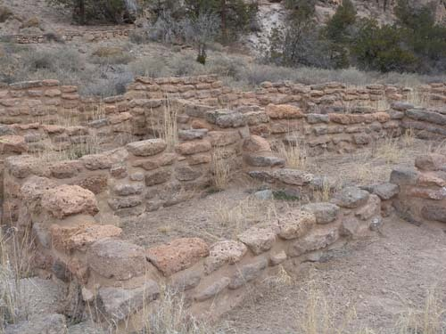  
암벽 동굴집 아래쪽에 있던 주택가와 각종 시설들의 유허

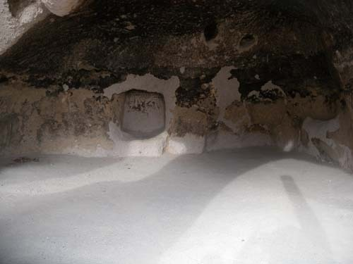  
암벽 동굴집 내부[벽이 온통 그을려 있음]

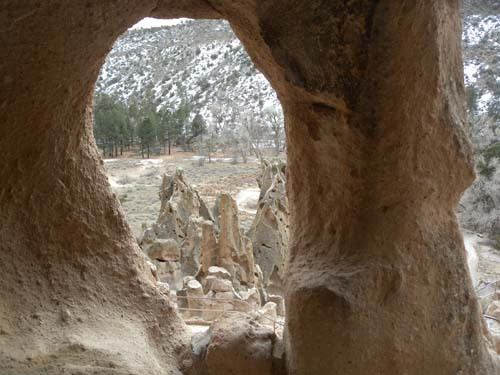  
암벽 동굴집에서 내다 본 바깥 풍경

그렇다면 그들은 이 깊고 척박한 산중에서 무얼 먹고 살았을까. 대략 12세기 중반에서 16세기 중반에 걸쳐 이곳에서 살았던 ‘선(先) 푸에블로[Ancestral Pueblo]’ 인들은 메사(mesa)의 위쪽에 있던 들판에 농작물들을 재배했던 것으로 보인다. 옥수수, 콩, 호박 등은 그들의 주식이었으며, 자생식물들과 우리가 현장에서 발견한 사슴, 토끼, 다람쥐 등의 고기도 영양분을 보충하기에 요긴했을 것이다. 그 뿐 아니라 그들의 집 주변에서 기르던 칠면조로부터는 깃털과 고기를 얻었을 것이며, 개를 이용한 사냥도 가능했던 것으로 보였다.

반델리어에 인간이 깃들기 시작한 세월은 10,000년이 넘는다. 메사와 계곡을 가로질러 이동하는 야생 조수(鳥獸)들을 따라 다니던 수렵•채취 부족들이 바로 그들이었다. 그러나 서기 1,150년에야 ‘선 푸에블로’ 인들은 반영구적인 주거지를 짓기 시작했고, 1550년에는 이곳을 떠나 리오 그란데(Rio Grande) 강가로 주거를 옮겼다. 코치티(Cochiti), 산 펠리페(San Felipe), 산 일데폰소(San Ildefonso), 산타 클라라(Santa Clara), 산토 도밍고(Santo Domingo) 등이 그들의 새로운 주거지역이었다.

그 후로 4백여 년 간 이 땅에는 사람들이 없었으며, 설상가상으로 심한 가뭄까지 닥쳐오게 되었다. 역사에는 기록되지 않았으나, 이들의 구비전승[口碑傳承, oral tradition]에 의하면, 리오 그란데 강을 따라 남쪽과 동쪽에 위치한 코치티 푸에블로와 산 일데폰소 푸에블로가 프리올레 캐년에 집을 짓고 살던 이들의 가장 가깝거나 직접적인 후손들로 보인다고 한다.

비지터 센터에는 박물관과 함께 이들의 생활사를 보여주는 다큐멘터리 영화관이 있었다. 거기서 확인하게 된 흥미로운 사실들 중의 하나는 이들이 구비전승을 통해 조상들과 연결했고, 그에 의존하여 삶의 지혜를 얻거나 적응해 나왔다는 점이다. 푸에블로의 구비전승은 자신들의 믿음, 이야기, 노래, 춤, 생활 속의 기술 등 모든 것을 포괄한, ‘옛날과 현재의 대화’ 즉 E.H. 카아의 말대로 ‘역사’였다. 따라서 구비전승은 선대 푸에블로의 생존에 기본적인 텍스트였고, 오늘날에도 푸에블로로 하여금 그들의 정체성을 유지해 나갈 수 있게 하는 필수적인 지식의 창고라 할 수 있었다. 그래서 푸에블로의 이야기들에는 그들의 활동이 묘사되어 있기도 하고 교훈이 기록되어 있기도 하여, 대대로 그것을 가르쳐 왔음은 물론 그 안에 들어 있는 생생한 정보들을 공유하기도 했다. 대부분 구비로 전승되어 왔지만, 개중에는 그림, 암각화, 혹은 춤으로 묘사되기도 한 모양이었다. 내가 그들의 주거지 주변에서 목격한 암각화도 그 사례들 가운데 하나였다.

1,700년대 중반 스페인 정부가 불하해준 땅을 소유한 스페인 정착자들은 프리욜레 캐년(Frijoles Canyon)에 자신들의 주거지를 만들었고, 1880년 코치티 푸에블로의 호세 몬토야(Jose Montoya)는 고고학자 반델리어[Adolph F. A. Bandelier, 1840. 8. 6.~1914. 3. 18.]를 프리욜레 캐년으로 데리고 가 조상들이 살던 고향땅을 보여주었다. 그 때부터 반델리어는 이 지역을 연구하기 시작한 것이다. 반델리어는 스위스 베른 출신의 미국 고고학자인데, 그의 이름을 따서 이 유적지의 명칭으로 삼았을 정도로 그는 이 지역에 관한 전문가였다. 그는 젊은 시절 미국으로 이주하여 노동을 하며 힘들게 살았다. 당시 대단한 인류학자 모건(Lewis Henry Morgan)의 지도 아래 그는 미국 남서부, 멕시코, 남아메리카 등지의 미국 원주민들을 연구하게 되었다. 그는 멕시코의 소노라(Sonora), 애리조나, 뉴멕시코 등지에서 연구를 시작하여, 이 지역 연구를 선도하는 권위자가 되었고, 쿠싱(F. H. Cushing) 및 그의 후계자들과 함께 선사 문화 분야의 선도적인 학자가 되기도 했다. 그의 이름을 딴 곳이 바로 이 구역이었다.

1916년 ‘반델리어 국립 유적지’ 법령이 만들어지고 윌슨(Woodrow Wilson) 대통령이 서명했으며, 1925년에는 에벌린 프라이(Evelyn Frey)와 그의 남편 죠지(George)가 이곳에 도착하여 1907년 애벗 판사(Judge Abbot)가 건립해온 ‘10 엘더스 랜취(the Ranch of the 10 Elders)’를 이어받게 되었고, 1934년과 1941년 사이에 ‘민간 자원 보존단[Civilian Conservation Corps]’의 노동자들이 프리욜레 캐년에 만들어진 캠프에서 작업을 하는 등 최근까지의 노력으로 지금의 유적지는 모습을 갖추게 되었다고 할 수 있다.

‘암벽 주거지’를 거쳐 내려오는 길은 지난여름 이 일대를 휩쓸었던 것으로 보이는 홍수의 현장이었고, 근년에 일어나 아름드리 소나무들을 태워버린 무서운 자연 화재의 현장이기도 했다. 무수한 나이테들을 몸에 새기고 벌렁 누워있거나 아직 청청하게 버티는 소나무들은 그 옛날 이곳에서 살아간 푸에블로 인들의 역사를 생생하게 기억하고 있을 것이다. 아무도 접근할 수 없는 이 계곡에서 먹고 자고 사랑하며 생존의 나날을 버텨내던 푸에블로 인들은 벌써 오래 전에 이 계곡을 떠났다. 그러나 리오 그란데 강줄기를 따라 새로운 터전들을 일군 그들은 변함없이 옛날이야기들 속에 숨어 있는 조상들의 지혜를 이어가며 오늘과 내일을 살아가고 있는 중이다. 마음속에서 메아리치는 프리욜레 계곡의 거센 냇물 소리를 기억하며...

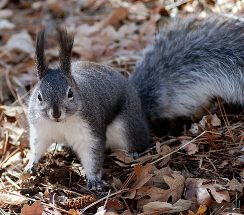  
당시 이곳 주민들이 잡아먹고 살았을 다람쥐

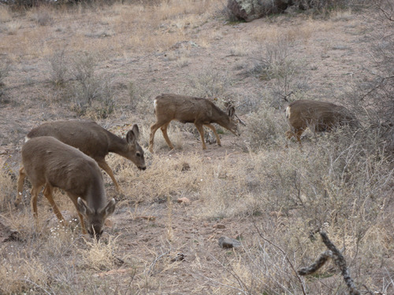  
당시 이곳 주민들이 잡아먹고 살았을 사슴들[Mule Deer]

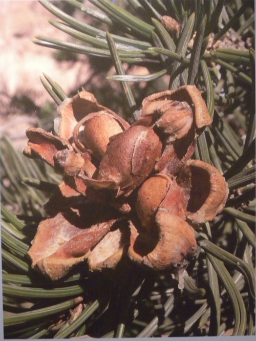  
당시 이곳 주민들이 따 먹고 살았던 잣나무 열매[piňon nuts].   
지방과 단백질의 공급원이었음.

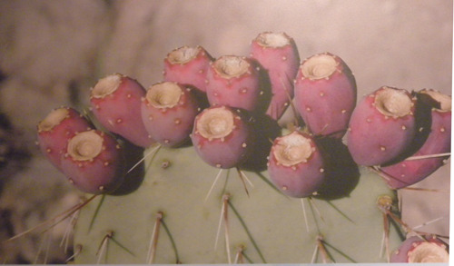  
당시 이곳 주민들에게 비타민과 무기질을 공급했을 선인장 열매들

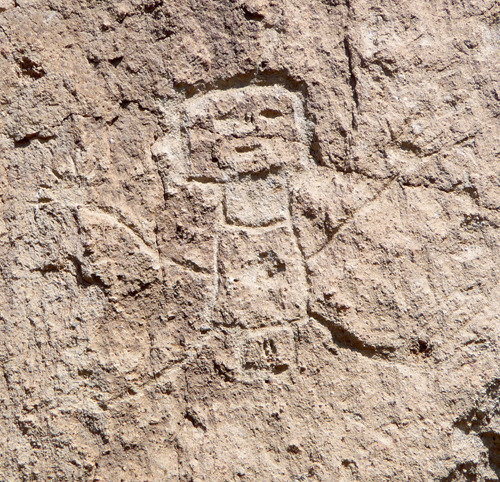  
당시 이곳 주민들이 동굴집 주변에 남긴 암각화[pictograph]

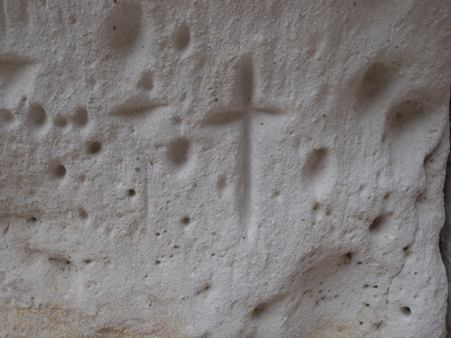  
스페인 이주자들로부터 받은 영향을 암시하는 암벽 위의 십자가

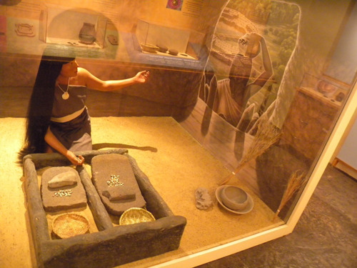  
열매를 갈아 식량을 확보하던 당시 여인들의 삶[비지터 센터 박물관 그림]

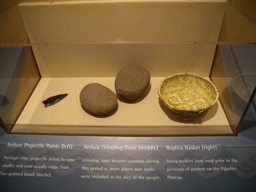  
당시 이곳 주민들이 사용하던 바구니와 갈돌, 그리고 화살촉[비지터 센터 박물관]

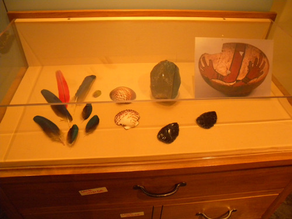  
당시 이곳 주민들이 사용하던 도자기와 각종 생활 도구들[비지터 센터 박물관]

공유하기

게시글 관리

**백규서옥\_Blog ver.**

[저작자표시 비영리 변경금지
(새창열림)](https://creativecommons.org/licenses/by-nc-nd/4.0/deed.ko)