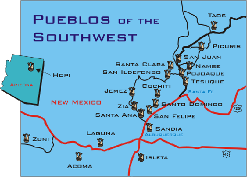  
뉴멕시코의 푸에블로 부족 분포도

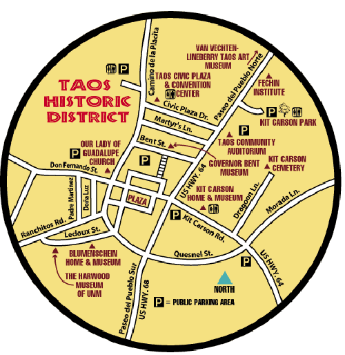  
타오 시내 역사구역 도

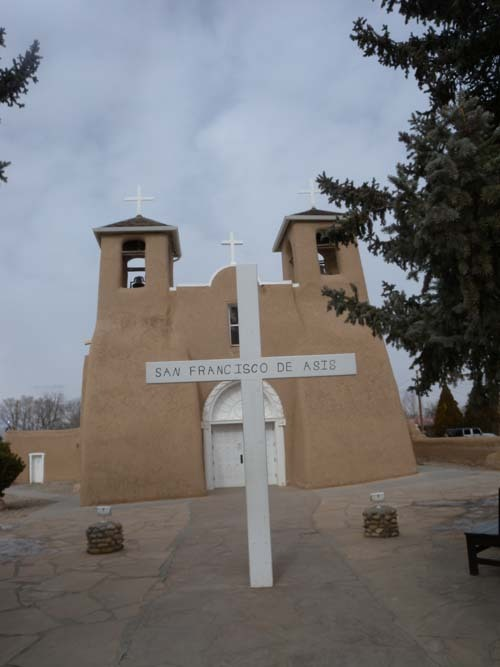  
타오 신 시가지 안의 '아씨시의 성 프란체스코 교회'

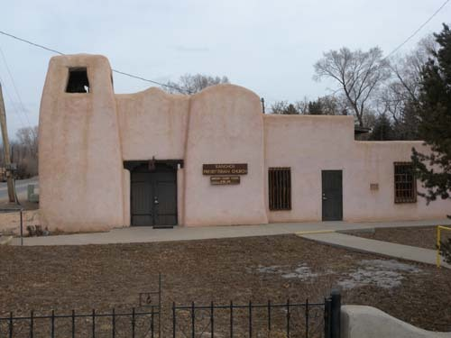  
타오 신 시가지 안의 장로교회

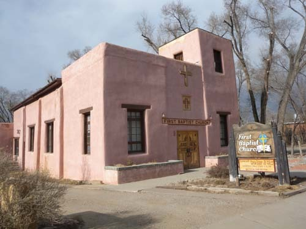  
타오 신 시가지 안의 침례교회

부드러운 어도비, 완강한 ‘타오 푸에블로’ 인디언들

반델리어 유적지가 자리 잡은 프리욜레 계곡을 벗어난 시각이 오후 4시에 가까워져 있었다. 뉴멕시코를 벗어나기로 한 애당초 계획을 버리고 별 수 없이 로스 알라모스의 한 부분인 화이트 락(White Rock)에서 1박을 하며 반델리어의 감동을 정리하기로 했다. 창밖으로 산타페 산맥의 연봉들이 아스라이 보이는, 아름다운 호텔이었다. 다음날 호텔에서 챙겨주는 아침을 먹은 다음 프런트의 아가씨에게 일기예보와 ‘타오(Taos) 행’에 관해 물었다. 눈 올 확률은 20%. 그러나 타오는 반드시 들러 가야 할 곳이라고 ‘강추’했다. 에라, 모르겠다. 눈이 쌓이면 며칠 묵어가지. 앞으로 언제 이곳에 또 올 것이냐. 그래서 산타페 쪽으로 다시 돌아가 I-40을 타는 대신, 그 반대편에 있는 타오(Taos)로 기수를 돌리기로 했다. 푸에블로 인들이 대대로 살아왔고, 지금도 살고 있는 타오의 집단 거주지를 육안으로 확인하고 싶었던 것이다.

화이트 락에서 타오 가는 길은 지금까지의 어떤 구간보다 아름다웠다. 겉으로 낙후되어 보이긴 했으나 연도의 촌락들도 모두 평화로웠고, 황량한 산하는 그 나름의 정제된 미학을 갖추고 있었다. 군데군데 퇴락한 도회들도 없는 건 아니었으나, 그것들이 갖고 있는 역사성은 내 호기심을 자극하기에 충분했다. 멋지게 뻗은 502번 도로로 화이트 락의 호텔을 출발하여 잠시 가다가 30번으로 갈아탔고, 에스파뇰라(Espaňola) 턴파이크에서 68번으로 갈아탄 다음 두 시간 넘게 걸려 타오에 도착했다.

달리는 중간 중간 탄성이 절로 나올 정도의 경관들을 만나면서 우리는 발걸음을 주춤거리기도 했다. 예컨대, 아리바 카운티(Arriba County)를 지날 때 길 가에서 녹슨 간판을 보고 찾아 들어간 작은 도시 벨라르데(Velarde)에서 과달루페 성모가 모셔진 작은 성당 ‘과달루페 성모 교회[Iglesia de la Virgen de Guadalupe Mission Church]를 만난 기억은 오래도록 잊히지 않을 것이다. 집도 몇 채 되지 않는 한적한 시골 동네 한 구석에 얌전히 앉아 있는 그 성당은 참으로 정결하고 가난해 보였다. 작은 나라에서 대형 교회들만 보아오던 내 눈에 큰 나라의 작은 교회가 주는 감동은 작지 않았다. 그런 감동을 안고 다시 먼 길을 달려 해발 2,124m의 높은 지역에 위치해 있는 면적 13.9 ㎢의 소도시 타오에 진입하게 되었다.

멀리 타오 마운틴이 서 있고, 그 앞으로 시가지가 비교적 널찍이 자리 잡고 있었다. 길은 좁았으나, 도시를 채우고 있는 어도비 양식의 집들은 따스해 보였다. 무엇보다 성당과 교회 및 공공건물들 대부분이 어도비 양식인 점이 좋았다. 번쩍이는 빌딩 식 교회들보다는 어도비의 그 따스함 속에 구원의 손길이 깃들 것만 같았다. 우리의 최종 목적지인 ‘타오 푸에블로(Taos Pueblo)’까지는 타오 신도시[Modern City of Taos]에서 북쪽으로 1마일이나 더 가야 하는데, 도시에 들어가자마자 어도비 양식으로 지어진 ‘아씨시의 성 프란체스코 성당[St. Francisco de Asísi Church]’이 매혹적인 자태로 서 있는 것 아닌가. 안 들를 수 없는 일. 앞쪽으로 가보니 말문이 막히도록 아름다운 건축미가 돋보였다. 이 지역의 교회들을 들르면서 느끼는 것은 종교적인 경건함보다는 건축미가 먼저 마음을 흔든다는 점이다. 교회 문을 살짝 밀고 들어서니 누가 죽었는지 장례미사가 집전되고 있었다. 경건하고 슬픈 분위기를 해칠까 저어되어 살그머니 되돌아 나왔으나, 아름다운 교회의 모습은 자꾸만 우리의 발걸음을 지척이게 하였다. 거기서 몇 블록을 전진하자 이번에는 어도비 양식의 장로교회와 침례교회 등이 참한 모습으로 서 있었다. 비록 문은 잠겨 있었으나, 외양을 감싼 고즈넉한 분위기가 세상의 번잡함을 정화시키고 있는 듯 했다. 역시 그곳의 자연환경과 일치되는 분위기의 교회가 사람들에게 구원의 희망을 쉽게 줄 수도 있겠다는 생각이 들었다. 교회 전체에서 풍겨나는 따스한 느낌 때문인가 이 지역의 교회를 볼 때마다 그대로 문을 열고 들어가 폭 안기고 싶은 마음이 드는 것이었다. 생소한 모습으로 번쩍이는 교회로부터 구원의 희망을 찾기란 어려운 일임을 비로소 깨닫게 되었다.

주변에 널린 갖가지 유혹들을 물리치고 가까스로 도착한 곳이 타오 푸에블로. 타오 마운틴을 뒤로 하고 먼지 풀풀 이는 벌판에 그득하니 서 있는, 어도비 양식의 집단 거주지였다. 밝고 따스한 주택의 색깔이 주변의 붉은 흙빛, 뒤에 버티고 선 타오 산의 푸른빛, 마을을 뚫고 흐르는 리오 그란데 강의 옥색 물빛 등과 절묘한 하모니를 이루고 있었다.

출입문을 통해서 들어가니 단층도 있고, 복층의 경우 5층까지 올린 집들도 있었다. 하나로 되어 있는 외벽 안쪽에 각자의 집들이 조합된 건축방식으로 이루어 진 것이 기본구조였다. 이 공동체에는 1,900명 이상의 푸에블로 인들이 속해 있는데, 그들 중 일부는 근처에 현대식 집을 짓고 살다가 시원해지면 푸에블로의 자기 집에 머물기도 한다는 것이었다. 그리고 일 년 내내 그곳에서 지내는 사람들도 대략 150명 정도 된다고 한다.

타오 푸에블로는 세계적으로 중요한 역사 문화 유적으로서 1992년 유네스코 세계문화유산에 등재된 바 있다. 집들의 외양, 사람들이 오르내리는 사다리들과 집 앞의 빵 화덕들은 스카이시티나 마찬가지였다. 사철 물이 흘러내리는 냇물을 보니, 그들이 이곳에 자리 잡은 이유를 알 것 같았다. 주거지는 냇물을 경계로 나뉘어 있었으며, 왼쪽 주거지의 중심부에 멋지게 지어진 가톨릭 교회도 있었다. 앞에서 누차 언급했지만, 이들이 자신들의 전통신앙을 거의 포기하고 가톨릭을 받아들인 점은 참으로 놀라운 일이었다. 스페인에 의해 식민 지배를 받은 결과라고 보지만, 신교 보다 가톨릭 쪽이 자신들의 전통신앙이나 가치관을 더 용인해준다고 생각한 것인지도 모르는 일이었다. 그러면서도 이들은 여러 면에서 폐쇄적이었다. 가옥의 내부는 전혀 공개하지 않을 뿐 아니라, 함께 사진 찍는 일도 거부하는 경우가 많았다. 집 앞 화덕에서 구운 빵을 판다고 하여 들어가 보았으나, 페치카에 장작 한 올 겨우 넣고 간신히 추위를 참고 있던 할머니는 아예 카메라에 손도 대지 못하게 했다. 끝까지 지키고 싶은 자신들만의 세계라도 있는 듯, 이들의 구역에 들어가면 오금이 저릴 정도로 경계의 눈빛을 쏘아대는 그들이었다.

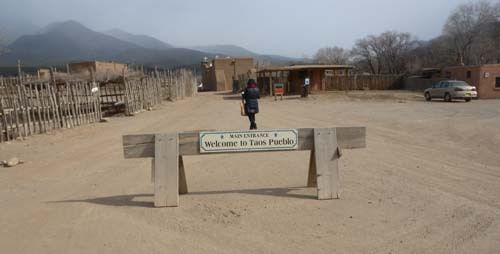  
타오 푸에블로 입구

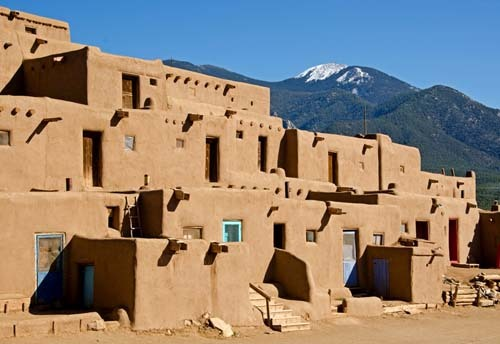  
타오 푸에블로 경내의 어도비 주거지

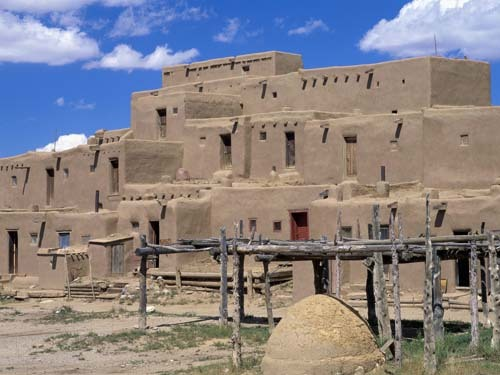  
타오 푸에블로 경내의 어도비 주거지. 앞 쪽의 반타원형 구조물은 빵을 굽는 화덕.

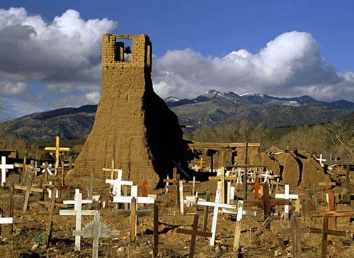  
타오 푸에블로 경내의  공동묘지를 갖춘 가톨릭 교회터

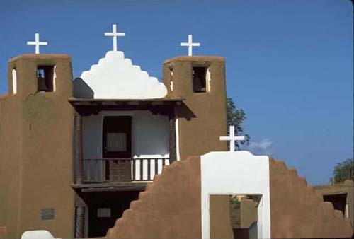

타오 푸에블로 경내의 가톨릭 교회

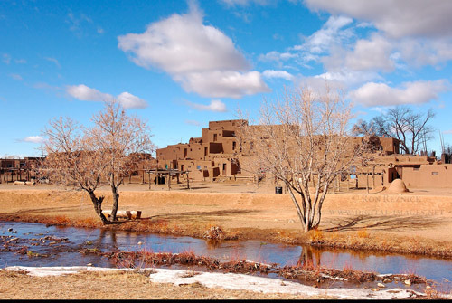

타오 푸에블로 왼쪽 주거지와 리오 그란데강 지류

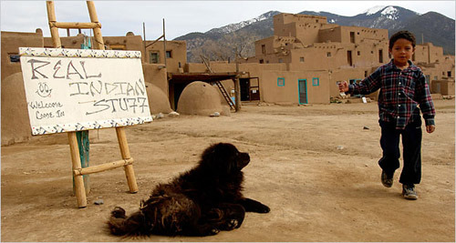

타오 푸에블로에서 만난 푸에블로 소년과 검은 개

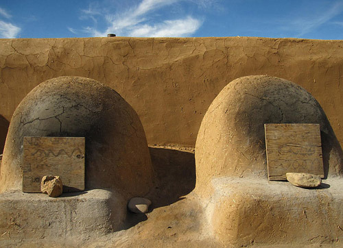  
타오 푸에블로의 빵 굽는 화덕

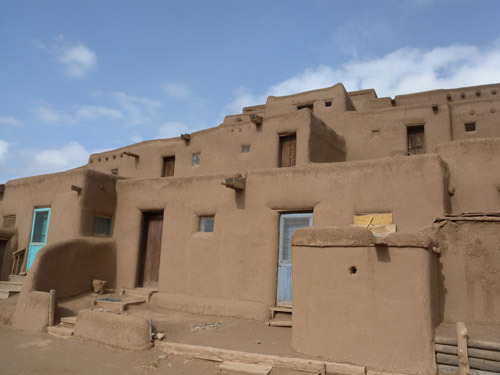  
타오 푸에블로 주거지

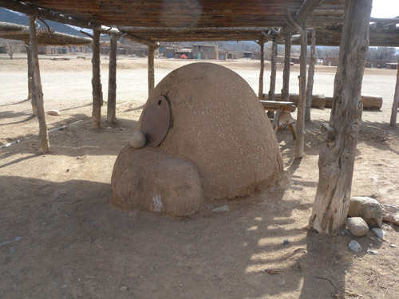  
차양 밑에서 보호받고 있는 화덕

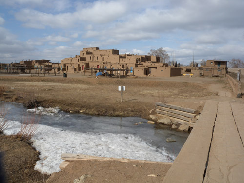  
리오 그란데 강물과 나무 다리

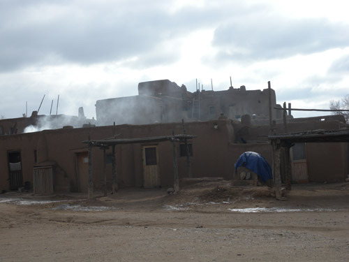  
빵을 굽고 있는 듯 연기가 피어오르는 타오 푸에블로

이들이 살아왔고, 앞으로도 쭉 살아갈 것 같은 그들만의 주거지를 간신히 돌아본 다음, 우리는 타오 외곽으로 리오 그란데의 강줄기를 찾아 차를 돌렸다. 30분 정도 황야를 달렸을까. 엄청난 규모와 높이의 다리 ‘리오 그란데 죠지 대교[Rio Grande George Bridge]’를 만났다. 저려오는 오금을 달래며 다리 한복판까지 걸어갔다. 비행기 창문으로 땅바닥을 내려다보듯 갑자기 고소공포증이 밀려들었다. 멀리 광활한 대지를 바라보고 나서야 이 다리가 없던 시절엔 타오가 강과 산으로 둘러싸인 고립지였음을 깨닫게 되었다. 그렇다면 그들은 왜 이런 고립지에 주거지를 건설하고 살았을까. 아마도 외부와 단절된 곳에 주거지를 건설하는 것이 자신들의 정체성을 지킬 수 있는 유일한 방법이라고 보았기 때문이리라. 지역들이 사통팔달로 이어지는 오늘날 그들이 외부인들과의 접촉을 꺼려하는 것도 그런 전통적인 삶의 방식에서 나온 본능적 반응일 것이다.

대략 1천년이 넘는 역사를 갖고 있는 타오 푸에블로는 뉴멕시코 북쪽의 여덟 개 푸에블로들 가운데 하나로서, 가장 비밀스럽고 보수적이며 사적인 영역을 많이 갖고 있는 부족이었다. 서기 1,000년부터 1,450년 사이에 세워져 미국에서 가장 오래된 거주 공동체인 타오 푸에블로. 그곳에서 우리는 화석처럼 살아가는 그들을 만났다. 외부세계와 단절되고 싶긴 하지만, 적빈(赤貧)을 해결하기 위해 외부인들의 접근을 허락할 수밖에 없었고, 그러다 보니 그들과 섞일 수밖에 없었던 것이 그들의 현실이었다. 아직도 지킬 만한 것이 있다고 믿는 그들이었지만, 외부인들로서는 그 점을 용납할 수 없는 현실이 안쓰럽게 생각되었다. 그래도, 이렇게 속물화되어가고 있는 시대에 조상들로부터 이어받은 자신들의 원래 모습을 지키려는 그들의 모습이 얼마나 훌륭한가?

타오 푸에블로 인들의 고집스런 표정을 대충 마음에 담아둔 채 우리는 뉴멕시코를 재빨리 벗어날 지름길 ‘엔젤 마운틴’의 산길로 접어들었다.

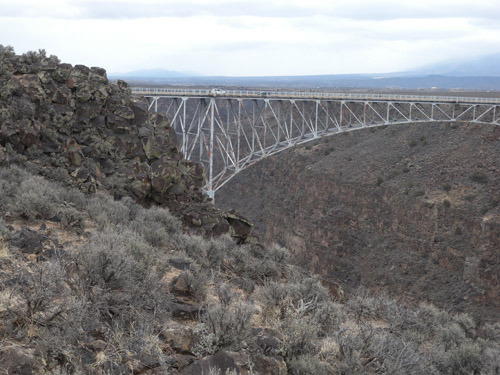  
리오 그란데 강줄기와 계곡을 가로질러 만들어진   
'리오 그란데 죠지 다리[Rio Grande Jeorge Bridge]'

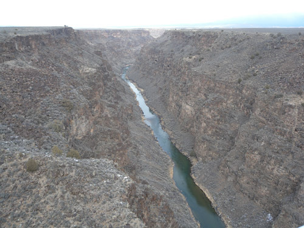  
광야를 가르며 죠지 다리 밑을 지나는 리오 그란데 강

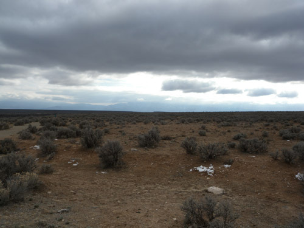  
리오 그란데 죠지 다리 부근에서 바라 본 광야

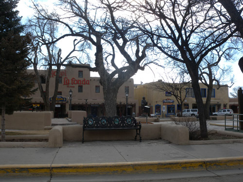  
산타페 광장과 비슷한 규모와 구조를 보여주는 타오 중앙광장

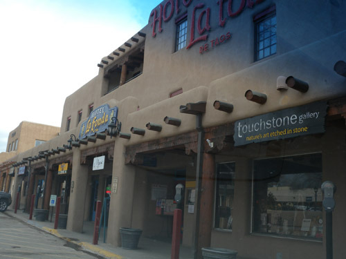  
타오 광장 주변의 상가들

  
타오 외곽에서 만난 갤러리 'Happy Trails'

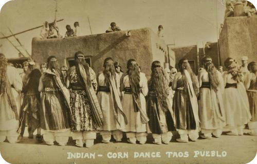  
자료사진-푸에블로 인디언들의 집단무용 '콘 댄스(Corn Dance)'

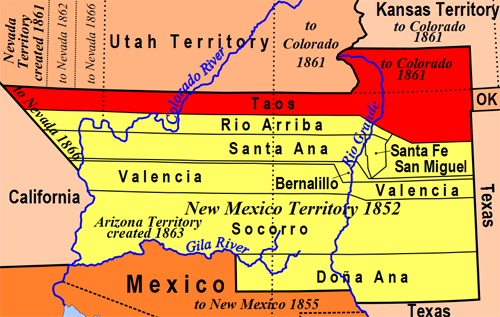  
타오 카운티를 비롯한 뉴멕시코의 영역도

공유하기

게시글 관리

**백규서옥\_Blog ver.**

[저작자표시 비영리 변경금지
(새창열림)](https://creativecommons.org/licenses/by-nc-nd/4.0/deed.ko)