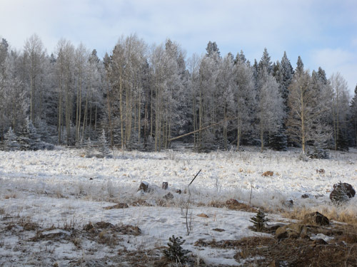  
숲속 길-1

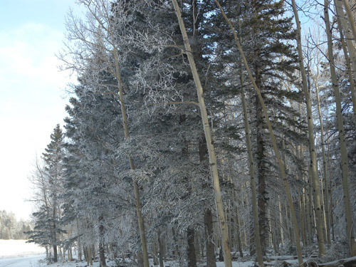  
숲속 길-2

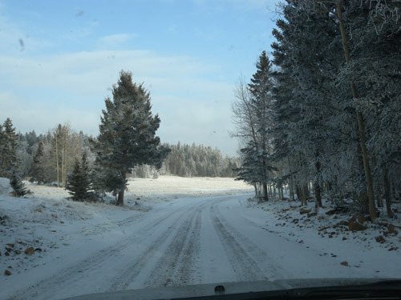  
숲속 길-3

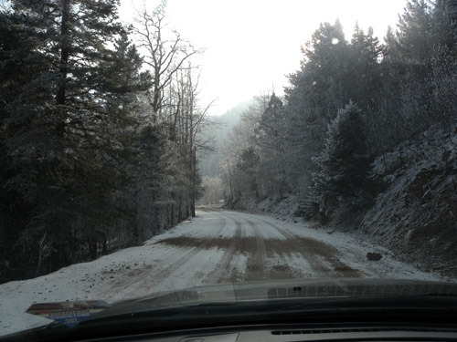  
숲속 길-4

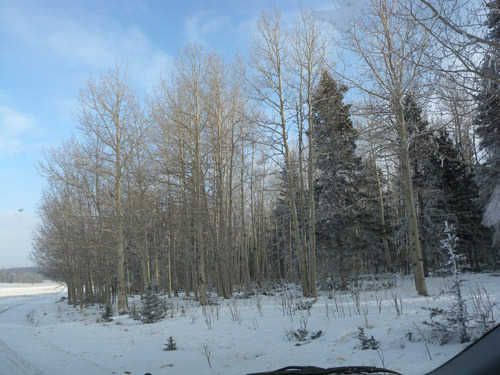  
숲속 길-5

아찔했던 순간, 엔젤 파이어 마운틴의 환상

타오(Taos)로부터 빠져나왔을 땐 오후 4시가 넘은 시각이었다. 뉴멕시코를 벗어나는 길은 두 갈래였다. 다시 산타페 쪽으로 돌아가 I-40을 타는 코스, 그 반대로 북쪽에 가로막힌 산맥을 넘는 지름길 코스 등 두 개의 옵션이었다. 하늘에는 무거운 구름이 잔뜩 몰려들어 타오 산의 절반 이상을 덮었고, 저녁이 가까워진 시각이었다. 지름길이든 우회로이든 I-40에 접어들어야 뉴멕시코를 벗어난 뒤 애당초 계획대로 텍사스 주의 아마리요(Amarillo)에서 1박을 할 수가 있었다. 지도상으로 지름길은 긴 코스에 비해 절반가량의 거리였다. 순간 핸들을 쥔 손에 힘이 들어갔다. 좋다. 지름길로 간다. 1,800년 이태리 원정에 나선 나폴레옹이 지름길인 알프스를 넘던 기백을 상상하며 산길을 타기로 한 것이다.

꼬불꼬불, 오르락내리락, 산길은 예상보다 험했다. 깊이 들어갈수록 오고가는 차량들도 뜸했고, 말 두 마리와 검정 소 10여 마리가 서 있던 목장을 끝으로 인가도 사라졌다. 석양은 저 멀리 산 끝에 간신히 걸려 있었다. 다시 울창한 삼림으로 들어서면서 사위(四圍)는 어둑해지고, 하늘의 구름은 더 두꺼워졌다. 눈발이 날렸고, 설상가상으로 아스팔트가 끊기면서 비포장도로가 시작되었다. 흙과 자갈이 적당히 섞인 길바닥엔 1~2인치 정도의 눈이 쌓여 있었다. 산속의 기후가 평지와 다르다는 점을 알고 있었으면서도, 지도상에 점선으로 표시된 길이가 매우 짧았음을 생각하고 애당초 가졌던 나폴레옹의 기개를 견지하기로 했다.

그러나 가도 가도 눈 덮인 산길은 끝을 보이지 않았다. 가슴 저 밑에서 작지 않은 불안감이 스멀스멀 기어 올라왔지만, 사령관이 흔들리면 전투력은 와해되는 법. 그냥 밀고 나갔다. 이미 인적(人跡)이고 차적(車跡)이고 끝난 지 오래되어 적막한 산길임에도 주변의 경치는 ‘끝내주게’ 좋았다. 쭉쭉 뻗어 올라간 나무들에는 하얀 눈이 덮여 어딜 보나 한 폭의 ‘겨울풍경화’였다. 군데군데 손바닥만하게 펼쳐진 풀밭들에는 눈과 수정모양의 얼음이 어울려 하늘이 조화를 부린 듯 했다.

몇 구비 산을 넘은 뒤 우리는 진짜로 동화의 세계를 만나게 되었다. 분지 형으로 생긴 계곡 한쪽의 산록에 수많은 사슴들이 눈밭을 헤집으며 먹이를 찾고 있는 것 아닌가. 아, 전 세계 산타 할아버지들이 타고 다니는 사슴들이 여기서 사육되는 것이로구나! ‘인영(人影)이 불견(不見)’인 이 산중에 도대체 이 많은 사슴들은 어떻게 모여 있단 말인가. 길 가에 차를 세우고 차창을 내렸다. 몇 녀석은 풀을 찾다 말고 우리를 물끄러미 바라보며 서 있고, 다른 녀석들은 오불관언(吾不關焉) 하던 일을 계속했다. 이게 바로 동화의 세계가 아닌가.

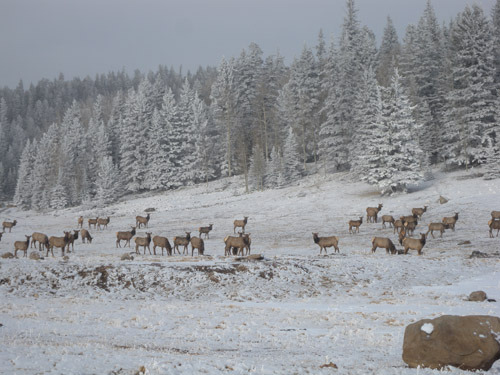  
선경에 노니는 사슴들-1

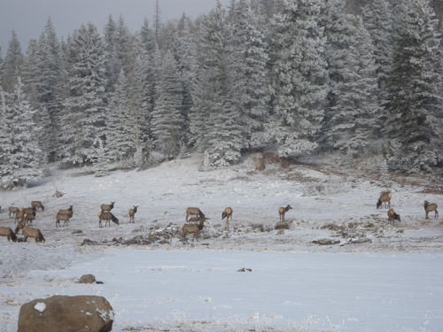  
선경에 노니는 사슴들-2

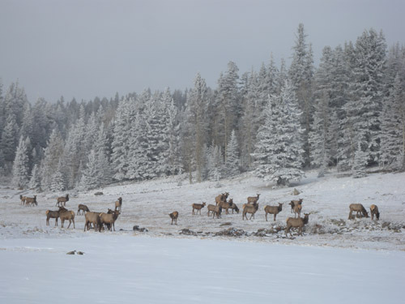  
선경에 노니는 사슴들-3

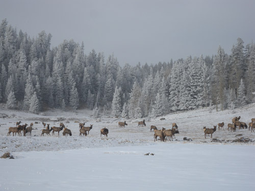  
선경에 노니는 사슴들-4

온통 눈에 덮여 순백으로 변한 무대에 사슴의 무리가 연출해내는 환상의 순간을 우리는 어쩔 줄 모르고 온몸으로 받아들였다. 자연의 위대한 아름다움에 흠뻑 취한 것이다. ‘어떻게 이 산을 벗어날 것이며, 우리에게 닥친 위험을 어떻게 헤쳐 나갈 것인가’라는 걱정과 불안은 이미 우리의 뇌리를 떠난 지 오래였다. ‘저 아름다운 사슴들이 살아가는 이 공간에 무슨 위험이 있을 것이며, 설사 차가 전진하지 못한다 한들 저 녀석들과 하룻밤 지새지 못할 이유가 뭔가?’라는 오기가 발동한 것이었을까. 그 녀석들에게 눈길을 주는 동안은 단 한 점의 걱정도 없었다.

그러다가 퍼뜩 정신이 들었다. 아무리 아름다워도 저들은 환상 속의 존재들이고, 우리는 현실의 존재들 아닌가. 어떻게든 벗어나야 했다. 그로부터 자동차를 살살 달래가며 액셀러레이터에 힘을 가했다. 묘하게도 사슴을 만난 곳으로부터 30분쯤 지나자 숲이 끝나고 다시 광대한 대지가 나오는 것이었다. 그로부터 20여 분을 달리자 하나 둘 민가가 나타나고, 10여 분을 더 달리자 아스팔트 도로가 나타났다. 까맣게 밤이 내린 드넓은 대지를 쾌속으로 달려 밤 8시나 되어서야 겨우 모텔 하나가 있는, 주 경계선 지역의 작은 도시 로건(Logan)에 도착할 수 있었다.

모텔에 도착한 뒤 하루 행적을 복기(復碁)해 보았다. 모텔에 도착하고 나서야 겨울 동안 미국 각지의 산악지역에서 조난당하는 사람들이 적지 않다는 사실을 떠올렸다. 그래도 대부분의 미국인들은 조난당했을 때 얼마간 견딜 수 있을 정도의 장비들은 갖추고 다니는 것이 상식으로 되어 있었다. 그럼에도 불행을 당하는 사람들이 적지 않은데, 우리는 어땠나? 우리의 트렁크엔 간단한 캐리어 하나만 달랑 들어 있을 뿐이었다. 그 흔한 담요도, 랜턴도, 간식거리도, 여분의 옷도 없었다. 스모커 아닌 내게 라이터나 성냥이 있을 턱도 없었다. 그 산중에서 터지지도 않는 전화기는 무용지물이었다. 인가가 있다 해도 미국의 관습상 찾아들어가 구조를 요청할 수 없는 것이 상식이지만, 아예 그런 인가마저 없었다.

그 눈 내리는 산 속에서 자동차가 덜컹하고 서거나 미끄러지기라도 했다면, 작은 눈이 폭설로 변해 더 이상 전진할 수 없었다면, 그래서 꼼짝 없이 그곳에 갇혔다면, 자동차의 연료가 소진되는 순간, 우리는 딱딱하게 굳은 채 세상을 하직할 수밖에 없었을 것이다. 아직도 이 세상에 많은 인연을 남겨 둔 우리가 미국 뉴멕시코의 산길에서 속절없이 세상을 하직하기에는 너무 억울하고 허무한 일 아닌가.

미국에서 장거리 자동차 여행을 하시는 분들은 명심해야 할 일이 있다. 자동차 트렁크에 각종 구난 장비들을 철저히 챙겨두시라. 차를 구입하자마자 어디서나 터지는 스마트 폰, 성능 좋은 랜턴, 라이터나 성냥, 담요, 물, 여분의 옷가지, 충분한 간식, 작은 톱[조난 시 불 지필 나무를 자를 때 필요함], 칼[혹시 간단한 요리나, 사냥 혹은 위급할 때 필요함] 등을 챙기시라. 6개월 동안 유럽을 자동차로 돌아다니면서도, 한국의 그 험한 산길들을 종횡무진 다니면서도, 아무 문제없었다는 자만과 안이함으로 우리는 우리 자신을 엄청난 위험에 몰아넣었던 것이다. 언제 어디서나 자만은 금물이다.

다만, 그 순간에 만난 사슴 떼는 우리의 불안을 잊게 만든 ‘하늘의 배려’였다. 그래서 그 순간을 생각하며 하나님과 그 사슴들에게 감사하고 있는 요즈음이다.

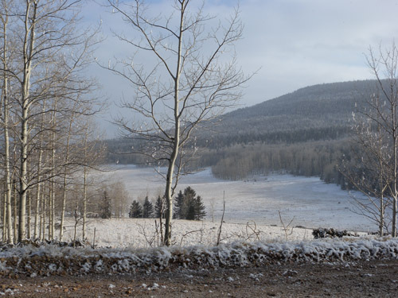  
산 속의 작은 공간-1

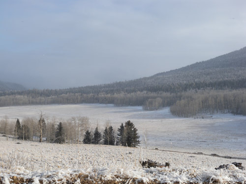  
산속의 작은 공간-2

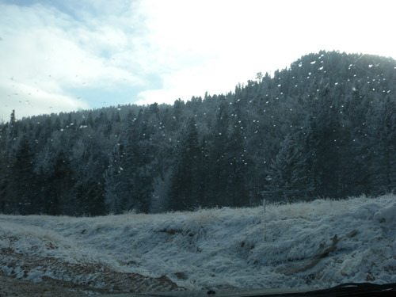  
눈 내리는 산길

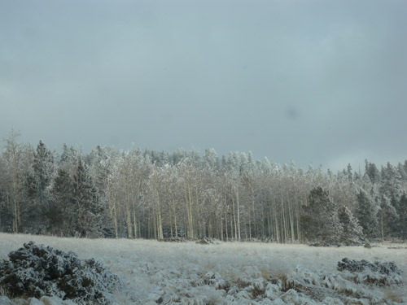  
눈 맞은 자작나무 숲

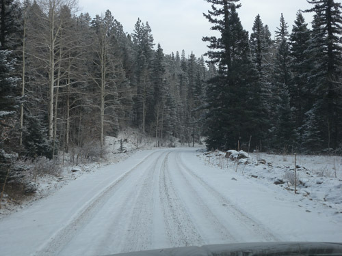  
눈 내린 고갯길

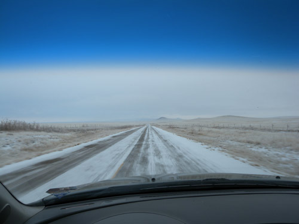  
다시 찾은 대지

공유하기

게시글 관리

**백규서옥\_Blog ver.**

[저작자표시 비영리 변경금지
(새창열림)](https://creativecommons.org/licenses/by-nc-nd/4.0/deed.ko)