xml:namespace prefix = "o" /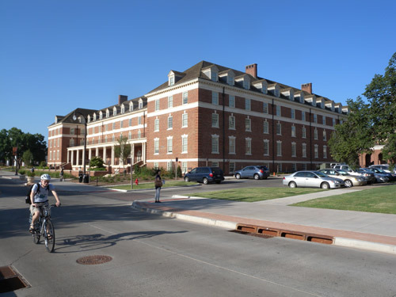

                         6개월간 몸을 담고 있던 South Murray 홀

 

 

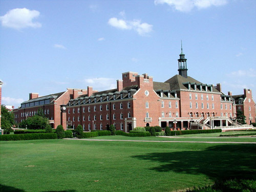  
                              OSU Student Union

 

 

 

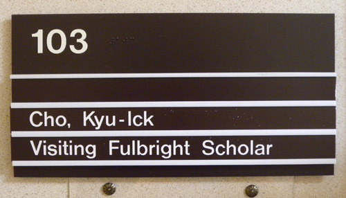  
                                        머레이 홀 1층에 있던 연구실 팻말

 

 

 

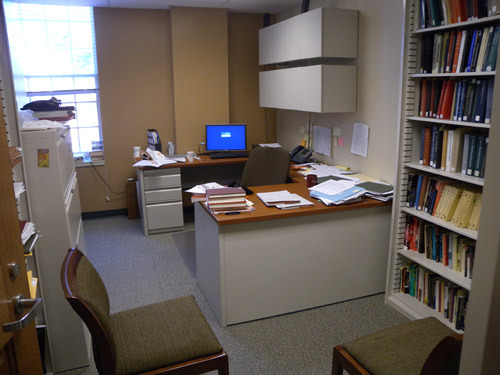  
                                       연구실 내부

 

 

 

스틸워터를 떠나며

예정 체류기간 6개월을 모두 써버리고, 오늘 드디어 스틸워터를 떠난다. 그동안의 추억에 쩐 짐들이 자동차 트렁크와 뒷좌석에 그득하건만 마음은 대체로 허하다. 그 옛날 유목민들이 이랬을까. 천막을 대충 걷어 말 등에 올려 메우고 정처 없이 또 다른 풀밭을 따라 길을 떠나던 그들의 기분이 아마도 이러했을 것이다. 농경 정착민의 후예인 내가 ‘노마드’라니? 스스로의 몸에서 ‘노마드’의 애환을 발견하게 되는 것은 아무래도 나를 감싸고 있는 시대의 변화 때문이리라. 풀이 자라면 다시 돌아오겠다는 맹세를, 떠나는 아침이면 그 옛날의 유목민들은 무수히 되뇌었을 것이다. 삶터 앞을 졸졸거리며 흐르는 시냇물을, 천막 주변에서 재잘거리던 작은 새들을, 가끔씩 찾아와 기웃거리던 사슴이나 토끼들을, 환하게 미소 짓던 꽃들을, 귓가에 스쳐가던 바람결을 어찌 잊을 수 있으랴! 천 년의 세월을 격(隔)한 노마드의 서정이 이 순간 내 마음을 치고 가는 것도 그 때문이다.

24일 아침, 오클라호마시티의 ‘윌 라저스 공항[Will Rogers World Airport]’ 출발 예정. 그러나 아직도 이 땅에 미련이 남았는가. 기다리는 사람은 없지만, 둘러 볼 곳들이 남아있어 스틸워터 출발 날짜를 며칠 당기기로 한 것이다. 무스코기(Muscogee)와 오크멀기(Okmulgee)에 모여 산다는 크릭(Creek) 인디언들을 만나기 위해 동쪽의 우회로를 택하기로 한 것.

스틸워터를 떠나는 이 순간의 기분은 9년 전 중・남부 유럽의 20개 나라들을 자동차로 돈 뒤, 런던 히드로 공항에서 귀국 비행기에 오르던 그 기분과 동일하다. 사실 아무런 경험이나 정보를 갖고 있지 않았기 때문에 어느 구석에 위험이 도사리고 있는지 알 수 없었으면서도 타고 난 낙천성과 조심성 하나로 무사히 그 길을 주파(走破)해낸 것처럼, 달력에 하루하루 금을 그어가며 체류해온 오클라호마 주와 스틸워터 역시 까맣게 모르던 공간들이면서도 그다지 숨차 하지 않고 골인 지점에 도착한 것이다. 처음으로 마주친 중・남부 미국인들의 보수성이 우리가 기대하고 있던 미국인들의 일반적 성향과 상당한 거리가 있다는 점에 머리를 갸웃거렸지만, 그들의 ‘보수성’이란 ‘자기표현의 미숙함’이외의 아무것도 아님을, 나는 그들을 만나는 순간 간파할 수 있었다. 사실 나로선 그게 가장 큰 행운이었다.

풀브라이터(Fulbrighter)로서의 가볍지 않은 사명을 짊어지고 오긴 했지만, 연구 외에 이곳에서 발견한 또 다른 것들이 나를 달뜨게 했다. 이곳 사람들과의 만남, 인디언의 역사나 문화와의 만남, 길과의 만남, 이상적인 환경과의 만남 등등. 그러나 무엇보다 소중했던 스틸워터는 문만 닫으면 절간처럼 조용해지는 공간이었다. 맑은 공기 속에 한 발만 나서면 온갖 새와 나무들이 그들먹한 낙원이었다. 기대 이상의 힐링을 체험하며 마음속의 온갖 찌꺼기들을 날려 버릴 수 있었다. 물론 이곳이라고 어찌 사람들 사이의 갈등과, 그로부터 일어나는 불행들이 없을 수 있을까. 그러나 유목민들이 아름다운 꽃향기와 산토끼의 해맑은 눈빛, 그 지순(至純)한 추억으로 광풍 몰아치던 수많은 밤들의 괴로움을 지우듯, 아름답지 못한 것들을 걸러내는 능력이야말로 지혜로운 인간의 전유물 아닌가. 사실 짧지 않은 6개월 동안 걸러내야 할 단 하나의 ‘씁쓸함’도 만나지 못한 나였다. 스틸워터에서 화려한 행복 보다는 작고 따스하며 담백한 즐거움 속에 거의 완벽한 힐링의 추억을 간직하게 되었으니, 이제 맛있고 영양가 풍부한 풀들이 많이 자라 있기를 기대하며 다시 옛 고향으로 소떼를 몰고 재입사(再入社)하기로 한다.

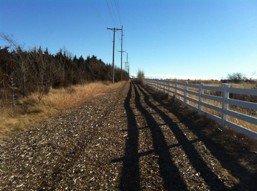  
산책로의 한 부분

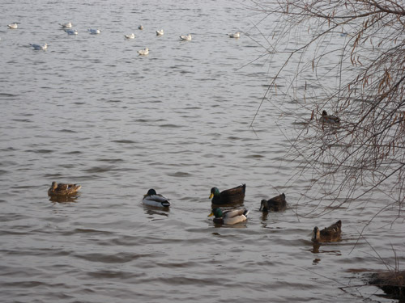  
가끔 산책하던 부머 호수의 오리들

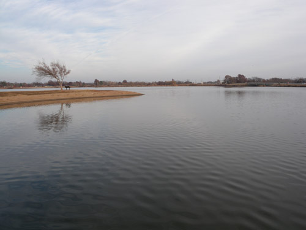  
부머 호수의 서정

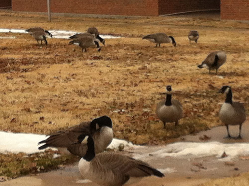  
아파트 뒤켠 풀밭에서 식사하고 있는 기러기들[Canadian Goose]

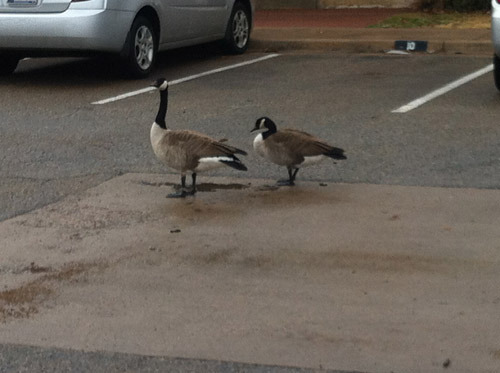   
아파트 주차장까지 진출한 기러기들

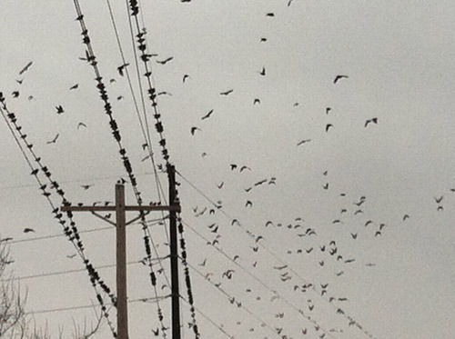  
산책로의 전선을 점령한 새들

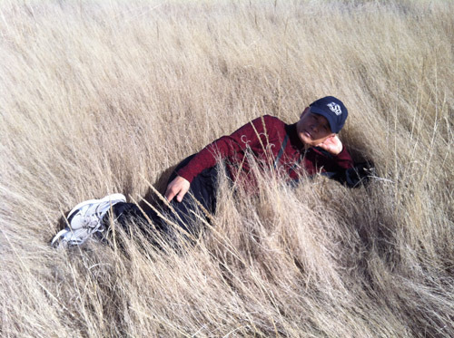  
산책로에서

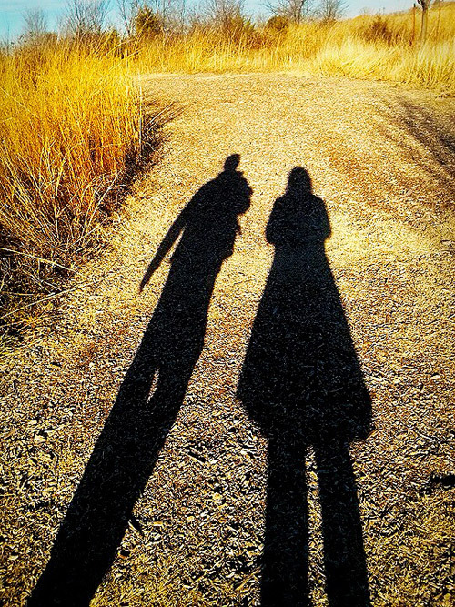  
산책로에서

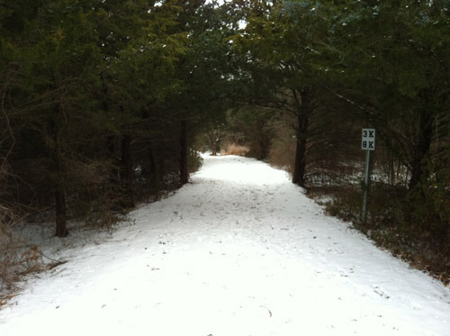  
눈 내린 산책로의 한 부분

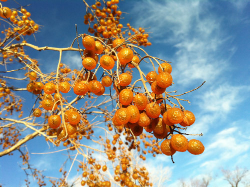  
산책로에서 만난 이름 모를 열매

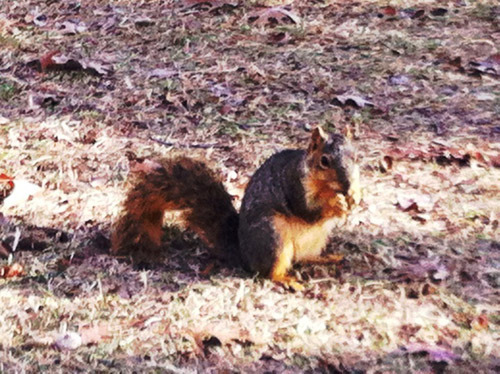  
산책로에서 만난 다람쥐

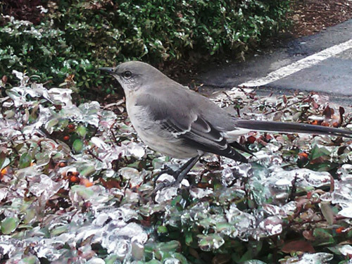  
추운 날 산책길에 만난 이름 모를 새

  
OSU 스포츠의 대명사 풋볼 팀 광고사진

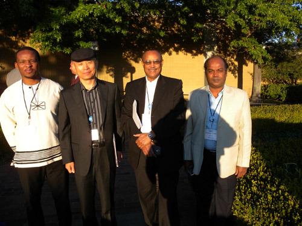  
'2013년도 풀브라이트 강화 세미나[2013 Fulbright Enrichment Seminar]'에 참석한  
 각국의 학자들 중 몇몇과 함께

  
스틸워터 입구에 세워진 표지석

공유하기

게시글 관리

**백규서옥\_Blog ver.**

[저작자표시 비영리 변경금지
(새창열림)](https://creativecommons.org/licenses/by-nc-nd/4.0/deed.ko)