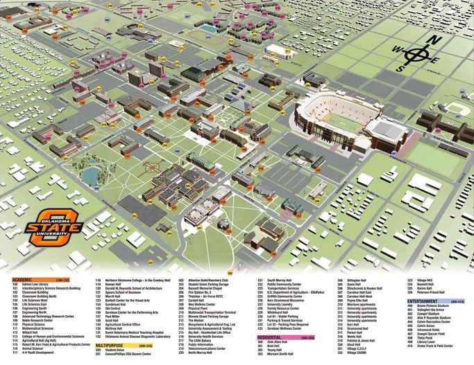  
OSU in Stillwater 캠퍼스 조감도

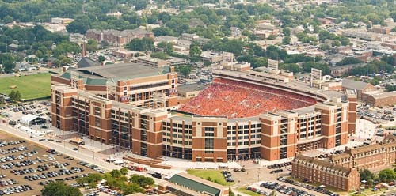  
OSU의 분 피켄스 스테이디엄(Boone Pickens Stadium)

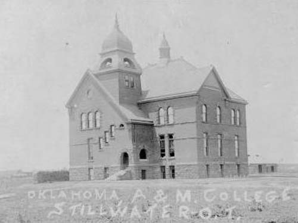  
OSU의 전신인 Oklahoma A&M 건물.   
현재는 OSU의 Honors College로 쓰이고 있음[아래 사진 참조].

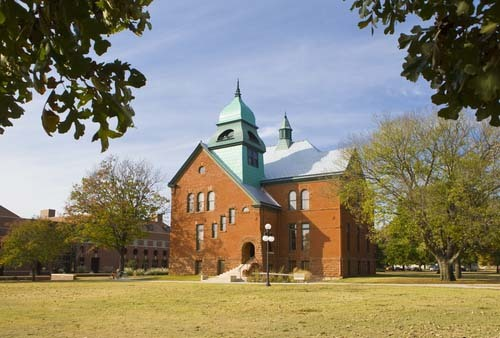  
OSU의 Honors College로 쓰이고 있는 Oklahoma A&M  건물.

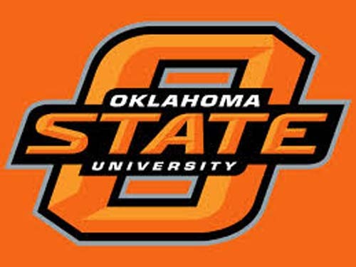  
OSU의 상징 마크

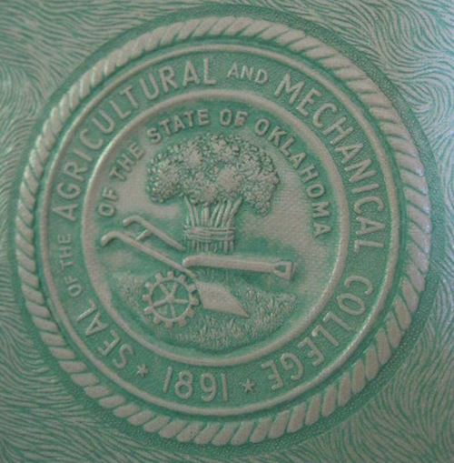  
Oklahoma A&M의 문장(紋章)

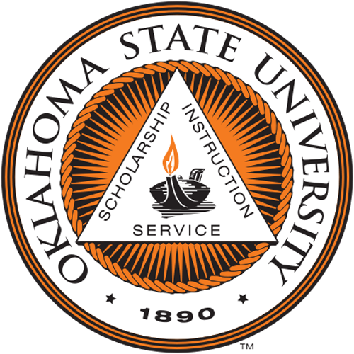  
OSU의 문장

  
OSU의 마스코트인 '피스톨 페테(Pistol Pete)

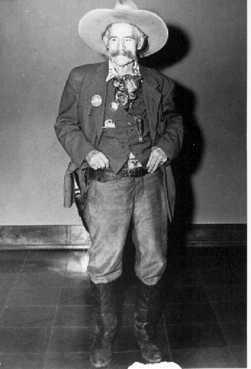  
피스톨 페테의 모델인 프랭크 이튼(Frank Eaton)

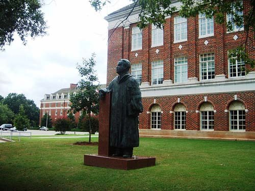  
1928~1950년까지 Oklahoma A&M의 총장을 지낸 베네트(Henry G.Bennett) 박사 동상.   
베네트 총장은 이 대학 발전의 초석을 놓았음.

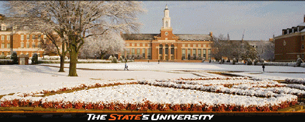  
OSU의 중심에 서 있는 중앙도서관 '에드몬 로우 라이브러리(Edmon Low Library)'의 설경

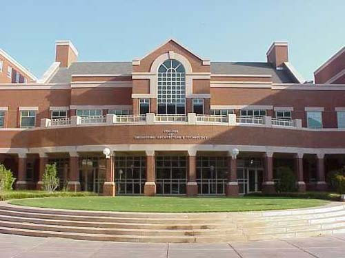  
OSU의 '선진 기술 연구 센터[Advanced Technology Research Center/ATRC]

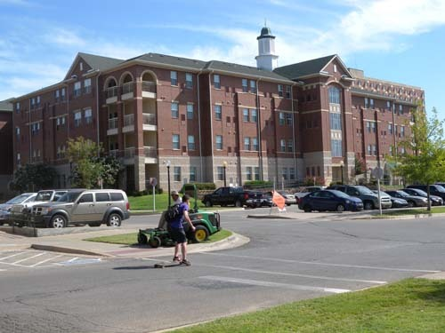  
OSU 캠퍼스의 한 건물

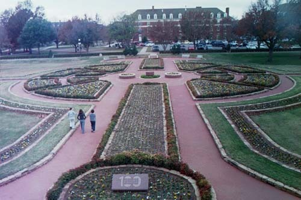  
스튜던트 유니언(Student Union)에서 내려다 본 OSU의 가든

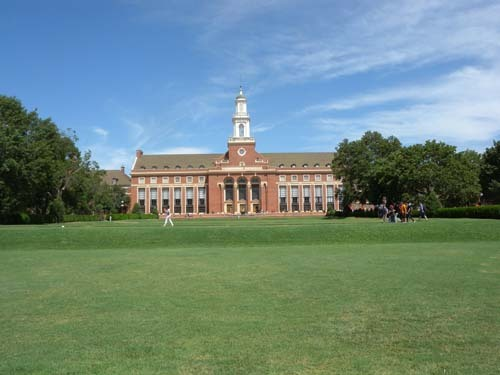  
OSU의 중심에 서 있는 중앙도서관 '에드몬 로우 라이브러리(Edmon Low Library)'의 여름 경치

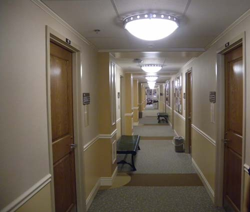  
백규 연구실이 들어 있던 사우스 머레이홀(South Murray Hall)의 복도

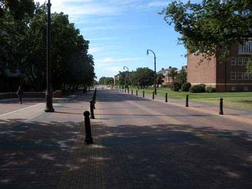  
OSU의 중심을 관통하는 몬로 거리[Monroe Street]

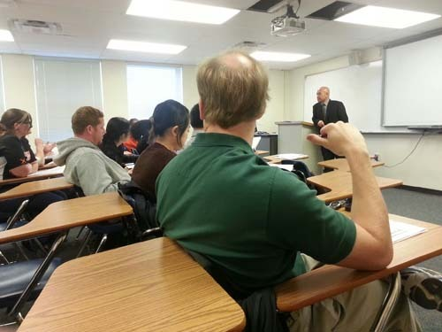  
학부와 대학원생들에게 특강 중인 백규

  
 OSU의 예술과학대학[College of Arts and Science]   
대닐로위츠( [Bret Danilowicz](http://cas.okstate.edu/bios/danilowicz.php))학장과 상면(학장실에서)

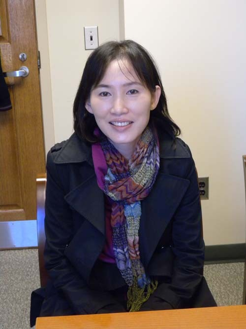  
백규 연구실을 방문한, OSU의 탁월한 한인 교육학 교수 조윤정 박사

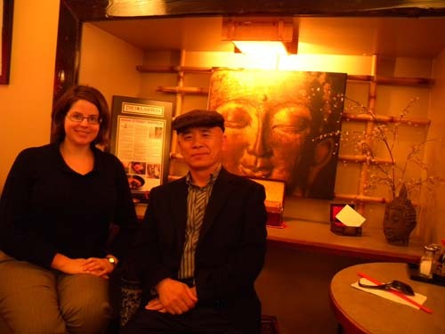  
OSU 인근 다운타운의 레스토랑에서 역사학과의 에멀리[[Graham, Emily]](http://history.okstate.edu/faculty-and-staff/170-dr-emily-graham) 교수와  함께

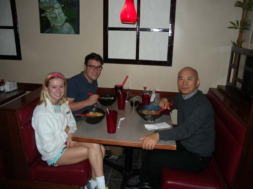  
OSU 역사학과의 반짝이는 두 학생 마켄지(Mackenzie)와 루크(Luke Mccamon)

평원 속 지성의 오아시스, 오클라호마 주립대학교

미국 내에서의 연구기관을 오클라호마 주립대학으로 정했다고 하자, 한국 풀브라이트의 심재옥 단장은 ‘참 잘한 결정’이라고 나를 추어주었다. 미국 내에서 그 학교만큼 친절하고 협조적인 기관도 드물다는 것이었다. 그 말을 듣고 나서야 오클라호마 주와 오클라호마 주립대학에 대해서 눈곱만큼의 사전 정보나 지식도 없었던 나로서는 적이 안심이 되었다.

도착 후 뙤약볕 내려 쪼이는 캠퍼스를 걸어보니, 소떼 노니는 초원인 듯 한없이 넓었다. 방문한 사무실의 직원들도, 교정에서 만나는 학생들도 모두 친절해서 마음이 놓였다. 따가운 햇살만 아니라면 시차로 인해 무거워진 눈꺼풀을 닫은 채 마냥 걷고 싶은 공간이었다. 듬성듬성 세워놓은 갖가지 양식의 건축물들도 고풍스럽고 따스해 보였다. 사우스 머레이홀(South Murray Hall)과 스튜던트 유니온(Student Union) 사이에 있는 쎄타 폰드(Theta Pond). 그 안에서 살아가며 이방인이 나타나도 무서워하지 않고 ‘꽉꽉’ 거리며 다가오는 기러기와 오리들도 정겨웠다. 그렇게 깨끗하고 아름다운 환경, 친절한 인간, 고풍스런 건축물들이 잘 어울려 친근미를 자아내는 OSU에서 꿈같은 한동안을 지내게 된 것이었다.

OSU는 이른바 ‘랜드 그랜트(land-grant), 선 그랜트(sun-grant)’ 대학이었다. ‘랜드 그랜트 대학’이란 ‘정부가 무상으로 제공한 토지에 세운 대학’을 뜻하는 말이다. ‘랜드 그랜트 대학’에 대한 지원은 1862년에 제정된 모릴법[Morrill Acts] 즉 ‘대학에 대한 연방 토지 허여법(許與法)’에 근거한다. 연방이 각 주에서 선출된 상하원 의원 1명당 3만 에이커의 나라 땅을 무상으로 주고, 그 토지 수익의 90%를 농학이나 공학 관련 강좌가 개설되어 있는 주립대학의 발전 기금이나 유지비로 사용할 수 있도록 한 것이 모릴법이다. 1890년과 1907년에는 기존의 모릴법에 의해 지원을 받는 모든 대학들에 의회가 직접 보조금을 교부하는 내용이 추가되기도 했다. ‘선 그랜트 대학’이란 ‘지속 가능하고 환경 친화적인 생태 기반의 대안 에너지를 연구 개발하는 대학’을 뜻한다. ‘선 그랜트 계획’의 지역 중심 역할을 수행하는 다섯 개의 미국 대학들이 모여 ‘선 그랜트 연합’이 결성되었고, 그 연합은 교통부, 에너지부, 농업부 등을 파트너로 삼아 연구•교육 활동을 펼친다. 오클라호마 주립대학을 비롯, 코넬 대학교(Cornell Univ), 오레곤 주립대학교(Oregon St. Univ.), 사우스 다코타 대학교(South Dakotat Univ.), 녹스빌 테네시 대학교(Univ. of Tennessee at Knoxville) 등 다섯 대학들은 각각 ‘선 그랜트’에 기반을 두고 있는 기관들이다.

1890년에 세워졌고, 2012년 기준으로 23,459명의 학생들과 1,857명의 직원을 포함한 OSU는 스틸워터 캠퍼스만 해도 1,489 에이커[6.03㎢]에 이를 만큼 넓다. 캠퍼스 안 어디에서나 피스톨을 찬 카우보이[피스톨 페테(Pistol Pete)]의 사진과 마스코트를 볼 수 있었으며, 풋볼을 비롯한 각종 경기 중에도 피스톨 페테의 분장을 한 사람이 그라운드에 나타나 분위기를 띄우곤 했다. 함께 풋볼을 관람한 제이슨으로부터 피스톨 페테의 연원을 들을 수 있었다. 피스톨 페테는 OSU, 뉴멕시코 주립대학, 와이오밍 대학교가 함께 사용하는 운동경기의 마스코트였다. 피스톨 페테는 프랭크 이튼(Frank Eaton)을 닮은 전통적인 카우보이의 의상과 모자를 착용하고 있는데, 그의 형상이 OSU 카우보이 팀의 마스코트로 쓰이기 시작한 것은 1923부터였다. OSU가 원래 ‘Oklahoma A&M 대학[Oklahoma Territorial Agricultural and Mechanical College]’으로 출발할 때 당시 이 대학의 스포츠 팀은 ‘Agriculturists, Aggies, Farmers’ 등으로 불렸고, 사실 그다지 인기는 없었지만 공식명칭은 ‘Tigers’였다. 그러다가 1923년 경 Oklahoma A&M은 스틸워터의 ‘양떼 행진[Sheep Parade]’을 인도하던 프랭크 이튼(Frank Eaton)을 새로운 마스코트의 모델로 삼아 기존의 호랑이 마스코트를 바꾸게 되었다는 것이다. 그렇게 1923년부터 프랭크 이튼은 Oklahoma A&M의 마스코트로 계속 쓰였으나, 1958년에 이르러서야 OSU는 이것을 공식적인 상징으로 인정했다 한다.

1860년 코네티컷 주에서 태어나 캔자스로 이주한 프랭크 이튼은 여덟 살에 아버지를 잃었다. 당시 자경단원이었던 그의 아버지가 남북전쟁 당시 남부 연합군 소속의 잔당 6명에 의해 맥주 집에서 저격당한 것이었다. 그 후 아버지 친구의 충고에 따라 열심히 권총사격 연습을 하여 결국 원수를 갚았고, 그 후로부터 그의 영웅적 행적은 전설로 남게 되었다고 한다.

피스톨 페테의 모습이 가장 강렬하게 등장하는 이벤트는 스포츠 경기들과, 홈커밍[OSU’s Homecoming Celebration]을 포함한 각종 축제들이었다. 9월부터 시작되는 1학기 초부터 기숙사별로 학생들이 단결하여 홈커밍을 준비하는 모습을 볼 수 있었다. 프래터너티(fraternity)와 소라러티(sorority) 즉 남녀 사생(舍生)들이 기숙사별로 모여 아이디어를 내고 기숙사 안팎을 치장하는 등 화려한 축제를 통해 그들의 단결심을 고취하고, 그런 유대관계는 졸업 후에도 끈끈하게 지속되는 것 같았다. 이러한 홈커밍데이의 전통과 함께 OSU는 놀랄만한 스포츠 유산들을 보유하고 있었고, 대부분의 학생들은 그 점에도 큰 자부심을 갖고 있었다. 시즌 중 거의 매 주말은 ‘게임 데이(game day)’였고, 하루 전부터 재학생•동문•주민들이 경기장에 총출동하다시피 함으로써 평소에 조용하던 시가지는 아연 활기를 띠곤 했다.

게임데이는 실질적으로 ‘스틸워터의 도시축제’인 셈이었다. 7만 명을 수용하는 ‘분 피켄스 스테이디엄(Boone Pickens Stadium)’은 그야말로 입추의 여지가 없을 정도였고, 응원의 함성으로 천지가 진동하는 듯 했으며, 캠퍼스 안의 잔디밭과 도로변의 공터는 외지에서 온 관객과 응원단의 텐트촌으로 바뀌곤 했다. 거대한 RV(Recreational Vehicle)들과 관객들의 승용차가 시내 공용 주차장들을 점령하고, 주차장으로부터 경기장까지는 무료 셔틀버스들이 수시로 왕래했다. 이처럼 풋볼, 농구, 여자 축구, 야구, 레슬링, 테니스, 크로스컨트리 등 다양한 종목의 스포츠들이 캠퍼스 안에서 활발한 모습으로 공존하고 있었다.

OSU 스포츠의 대단한 모습은 대외적인 경기력 뿐 아니라 일반 학생들을 위한 생활스포츠에서도 두드러진다. 51개의 국내 선수권 챔피언십을 보유하고 있는 사실은 무엇보다 돋보이는 점이었다. 많은 챔피언십 보유 순위에서 OSU는 미국 대학 경기 연맹[NCAA: National Collegiate Athletic Association]의 최상위 그룹인 1그룹[Division 1]의 351개 대학들 중 4위에 속하고, 아이오와•캔자스•오클라호마•텍사스•웨스트 버지니아 주를 포괄하는 ‘빅 12 경기 협의회[Big 12 Conference]’ 소속의 10개 대학들 중에서는 1위에 속한다. 

그 뿐 아니라 캠퍼스 한 쪽에 서 있는 ‘국립 레슬링 명예의 전당 박물관[National Wrestling Hall of Fame and Museum]’은 미국 전역에서 배출된 역대 레슬링 선수들의 모든 것들을 보여주고 있었는데, 링컨도 루즈벨트도 슈워츠코프도 레슬링 선수출신이라는 사실을 이곳에서 비로소 알게 되었다. 이 명예의 전당은 단순히 ‘힘깨나 쓰는 장사’로 사람들의 입에 오르내리다가 잊히는 한국과 달리 오래도록 명예가 드높여지고 보존되는 미국의 힘과 지혜를 느낄 수 있는 공간이었다. 그러나 OSU 스포츠의 장점이 스타플레이어들의 ‘엘리트 스포츠 종목’에만 있는 것은 아니었다. 구성원들의 건강관리와 유지를 위해 세운 종합 스포츠관인 콜빈 센터와 세레티안 웰니스 센터, 크로스 컨트리 경기장, 잔디 축구장, 테니스장 등이 캠퍼스 안 곳곳에 설치되어 있는 스포츠 공간들은 대중 스포츠의 현장이었다. 구성원이면 누구나 이용할 수 있는 이런 시설들은 대학이 엘리트 스포츠 아닌 대중 스포츠에 투자를 많이 하고 있음을 보여 주는 증거들이었다.

1890년 12월 25일 오클라호마 의회가 모릴법에 의거하여 개교한 ‘오클라호마 지역 A&M 대학’은 개교 이래, 많은 변화와 발전들을 거쳐 1957년 5월 15일 오클라호마 주립대학[Oklahoma State University]으로 변신했고, 스틸워터를 그 본거지로 삼게 되었다. 그 과정에서 스틸워터 이외에 ‘OSU-오크멀기 기술연구소[OSU-Institute of Technology in Okmulgee]’(1946), ‘OSU-오클라호마 시티[OSU-Oklahoma City]’(1961), ‘OSU-털사[OSU-Tulsa]’(1984), ‘OSU-건강연구소, 털사[OSU-the Center for Health Sciences-Tulsa]’(1988) 등의 분교들을 거느리게 됨으로써 명실상부한 이 지역의 대표 대학으로 자리 잡게 된 것이다.

스틸워터의 OSU 캠퍼스는 ‘농업과학과 자연자원 대학[College Science and Natural Resource(CASNR)/농업경제학(Agricultural Economics), 농업경영학(Agribusiness) 등 16개 전공]’, ‘예술과학대학[College of Arts and Science(CAS)/영어(English), 역사(History) 등 24개 학과]’, ‘교육대학[College of Education(COE)/초등교육(Elementary Education), 직업기술교육(Career and Technical Education) 등 29개 프로그램]’, ‘공학•건축•기술대학[College of Engineering, Architecture, and Technology(CEAT)/소방안전기술(Fire Protection and Safety Technology), 산업공학과 경영학부(School of Industrial Engineering and Management) 등 13개 학부]’, ‘인문대학[College of Human Sciences(HS)/디자인학과(Department of Design), 호텔 식당경영학부(School of Hotel and Restaurant Administration) 등 4개 학과]’, ‘스피어스 경영학부[Spears School of Business/금융학과(Department of Finance), 마케팅학과(Department of Marketing) 등 7개 학과]’ 등 6개 대학 200여 전공으로 구성되어 있다.

스틸워터의 전체면적은 73.3㎢였고, 그 중 다운타운의 면적은 ⅓이 채 안 되는 듯 했으며, 6.03㎢에 달하는 OSU는 다운타운으로 감싸인 방사형의 구조를 이루고 있었다. 현실적으로 미국 내 대학들 가운데 OSU의 서열이 어떠하든, 동부나 서부의 전통적인 명문대학들과 비교하여 그 수준이 어떠하든, 스틸워터를 비롯한 오클라호마 주민들은 정말로 OSU에 대한 자부심을 갖고 있는 점이 이채롭고 감동적이었다. 서울과 지방 대학들 간의 서열을 따지고, 같은 지역 안에서도 대학 간의 서열을 따지며, 같은 대학 내에서도 학과 간의 서열을 따지며 차별하는 우리나라의 현실과 비교하면 참으로 놀라운 일이었다. 그들에게 OSU는 오클라호마를 대표하는, ‘우리 대학’이라는 의식이 강했다. 아름답고 깨끗한 자연 속에 평화로운 모습으로 늘어서 있는, 나지막하고 고풍스런 건물들이 OSU 캠퍼스의 역사와 문화를 보여주고 있었다. 밤을 새워가며 공부하고, 가끔 체육관으로 몰려가 ‘Go Pokes!’를 목청껏 외치며 OSU Cowboys들을 응원하는 세계의 수재들이 그 공간에 열기를 불어넣고 있었다. OSU에 머물며 미국 대학들의 경쟁력과, 그로부터 나오는 미국의 힘을 실감하게 된 것도 그 때문이다.

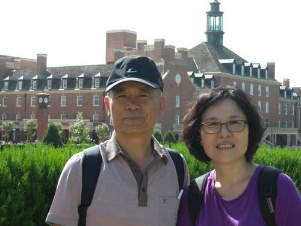  
미국에 막 도착하여 뙤약볕 아래 캠퍼스를 돌아보는 백규와 멜라니

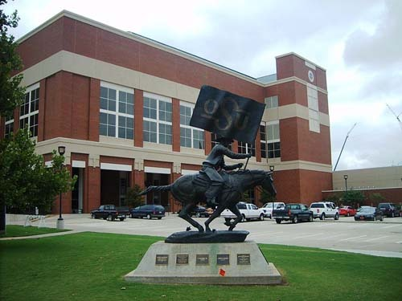  
OSU 갤러거 아이바 경기장[Gallagher Iba Arena] 앞에 서 있는 'OSU Spirit Rider'

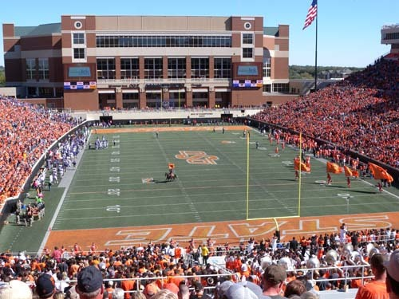  
풋볼 경기 중 OSU가 한 점을 얻자 말을 탄 카우걸과 응원단이 경기장에 나온 모습  
[Boone Pickens Stadium]

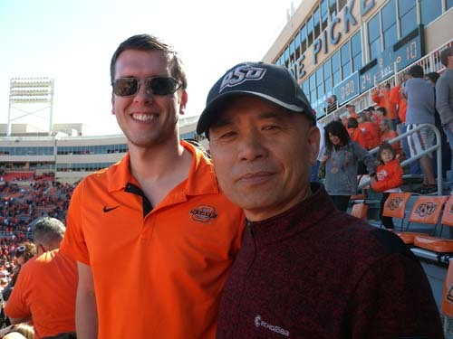  
풋볼 경기를 관람하는 제이슨(Jason Culp)과 백규

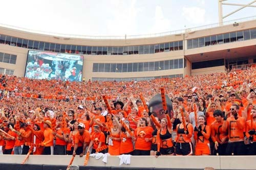  
풋볼 경기장에서 OSU를 응원하는 학생 응원단

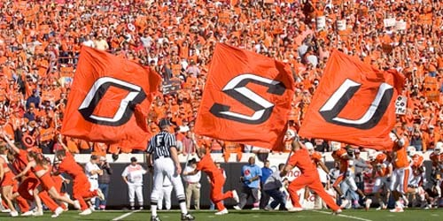  
풋볼 경기에서 OSU가 선취점을 올리자 기뻐 뛰쳐나온 응원단

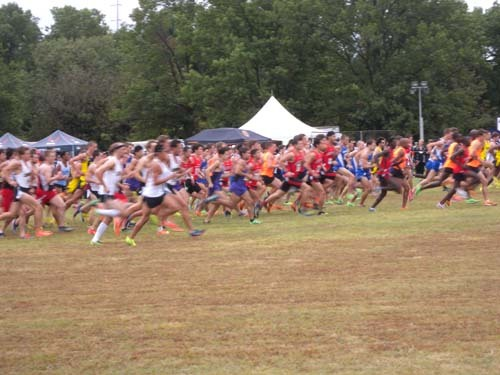  
크로스 컨트리 경기장에서 힘차게 출발하는 선수들

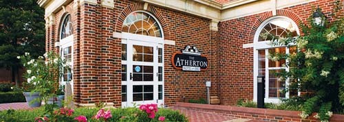  
OSU에서 운영하는 캠퍼스 내의 호텔 Atherton

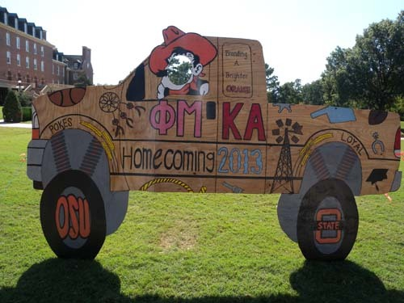  
홈커밍 행사의 일환으로 학생들이 만들어 전시하는 홍보판

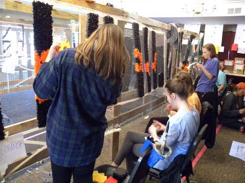  
홈커밍 행사에 전시할 기숙사 장식물들을 합동으로 제작하고 있는 여학생들[sororities]

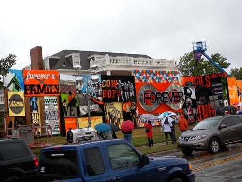  
기숙사생들 스스로 한 학기 동안 기획하여 제작한 장식물을 기숙사 전면에 부착한 모습.   
많은 일반인들이 이것을 구경하기 위해 캠퍼스를 찾는다.

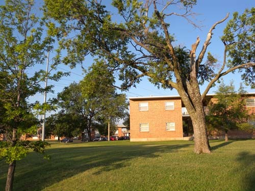"  
OSU 캠퍼스 내의 아파트[101 윌리엄스]

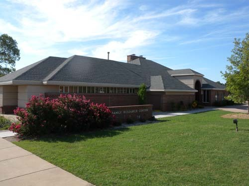  
OSU 아파트를 관리하는 사무실 건물[Famil Resource Center/FRC]

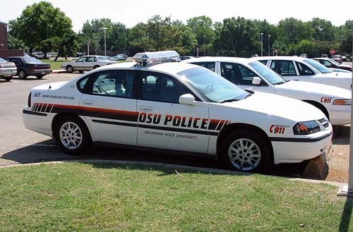  
대학 내의 치안을 담당하는 OSU 대학 경찰서 순찰차량들

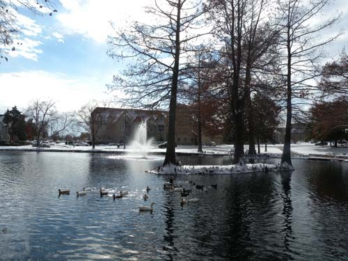  
겨울을 맞은 OSU 쎄타폰드(Theta Pond)

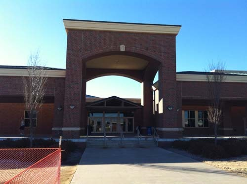  
학생들이 언제나 찾아 체력을 단련하는 콜빈 레크리에이션 센타(Colvin Recreation Center)

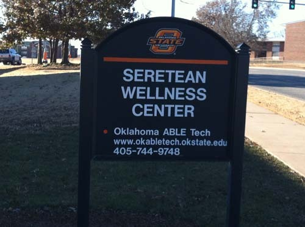  
학생들의 체력과 건강 증진을 위해 건립된 '세레티안 웰니스 센터' 입간판

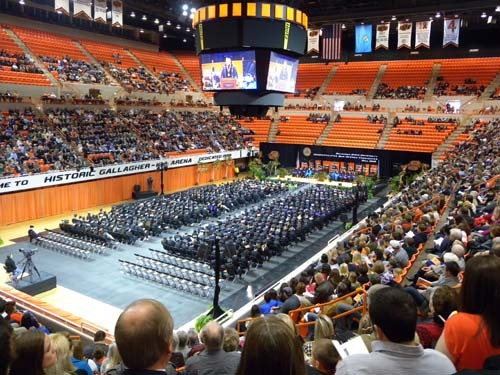  
갤러거 아이바 아레나에서 갖는 후기 졸업식의 한 부분

공유하기

게시글 관리

**백규서옥\_Blog ver.**

[저작자표시 비영리 변경금지
(새창열림)](https://creativecommons.org/licenses/by-nc-nd/4.0/deed.ko)