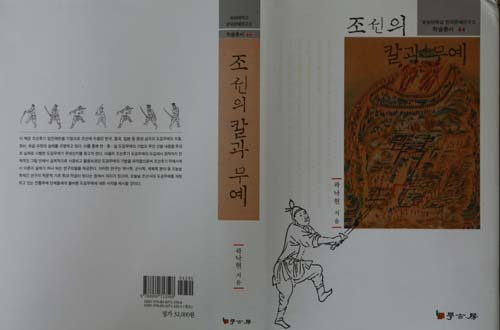

  
도검무예에 대한 대중의 관심을 불러 일으킨 저서

  
자신의 서재에서 곽낙현 박사

칼과 무예의 학문적 재조명을 통해 구체화된 ‘도검무예(刀劍武藝)’의 존재

-곽낙현 박사, <<조선의 칼과 무예>>를 한국문예연구소 학술총서 44로 발간-

곽낙현 박사(한국학중앙연구원 자료정보화실 전임연구원)가 조선의 칼과 무예를 학문적으로 분석하여 <<조선의 칼과 무예>>(학고방)를 한국문예연구소 학술총서 44로 발간했다.

곽박사는 이 책에서 ‘임진왜란 이후/18세기/18세기 이후’로 나누어 도검무예의 수용으로부터 보급에 이르는 전 과정을 소상히 살폈다. 임진왜란 이전의 도검이 갖는 의미나 역할, 임진왜란을 계기로 도검무예가 도입되고 수용된 양상, 임진왜란 이후 변화해간 도검무예의 추이나 변화를 논한 것이 첫 부분이고, <<무예도보통지(武藝圖譜通志)>>의 내용을 바탕으로 18세기 도검무예의 정비나 기법을 상세히 분석한 것이 둘째 부분이며, <<대전통편>>•<<만기요람>>•<<어영청중순등록>>•<<장용영고사>> 등에 나오는 도검무예를 분석한 것이 셋째 부분이다. 특히 정조 14년(1790)에 간행된 <<무예도보통지(武藝圖譜通志)>>의 도검무예 가운데 10기[쌍수도, 예도, 왜검, 왜검교전, 제독검, 본국검, 쌍검, 월도, 협도, 등패]를 중점적으로 수용하고 표준화하여 기법적 특징을 분석, 제시한 내용은 이 책의 핵심적 내용이라 할 수 있다. 치밀한 분석과 정치한 논리전개 뿐 아니라 많은 사진과 도표를 많이 활용한 점은 이 책이 지닌 장점들이다.

역사학, 군사학, 체육학 등 서로 다른 분야들의 통섭적 입장에서 조선의 도검무예를 조명해낸 이 책은 이론와 실제가 절묘하게 융합된 모습을 보여준다. 무엇보다 저자 본인이 검도를 비롯한 무도의 고단자로서 ‘도검무예’의 이론적 토대를 마련했다는 점은 이 책의 의미와 가치를 더욱 높여주는 일이기도 하다. 이 책의 목차는 다음과 같다.

제1장 임진왜란 이후 도검무예의 수용과 추이

1절 임진왜란 이전 도검의 역할

1. 전술체계와 단병무예

2. 근접전 전투방식에서 도검의 역할

2절 임진왜란 중 도검무예의 도입과 수용

1. 단병전술과 도검무예의 도입

2. <<무예제보>> 편찬과 도검무예 수용

3절 17세기 이후 도검무예의 추이와 변화

1. <<무예제보번역속집>>의 도검무예

2. 김체건과 왜검의 추이

제2장 18세기 도검무예의 정비와 실제

1절 <<무예도보통지>> 편찬과 도검무예 정비

1. <<무예도보통지>> 24기 구성과 내용

2. 도검무예의 ‘세(勢)’

2절 도검무예의 실제

1. 쌍수도

2. 예도

3. 왜검

4. 왜검교전

5. 제독검

6. 본국검

7. 쌍검

8. 월도

9. 협도

10. 등패

3절 도검무예에 나타난 기법의 특징

제3장 18세기 이후 도검무예 보급과 실태

1절 도검무예 관련 시취규정

1. <<대전통편>>의 도검무예

2. <<만기요람>>의 도검무예

2절 도검무예 관련 군영등록

1. <<어영청중순등록>>의 도검무예

2. <<장용영고사>>의 도검무예

3절 도검무예의 특성과 의의

한국의 칼, 전통무예, 군제사, 전통문화 등에 관심 있는 분들의 일독을 권한다.

숭실대학교 한국문예연구소 학술총서 44, <<조선의 칼과 무예>>, 학고방, 2014.

공유하기

게시글 관리

**백규서옥\_Blog ver.**

[저작자표시 비영리 변경금지
(새창열림)](https://creativecommons.org/licenses/by-nc-nd/4.0/deed.ko)