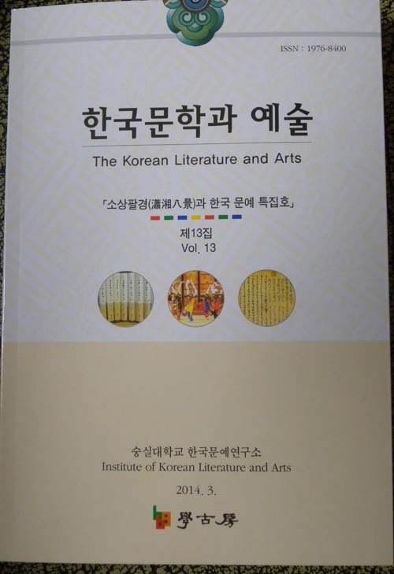
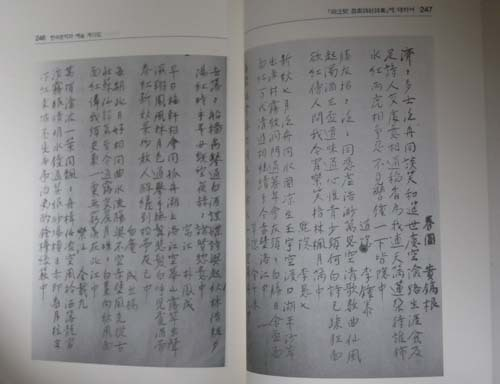

<<한국문학과 예술>> 13집을 “소상팔경(瀟湘八景) 특집호”로 발간!

저희 한국문예연구소에서 <<한국문학과 예술>> 창간호를 발간한 것은 2008년 3월 31일이었습니다. 그로부터 3월 말, 9월 말 등 매년 2권씩의 논문집을 발간하여 지난 3월말 드디어 13호를 펴내게 되었습니다. 그동안 우여곡절이 많았고 시련도 적지 않았습니다만, 논문 필자들의 성의와 기대를 제외한 아무런 도움도 없이 13호 논문집을 내게 된 점에 대하여 자부심을 갖고 있습니다. 그동안 발간한 논문집들에는 주목할 만한 논문들이 꽤 여러 편 발표된 바 있습니다. 매년 2회의 연구소 학술발표대회를 통해 우리 문학과 예술 분야에서 꼭 짚어야 할 문제들을 다루었고, 그 발표논문들을 다듬어 특집호로 <<한국문학과 예술>>을 발간해 왔기 때문에, 우리는 ‘초점 있는 논문집’을 학계에 선보일 수 있었던 것입니다.

<<한국문학과 예술>>의 특징은 ‘특집논문들, 자유주제 논문들, 학•예술도서 서평, 자료 원문 및 해제’ 등으로 내용이 편성된다는 점입니다. 그 점은 이번 호에는 마찬가집니다. 내용을 제시하면 다음과 같습니다.

●논문

1. 소상팔경: 동아시아 공통 모티프의 문화형상/衣若芬(싱가폴 남양이공대 교수)

2. 소상팔경 수용과 한국팔경시의 유행 양상/안장리(한국학중앙연구원 선임연구원)

3. 한국 소상팔경시의 儒家 성향 연구/전유재(숭실대학교 문학박사)

4. 한•중 소상팔경도의 조형성과 표상 비교-‘소상야우’를 중심으로/송희경(이화여

대 한국문화연구원 연구교수)

5. 소상팔경의 한국 전통성악사적 전개/김인숙(서울대학교 국악학과 강사)

●서평

1. 낯선 존재와 조우하는 사유의 여정-<<해석의 권리>>(엄경희, 까만양, 2013)를 읽

고/박선영(서울신학대 교양학부 교수)

2. 맥락이 증발한 폭력에 대한 재맥락화-<<야만적인 앨리스 씨>>(황정은, 문학동네,

2013)를 읽고/허명숙(숭실대 교육대학원 겸임교수)

3. 흥관군원(興觀群怨)의 파노라마-<<내가 좋아하는 한시>>(민병수•김성언 외, 태학

사, 2013)를 읽고/양훈식(숭실대 국어국문학과 강사)

●자료해제

<<동범계(同泛契) 창남시사(昌南詩社) 시집(詩集)>>에 대하여/조규익(숭실대 교수)

강호 제현의 많은 관심과 지원 부탁드립니다.

2014. 4. 16.

한국문예연구소 소장 조규익 드림

공유하기

게시글 관리

**백규서옥\_Blog ver.**

[저작자표시 비영리 변경금지
(새창열림)](https://creativecommons.org/licenses/by-nc-nd/4.0/deed.ko)