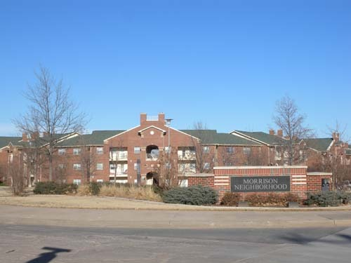
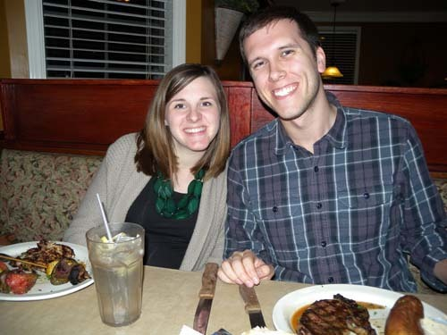

  
제이슨 가족이 살고 있는 대학 아파트[Morrison]

  
제이슨 부부와 함께 저녁 식사 중에[Freddy Paul's에서]

  
식사 후 제이슨 가족과 함께

  
제이슨 집을 방문하여 그의 아들 그레이선[Grayson]과 함깨

탁월한 젊은 영어 교육자, 제이슨 컬프(Jason Culp)

2013년 8월 27일 저녁. 이미 어둑발이 내리기 시작한 저녁 일곱 시쯤 숙소인 대학 아파트 ‘윌리엄스[Williams]’에 도착했다. 평화로운 초원 위에 조용히 앉아 있는, 그림 같은 아파트였다. 아파트 관리소 FRC[Family Resources Center]의 사무실을 찾아가니 훤칠한 ‘훈남’ 한 사람이 친절하게 우리를 안내했다. 나중에 그가 우리 아파트의 위층에 사는 OSU 대학원생 제이슨임을 알게 되었다. 그는 초등학교 교사인 아내와 함께 그 아파트에 살며 FRC에서 파트 타임으로 일하고 있었다.

제이슨과의 인터뷰

우리는 종종 그를 만났다. 아파트에 문제가 생겨도, 우편물이나 택배 수령에 문제가 있어도, 우리는 그를 불렀다. 학교에서도 내 연구실에서도 나는 그와 자주 만나 스스럼없이 대화를 나누는 사이가 되었다. 실제 나이를 가늠할 수 없는 게 미국인들인데, 나이 차이에도 불구하고 동등한 입장에서 교제할 수 있는 상대가 미국인들이기도 했다. 그와 친구로 만나면서 나는 자연스럽게 한국문화와 한국인들의 삶을 말해주었고, 그는 그간 우리가 모르고 있던 남부 미국인들의 삶과 의식(意識)을 설명해주었다.

그와 만나는 과정에서 그가 TESOL[Teaching English to Speakers of Other Language/외국어 사용자들을 위한 영어 교육]을 전공한다는 사실을 알게 되었고, 그의 영어가 매우 명료하면서도 정확하다는 점을 깨닫게 되었다. 한국 사람들이라고 모두 표준 한국말을 ‘명료하고 정확하게’ 구사하지는 못하듯, 미국 사람들이라고 모두 표준 영어를 구사하지는 못한다는 사실을 나는 이미 알고 있었다. 영어만으로 분류할 경우 미국에서 만난 미국인들은 대충 네 부류로 나뉘었다. 짤막하면서도 느릿느릿한 영어로 상대방을 편안하게 해 주는 어른들, 진한 사투리 억양으로 상대방을 갸웃거리게 만드는 사람들, 입에 오토바이 엔진을 단 듯 숨넘어가게 지껄여대는 학생들과 젊은이들, 제이슨처럼 교과서적인 영어로 호감을 주는 소수의 지식인들. 가끔 방송에서 목격하는 오바마 대통령, 전 국무장관 힐러리 클린턴, 현 백악관 대변인과 미 국무성 대변인 등의 대중 스피치를 통해 미국 지도자들이나 상류층의 덕목 가운데 ‘언어의 명료성과 모범성’이 큰 자리를 차지한다는 사실을 알게 되었고, 제이슨에게서 그런 스피치의 전형을 확인하게 된 것이었다.

지금 한국에는 많은 원어민 영어교사들이 활약하고 있다. 모두 훌륭한 자질을 갖춘 사람들이지만, 각기 다른 그들의 특징과 개성을 뛰어 넘는 ‘표준성과 모범성’을 제이슨에게서 발견했다. 흡사 입술과 내면에 부드러운 모터(motor)를 달아놓은 듯, 그에게선 늘 명료하고 기분 좋은 영어가 솔솔 흘러나오는 것이었다. ‘이런 사람이 우리나라의 대학이나 공공기관에서 한국인들에게 영어를 가르칠 수만 있다면 얼마나 좋을까?’하는 생각을 늘 갖게 하는 그였다. 그 역시 한국 같은 나라에 나가 영어를 가르칠 수 있기를 바라는, 간절한 마음을 갖고 있었다.

\*\*\*

제이슨 부부와 식사를 함께 한다거나 차를 마시면서, 풋볼 경기를 관람하면서, 새로 태어난 아기를 축하하기 위해 그의 집을 방문하면서, 우리는 서로의 사이에 개재하는 문화의 차이를 초월하여 상통하는 동질성을 발견할 수 있었다. 다름을 넘어 같음을 확인할 수 있게 하는 힘은 바로 언어였다. 대화를 통해 서로의 다름을 ‘평평하게 만드는 것’이 바로 소통의 힘이었다. 우리는 그와 그의 가족을 만나면서 미국 체류 기간 내내 행복했다. 타향에서 마음을 주고받을 수 있는 친구가 이웃에 살고 있는 것처럼 든든한 일이 어디에 있을까. 비록 우리에 비해 나이는 어렸지만, 지구촌에 대하여 그가 갖고 있던 식견만은 어느 기성세대보다 월등했다. 그리고 글로벌화 된 세계에서 좀 더 멋진 삶을 살기 위해 우리가 갖추어야 할 조건들은 무엇인지 분명히 깨닫게 해준 그였다. 조만간 한국에서 그를 만날 수 있게 되길 기대하면서, 그들과의 행복했던 몇 개월을 회상해보는 요즈음이다.

공유하기

게시글 관리

**백규서옥\_Blog ver.**

[저작자표시 비영리 변경금지
(새창열림)](https://creativecommons.org/licenses/by-nc-nd/4.0/deed.ko)