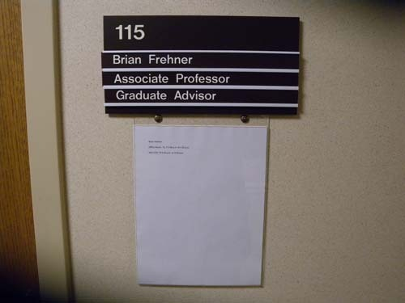
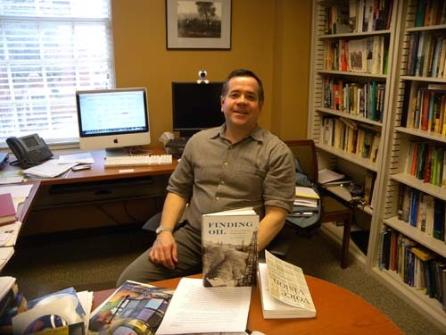
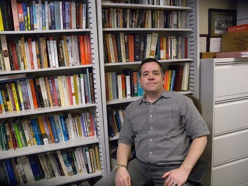
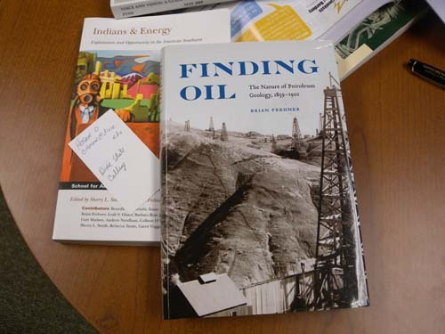

  
연구실에서, 프레너 교수

  
연구실에서, 프레너 교수

  
최근에 발간된 그의 책들

역사학의 새로운 분야를 개척해온 프레너 교수

올해 2월로 접어든 어느 날 오후. 미소가 멋진 중년 신사 한 분이 연구실 문을 두드렸다. 자신을 ‘역사학과의 프레너 교수’라고 소개했지만, 처음 보는 인물이었다. 알고 본즉 그는 지난 해 연구년으로 학교를 비운 상태였고, 나는 작년 8월에서야 OSU에 입성했기에 만날 기회가 없었던 것이다. ‘풀브라이트 방문학자’라는 내 연구실의 문패에 호기심을 가진 것 같았는데, 말을 나누는 도중 내가 한국에서 왔다고 하니 더욱 큰 흥미를 갖는 것이었다. 떠날 날에 임박해서야 만난 점에 대하여 그 또한 애석해 했다.

그러나 무엇보다 내가 그에게 흥미를 느낀 것은 그의 전공이었다. 그의 말을 듣고 나서 나름대로 생각해보니, 그의 전공은 크게 보아 ‘에너지사(史)’, 좁히면 ‘에너지 개발 및 이용사’, 더 좁히면 ‘에너지 개발과 그것을 둘러싼 환경 등 사회문제사’로 정리될 수 있을 것 같았다. 그러고 보면 그의 전공은 오클라호마주에서 매우 중요한 의미를 갖고 있었다. 비록 강제이주를 당한 처지였지만, 주로 인디언들이 차지하고 있는 대평원 오클라호마 주는 어딜 가나 원유와 천연가스가 생산되는 천혜의 땅이었다. 오클라호마 번영의 역사는 석유 등 천연자원 개발과 맥을 같이 해왔다고 할 수 있다.

그런 문제들을 역사학의 관점에서 다루는 학자가 있으리라고는 꿈에도 생각지 못한 나였다. 그저 ‘한국사/동양사/서양사’ 혹은 ‘고대사/중세사/근•현대사’ 쯤으로 나누어 연구하고 가르치는 게 전부라고 생각해온 것이 한국의 역사학계나 내 의식 수준의 현주소였던 것이다. 물론 어느 분야든 역사가 있기 마련이고, 역사학으로 수렴되는 모든 부분들이 인문학의 범주일 것은 분명하지만, ‘에너지 개발의 역사’가 어엿한 학문 테마로 정립해 있으리라고는 전혀 예상하지 못한 나였다. 그렇게 프레너 교수[Dr. Brian Frehner]를 OSU의 한켠에서 만나게 되었다.

프레너 교수와의 인터뷰

그의 학문적 관심을 정확히 짚어내어 나열하면, ‘1860년~1945년 미국/미국의 서부/환경/기술/공공분야’로 집약될 수 있다. 그는 UCLA에서 학부를, 라스베가스의 네바다 대학에서 석사학위를, OSU에서 박사학위를 받았는데, 그 매력적인 박사학위 논문의 테마가 바로 “크리칼러지(Creekology)[즉 ‘석유 탐사학’]에서 지질학(Geology)으로: 1860년~1930년까지 남부 대평원에서의 석유 탐사와 보호”였다. 캘리포니아에서 출발하여 애리조나를 거쳐 오클라호마에 정착을 본 그의 지적 탐구 여행이야말로 흡사 대평원에서 석유를 탐사하듯 진행되어 온 것이나 아닐까.

얼마나 많은 역사학의 테마들이 존재해왔고, 앞으로 얼마나 많은 역사학의 새로운 테마들이 개발될 것인가. ‘역사란 본질적으로 과거의 사건을 현재의 눈과 관점으로 보는데서 성립하며 역사가의 임무는 기록이 아닌 가치의 재평가에 있다’는 크로체의 생각을 사건들의 해석이나 역사기술의 대전제로 삼은 E.H. Carr가 자신 있게 내세운 것처럼 ‘역사란 역사가와 사실 사이의 상호작용의 부단한 과정이며 현재와 과거 사이의 끊임없는 대화’라고 한다면, 역사학이란 앞으로도 지식사회의 마를 수 없는 오아시스일 수밖에 없지 않겠는가.

프레너 교수는 흡사 살아있는 현장에서 꿈틀거리는 노다지를 잡은 사람처럼 보였다. 버팔로 떼가 밀고 지나가는 대초원의 한복판에서 석유채굴기가 끄덕거리며 기름을 퍼 올리는 오클라호마의 풍경을 보면서도 그에 관한 역사적 상상력을 펼치지 않을 역사학도나 인문학도는 없으리라. 그런 점에서 프레너 교수는 자부심 강한 행운아였다.

그는 최근 들어 <<석유의 발견: 1859-1920 석유 지질학의 본질>>, <<인디언과 에너지: 미국 남서부의 개발과 기회>>, <<라스 베가스에서 쥬스 짜기: 미국 소도시의 성장에 대한 소견들>> 등 주목할 만한 저서들과 많은 논문들을 발표함으로써 학계의 주목을 받아온, 탁월한 학자였다. 그런 업적들을 바탕으로 여러 건의 학술상과 연구비 수혜를 받았으며, 많은 학생들이 그를 따라 면학의 열기를 분출하고 있었다.

프레너 교수를 만나 이런 저런 이야기들을 나누면서 이제 우리도 화석처럼 굳어진 대학의 전공체계를 유연화시켜 시의적절하고 지역 친화적인 분야들을 연구하고 강의하는 체제로 바꿀 필요가 있음을 비로소 깨닫게 되었다. 우리가 언제부터 20세기 중반에 구축한 패러다임을 21세기 한복판으로까지 지속시키려는 배짱을 갖고 있는지 알 수가 없다. 학자들은 입만 열면 ‘전공영역의 정체성[identity]’을 강조하지만, 그건 강한 ‘울타리에 대한 집착이나 미련’에 불과하다는 점을 프레너 교수를 만나면서 깨닫게 되었다. 바야흐로 ‘다원화되고 있는 우리네 삶을 어떻게 학문체계 속으로 끌어들일 수 있을까’를 고민할 때가 된 것이다.

공유하기

게시글 관리

**백규서옥\_Blog ver.**

[저작자표시 비영리 변경금지
(새창열림)](https://creativecommons.org/licenses/by-nc-nd/4.0/deed.ko)