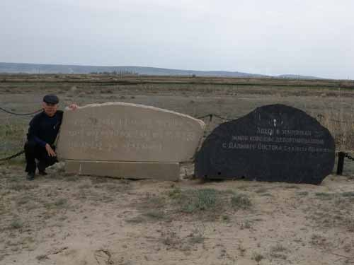
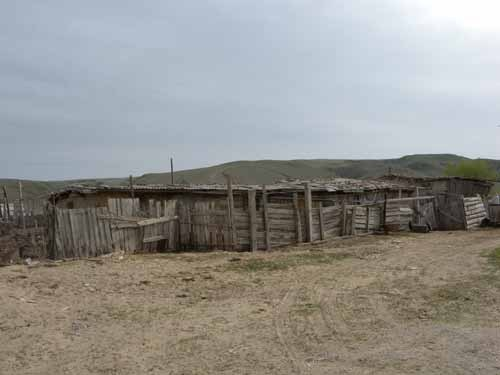
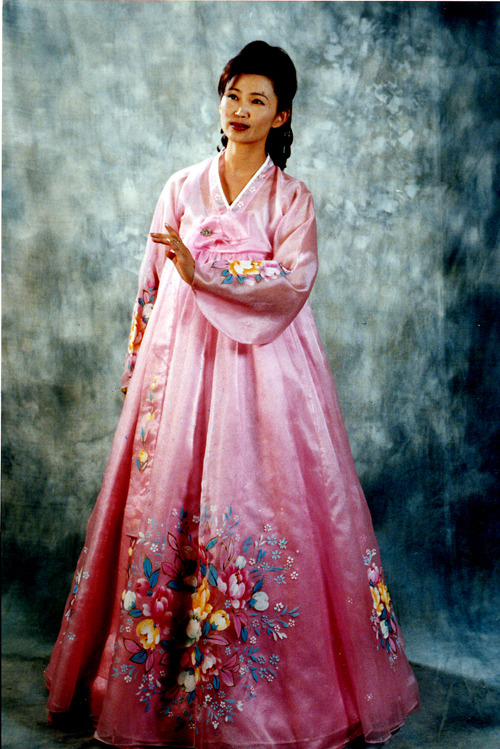
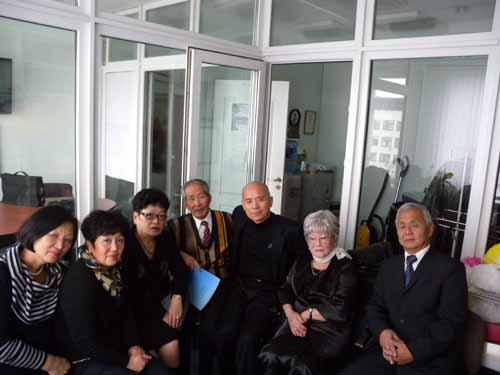
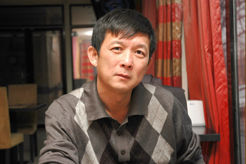
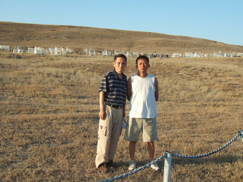
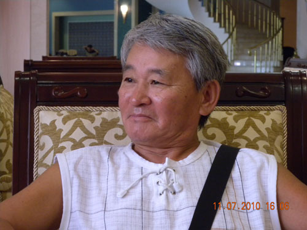
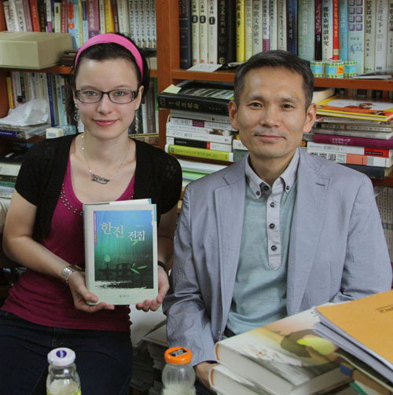
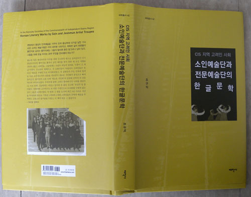

  
            원동지역으로부터 강제이주된 고려인들이 처음으로 도착하여 토굴을 파고 살던   
   우쉬또베 교외의 황무지. 지금은 공동묘지로 바뀌어 있음.

  
고려인들이 최근까지 거주하다가 모두 떠나 폐허가 된 우쉬또베 인근의 모쁘르 마을

  
2002년 아리랑 극장의 가수 김막달레나

  
벨라루스 고려인협회에서 고려인들과 함께[수도 민스크에서]

  
카자흐스탄의 탁월한 고려 시인 '이 스따니슬라브'

우쉬또베의 바스쮸베 언덕에서 김병학 시인과 이 스따니슬라브 시인.   
뒤쪽으로 보이는 하얀 시설물들이 고려인들의 공동묘지임.[2006년]

  
우즈베키스탄의 타쉬켄트 호텔 로비에서 소설가 블라지미르 김

  
카자흐스탄 고려인 극작가 한진 선생의 손녀 한율리아와 김병학 시인.[백규 연구실에서]

\*이 글은 <<CIS 지역 고려인 사회 소인예술단과 전문예술단의 한글문학>>[태학사, 2013]의 머리말인데, 몇 분의 요청으로 이곳에 옮겨 놓습니다.

고려인들과 ‘고려인 문학’

긴 여정이었다. 타임머신을 타고 오래 전의 고려인이 되어 그들이 겪어 온 ‘탈향과 이주’의 역정을 추체험하는 길이 간단치 않았다. 그들의 자취를 찾아 2008년부터 2011년까지 이른바 CIS[독립국가연합 : Commonwealth of Independent States]에 속한 몇몇 나라들을 부지런히 돌아다녔다. 그러나 그곳들에 상상 속의 고려인들은 더 이상 없었다. 김경천 장군의 말발굽 소리도, 홍범도 장군의 신출귀몰도, 작가 조명희의 빛나는 문장도 사라지고 없었다.

굽이굽이 복잡하기만 한 디아스포라의 역정(歷程)에 지치고 힘들었던 것일까. 자신들이 지켜오던 우리 말 아니 고려 말이 현실 속에서 그리도 무거운 짐이었을까. 스탈린의 폭력적인 동화정책에 어쩔 수 없이 그 무거운 민족의 표지(標識)를 내려놓은 그들이었다. 외모와 약간의 생활양식, 그리고 ‘고려인’이라는 민족의 칭호만 뺀다면, 그들에게서 동족으로 생각할만한 요소를 발견하기란 어려웠다. 유창한 러시아어를 굴리는 그들의 혀 밑에 우리말이 깃들 틈은 더 이상 없었다. 말을 잃으니 문학과 역사를 잃고, 문학과 역사를 잃으니 민족정신을 잃어버리게 된 그들의 지난날들이 그들을 만날 때마다 그 옛날 가설극장 영사기의 낡은 필름 돌아가듯 반복적으로 눈앞에 어른거렸다. 민족의식의 희미한 끈이나마 이어보려고 무던히 애쓰던 1세대 고려인들은 고려극장의 창고 한 구석에 버려진 이름으로 쳐 박혀 있거나 우쉬또베 근교의 황무지에 녹슨 묘비로 남아 있을 뿐이었다. 그런 고려인 2세와 3세들의 표정 너머에 아련히 남아있는 부모세대의 근심과 좌절을 읽어냈다면, 지나친 과장일까.

‘모든 소수민족들은 러시아인이 되어야 한다’는 모토가 바로 스탈린이 표방한 동화정책의 핵심이었다. 흉포했던 일본 제국주의의 마수를 피해 그 땅에 들어간 소수민족들 중의 하나가 고려인들이었다. 거기서 그들은 구소련의 다수민족에 의해 또 다른 식민지인으로 타자화 되는 역사적 폭력을 겪어야 했다. 일제의 끄나풀 역할을 할지도 모른다는 의심을 받아 중앙아시아의 황무지로 쫓겨난 고려인들은 그곳에서도 ‘주변인’으로 낙인찍혀 제국의 공민 대우를 받지 못한 채 긴 세월을 견뎌야 했다. 일찍이 식민주의⋅억압과 피억압 등에 대한 비판적 대안을 내놓은 선구자 프란츠 파농의 ‘인종이 곧 계급’이란 말은 사실 고려인들에게도 들어맞는 명제였다.

그러나 구소련이 해체되고 각 공화국들이 독립된 이후에도 고려인들은 또 다시 ‘새로운 주변인’으로 타자화 되었다. 각 공화국의 주도민족에 밀려 또 다른 소수자로서의 설움을 맛보면서 새로운 식민화의 함정으로 빠져 들어간 것이다. 이처럼 탈식민의 조류 속에 ‘새로운 식민화’의 굴레에 갇히게 된 것은 역사의 아이러니였다. 그러던 그들이 우여곡절 끝에 그리던 할아버지의 나라를 찾았으나, 이곳 또한 그들에겐 비집고 들어갈 틈 없는 공고한 ‘중심부’일 뿐이었다. 말하자면 고국에서도 또 다른 주변인으로 타자화 될 수밖에 없는 것이 그들의 운명이었다. 최근 3년 가까운 시간을 투자하여 한글로 기록된 1세대와 2세대 고려인들의 문학과 예술을 추적하는 고통스런 즐거움을 누렸고, 이 책이 바로 그 결실이다.

\*\*\*

그동안 많은 분들로부터 큰 도움을 받았다. 다 꼽을 수는 없으나, 물설고 낯 선 중앙아시아에서 밝은 눈과 귀가 되어 준 김병학⋅이 스타니슬라브⋅김 블라지미르⋅김 빅토리아 등 몇 분은 특히 잊을 수 없다. 그 가운데 김병학 선생으로부터 받은 도움은 결정적이었다. 젊은 나이에 카자흐스탄으로 건너 가 한동안 한글교사로 활약한 뒤 고려인 사회의 문화와 역사를 연구해오고 있는 그를 능가할 만한 ‘중앙아시아 고려인 전문가’는 없다고 본다. 이 책에 반영된 귀한 자료들 가운데 상당 부분은 그의 손을 거친 것들이다. 뿐만 아니라 최근 그는 국내에서 여러 권의 고려인 관련 서적들을 출간함으로써, 중앙아시아 고려인 문화에 대한 우리나라 학계의 관심이나 수준을 괄목할 만큼 높인 사실도 강조하고 싶다. 이런 인재를 발탁해 쓰는 게 나라의 할 일이다.

감사하게도, 이 연구 작업을 위해 한국연구재단에서 연구비를 제공했고, 학자의 뜻을 세우던 시기에 손을 잡아주신 도서출판 태학사의 지현구 사장님을 27년 만에 다시 만났다. 연구 활동의 한 부분을 결산하며 세월의 덧없음과 인연의 소중함을 깨닫게 된 것은 망외(望外)의 소득이다. 고전문학도로 살아오던 중 우연히 ‘해외 한인문학’을 만나 탐구 영역을 넓히게 되었고, 그 한 부분인 ‘고려인 문학’을 수탐하여 미흡하나마 한 권의 책으로 엮어 내게 된 점을 큰 행복으로 생각한다. 이렇게 소담스런 책으로 만들어 주신 태학사 한병순 부장의 노고에 감사하며, 강호제현의 아낌없는 叱正을 고대한다.

2013. 6.

달마산 아래 백규서옥에서

조규익

공유하기

게시글 관리

**백규서옥\_Blog ver.**

[저작자표시 비영리 변경금지
(새창열림)](https://creativecommons.org/licenses/by-nc-nd/4.0/deed.ko)