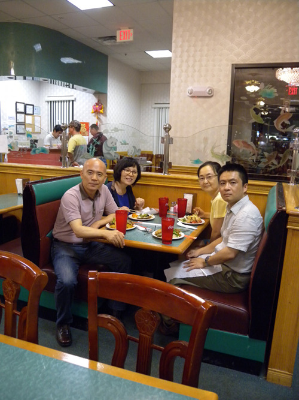
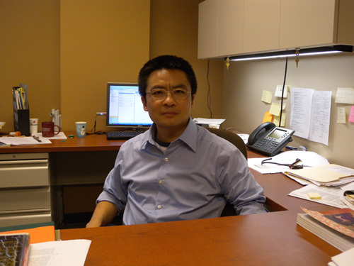
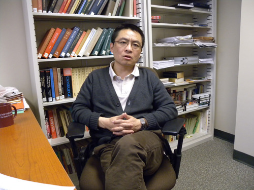
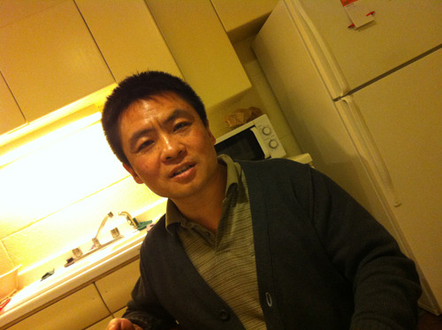
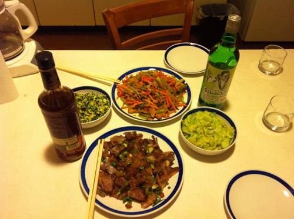
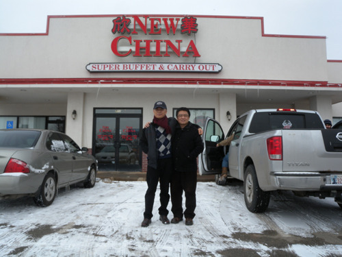

  
두 교수 부부와 처음 만나던 날, 저녁식사 자리

  
자신의 연구실에서 두 교수

  
필자와 대화를 나누고 있는 두 교수

  
초대 받아간 두 교수의 집에서

  
두 교수의 요리솜씨

  
스틸워터의 중국집에서 식사를 마치고 나와서

미국의 중남부에서 아시아 역사를 가르치는 젊은 학자: 용타오 두[Yongtao Du/杜勇濤] 교수

작년 8월 27일. 미국에 도착한 우리를 오클라호마 시티 ‘윌 라저스[Will Rogers] 공항’으로 픽업 나온 사람이 용타오 교수였다. 한국인인 우리는 젊은 그를 아시아식으로 ‘두 교수’라 불렀지만, 미국의 교수들과 학생들은 ‘용타오’라 불렀다. 그의 중국 이름은 ‘두용도(杜勇濤)’. 그의 출생지인 중국 화중(華中) 지역의 하남성(河南省)은 중원문화의 발상지로서 빛나는 인물들이 배출된 곳이다. 도가(道家)의 시조 노자(老子), 동한(東漢) 시절의 과학자 장형(張衡), 당송팔대가 중에서 첫 손가락으로 꼽히는 문장가 한유(韓愈), <<대당서역기(大唐西域記)>>의 저자인 승려 현장(玄獎), 남송의 영웅 악비(岳飛) 등등. 그러나 무엇보다 당나라의 큰 시인 두보(杜甫)를 빼놓을 수 없으니, 두 교수야말로 바로 그 두보의 후예 아닌가.

두 교수와의 인터뷰

OSU 역사학과의 유일한 동양인 전임교수인 그는 늘 ‘통통통’ 연구실과 강의실을 오가며 분주하게 지내고 있었다. 그는 하남대학교(Henan Univ.)에서 학사학위를, 베이징 대학교에서 석사학위를, 일리노이 대학교[University of Illinois at Urbana-Champaign]에서 박사학위를 받은 다음, 일리노이 대학교와 와쉬번 대학교(Washburn Univ.)에서 강의를 하다가 2009년부터 이곳 OSU의 역사학과로 옮겨 재직하는 중이었다.

“부의 교훈: 명나라 말기 혜주(惠州)의 상업문화와 지방주의”, “초지방적(超地方的) 혈통과 고향 애착의 로만스”, “경쟁적 공간 질서: 명나라 말기의 상업지리학” 등 탁월성과 독창성을 보여주는 논문들을 발표했고, ‘하바드 옌칭의 논문 작성을 위한 현장 연구 지원’, ‘탁월한 지리학사(地理學史) 학자에게 수여하는 리스토우 상’, ‘리칭 학술상’ 등 여러 번의 학술상과 연구지원의 수혜를 받고 있는, 촉망받는 신진학자가 바로 그였다. 미국의 여타 지역들과 중국을 오가며 부지런히 논문을 발표하는 그의 모습이 돋보였다. 중국 역사 뿐 아니라 한국과 일본 역사에 대한 탐구를 계속하면서 동양에 관한 미국 학생들의 호기심을 자극하고 있는 점도 좋아보였다.

미국 도착 뒤 시차적응도 되지 않은 나에게 한국사에 대한 물음들을 끊임없이 던졌다. 신라의 왕통, 삼국 간 정치제도의 차이, 왕건의 출신, 문벌귀족, 양반, 본관 등등. 사실 나도 공부를 하지 않으면 즉석에서 답하기 어려운 질문들을 쉼 없이 건네는 그였다. 자신의 전공인 중국사를 제대로 공부하기 위해서라도 주변국의 역사를 알아야겠더라는 그의 말은 그간 한국인이나 일본인을 만나지 못함으로써 겪을 수밖에 없던 자신의 지적 갈증을 명증하게 드러냈다.

우리는 잠깐씩 수시로 만나면서 ‘한-중-미’의 역사적 접촉과 현실을 논하는 사이가 되었다. 나는 중국말을 한 마디도 못하고 그 또한 한국말을 한 마디도 못했지만, 고맙게도 영어가 우리 사이의 간격을 메워주었다. 그러다가 갈증이 도지면 서로가 가끔씩 알고 있는 한시들을 써 보여주며 정서적 공감대를 확인했을 뿐 아니라, 근대 이전 동아시아에 정착되어 있던 ‘중세적 보편주의’의 실체와 힘을 확인할 수도 있었으니, 제대로 쓰인 역사에 대하여 무한한 신뢰를 갖고 있던 나로서는 감동적인 체험이었다. 조선과 중국의 지식인들이 북경의 유리창이나 그들의 사저(私邸)에서 필담으로 교유하던 그 시절의 광경을 우리 또한 제3국 미국의 한 구석에서 제법 재현한 셈이니, 참으로 희귀한 일 아닌가.

중국인인 그에게 나는 ‘중화주의(中華主義)’의 협소함에서 벗어나라는 주문을 누차 건넸고, 그 역시 ‘마오쩌둥을 좋아하지만, 미래지향적 행동지표로서의 글로벌리즘을 잊지 않고 있다’는 말로 화답하곤 했다. 학문의 바다 미국에서 조만간 그는 아시아사의 최고 전문가로 성장할 것이다. 그렇게만 된다면, 그는 분명 민족주의의 편협한 굴레에서 벗어나 완벽하게 균형 잡힌 ‘미래의 지식인’으로 확고하게 자리 잡으리라 믿어본다.

공유하기

게시글 관리

**백규서옥\_Blog ver.**

[저작자표시 비영리 변경금지
(새창열림)](https://creativecommons.org/licenses/by-nc-nd/4.0/deed.ko)