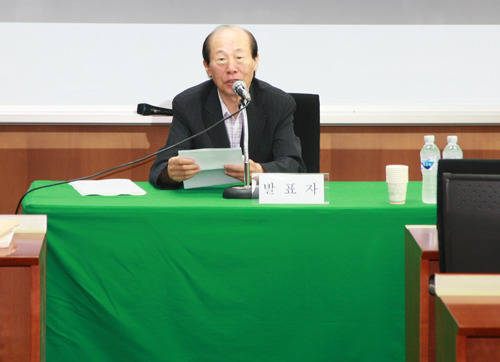
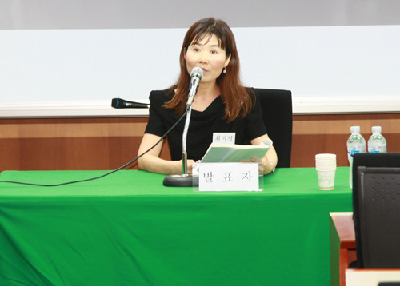
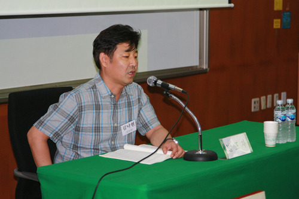
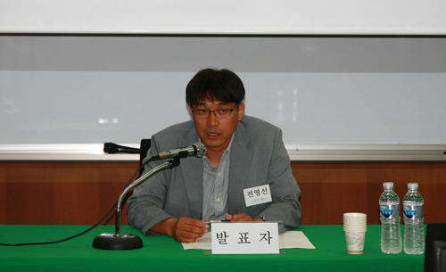
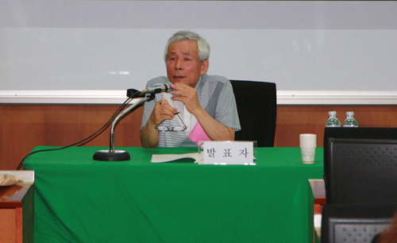
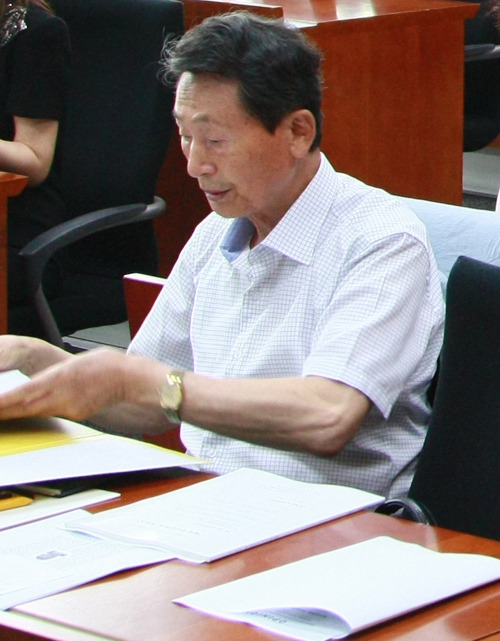
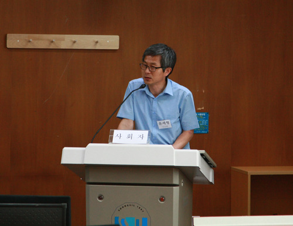
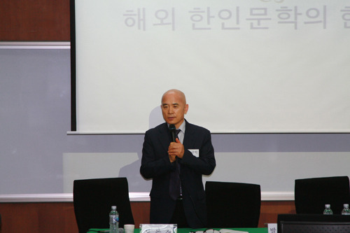

  
이명재 교수

  
최미정 박사

  
김낙현 박사

  
전영선 박사

 

  
이한창 교수

한국문예연구소 2014년도 전반기 학술발표대회를 마치고

학술발표회를 기획하고 주최하는 일이 갈수록 어려워진다. 예산 확보나 발표자 및 토론자 섭외도 쉬운 일은 아니지만, 가장 어렵고 신경 쓰이는 일은 사람들의 무관심과 도외시다. 적지 않은 돈과 신경을 써서 잔치를 벌여 놓고도 손님이 없어 텅 빈 좌석을 망연히 바라만 보아야 하는 주최 측으로서는 괴롭기 짝이 없다. 무엇보다 심혈을 기울여 발표논문을 작성해온 발표자들에게 인사가 아닌 것 같아 좌불안석이다. 물론 발표자들이라고 그런 현실을 모르지는 않는다. 그들 역시 학술발표회를 기획하고 주최하는 당사자들이자 그런 참상에 대하여 ‘동병상련(同病相憐)’하는 이웃들이기 때문이다. 그렇다 해도 주인의 입장에서 겪어야 하는 미안함과 민망함은 말로 표현할 도리가 없다. 그래서 내 또래의 학자들이 만나면, 이제 ‘학술발표대회는 더 이상 열지 말아야 할까보다’라는 푸념을 늘어놓기 일쑤다. 후학들이 더 이상 자신의 선생 혹은 몇몇 선배들을 제외한 남의 논문과 책을 읽거나 인용하려 들지 않는 시대가 되었으니, 남의 학술발표회에 자발적으로 참석하기를 바라는 일이야말로 과람(過濫)한 기대라 할 것이다.

\*\*\*

“해외 한인문학의 현주소”라는 타이틀 아래 그 분야의 고수들을 모신 덕이었을까. 그럭저럭 학술발표대회를 마칠 수 있었다. 정년 이후 지금까지 현대문학의 비평과 해외 한인 문학의 연구에 매진하고 있는 이명재 교수[중앙대]가 ‘유럽지역의 한인 한글문단’을, 10여년을 미국에 살면서 직접 한인 시인들을 만나면서 연구를 해온 최미정 박사[성서대]가 ‘재미 한인문학의 현재와 미래’를, 현장을 바탕으로 하는 예리한 분석력을 구사하는 김낙현 박사[중앙대]가 ‘구소련 고려인 문학의 현재와 미래’를, 북한문학의 탁월한 전문가 전영선 박사[건국대]가 ‘북한문학의 현재와 미래’를, 관록과 끈기의 노학자 이한창 교수[전북대]가 ‘재일 한인문학의 연구현황과 과제’를 각각 발표했고, 유선모 교수[경기대], 강진구 박사[중앙대], 김성수 박사[성균관대], 허명숙 박사[숭실대] 등 각 분야 전문가들의 토론도 이어졌다.

\*\*\*

현재 7백만의 한인들이 해외에 나가 있다. 남북한 합친 인구를 7천만으로 잡을 때 10%가 넘는 인구요, 남한 인구 5천만의 14%에 해당하는 인구다. 그렇게 많은 한인들이 해외에서 문학을 창작을 해왔고, 지금도 하고 있으며, 앞으로도 해나갈 것이다. 문제는 ‘한글문학’의 지속성이다. 해외 한인 3세만 되면 언어나 정서의 면에서 완전히 현지인으로 바뀌게 되는데, 우리말이나 글을 잃어버린(잊어버린) 상태에서 더 이상 우리 문학이 산출될 수 없다는 점을 감안할 때, 해외 한인 한글문학의 ‘내일’은 어둡다는 것이 대체적으로 일치를 본 견해였다. <<고려문학>>처럼 문학저널을 우리나라에서 발간함으로써 국내와 현지의 문인들을 결부시켜 현지인 문학을 유지하려는 방법도 있긴 하다. 그러나 그 방법으로 시들어가는 현지인 문학을 잠시 부축할 수는 있겠지만, 그것이 근본적인 해결책은 아닐 것이다. 이와 관련 카자흐스탄의 탁월한 극작가 한진은 일찍이 다음과 같은 말을 한 적이 있다.

“지금 우리 문단[\*고려인 문단: 인용자 주]은 풍전등화의 처지이다. 우리말[\*고려말, 즉 한국말: 인용자 주]로 쓴 작품을 읽을 수 있는 독자들도 거진 없다싶이 하지만 우리말로 글을 쓰는 작가들도 손가락으로 셀 수 있는 정도이다. 그러니 재쏘고려인문학의 존재에 대해서 말하기조차 거북한 일이다. 우리말을 부흥시키기 전에는 우리 문학을 부흥시킬 수 없다는 것은 뻔한 상식일 것이다. 다행히 최근에 와서 재쏘동포들 사이에서는 우리말을 배우려는 열성이 높아가고 있다. 그러나 지금부터 말을 배우기 시작하는 젊은이들 속에서 우리말로 문학작품을 쓸 수 있는 사람이 나오리라고는 기대하기 힘들다. 문학작품을 쓸 수 있는 말은 적어도 어머니의 젖과 함께 몸과 넋에 배인 말이야 한다고 나는 믿고 있다. 그러나 지금 어린애에게 젖을 물리는 그 어머니들도 우리말을 모른다. 이렇게 자꾸 캐여보면 암담하기만 하다.(…)한글문학의 전공시기를 메울 문학은 제 생각에는 아마 로씨야어로 쓴 우리 고려인 작가들의 문학일 것이다. 다행히 지금 우리 문단에는 로씨야말로 글을 쓰는 재간 있고 전망이 있는 신예작가들이 있다. 그들의 작품은 오라지 않아 널리 알려지게 될 것이다. 쏘련에서도 중국에서도 일본에서도 또 조국 본토에서도 우리말로 쓰지 않은 작품이 조선-한국문학이냐 아니냐 하는 론쟁이 많이 벌어졌고 또 벌어지고 있다. 그러나 지금 우리가 처한 립장에서 볼 때 아직은 우리 고려인 작가들이 고려인들의 생활을 묘사한 작품은 범민족문학권에 포괄하는 것이 선책이라고 생각한다. 될 수 있는 대로 이 진공시기가 짧고 하루 빨리 우리말 문학이 부흥되기를 바랄 뿐이다.”

이 말이 3, 40년 전에 한진이 진단한 ‘고려인 문단’의 현실이고 보면, 지금 고려인 문단이나 그와 유사한 수준의 다른 지역 한인들의 문단은 거의 완벽하게 붕괴되었다고 해도 과언이 아닐 것이다. 지금도 우리나라 사람들이 왕성하게 이민을 떠나는 미국의 경우라면, 한인문학의 미래는 밝다고 할 수 있다. 미국에서 새로 태어나는 ‘한국계 미국인’들은 영어로, 한인 1, 2세들은 한국어로 문학창작을 지속함으로써 ‘미국 내 한국문학의 맥’은 이어질 수 있을 것이기 때문이다. 한진의 말대로 러시아어로 창작하는 고려인들에 의해 ‘고려인 문학의 맥’은 이어질 수 있겠지만, 그것은 그대로 ‘러시아문학’일 뿐 ‘한국문학’은 아니라는 데 우리의 고민이 있는 것이다. 해외 한인들의 자손을 우리나라에 데려와 우리 말 교육을 시키는 방안도 있겠지만, 그 역시 ‘부지하세월(不知何歲月)’일 터. 해외 한인공동체가 건실하게 성장하고, 그런 공동체들을 바탕으로 한국어와 현지어가 함께 구사되기 전에는 기대하기 어려운 일이다. 말하자면 한국어와 현지어를 사용하는 세대들이 공존하거나, 이중어를 사용하는 후속 세대들이 늘어날 때 ‘한국어문학’과 ‘현지어문학’의 병행도 가능하다는 것이다. 우의 국력도 해외 한인들의 정치ㆍ경제적 지위나 민족의식도 다 함께 높아져야 그런 일이 가능해질 것은 당연하다.

그런 차원에서, 앞으로 ‘해외 한인문학의 연구’는 ‘해외 한인문학 지속의 방안’을 마련하는 데 힘써야 한다는 것이 학술토론의 주된 논점이었다.

  
                                                        유선모 교수

 

 

  
                                                       강진구 박사  
  
                                              

  
                                            사회를 보는 윤세형 선생

 

 

  
                                             토론 마무리 멘트-조규익

공유하기

게시글 관리

**백규서옥\_Blog ver.**

[저작자표시 비영리 변경금지
(새창열림)](https://creativecommons.org/licenses/by-nc-nd/4.0/deed.ko)