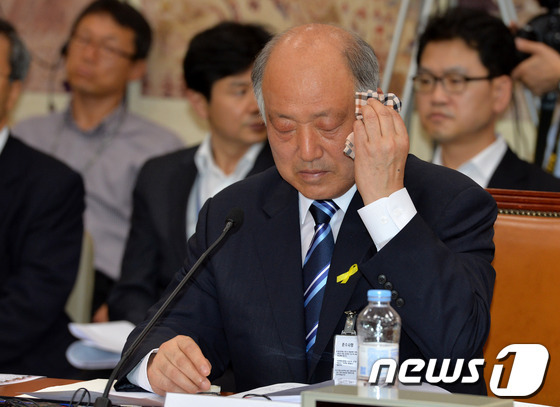

교육부 장관 후보 청문회를 보며

몇 년 전의 일이다. 가까이에 있던 지인들 중의 하나가 연구비 부정 집행으로 검찰에 불려간 일이 있었다. 학생들에게 돌아가야 할 돈의 상당부분을 자신이 ‘편취(騙取)’한 혐의였다. 소문에 의하면, 그는 새파랗게 젊은 검사에게 “그건 자신이 주도한 일은 아니며, 그간 학계에서 관행적으로 해오던 일”이라는 요지로 강변을 했다 한다. 평소 그에게 별 호감을 갖고 있지도 않았지만, 당시 그가 했다는 그 말을 듣고 나서 그에 대한 ‘최소한의 기대’마저 접고 말았다. 자신의 범죄행위를 ‘학계의 관행’으로 눙치려고 한 그의 그 말만으로 판단하자면, 그는 인간도 아니었다. 

                                 청문회에서 진땀을 닦고 있는 교육부 장관 후보[사진은 중앙일보에서 가져 옴]

요즘 또 다시 내 속을 긁는 인간이 하나 등장했다. 언론 매체들을 매일 매 시간 새로운 뉴스로 도배하고 있는 인물. 바로 교육부 장관 후보로 내정된 김명수 교수다. 처음에 그 이름을 접하곤 하도 ‘듣보잡’이라서, ‘박 대통령이 모처럼 의외의 인물을 하나 찾아냈구나!’ 하고 은근히 기대를 했었다. 나와 분야가 다르니 처음 듣는 이름이라고 무조건 폄하할 일은 아니고, 무엇보다 똑똑한 인물로 차고 넘치는 대한민국에서 상아탑에 틀어박혀 조용히 학문을 연구해온 ‘참 학자이려니!’하는 기대 때문이었다. 그러나 후보 지명의 소식이 전해지자마자 그에 관한 온갖 추잡하고 저급한 소식들로 매스컴은 도배되기 시작했다. 논문 표절[\*후보자의 사례는 '표절'과 '탈취'가 뒤섞인 경우다], 칼럼 대필, 사교육 업체 주식 투자 등등. 학자로서는 가장 추악하면서도 빠져나갈 수 없는 범죄행위들의 한복판에 그는 서 있었다. 급기야 그의 제자들 가운데 한 사람은 그런 범죄의 과정들을 언론에 낱낱이 고발하기에 이르렀다. 이런 상황에도 얼굴을 들고 청문회 자리에까지 나온 그는 참으로 후안무치했다. 더욱 고약한 건 청문회장에서 자신의 비행을 변호하기 위해 ‘관행’이란 말을 꺼내들었다는 점이다. 자신의 그런 행위들이 ‘그 시대의 관행’이었으니, 잘못이 없다는 뜻일 것이다. 그의 그 말 한 마디에 나는 조금 전에 먹은 음식을 토하고 말았다. 앞에 말한 연구비 부정 집행 교수가 사용한 ‘관행’이란 말을 김 교수 역시 청문회장에서 마치 ‘전가의 보도’처럼 휘두르고 만 것이다.

‘관행’이라? 학생들에게 돌아가야 할 연구비를 편취한 행위가 관행이라? ‘제자의 논문에 자신의 이름을 제1저자로 얹고, 그 논문으로 연구비를 받아 챙기고, 한국연구재단의 실적목록에는 아예 자신의 단독논문으로 올리고, 그런 논문들로 승진을 하고, 일간신문에 기고하던 칼럼을 학생들에게 대필시킨’ 그런 행위들이 관행이라?

국가가 발주하는 모든 프로젝트의 경우 반드시 연구원들에게 돌아갈 인건비의 액수가 예산으로 정해져 있고, 연구비 집행 기관에서는 연구 책임자인 교수를 경유하지 않고 그들에게 직접 지급하도록 규정되어 있다. 연구 책임자가 연구원들이 지급받는 돈의 일부를 자신에게 보내도록 강요한다면, 어렵지 않게 그 돈을 편취할 수는 있을 것이다. 그러나 그건 칼을 들고 행인들의 돈을 빼앗는 것만큼이나 극악한 범죄행위다. 자신이 책임자로 되어 있는 프로젝트에서 가난한 젊은 학자들이 일시적으로라도 생활비를 지급받게 되는 사실에 마음 편해 하고 안도하는 것이 대부분 교수들의 상정(常情)이다. 주변의 젊은 학자나 학자 지망생들이 생활고에 부대끼지 않고 연구할 수 있는 여건을 자신이 만들어 주었다면, 그 얼마나 행복한 일인가?

논문 한 편을 써보면 안다. 글 쓰는 노동이야말로 ‘등잔 속의 기름이 바작바작 말라가듯’ 얼마나 삶의 진액을 소모하는 일인가를, 직접 써본 사람만 알 수 있다. 그런 논문을 빼앗는다는 것은 무엇으로도 변명할 수 없는 범죄다. 그것도 다른 사람 아닌 제자의 논문을 자신의 것으로 빼앗았다니, 말문이 막힐 일 아닌가. 교직에 종사해온 그 긴 세월 동안 단독저서 한 권 내지 못했다는 사람이니, 단독 논문인들 제대로 낸 적이 있을까. 학문과는 거리가 먼 국회의원들이 ‘표절의 의미’에 대해서 물었으나 제대로 답변조차 못했다니, 다시 무슨 말을 덧붙이랴! 그런 사람을 교육부 장관으로 간택하고 국회에 통과시켜 줄 것을 요청한 대통령은 대체 어떤 사람인가.

이제 다시 찾을 일 없을 것처럼, 우물에 ‘똥을  퍼붓고 간’ 못된 인간들이다. ‘관행’이란 편리한 말로 자신들이 몸담았던 대한민국의 지식사회를 잠재적 범죄 집단으로 몰고 갔기 때문이다. 자신의 처지가 아무리 궁하다 해도 대다수 선량한 이웃들의 얼굴에 똥물을 끼얹어서는 안 된다. 물론 어느 공동체에도 범죄자는 있다. 그렇다 해도 그런 범죄행위를 ‘관행 운운’의 궤변으로 일반화시켜서는 안 된다. 똑똑하지만 가난한 제자들이나 주변의 배고픈 학자 지망생들에게 혜택이 돌아가길 바라는 대부분의 교수들에게, 지금도 연구실에 틀어박혀 한 편의 논문을 완성하기 위해 기력을 소진하고 있는 학자들에게 그 이상 더한 모욕이 어디에 있을까?

공유하기

게시글 관리

**백규서옥\_Blog ver.**

[저작자표시 비영리 변경금지
(새창열림)](https://creativecommons.org/licenses/by-nc-nd/4.0/deed.ko)