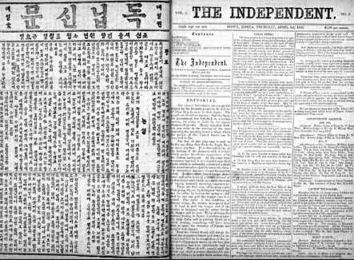

빗나간 우리나라 언론

재작년 언제쯤이던가. 외국에서 공부를 하고 있는 제자 한 녀석이 자못 분개한 듯한 어투의 이메일을 보내왔다. 첨부파일을 열어본즉 가관이었다. 국내 모 대학의 어떤 공학 교수가 외국 학자들의 논문 십 수편을 표절하여 국제학술지들에 게재한 사실이 해당 학회 홈페이지의 전면에 대문짝만하게 실린 내용이었다. 호기심이 발동하여 그가 재직하는 대학의 사이트에 가보니, 그는 그 대학의 ‘최우수 연구자’로 선정되어 사진과 이름, 공적사항들이 홈페이지의 전면을 장식하고 있었다. 참 놀랍고 한심한 일이었다. 무엇보다 같은 교수로서 그 사실을 내게 알려 준 그 제자에게 몹시 부끄러웠다.

포털 사이트의 검색창에 그 교수의 이름을 넣어보았다. 그런데 그는 해당 분야의 훌륭한 연구논문을 발표한 공로가 인정되어 이미 정부의 해당 부처로부터 큰 상을 받은 바 있었는데, 그 수상논문이 바로 표절논문들 가운데 하나였다. 그 부처에서는 표절여부를 확인도 하지 않은  채 그에게 덜컥 상부터 안긴 것이었다. 정부 부처로 전화를 걸었다. ‘이러이러한 사실을 알고 있느냐?’고 물었으나, 금시초문이란다. 조사해볼 용의가 있느냐고 물으니 앞으로 알아보고 연락 주겠다고 시큰둥하게 답변했다. 그러나 지금껏 일언반구 연락이 없다.

 나는 즉시 그가 소속되어 있다는 해당 학회에도 문의했다. 회장은 연락이 안 되고, 여러 명의 부회장들 가운데 한 사람과 통화가 되었다. ‘귀 학회 회원 한 분이 표절행위로 해당 전공분야 국제학회의 홈페이지 전면을 장식하고 있는 사실을 알고 있느냐?’고 물으니, 마찬가지로 금시초문이란다. 나중에 확인하여 알려주겠노라고 약속을 했다. 당시는 그 교수의 표절행위가 게시된지 한 달이 넘은 시점이었는데, 아무도 그 사실을 모르고 있는 점으로 미루어 한국의 해당 전공학회의 임원들이 한 번도 그 학회의 사이트에 접속하지 않았음을 알게 되었다. 국문학자인 나도 이름을 알고 있는 그 국제학회를 어째서 한국의 내로라 하는 해당 분야 학자들이 제대로 접속조차 안 하고 지내는지 참으로 알 수 없는 일이었다. 그러나 지금까지도 연락이 없다. 직접 확인해보진 않았으나, 지금껏 그는 그 학교에서 잘리지 않고 '교수노릇' 잘 하고 있는 것으로 알고 있다. 이게 대한민국의 대학이다!

더 이상 호소할 데가 없던 나는 평소 ‘사회의 목탁’으로 자처하며 목소리를 높이던 유수 언론사의 기자에게 전화를 걸었다. 평소 잘 알고 지내는 그였다. 사건의 전말을 설명하자 머뭇거리던 그는 “조 교수님, 언론사는 정의를 구현하는 곳이 아닙니다. 그런 사건을 폭로하는 경우에는 앞, 뒤, 옆을 조심스레 살펴야 하는 겁니다.”라고 점잔을 빼는 게 아닌가. 갑자기 눈앞이 캄캄해졌다. 언론사가 정의를 구현하는 곳이 아니라니? 그 젊은 기자가 틀렸든 내가 틀렸든 무언가 잘못 된 게 틀림없었다.

  
                                      <독립신문 창간호>

내가 목소리를 높였다. “그 사건은 이미 해당 국제학회 홈페이지의 얼굴에 대문짝만하게 공개되어 대한민국이 세계만방으로부터 망신을 당하고 있는데, 그걸 보도하는 게 어찌 단순한 폭로란 말이오? 그런 사실을 국내에 널리 알려 다시는 유사한 일이 없도록 하는 게 언론의 임무가 아니란 말이오?”라고. 그러자 그는 “말씀은 잘 알겠으나, 그런 일일수록 사회적인 맥락을 잘 살펴야 하는 법이지요. 우리가 먼저 나설 수는 없는 일이지요.”라고 능청을 떠는 것이었다. 순간 나도 모르게 수화기를 꽝 소리 나게 내려놓았다. 못된 친구였다. 그 젊은 기자는 잘못 배운 처세술로 나를 가르치려 하는 것이었다. 그는 썩은 선배들로부터 그런 처세술을 배웠을 것이다. 그로 미루어, 언론계는 이미 썩어 있었다. 그 뒤 그 사건은 강변의 자갈돌처럼 흔하디흔한 대한민국의 어느 언론에도 보도되지 않은 채 넘어갔고, 정보를 건넨 어느 기관이나 학회로부터도 조치 결과에 대한 연락을 받지 못했다.

\*\*\*

그 때나 지금이나 언론들은 자기반성의 기미를 보이지 않은 채 세월만 보내고 있다. 아니 언론 뿐 아니라 대학까지 한국을 대표하는 지식사회는 회생이 불가능할 정도로 썩어 있는 게 사실이다. 물론 언론이 사법부는 아니니 정의를 규율할 수는 없을 것이다. 그러나 사건들을 다룰 때 상식에 비추어 옳고 그름 정도는 분간할 수 있어야 하고, 최소한 독자들이 옳고 그름을 판별할만한 자료는 제공해야 하지 않겠는가. 정의의 잣대보다는 진영(陣營)의 논리에만 근거하여 옳고 그름을 판별하려 한다면, ‘우익 기관지’나 ‘좌익 기관지’일 뿐, 상식적 차원의 언론기관이라 할 수는 없을 터. 이미 정체성을 잃어버린 대한민국의 언론들은 날이 갈수록 복잡해지는 정치 지형 속에서 길을 찾지 못하고 있으며, 강호의 지사들 사이에 망양지탄(亡羊之歎)의 한숨소리 또한 높아가고 있다. 언제쯤이나 언론이 다시 정도를 찾을 수 있을 것이며, 언제쯤이나 한국의 지식사회가 최소한의 양식을 갖추게 될 것인가.

공유하기

게시글 관리

**백규서옥\_Blog ver.**

[저작자표시 비영리 변경금지
(새창열림)](https://creativecommons.org/licenses/by-nc-nd/4.0/deed.ko)