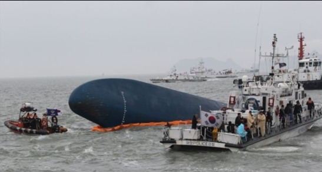

  
오클라호마주 무어(Moore) 시 초입의 조형물과 자동차들

에프 엠(FM)대로 살면, 망할까?

미국에 도착한 지 일주일 만에 차를 구입하여 몰기 시작했다. 오클라호마의 스틸워터는 십 몇 년 전에 지내던 LA보다 도로가 훨씬 한산하고 넓었다. 미국에서는 교차로에 진입하기 직전에 반드시 정지한 다음 어느 방향이든 먼저 와 서 있는 차가 진입하도록 양보해야 한다. 비록 사방에 차 한 대 없어도 반드시 정지하여 두리번거리며 확인한 다음 출발하는 것이 ‘정해진 법규’였다. 저 멀리 차도로 사람이 걸어가면 무조건 서서 기다리는 것도 그들의 원칙이었다. 신호등을 지키는 건 ‘물어볼 필요’도 없는 일. 법규를 철저히 지키는 미국인들이 답답할 지경이었다.

초기에는 가끔 착각하여 ‘한국에서의 운전 습관’이 튀어나오기도 했다. 그런 미국의 ‘운전 관습’이 몸에 배기까지 한 달 이상이 걸렸다. 이처럼 내가 미국에 체류하면서 감동을 받았던 건 미국인들의 이른바 ‘리걸리즘(legalism)’이었다. ‘고집스런 법칙 존중주의’ 쯤으로 번역될 수 있을까. 간혹 답답하기도 했으나, 세계 초강대국 미국의 힘을 느낄 수 있었던 ‘최고의 장점’이었다.

\*\*\*

부끄러운 일이지만, 우리는 ‘일리걸리즘(illegalism)’이 관습화된 나라다. ‘고집스런 범칙주의(犯則主義)’  혹은 ‘일상적 범칙주의’  쯤으로 번역할 수 있을까. ‘어기는 맛에 법을 만든다’는 말이 상식처럼 되어 있고, ‘예외 없는 법 없다’는 속담을 진리처럼 숭상하는 나라가 우리나라다. 차를 몰고 거리에 나가보라. 아무리 차량 대수에 비해 길이 좁아서 그렇다고는 하지만, 틈만 나면 교통신호를 무시하고, 횡단보도에 사람이 지나가면 전속력으로 가속페달을 밟아 그 앞을 ‘쌩!’하고 가로질러 내빼는 건 일상적인 모습이다. 직진차선에 차가 밀린다 싶으면 그 옆으로 빠져 나가는 우회차선을 쌩 달려 앞쪽으로 간 다음 뒤에서 묵묵히 기다리는 운전자들을 조롱하듯 끼어들기도 한다. 우리나라에서 총기 소지가 미국처럼 자유로워진다면, 아마도 사망자의 90% 이상은 도로에서 생겨날 거라는 생각까지 하게 되는 요즈음이다.

내비게이터 덕분이긴 하지만, 감시카메라의 위치를 귀신같이 알아낸 뒤 그 사이사이에선 엄청난 과속도 일삼는다. 당국에서는 ‘구간 단속’이라는 지혜까지 내놓았지만, 요즘은 머리 좋은 운전자들 때문에 그것도 무력화 된지 오래다.

이런 ‘일리걸리즘’이 교통에만 국한되는 문제일까. 많은 돈을 벌면서 세금 한 푼 안 내고, 건장한 체구로 태어났으면서 병역의 의무를 기피하고, 집 지을 수 없는 땅에 호화주택을 짓고, 선박의 구조를 변경하면서까지 화물을 과적하고...주워섬기자면 끝이 없다.

\*\*\*

세월호 사고가 일어난 뒤 ‘국가 대개조’에 나서겠다는 대통령의 의지도 날이 갈수록 무뎌지고 있다. 대통령이 무슨 말을 한다고 이루어질 수 있는 구조가 아니기 때문이다. 하루가 멀다 하고 일어나는 지하철 사고, 열차 사고, 비행기 사고... 운전자, 정비사 등이 간단하지만 중요한 수칙들을 무시하기 때문이다. ‘대충대충 해!’라거나 ‘설마 무슨 일이야 있겄어?’라는 무심함과 대범함의 천국이 우리나라다. 집을 지을 때도 넣으라는 철근을 다 넣지 않고, 시멘트의 품질규격이나 분량을 지키지도 않는다. 업자들이 찔러주는 돈 봉투에 감독하는 놈들은 슬쩍 눈을 감아주곤 한다. 식당 하면서 식재료의 원산지 표시 원칙을 지키면 멍청이다. 앞 손님이 먹다 남긴 음식을 다른 손님에게 다시 제공하는 것은 애교. 식재료가 쉽게 상한다고 농약을 치는 인간들이 그들먹한 나라가 우리나라다. 남이야 먹고 죽든 말든, 차를 타고 가다가 바퀴가 빠져 죽든 말든, 곤히 잠자다가 집이 무너져 죽든 말든, 북괴군들이 쳐들어 올 때 포탄이 발사되지 않아 귀한 우리 장병들이 죽든 말든, 열차가 부딪쳐 수십 명의 귀한 사람들이 죽든 말든....내 주머니에 돈만 들어오면 장땡인 나라다.

\*\*\*

Field Manual, 즉 ‘에프엠’이란 ‘야전 수칙’이다. 야전에서 수칙을 지키지 않으면 아군들이 죽을 수밖에 없다. 그러니 절체절명의 원칙이 바로 에프엠이다. 그러나 우리나라에서는 ‘에프엠 대로 살면’ 망한다. 미련하고 답답하다고 욕을 먹는다. ‘바쁜 세상 대충 살지. 뭔 일 났다고 원칙 지킨다나? 아니 지가 잘 났으면 얼마나 잘 났다고 저렇게 규정을 지키며 답답하게 군디야?’ 온갖 욕이 쏟아진다. 그러니 에프엠을 지키려던 사람들도 슬그머니 ‘반칙의 대열’로 끼어든다. '망할 놈'의 관습이요, 분위기다. 법을 지키는 사람이 욕먹는 사회를 생각해 봤는가? 툭하면 범칙자들에게 욕을 퍼붓기 좋아하는 우리들. 스스로의 행동들을 한 번 돌아보자. 하루 중 에프엠대로 법규대로 살아가는 순간이 몇 %나 되는지 살펴보자. 사건이 터지면 정부나 대통령만 욕한다. 자신들은 에프엠대로 법규대로 살아 왔는데, 대통령이나 정부 당국자가 무능하고 사악하여 사고가 났다는 투다. 온통 범법자들로 이루어진 이 땅의 야당 인사들은 한 술 더 뜨면서 대중을 선동하려까지 든다. 한심하다 못해 슬프도록 ‘재미있는’ 나라가 '우리 대한민국'이다.

복잡하게 생각할 것 없다. 이미 만들어진 에프엠만 제대로 지켜도 ‘국가 대 개조’는 당장 이루어진다!!!

  
뒤집어진 채 점점 물 속으로 가라앉고 있는 세월호[네이버 사진]

공유하기

게시글 관리

**백규서옥\_Blog ver.**

[저작자표시 비영리 변경금지
(새창열림)](https://creativecommons.org/licenses/by-nc-nd/4.0/deed.ko)