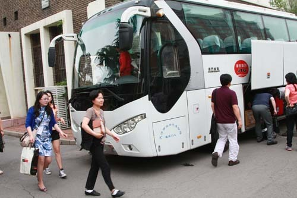  
공항에서 천진외대 국제교류센터에 도착하여

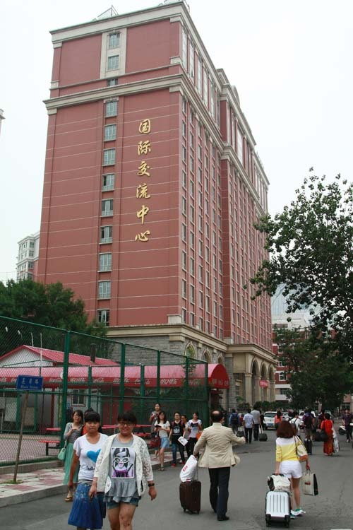  
천진외대 국제교류센터

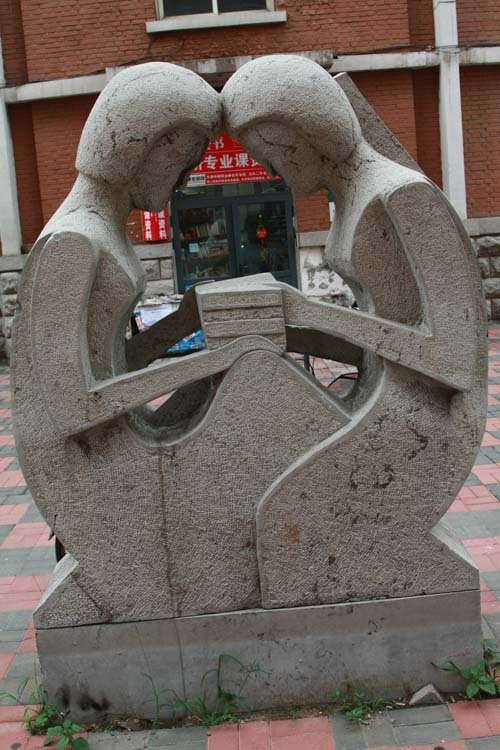  
천진외대 국제교류센터 앞마당에 설치된 조각상

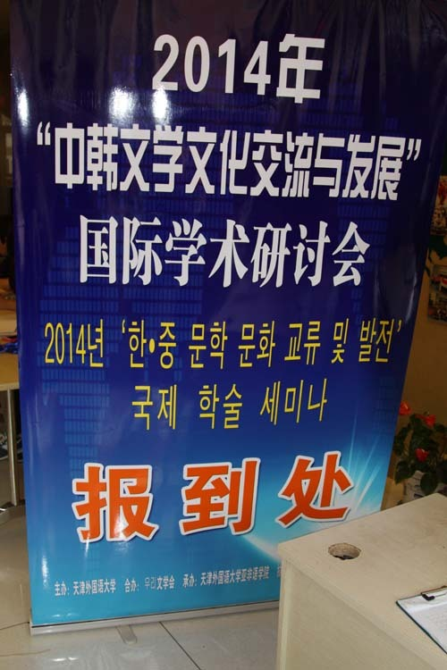  
천진외대 국제교류처에 걸린 국제학술회의 보도처 표지판

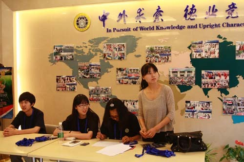  
천진외대 국제교류처 로비에서 안내하는 학생들

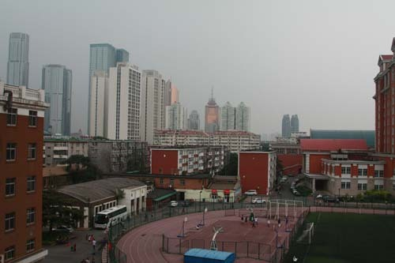  
천진외대 국제교류처 호텔방에서 내다 본 천진시가지

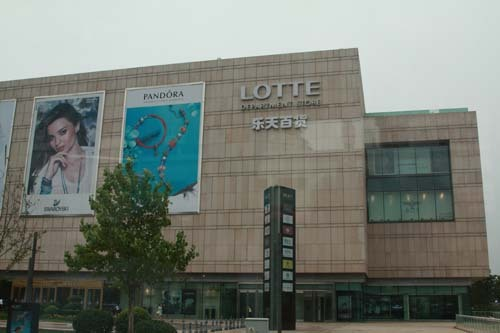  
천진외대 국제교류처 호텔방에서 내다 보이는 롯데백화점

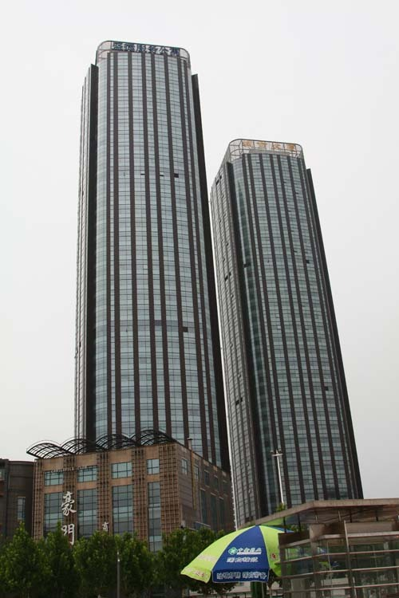  
천진시가지에서 흔히 보이는 높은 빌딩들

영욕이 퇴적된, 미래 지향의 역사 도시 천진(天津)을 찾아(1)

3월 초. 천진에서 국제학술회의가 있으니 발표를 원하는 사람은 신청하라는 연락이 왔다. ‘국제학술회의’라 해봐야 중국에서 열리는 만큼 수준이 ‘뻔할 뻔자’임을 경험으로 알고 있었지만, ‘천진’이 탐났다. 뿐만 아니라 천진에서 학술회의를 마치는 다음 날 열하(熱河)로 이동하는 일정도 들어 있었다. 이미 열하를 다녀온 나로선 흥미가 반감되긴 했으나, 13년의 세월 동안 변했을 열하가 궁금한 것도 사실이었다. <<열하일기(熱河日記)>>를 읽으며 연암 박지원의 정신세계를 흠모해 온 게 대부분의 국문학도들일 것이니, 열하는 이번 여행에서 일종의 ‘미끼상품’(?)인 셈이었다. 주최 측이 열하를 끼워 넣은 것도 그 점을 노렸기 때문이리라.

임오군란 이후 원세개(袁世凱) 일당에게 납치된 대원군이 3년 간 감금의 수모를 당한 곳. 제국주의 열강들에 의한 강제 조차(租借)로 입은 상처가 도시의 핵심부분에 고스란히 남아 있는 곳, 발해 만에서 북경으로 들어가는 관문, 등등. 천진은 적지 않은 역사적 의미를 지니고 있는 도시였다. 그러나 무엇보다 우리나라에서 가까운 곳이라 언제고 갈 수 있으리라는 생각에 지금껏 미답(未踏)으로 남겨둔 곳이었으므로, 나는 망설임 없이 참여하게 되었다.

인류 역사상 ‘가장 부도덕한 전쟁’으로 일컬어지는 아편전쟁(1840~1842)이 일어난 곳이었다. 영국과의 두 차례 전쟁에서 모두 패하고, 중일전쟁에서도 패함으로써 완벽하게 주권을 상실하게 된 중국이었다. 오랜 세월 중화주의와 동아시아 중세보편주의의 핵심 공간으로 군림해오던 중국이 ‘아차’ 하는 순간에 역사의 진운(進運)을 놓침으로써 국제사회의 ‘동네북’으로 전락된 역사적 비운의 생생한 현장이 바로 천진이었다. 그러면서도 열강 침탈의 역사를 근대화의 역사로 바꾸는 데 성공했고, 어떤 나라처럼 치욕의 현장을 쓸어버리지 않고 관광 자원으로 활용하는 대인배(大人輩)의 지혜와 금도를 보여 준 ‘미래 지향의 공간’이기도 했다.

우리가 머물게 될 이틀은 턱없이 짧은 시간이지만, 그래도 이 도시를 일별이라도 해야겠다는 욕구를 억누를 수 없었다. 서울 출발 전날 냉방병에 걸려 골골하면서도 장도에 오르게 된 것은 그 때문이었다. 10시 50분 출발 예정이던 아시아나 항공은 무슨 이유인지 30분 가까이 연발했고, 12시가 훨씬 넘어서야 천진 공항에 도착했다. 도시는 생각보다 크고 깨끗했다. 공항에서 버스에 오른 가이드는 ‘천진’이란 말의 유래부터 설명했다. 그 중 ‘천자의 나루터’란 설명이 가장 타당한 듯 했다. 즉 명 태조의 아들들 가운데 하나인 영락(永樂)이 황제에 즉위하기 전 남경 홍무(洪武)제의 손자이자 태조의 후계자인 주윤문(朱允炆)에 대항하는 싸움을 시작했는데, 그가 떠난 곳이 바로 이곳의 고강(沽江)으로서 즉위에 성공한 다음 자신이 떠난 곳에 ‘천진’이란 이름을 붙였다는 것이다. 발해로 흘러 들어가 양자강과 황하를 만나는 하이강[The Hai River; 海河]이 질펀하게 흐르고 있었다. 전반적으로 물이 많은 도시였다.

숙소인 천진외대 국제교류처 호텔에서 점심을 먹고 3시가 넘어서야 천진박물관에 들렀다. 하서구(河西區) 은하(銀河) 광장에 있는 천진박물관은 백조가 두 날개를 편 듯한 건축 양식도 일품이었지만, 소장품의 양과 질은 더욱 엄청났다. 50,000㎡의 넓이. 우리 개념으로 15,151평이 넘는 규모에 방대한 중국 전역의 고대미술품들을 소장하고 있는 곳이었다. 서예, 그림, 청동기, 도자기, 옥 공예품, 인장, 벼루, 상나라 때의 갑골문, 동전, 고문서, 근대의 각종 유물 등 20만 점이 넘는 미술품들과 역사유물들을 소장하고 있었다. 박물관의 외형이나 소장품의 규모로는 일개 시립박물관의 수준을 훨씬 뛰어 넘는 수준이었다. 중국의 근대사에서 천진이 차지하고 있는 위상이 대단했던 만큼 서구 열강들과의 갈등, 전쟁, 식민화 등의 우여곡절과 그 산물인 조계(租界)에 관련된 각종 유물이나 문서, 인물들이 복잡하지만 잘 정리되어 있었다.

 

박물관은 매우 넓었다. 세계의 유명 박물관을 두루 돌아본 경험에 미루어, 천진박물관을 대강이라도 섭렵하려면 짧게 잡아도 꼬박 이틀은 필요하다는 것이 내 판단이었다. 고작 두어 시간으로 장강대하 같은 중국사의 유물들을 둘러보는 게 가당키나 한 일인가. 5시가 땡 치자 복무원들은 가차 없이 우리를 쫓아내기 시작했다. 위층엔 올라가 보지도 못한 채 그러지 않아도 주마간산으로 시작한 박물관 투어를 마칠 수밖에 없었다. 밖에 나오니 기념물 같은 주변의 고층건물들 사이로 어둠이 차오르고 있었다. 그렇게 천진에서의 귀하디귀한 하루를 보내고 말았다.

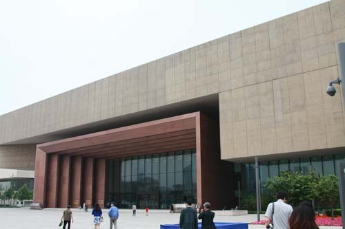  
천진박물관 입구

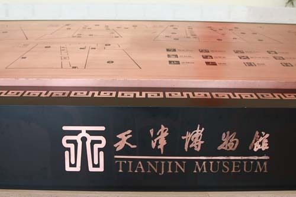  
천진박물관 내부

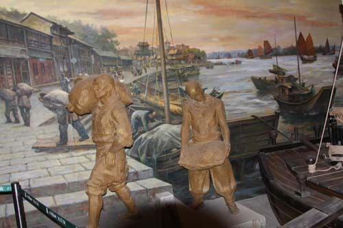  
천진박물관 소장-부두의 노동자들

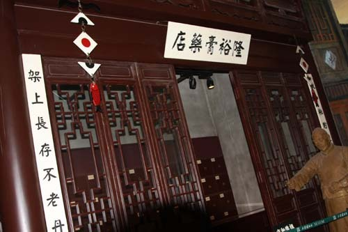  
천진박물관 소장 생활사 자료-약방

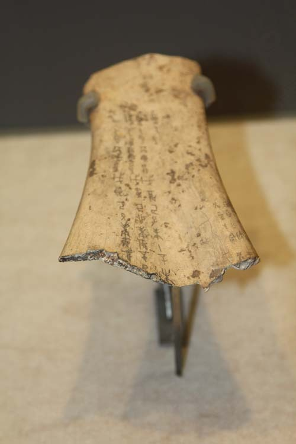  
천진박물관 소장-상나라 시대의 갑골문

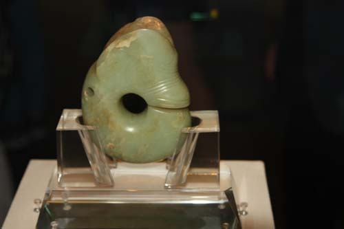  
천진박물관 소장품-신석기 시대 홍산문화에서 황옥으로 만든 pig-dragon

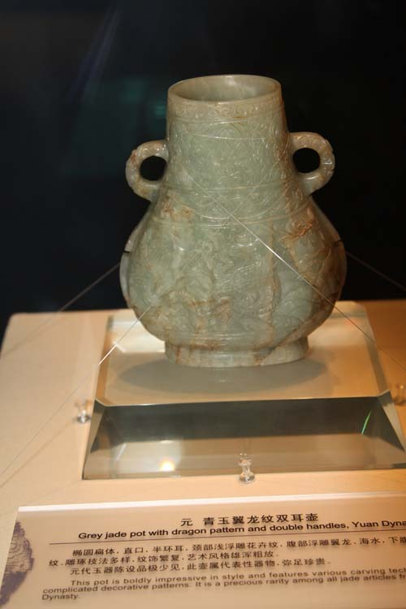  
천진박물관 소장품-원나라 때 옥날개 용무늬의 두 귀를 가진 병

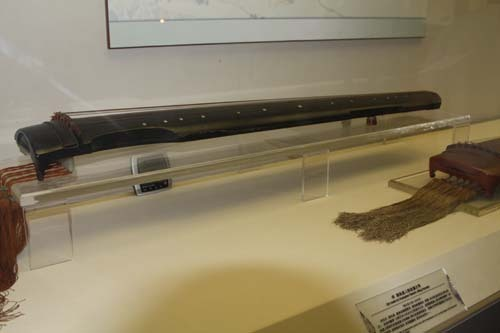  
천진박물관 소장품-명나라 때 황남도인이 제작한 익번왕금

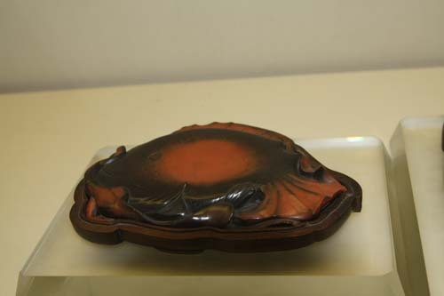  
천진박물관 소장품-명나라 때 물고기와 연꽃 모양을 朱砂로 새긴 벼루

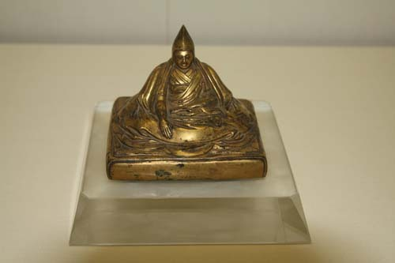  
천진박물관 소장품-청나라 때 청동으로 만들어진 달라이라마 상

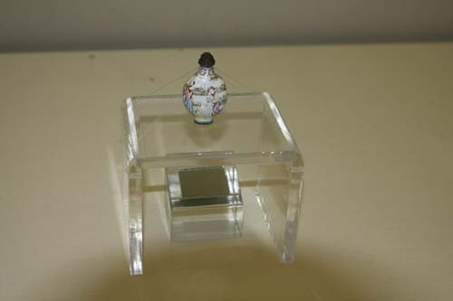  
천진박물관 소장품-청나라 때, 에나멜로 서양인들이 그려진 비연호(鼻烟壺)

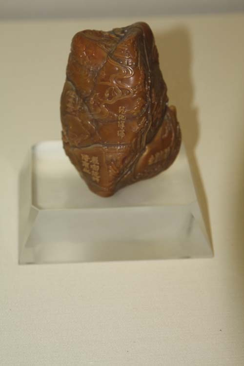  
천진박물관 소장품-청나라 때 바위 모양의 壽山 돌도장  
[남산지수(南山之壽: 남산처럼 장수하라)가 새겨져 있음]

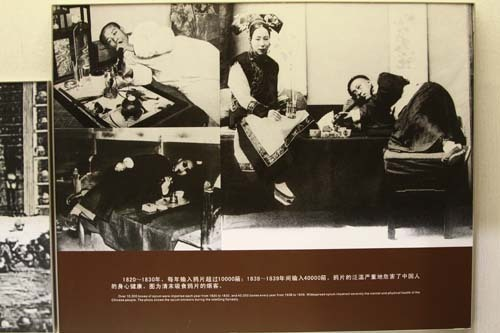  
천진박물관 소장품-19세기 초중반 아편을 탐닉하던 중국인들

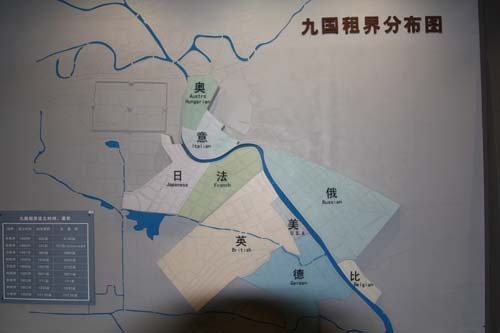  
천진박물관 소장-9개국 조계 분포도-  
오스트리아- 헝가리, 이태리, 일본, 프랑스, 러시아, 미국, 영국, 독일, 벨기에

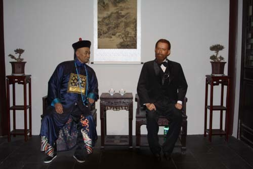  
천진박물관 소장-북양대신 이홍장과 대화를 나누는   
미국 18 대 대통령 그란트(Ulysses Simpson Grant)

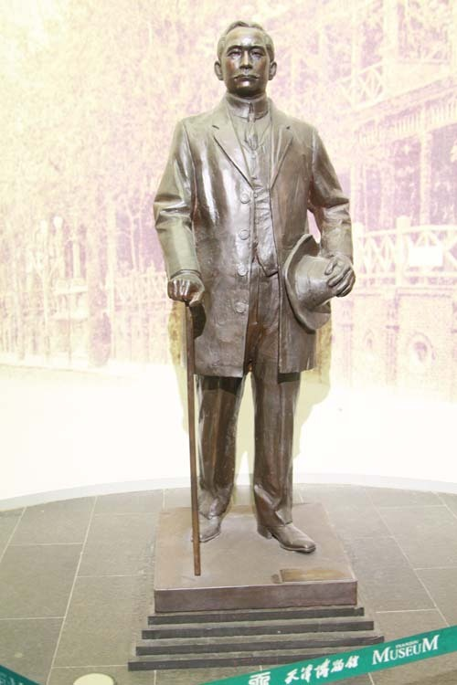  
천진박물관 소장-중국의 국부 손문상

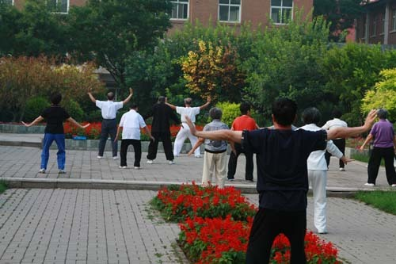  
이른 아침 공원에서 태극권을 수련하는 중국인들

공유하기

게시글 관리

**백규서옥\_Blog ver.**

[저작자표시 비영리 변경금지
(새창열림)](https://creativecommons.org/licenses/by-nc-nd/4.0/deed.ko)