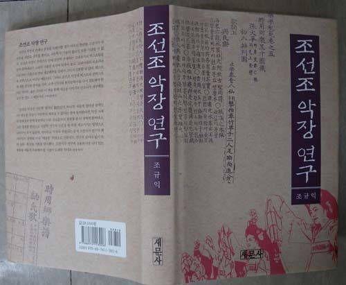
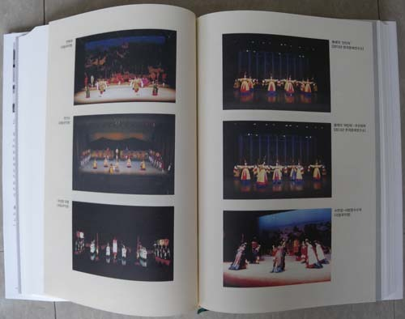
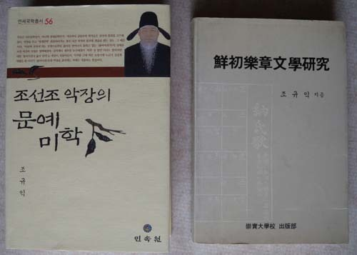

  
표지

  
내용

  
악장이 가창되던 무대예술로서의 정재들

  
우측이 첫 책(1990), 좌측이 두번째 책(2005)

새 책 <<조선조 악장 연구>>가 출간되었습니다!

오늘 새 책 <<조선조 악장 연구>>(새문사)가 나왔습니다.

저는 대학에 들어가면서 국문학에 뜻을 두었고, 대학원에 들어가면서 고전문학으로 범위를 좁혔으며, 석사논문을 쓰면서 아예 고전시가 쪽으로 방향을 잡았습니다. 20대 후반 경남대학교의 전임으로 자리를 잡으면서 같은 방향의 연구를 지속했으나, 숭실대학교로 옮긴 뒤부터는 조금씩 영역을 넓히기 시작했습니다.

그동안 제가 관심을 가져 온 여러 대상들 가운데 악장은 초기부터 꾸준히 천착하고 있는 분야입니다. 1990년에 이 분야의 첫 저서인 <<선초 악장문학 연구>>(숭실대학교 출판부)를, 2005년에 <<조선조 악장의 문예미학>>(민속원)을 각각 펴냈고, 이제 <<조선조 악장 연구>>를 펴냄으로써 저 개인의 25년 악장 연구사를 일단 마무리하고자 합니다. 물론 ‘악장에 더 이상 파낼 만한 것이 없다’는 뜻은 결코 아닙니다. 사실 내심으로는 해답을 찾지 못한 이 분야의 ‘화두(話頭)’가 한 둘 더 남아 있습니다. 그 때문에라도 마음이 바뀌어 옛날의 우물터를 다시 찾을지 알 수는 없으나, 지금 갖고 있는 앞으로의 ‘연구 스케줄’로 보면 쉽지 않을 것 같습니다. 출중한 후배들이 그들 나름의 통찰력으로 새로운 차원의 연구를 지속해 가리라 믿기 때문에 지금 제 관심의 물꼬를 다른 곳으로 돌려 보려는 것뿐입니다.

이 책의 몇 부분에서 강조했습니다만, 텍스트와 콘텍스트 및 상호텍스트에 대한 면밀한 고찰 없이는 고전시가론이나 고전시가사 혹은 국문학사는 완벽을 기할 수 없습니다. 그 가운데 특히 고려・조선의 시가문학은 비생산적 ‘동어반복’의 쳇바퀴에서 벗어날 수 없다고 봅니다. 관찬문헌인 조선조의 악서들에 고려의 악장[학계에서 말하는 이른바 ‘고려속요’]들이 기록되어 있다는 텍스트의 측면, 조선과 고려의 궁중 무대예술이라는 콘텍스트 혹은 시대・문화적 맥락의 측면, 당악을 비롯한 외래 음악이나 공연과의 연계에서 이루어지는 상호 텍스트적 측면 등을 종합적으로 고려해야 비로소 그 본질은 분명히 드러날 것입니다. 악장에 관한 책은 다시 내지 않더라도 기회 있을 때마다 논문이나 발표문 등을 통해 이 문제만은 더 심도 있게 규명해볼 생각입니다.

악장의 존재를 인지하기 시작한 초기에 비해 지금은 좀 나아졌습니다만, 그래도 악장에 대한 폄하의 분위기는 지속되고 있습니다. 예컨대, <동동>이 조선조 <<악학궤범>> ‘아박’ 정재의 창사[혹은 악장]로 기록되어 있는 사실을 잘 알면서도 고려의 시대・정치・문화적 맥락으로만 재단하려는 관성이 바뀌지 않고 있는 점은 아주 흥미롭습니다. <<고려사 악지>>를 비롯한 몇 기록들에 간단히 기록된 ‘동동’ 관련 언급이 학자들의 생각을 아직도 지배하고 있는 점으로도 분명해지는 문제입니다. ‘동동’이란 노래가 고려 궁중에 수용되어 속악정재라는 무대예술로 꾸며질 때 이미 존재하던 당악정재들의 양식이 그 표본으로 작용했을 가능성은 처음부터 상상도 하지 못하고 있는 것입니다.

“動動之戱 多有頌禱之詞 盖效仙語而爲之 然詞俚不載”라는 말에서 ‘선어(仙語)’란 말을 엉뚱하게 해석해온 것을 그 분명한 예로 들 수 있습니다. 헌선도(獻仙桃), 수연장(壽延長), 오양선(五羊仙) 등 당시에 성행하던 당악정재들 속의 선모(仙母)를 비롯한 신선(神仙)들이 잔치 자리의 좌상객인 임금에게 바치던 ‘송도(頌禱)의 말’이 바로 ‘선어’[즉 ‘신선의 말’]이었음을 몰랐던 것입니다. 말하자면 당시 조성되어 있던 상호 텍스트적 상황에 대한 무지에서 비롯된 해프닝이었습니다. 원천적으로 고려노래의 정체는 대부분 궁중의 음악에 쓰이던 악장들이었다는 점과, 조선조 악장의 모범적 선례가 고려의 악장이었다는 점만 인지했다면 간단히 해결될 수 있는 문제였습니다. 이 경우는 악장 연구로 얻을 수 있는 단편적 소득에 불과합니다만, 연구하기에 따라서는 앞으로 이것 말고도 다른 많은 것들이 밝혀지리라 봅니다.

참고로 이번에 출간된 책의 목차를 이곳에 들어놓겠습니다.

제1부 총서: 지속과 변이의 원리, 그 구현체로서의 조선조 악장을 바라보며

Ⅰ. 계승과 극복 대상으로서의 고려악장

Ⅱ. 조선조 악장에 나타나는 지속과 변이의 양상

Ⅲ. 전환의 양상: 포괄화・추상화에서 구체화로

Ⅳ. 앞 시대 유산의 포용과 새로운 정체성의 추구

제2부 아악악장: 텍스트 및 주제의식의 중세적 관습성

▪왕조와 통치이념의 정당성, 제례악장의 모범적 선례: <문선왕 악장>

Ⅰ. 석전과 <문선왕 악장>

Ⅱ. <문선왕 악장>의 원형과 수용과정

Ⅲ. <문선왕 악장>과 조선조 아악악장의 형성

Ⅳ. <문선왕 악장>의 악장사적 위상

Ⅴ. <문선왕 악장>과 제례악장의 중세적 보편성

▪왕조 존립과 영속의 당위성 및 자신감: <사직악장>

Ⅰ. 사직제의 위치

Ⅱ. <사직악장>의 텍스트 양상과 내용

Ⅲ. 악장제작의 관습과 <사직악장>의 위상

Ⅳ. <사직악장>의 중세적 보편성과 특수성

▪먹거리의 풍요에 대한 기원과 애민의식: <선농악장>

Ⅰ. 선농과 선농제

Ⅱ. <선농악장>의 텍스트와 주제의식

Ⅲ. <친경악장>의 텍스트와 주제의식

Ⅳ. 악장사적 위상

Ⅴ. <선농악장>과 <친경악장>의 중세적 보편성

▪입을 것의 풍요에 대한 기원과 애민의식: <선잠악장>

Ⅰ. 선잠제와 <선잠악장>

Ⅱ. 선잠제 전통의 정착과 의미

Ⅲ. <선잠악장>의 텍스트 양상과 주제의식

Ⅳ. 악장사적 위상

Ⅴ. <선잠악장>의 중세적 보편성

▪우순풍조를 통한 백성들의 안녕과 풍요 기원: <풍운뇌우 악장>

Ⅰ. 풍운뇌우 제의와 <풍운뇌우 악장>

Ⅱ. 풍운뇌우 제의의 전통과 정착과정

Ⅲ. 풍운뇌우 악장의 텍스트 양상 및 내용

Ⅳ. 변계량 악장의 變改 문제

Ⅴ. <풍운뇌우 악장>과 중앙집권적 통치철학

제3부 향・당악악장: 텍스트 및 주제의식의 실험성과 조선조 악장의 독자성

▪천명에 의한 개국의 업적 찬양, 왕조의 무궁함 기원: <문소전 악장>

Ⅰ. 문소전 제례와 <문소전 악장>

Ⅱ. <문소전 악장>의 문헌적 양상 및 내용의 짜임

Ⅲ. 악장사적 위상

Ⅳ. <문소전 악장>과 정격 악장의 맥

▪왕조의 문화적 자부심과 독자적 미학의 발현: <석전음복연악장>

Ⅰ. 석전제와 음복연

Ⅱ. ‘신찬 등가악장’의 내용적 짜임과 주제의식

Ⅲ. 악장 제작의 방법 및 시가문학사적 의의

Ⅳ. <석전음복연악장>의 독자성과 문화적 자부심

▪창업과 수성, 경천근민의 이상적 치도: <창수지곡>과 <경근지곡>

Ⅰ. 제례 속의 음복연 절차와 두 노래

Ⅱ. 두 작품의 내용 및 악장사적 위상

Ⅲ. 제작상황

Ⅳ. <용비어천가>의 제작원리와 <창수지곡>・<경근지곡>

▪새 장르의 노래를 통한 합리적 생활윤리의 제시: <오륜가>

Ⅰ. 궁중악장 <오륜가>

Ⅱ. <오륜가>의 존재양상 및 의미

Ⅲ. <오륜가> 작자 및 창작 토양으로서의 시대 상황

Ⅳ. <오륜가), 지배이데올로기의 경기체가 식 표출

▪여민동락・감응형통・취포절제・경천근민의 가르침: 봉래의 악장

Ⅰ. 조선조 최대의 창작악무 봉래의, 그리고 <용비어천가>

Ⅱ. 악무 명칭의 문헌적 근거와 악장 내용의 상관성

Ⅲ. 봉래의 악장에 아로새긴 세종의 철학, 왕조의 이상

▪제왕의 통치이념을 선양한 언어구조물: 봉래의 진・퇴구호

Ⅰ. 진・퇴구호와 악장

Ⅱ. 봉래의 진・퇴구호와 악장의 의미적 상동성

Ⅲ. 봉래의 진・퇴구호의 텍스트 양상과 주제의식

Ⅳ. 봉래의 악장의 주제의식과 진・퇴구호

제4부 다른 각도에서 본 조선조 악장의 본질적 속성

▪정재 악장에서 확인되는 송도 모티프와 선계 이미지의 연원 및 지속양상

Ⅰ. 궁중악장과 콘텍스트로서의 송도 문화 및 선계 이미지

Ⅱ. 송도 모티프의 초기 양상

Ⅲ. 송도 모티프의 지속 및 확산과 문화적 의미

Ⅳ. 조선조 후기 창작 정재들과 선계 이미지의 변주

Ⅴ. 정재 및 정재 악장의 선계 이미지, 그 지속과 변이의 문화적 의미

▪시조와 궁중악장의 관계

Ⅰ. 악장과 시조가 공존하던 시공, 조선조

Ⅱ. 악장과 시조의 연계, 그 외연과 내포

Ⅲ. 악장과 시조, 새로운 관계 설정의 가능성

▪북한문학사와 악장

Ⅰ. 악장에 대한 일반적 관점과 북한문학사

Ⅱ. 북한문학사의 악장관

Ⅲ. 악장을 왜곡시킨 북한문학사의 이념적 경직성

▪고전시가교육과 조선조 ‘고려속가 악장’의 텍스트 및 콘텍스트: <동동> 지도론

Ⅰ. 고전시가와 고전교육, 그리고 악장

Ⅱ. 교육과정과 고전시가교육의 현실

Ⅲ. ‘동동’의 속성 및 환경

Ⅳ. 고전시가 교육과 복합 텍스트로서의 궁중악장

제5부 총결: 악장에 그려진 왕조의 이상과 현실, 그 거리를 음미하며

강호 고사(高士)들의 지도와 편달, 부탁드립니다.

2014. 7. 31.

백규

공유하기

게시글 관리

**백규서옥\_Blog ver.**

[저작자표시 비영리 변경금지
(새창열림)](https://creativecommons.org/licenses/by-nc-nd/4.0/deed.ko)