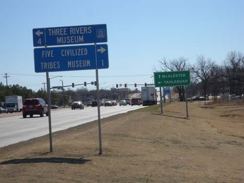  
무스코기 초입의 이정표

  
무스코기 초입에서 만난 인포메이션 센터

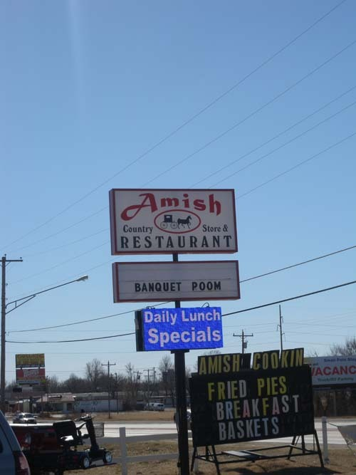  
아미쉬 레스토랑의 표지판

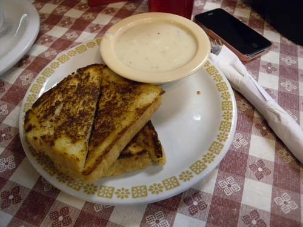  
아미쉬 레스토랑의 정갈하고 소박한 음식

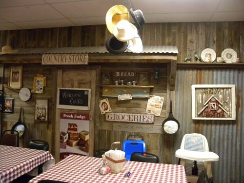  
아미쉬 레스토랑의 내부

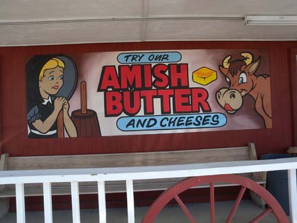  
아미쉬 버터 및 치즈 광고판

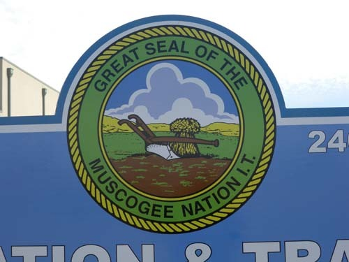  
무스코기 네이션의 문장(紋章)

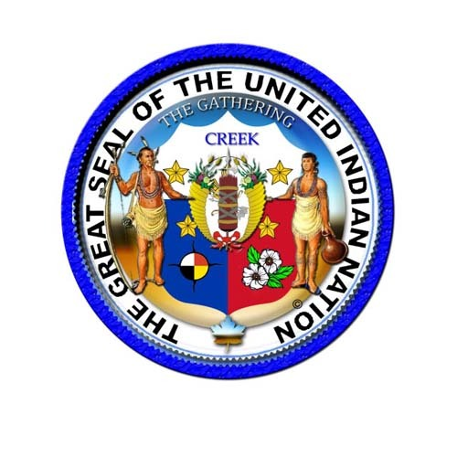  
연합 인디언 네이션의 문장

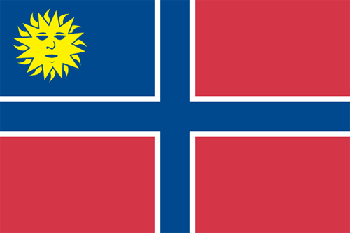  
무스코기 네이션의 국기

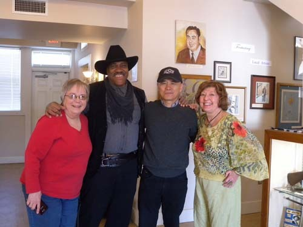  
삼강박물관(The Three Rivers Museum)에서 큐레이터들 및 보안관과 함께

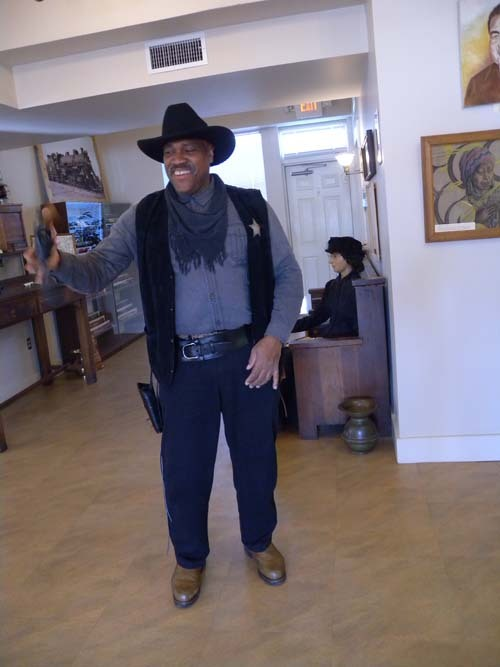  
보안관의 현란한 '권총 돌리기'

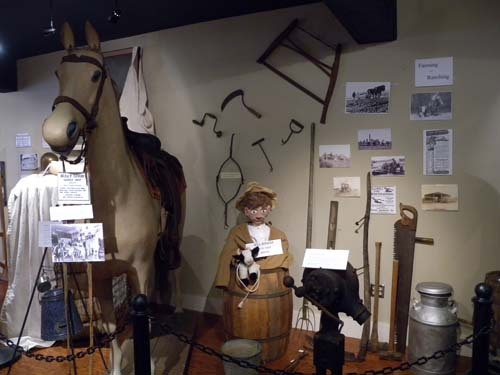  
삼강박물관의 생활사 자료

크릭(Creek) 족의 꿈과 현실을 찾아

2014년 2월 24일 아침 8시 오클라호마시티 ‘윌 라저스 공항[Will Rogers World Airport]’ 발 유나이티드 아메리카 항공편으로 시카고 오헤어 공항으로 이동, 한국행 아시아나에 몸을 실으면 미국 생활은 끝이었다. 그래서 이 땅에 남은 미련을 남김없이 태우고자 21-22일 크릭 인디언들의 집거지를 거쳐 출발 전날 오클라호마 시티에 입성하기로 했다. 무스코기(Muscogee)와 오크멀기(Okmulgee)에 모여 산다는 크릭 인디언들을 만나기 위해 털사(Tulsa) 방향의 동쪽 우회로를 택하기로 한 것이다.

체류하는 동안 오클라호마에 거주하는 39개 인디언들 가운데 겨우 10여개 부족들을 접한 우리였다. 그 10여개 부족들 가운데는 이른바 ‘문명화된 다섯 부족들[The Five Civilized Tribes: 체로키(Cherokee), 치카샤(Chickasaw), 촉토(Choctaw), 크릭(Creek/Muscogee), 세미놀(Seminole)]이 포함되어 있었는데, 그 가운데 오클라호마 동쪽의 크릭은 마지막 코스로 남겨 두고 있었던 것이다. 미국인들은 이 다섯 부족들을 ‘Civilized Tribes’로 부르고 있었으나, 그동안 우리는 그 말에 대해서 상당한 거부감을 갖고 있었던 게 사실이다. ‘civilized’를 ‘문명화된’으로 번역할 경우, 그동안 우리가 만난 여타의 인디언들은 뭐란 말인가. 우리가 보기에 그들 역시 이미 문명화된 미국 사회의 일원으로 훌륭하게 살고 있었기 때문이다. 인디언의 역사와 문화를 전공하고 있는 OSU 역사과의 모제스(Dr. L. G. Moses) 교수에게 물었더니, 이 다섯 부족들이 ‘식민시대나 초기 미 연방시대에 앵글로 색슨 계열 정착자들의 생활방식이나 관습을 수용, 그들과 선린관계를 맺어오면서 문명화되었음’을 뜻하는 말이라고 했다. 내가 그 말을 ‘미국화’로 바꾸어 이해해도 무방하겠다고 생각한 것은 그 때문이었다.

2월 21일. 겨울날씨치곤 쨍쨍하게 맑고 온화했다. 이 땅을 떠나기로 되어 있는 24일까지 만 3일. 하룻밤은 인디언 구역에서, 나머지 이틀 밤은 오클라호마시티에서 보내기로 했다. 짐가방들을 트렁크에 때려 실은 우리는 렌터카를 몰고 학교를 한 바퀴 돈 뒤 177번, 412번, 44번 하이웨이 등을 번갈아 타면서 무스코기로 달렸다. 털사로부터 한 시간쯤이나 달렸을까. 무스코기 초입의 길가에 자그마한 관광안내소[Muskogee Tourist Information Center]가 나타났고, 그 건너편에 참한 식당 하나가 숨듯 서 있었다. 이곳에서 ‘아미쉬 레스토랑[Amish Restaurant]’을 만나다니! 행운이었다. 전통 기독교 교회공동체 아미쉬. 메노파(Mennonite) 교회들과 비슷하지만 다른 집단이다. 그들은 스위스 아나뱁티스트(Anabaptist)  즉 ‘재세례파(再洗禮派)’[16세기 종교개혁의 급진적 좌파 운동 집단으로서 유아세례를 부정, 죄와 믿음을 공개적으로 고백하고 성인세례를 받는 것만이 타당한 세례라고 보았음]와 근원을 공유한다. 단순한 생활, 검소한 복장, 문명과 기술의 이기(利器) 등을 기피하는 그들이었다. ‘목마른데 옹달샘 만난 격’으로 여기서 그들이 운영하는 식당을 만나게 된 것. 앤틱 풍의 인테리어가 약간은 생소했으나, 벽면 가득 옛날 장식품들이 편안해 보였고 이들만의 풍미(風味) 또한 일품이었다.

다시 관광안내소로 돌아와 체구 좋은 중년 여성 자원봉사자의 친절한 설명을 들었다. 무스코기라 지칭하기도 하는 크릭 족은 오클라호마 주에 근거를 두고 있으며, 현재 이곳 외에 앨라배마・조지아・플로리다 등에도 분포되어 있었다. 우리가 이미 만나 본 세미놀 족 역시 이들처럼 무스코기 어[크릭 어]를 사용하는, 가까운 부족이었다. 원래 무스코기 족은 오늘날 테네시・조지아・앨라배마 주에 걸쳐 흐르는 테네시 강을 따라 건축물을 쌓았던 미시시피 문명의 후예로 추측된다. 미시시피 문명을 이룬 사람들 가운데 최대의 공동체는 ‘카호키아 토성터[Cahokia Mounds]’로부터 나왔으리라 추정되는데, 이미 그 시대에 계급화된 사회나 상속이 이루어지던 종교적・정치적 집단이 생겨나 미국의 중서부와 동부를 800년부터 8세기 가까이 지배하고 있었다. 우리가 보고 있는 무스코기 족이 바로 그 후손들이었던 것이다.

그들은 초기에 개척자로 등장한 스페인 사람들과 많은 갈등을 빚었고, 그 가운데 탐험대를 이끌고 나타난 스페인 사람 데소토와 ‘마빌라 전투’를 벌이기도 했다. 데소토의 탐험대가 퍼뜨린 전염병으로 많은 인디언들이 죽어 인구가 급격히 감소되었고, 결국 미시시피 문명도 붕괴되기에 이르렀으나, 살아남은 인디언들 가운데 무스코기 어를 쓰는 사람들이 무스코기 부족 혹은 무스코기 부족 연합으로 다시 뭉치게 된 것이다.

1866년 새 정부를 세운 크릭 족은 오크멀기를 수도로 정했고, 1867년에 세운 의사당을 1878년엔 더 크게 확장했다. 우리가 돌아본 크릭 네이션 의사당은 ‘국가의 역사적 랜드마크’로서 크릭 족 의사당 박물관으로 사용되고 있었다. 크릭 족은 번영기였던 19세기 마지막 10년 동안 학교・교회・공공건물 등을 지었는데, 이 시기 이 종족은 자치조직을 갖고 있었으며 그로 인해 연방정부로부터는 최소한의 간섭만 받고 있는 상태였다.

1898년 ‘커티스 법[Curtis Act]’에 의해 부족 정부가 해체되었고, ‘도스 할당법[Dawes Allotment Act]’에 의해 부족의 임대 토지는 사라지게 되었다. 도스 위원회는 부족원들을 ‘혈통에 의한 크릭 족’과 ‘자유민으로서의 크릭 족’으로 나누어 등록을 했다. 그런데 그들은 부족원들이 갖고 있는 크릭 혈통의 비율에 상관없이 아프리카 혈통만 인정되면 누구나 그 범주에 분류해 넣었던 것이다. 1906년 4월 26일, 미합중국 의회는 1907년에 오클라호마가 주의 자격을 인정받을 것으로 예상, ‘1906년 문명화된 다섯 부족 법안’을 통과시키게 되었다. 이런 일들이 진행되는 동안 크릭 족은 8,100㎢의 땅을 비원주민 정착자들과 정부에 빼앗기고, 그 후에야 ‘1936년 오클라호마 인디언 복지법’ 아래 일부 무스코기 족 도시들은 연방의 승인을 받게 된 것이다. 크릭 네이션은 1970년까지 재조직되거나 연방의 인정을 다시 얻지 못하다가 1979년에야 1866년의 헌법을 대체하는 새 헌법을 만들어 비준하게 되었다. 1976년 하르호(Harjo)와 클레피(Kleppe) 간의 법정 소송사건으로 미합중국의 가부장주의는 종식되고, 민족자결권이 고양되었다. 크릭 네이션은 후손들의 구성원 자격을 결정하기 위한 기초로 도스 법의 명단을 이용, 58,000명이 넘는 할당자들과 그들의 자손들을 등록시키기에 이른 것이다.

현재 크릭 족의 인구는 69,162명, 주요 거주지는 미국의 오클라호마 주이며, 종교생활은 기독교[특히 침례교와 감리교]와, 종교적・정치적・전통주의적 조직인 ‘네 엄마들의 결사(結社)[Four Mothers Society]’를 중심으로 영위되고 있는 것이 특이했다. 특히 크릭, 체로키, 촉토, 치카샤 등 네 종족이 주로 그들의 땅을 비원주민 이주자들에게 할양하도록 한 도스 법이나 미 의회의 법안 활동 등에 반발하여 결성한 복합적 조직이 바로 이것이었다.

인포메이션 센터의 직원으로부터 무스코기와 오크멀기에 관한 풍부한 정보를 얻은 다음 본격적인 탐사에 나섰다. 먼저 언덕 위의 ‘Five Civilized Tribes Museum’에 들렀는데, 1850년 5월 26일에 세워진 ‘무스코기 네이션’의 옛 건물을 쓰고 있었다. 그러나 들어가 보니 소장품은 별스럽지 않았다. 1층에는 다섯 부족의 휘장[seal]들과 사진 몇 장이 걸려 있었는데, 사진조차 찍지 못하게 했다. 1층에서 올려다보니 2층에도 식탁이나 의자 등 생활사 자료들이 몇 가지 진열되어 있을 뿐이어서 사진을 찍지 못하게 하는 이유를 어렴풋이나마 깨달을 수 있었다. 이미 다른 네 부족들을 찾아 그들 문화와 역사유물들의 진수를 맛보고 온 우리였다. 그러한 유물들의 일부를 복제하여 모아 놓고 ‘Five Civilized Tribes Museum’의 간판을 붙인 뜻은 좋았으나, ‘통합문화’를 보여주기엔 턱 없이 모자라는 컬렉션이었다.

약간의 실망감을 안고 무스코기 시내로 달려 들어갔으나, 이곳 역시 다른 도시들과 마찬가지로 경기가 안 좋아서인지 기름기가 빠져 있었다. 간판마저 흐릿하게 퇴색되고 있는 옛 건물들만 경기가 좋았던 그 시절의 분위기를 암시하고 있을 뿐 널찍한 시내 도로들에는 먼지만 날리고 있었다. 우리는 옛날의 역사(驛舍)를 재활용하여 만든 ‘삼강박물관[Three Rivers Museum]’을 방문했다. 잘 나가던 시절 카우보이들이 텍사스나 오클라호마의 중남부로부터 몰고 온 소떼들을 열차에 싣고 동부로 나아가던 오클라호마 주의 출구가 바로 이곳이었다. 카운터에 앉아 있던 여성 자원봉사자 한 분이 오랜만에 만나는 외국 손님에 당황했는지 허둥거리며 친절을 베풀었다. 큰 역사를 박물관으로 개조한 만큼 세련되지는 않았으나, 오클라호마 주의 어디에서나 볼 수 있는 현장감이 이곳에서도 물씬 풍겨났다. 잠시 후 그 여성이 전화로 호출한 정식 큐레이터가 달려왔고, 그녀로부터 박물관을 꽉 채운 각종 생활사 자료들에 대한 설명을 들었다. 설명이 다 끝나갈 무렵 크릭 인으로 보이는 건장한 체구의 보안관이 들어왔다. 홀을 꽉 채울 듯 거대한 몸집의 그는 꽤나 붙임성이 좋았다. 대대로 이 도시에서 살아온다는 그는 보안관이라는 자신의 직책에 큰 자부심을 갖고 있는 듯 했다. 무엇보다 한국에 대한 호감을 갖고 있었으며, 자신의 가계와 이 도시에 대한 자랑을 늘어놓기 바빴다. 급기야는 우리를 환영하려는 의도였는지 자신의 권총을 빼내 현란한 손놀림을 보여주기도 했다. 밖에 놓인 열차 유물까지 둘러 본 다음, 친절한 사람들로부터 간신히 빠져 나온 우리는 즉시 차를 몰아 1시간 거리의 오크멀기에 도착, 1박을 하게 되었다.

토요일인 다음날 오크멀기의 탐사에 나섰다. 공공기관이나 박물관 등은 대부분 문을 닫은 상태. 하는 수 없이 도심 주요부분들을 걸어 다니며 느껴보기로 했다. 윤기가 빠진 점은 다른 도시들과 같았으나, 규모가 제법 컸다. 오클라호마 주 오크멀기 카운티의 도시이자 남북전쟁 이래 크릭 네이션의 수도였던 곳이다. 그 명칭 ‘Okmulgee’는 영어로 ‘끓는 물(boiling water)’를 뜻하는 크릭 단어 ‘oki mulgee’에서 나왔다는데, ‘졸졸 흐르는 시내[babbling brook]’ 혹은 ‘증발・악취[effluvium]’ 등으로도 번역된다는 점을 감안하면, 이곳은 분명 노천온천 지역이었을 것이다. ‘악취 나는 끓는 물’이라면 아마도 유황온천이었으리라. 인근의 체로키 네이션에서 발견한 그들의 환영사 ‘Osiyo[오시오]’를 내가 우리말 ‘(어서) 오시오’에서 나온 것으로 해석했듯이, ‘oki mulgee’ 는 ‘아쿠 (뜨거운) 물!’로부터 나온 것이나 아닐까 상상해 보았으나, 근거를 대지 못하는 한 부질없는 생각일 수밖에 없을 것이다.

남북전쟁 이후 내내 크릭 네이션의 수도였던 만큼 시내 곳곳에 고풍스런 자취가 많이 남아 있었다. 33.2㎢의 넓은 땅에 2010년 기준 12,321명의 인구가 분산되어 살고 있으므로 한산할 수밖에 없지만, 전체적으로 기름기는 빠져 있었다. 우리가 찾으려 한 ‘오크멀기 다문화 역사 박물관[Okmulgee Multicultural Historical Museum]’을 길가에서 발견하고 차를 멈추었으나, 이미 문을 닫은 채 ‘이전했다’는 메모만 문 앞에 걸려 있었다. 주변에 물었으나, 어느 곳으로 갔는지 아는 사람이 없었고, 찾아간들 토요일에 문을 열었을 리 없어, 하릴없이 무스코기 네이션 본부가 위치한 곳을 찾았다. 이미 130여년이나 지난 시기의 건물들이 넓은 땅에 여유롭게 늘어서 있었다. ‘무스코기 네이션 크릭 의사당[Muscogee Nation Creek Council House]’, ‘크릭 의회[Creek Capitol]’, ‘크릭 네이션 수도 청사[Creek Nation Capital]’ 등 단순 소박한 건물들이 주변의 상가들과 행복한 어울림을 이루고 있었다. 1867년 조직된 크릭 네이션의 수반 코우치먼[Ward Coachman] 시대에 오크멀기는 수도로 지정되었고, 1870년에는 ‘오크멀기 헌법’도 제정되었다. 수도 청사 의사당 건물 뒤편의 잔디밭에는 어딜 가나 볼 수 있는 인디언 관련 유물들이 늘어서 있었고, 그 가운데 ‘눈물의 행진[Trail of Tears]’ 표지가 버티고 서 있었다. 미국이 인디언 특히 크릭 족에 대하여 자행한 횡포를 고발하는 내용임은 물론이다. 어느 인디언 네이션에 가도 ‘Trail of Tears’ 표지가 서 있는 곳은 눈에 가장 잘 띄는 곳이다. 인디언들에게 가한 미국의 원죄는 인디언이 살아 있는 한 업보가 되어 그들을 괴롭힐 것임을 이 표지판은 말해주고 있었다.

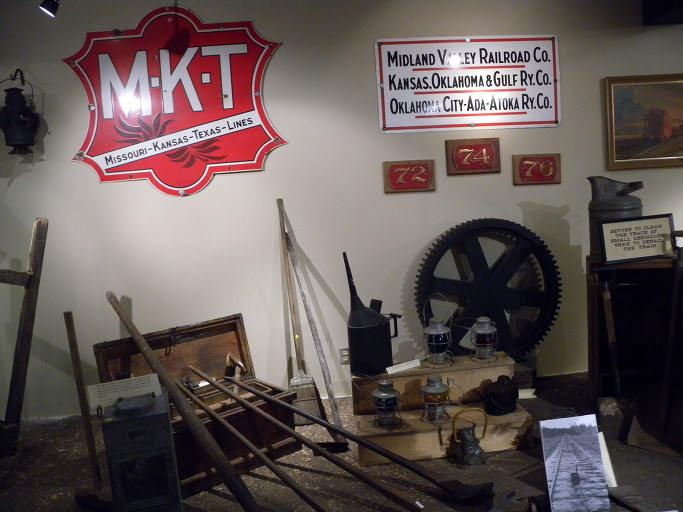  
삼강박물관의 생활사 자료[MKT 라인, 즉 '미주리-캔자스-텍사스' 간 철도 노선에서 사용되던 각종 물건들]

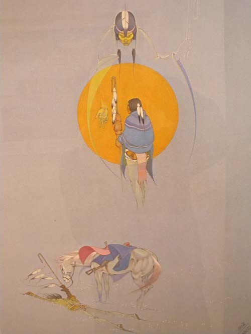  
삼강박물관에 소장된 인디언 관련 그림[승천하는 전사의 영혼?]

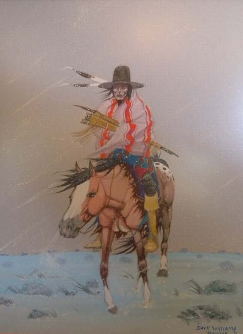  
삼강박물관에 소장된 인디언 관련 그림[크릭 족 전사?]

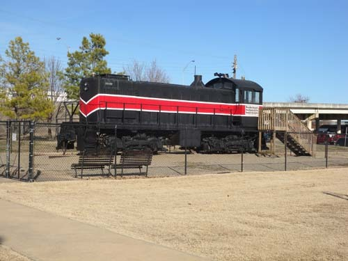  
삼강박물관에 전시된 당시 기관차

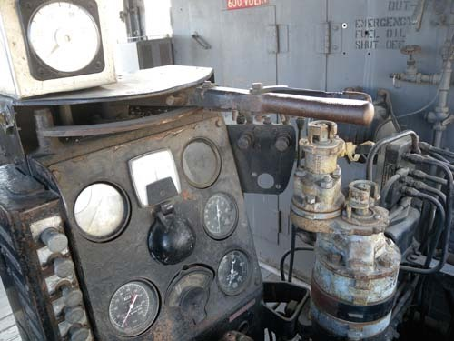  
박물관에 전시된 기차의 기관실

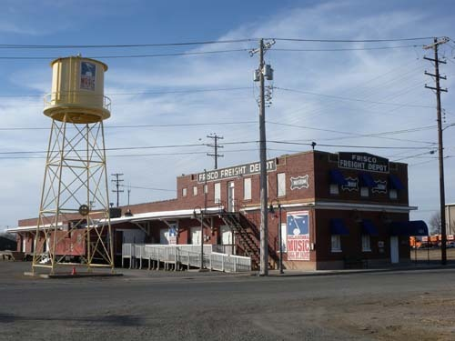  
지금은 박물관과 음악 홀로 쓰이는 당시의 화물열차 역

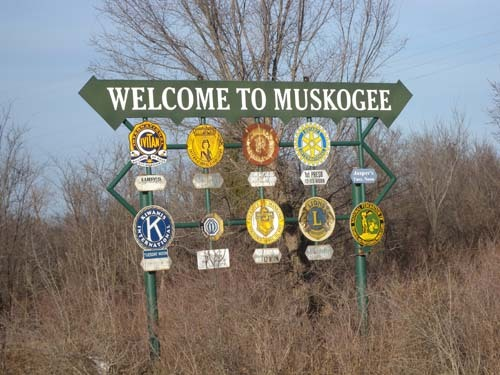   
무스코기 초입의 환영 표지판

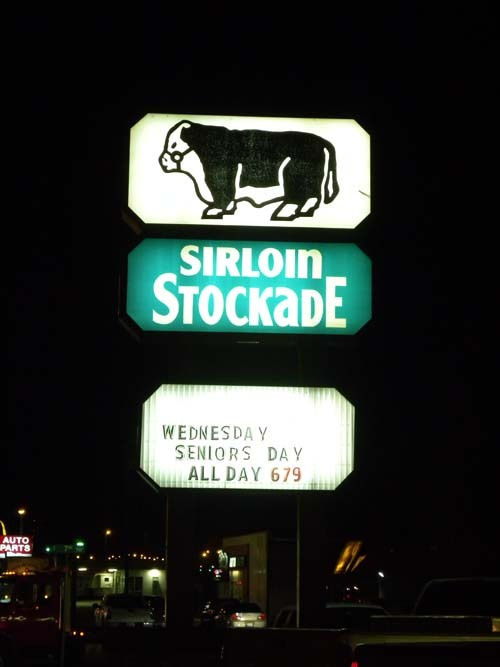  
오크멀기에서 저녁을 먹은 집[값싼 등심이 맛있는 집]

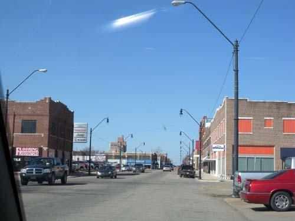  
한산한 오크멀기 시가지

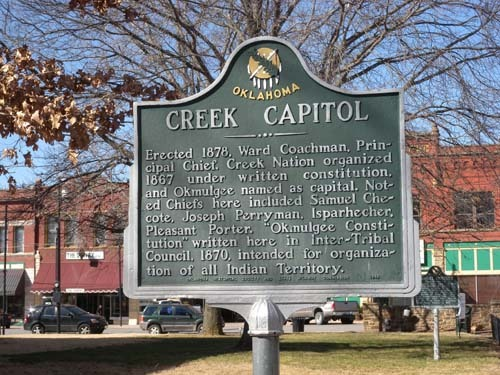  
크릭 네이션 의사당

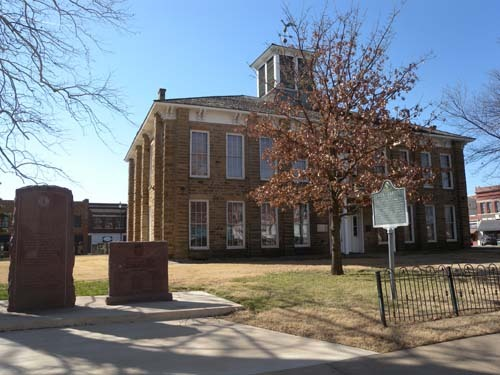  
크릭 네이션 의사당

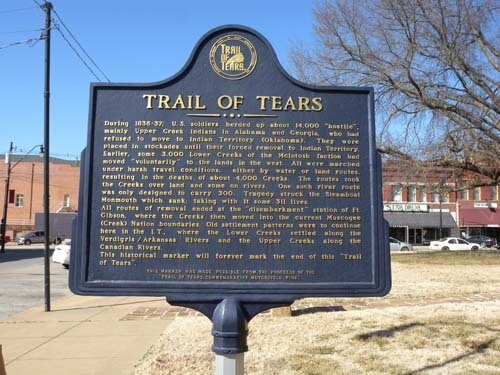  
'눈물의 여정' 설명판

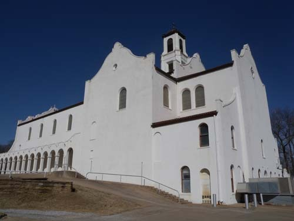  
빠두아의 성 안토니 가톨릭 교회

의사당을 떠난 우리는 널찍널찍한 주택가를 배회하다가 크고 멋진 교회들을 만났다. 그 가운데는 미국에서 보기 드문 천주교 성당도 있었다. 이름은 ‘빠두아의 성 안토니 가톨릭 교회[St. Anthony of Padua Catholic Church]’. 천주교 신자인 아내의 말대로 그곳을 방문하게 되었다. 성당 뒤편 주차장에 차를 대는데, 작은 차 한 대가 또르르 달려왔고, 문이 열리면서 로만칼라 복장의 연세 지긋하신 신부 한 분이 의상을 손에 들고 급히 나와 성당 안으로 들어가는 것이었다. 이곳에 들어오면서 미사가 있다고 공지되어 있는 것을 본 터라 우리도 부랴부랴 성당 안으로 들어갔다. 미사 예정 시각이 지나 있었기 때문이다. 그런데 성당 안은 텅 비어 있는데, 아까 들어온 신부가 촛불을 붙이고 있었다. 인사를 하고 물으니 오늘 특별 미사가 있는데, 아직 수녀가 당도하지 않아서 당신이 직접 미사 준비를 하고 있다는 것이었다. 한국에서 온 관광객이라 하자 반색을 하며 우리를 위해 포즈를 취해 주었다. 휑하니 넓은 성전에는 우리 둘 만 앉아 있었고, 신부 혼자 미사 준비에 분주한 모습이었다. 참 겸연쩍었다. 최소한 한 시간 가까이 걸릴 미사에 우리 둘만, 그것도 천주교 신자로는 아내 한 사람만 참여하는 셈이니, ‘참으로 기이하고 멋쩍은 경험’ 아닌가.

‘우린 갈 길이 바쁘니 어여 나갑시다!’ 신부가 옷을 입으러 들어간 틈에 나는 아내의 옆구리를 찔렀다. 나의 표정이 완강해 보였던지 아내도 마지못해 따라나선다. 밖으로 나오며 생각하니 참으로 미안하고 안쓰러웠다. 특별미사에 신도는 하나도 없고, 그나마 찾아온 한국인 관광객 두 명마저 종적이 묘연하게 사라지고 말았으니, 미사복을 입고 나온 신부는 얼마나 황당했을까. 7~8년 전 유럽 자동차 여행에 나섰을 때의 기억이 떠올랐다. 상당수의 성당이나 교회들은 주일날에도 문이 닫혀 있었다. 주일 예배에 참여하고자 하이델베르그의 한 교회에 갔더니 교회 문은 열려 있었으나 목사 한 분이 앉아서 무료하게 책을 읽고 있을 뿐이었다. 서구사회에서 교회가 망하고 있음을 절감한 순간이었다. 그래서인가. 이 성당 정면엔 ‘미국정신과 함께 가톨릭 정신이 꺼지지 않도록 노력하며[Keeping Catholicism Alive With American Spirit]’라고 쓰인 걸개가 늘어져 있었다. 그에 비해 프로테스탄트 교회들은 아직 살아 움직이고 있었다. 교회에 모여 활동을 벌이는 젊은이들은 미국 사회에 뿌리내린 신교의 힘을 보여주고 있었다.

도시 외곽에 자리 잡은 OSU 무스코기 캠퍼스를 거쳐 ‘무스코기 참전용사 비’, ‘무스코기 크릭 네이션 지방법원’ 등을 일별한 다음 마지막 행선지 오클라호마시티를 향해 40번 하이웨이에 접어들면서 우리의 크릭 탐사는 끝이 났다.

\*\*\*

크릭 족을 대면하기 위해 무스코기와 오크멀기를 찾았으나, 박물관의 유물이나 건축물로 남아 있는 삶의 흔적만 보았을 뿐, 그들의 종적은 없었다. 그렇다. 아직도 검붉은 얼굴에 검은 머릿결을 날리는 그들의 모습이 유지될 리는 없을 것이다. 아니 그렇게 하는 것이 바람직한 일도 아닐 것이다. 나와 다른 모습의 이웃들과 섞이고 사랑함으로써 나를 변모시키는 것만이 살아남는 길이었을 터. 그러나 신화 속에 살아 숨 쉬는 인디언들의 문화나 의식도 언젠간 새로운 시대 삶의 원리로 부활될 수 있으리라. 돌고 도는 것이 세상 이치라면, 지금 위세를 떨치는 서구문화의 끝판 어디쯤에서 그 옛날 인디언들이 영위하던 생활양식이나 정신이 그들의 이름을 잊어버린 채 새로운 삶의 원리로 사람들을 고양(高揚)시키게 되리라. 그 때를 기다리며 은인자중하며 살아가는 크릭 인들을 우리는 여기서 만난 것이다.

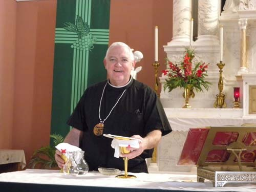  
빠두아의 성 안토니 가톨릭 교회의 사제

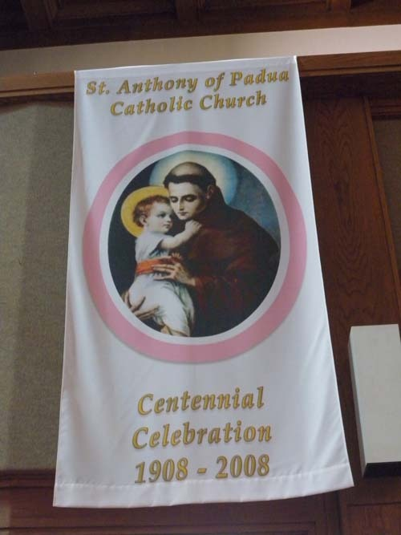  
빠두아의 성 안토니 가톨릭 교회 100주년[2008] 기념 표지

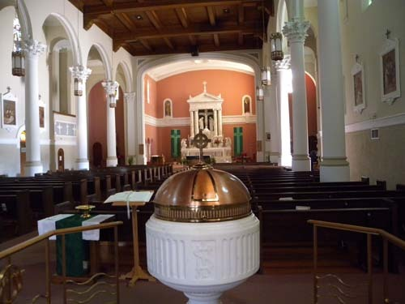  
빠두아의 성 안토니 교회 내부

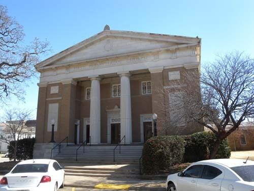  
오크멀기 제일 장로교회

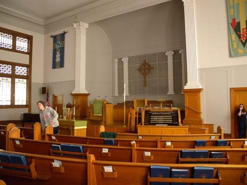  
오크멀기 제일 장로교회 내부

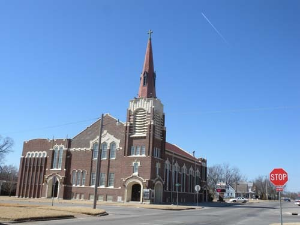  
오크멀기 연합 감리교회

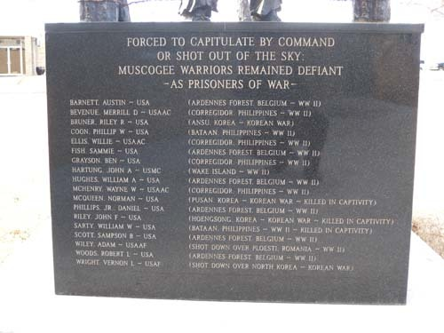  
무스코기 전몰용사 추모비[한국전에서 전사하거나 실종된 병사들 포함]

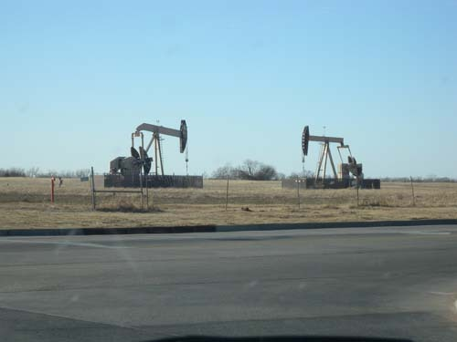  
오클라호마시티의 '윌 라저스 공항' 인근에서 만난 석유채굴기들

공유하기

게시글 관리

**백규서옥\_Blog ver.**

[저작자표시 비영리 변경금지
(새창열림)](https://creativecommons.org/licenses/by-nc-nd/4.0/deed.ko)