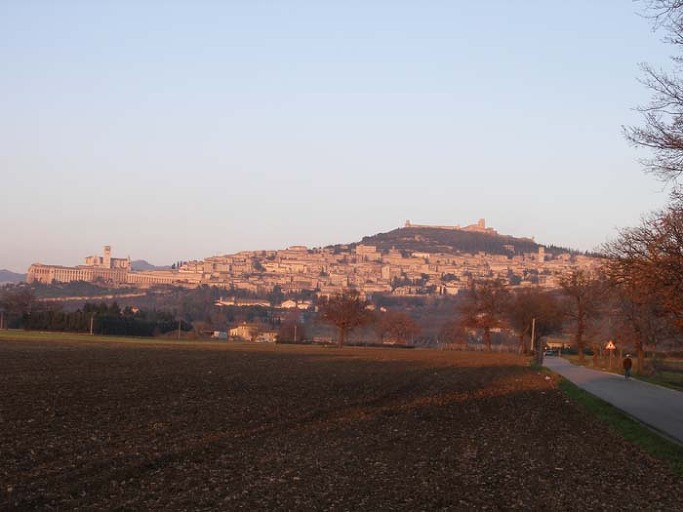
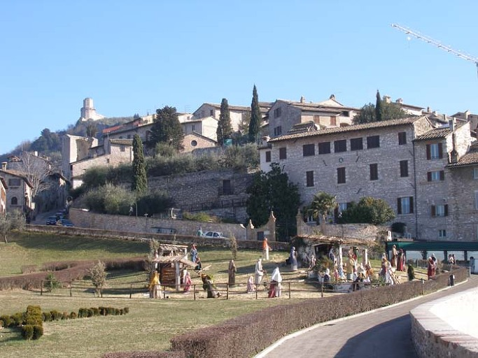
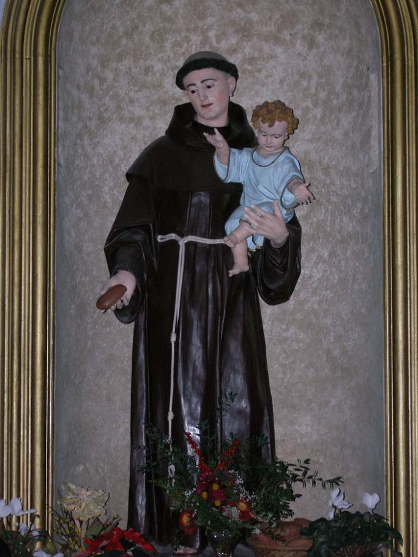
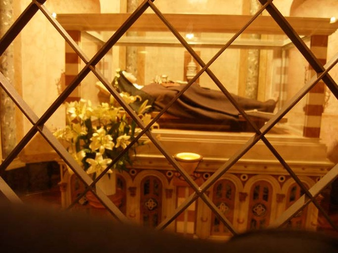
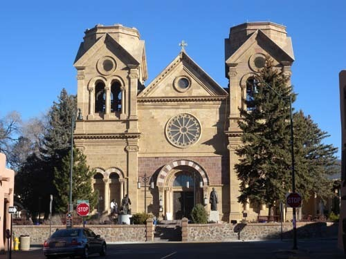
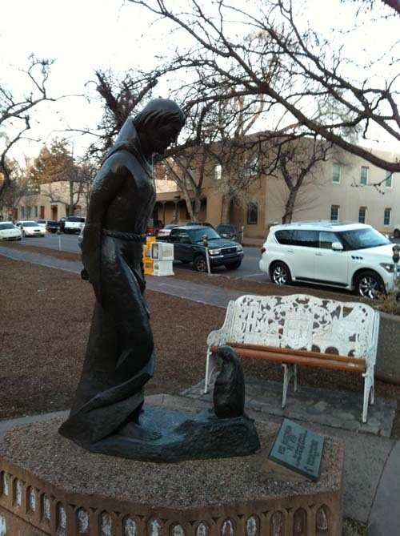

  
멀리서 바라 본 석양 무렵 아씨시(Assisi)의 따스한 모습

  
프란치스코 성당에서 바라본 아씨시의 모습

  
산타 마리아 소프라 미네르바 성당 안의 프란치스코 성인 상

  
아씨시의 클라라 성당에 안치된 클라라 성인의 시신

프란치스코 교황의 방한을 보며

#1 2006년 1월 6일. 유럽 자동차 여행 일정 중 막바지 쯤 이탈리아의 ‘아씨시(Assisi)’에 도착했고, 거기서 프란치스코 성인을 만났다. 아씨시는 오르비에토에서 북쪽으로 두 시간 가까이 달려 도착한, 작고 아름다운 도시였다. 그 때가 마침 석양 무렵이었기 때문일까. 주황색의 ‘석양 스포트 라이트’를 받아 작은 도시 전체가 따스한 온기를 발산하고 있었다.

부상(富商) 몬나 피카(Monna Pica)와 피에트로 디 베르나도네(Pietro di Bernadone) 사이에서 12세기 말경[대략 1181년~1182년] 태어난 프란치스코는 기사(騎士)의 꿈을 갖고 있었다. 1202년 실제로 콜레스트라다(Collestrada)의 전투에 참가하기도 했다. 포로로 잡혔다가 석방되어 아씨시로 돌아왔으나, 잠시 후 다시 전쟁에 참여하기 위해 아풀리아(Apulia)로 갔다. 여행 중 병에 걸렸던 그는 오랜 동안의 묵상을 통해 ‘기적적 통찰’을 얻은 후 아씨시로 돌아왔고, 그로부터 세속적인 삶의 방식을 청산하고 자선사업에 몰두하기 시작했다. 로마 순례 도중 가난한 여인을 만나 자신의 화려한 옷을 거지의 누더기로 바꾸어 입고, 나머지 가진 것들 모두를 주어버리기도 했다. 그를 결정적으로 바꾼 것은 “가라, 그리고 내 집을 고쳐라”는 다미아노(Damiano) 성인의 계시였다. 그는 ‘가난 속에서 하나님을 섬기는 것’이 다미아노 성인의 바라는 바임을 확신하게 되었고, 기적이 일어난 것이다.

그로부터 프란치스코는 좋은 옷을 버리고 은자의 도포와 부츠에 지팡이를 들고 다니기 시작했다. 완벽하게 살려면 절대 가난과 순결 속에 살 뿐 아니라 신의 말씀을 설파해야 한다고 확신했다. 청빈의 삶 속에서 하나님의 말씀을 전파하기로 마음먹은 것이었다. 1209년~1210년 사이에 프란치스코는 동료들과 함께 로마 교황 이노센트(Innocent) 3세를 찾아가 자신들의 종교적인 삶의 방식을 승인 받았다. 그로부터 그들은 리보토르토(Rivotorto)와 산타 마리아 데글리 안젤리(Santa Maria degli Angeli)로 돌아가 자신들의 사명을 수행하기 시작했다.

1211년~1212년 사이엔 성녀 클라라가 가족들의 반대를 무릅쓰고 프란치스코의 뒤를 따라 집을 떠나기도 했다. 클라라와 초기 추종자들은 성 다미아노 교회에 그들의 거처를 마련했다. 그런 과정을 통해 청빈의 삶을 바탕으로 하나님의 말씀을 전하는 공동체가 이룩되었다. 1226년 그가 죽자 그의 추종자들과 아씨시 시민들은 성 기오르기오 교회[현재 산타 클라라 교회의 사크라멘트 채플]의 묘지까지 행렬을 이루어 그의 시신을 운구했다. 지금 아씨시의 메인 광장인 피아자 꼬무네(Piazza del Comune)를 가로지르는 거리의 양 끝에는 성 프란치스꼬 대성당과 성 클라라 성당이 자리 잡고 있다. 클라라 성당 위쪽에는 주교좌 성당인 성 루피노 성당이, 꼬무네 광장 바로 아래쪽엔 치에사 누오바(Chiesa Nuova)가, 누오바 교회 바로 아래엔 성 안토니오 성당이, 광장엔 성 도나토 성당이, 프란치스꼬 대성당 아래쪽엔 성 베드로 성당이 각각 서 있었다. 세상의 헤아릴 수 없이 많은 성당들에서 프란치스꼬 성인의 삶을 보여주고 있었으며, 그의 삶은 하나님 말씀의 진리성을 증거하고 있었다.

#2 2014년 2월 9일. 미국 뉴멕시코 주의 산타페에서 프란치스코 성인을 또 만났다. 구시가지 언덕에 올라앉은 프란치스코 대성당이 산타페 시내를 굽어보는 형국이었다. 시내 어딜 가든 프란치스코 성인 상을 만날 수 있었다. 시청 앞 잔디밭에는 재미있는 상 하나가 서 있었다. 프레어리 독(Prairie dog) 한 마리가 굽어보고 타이르시는 성인에게 무언가 열심히 변명하는 모습이었다. 미국 서남부에서 흔한 동물 하나가 프레어리 독이다. 이 녀석은 ‘땅굴 파기’ 천재로서 닥치는 대로 터널을 뚫었다. 그러니 농부들은 죽을 맛이다. 땅 밑으로 이리저리 굴을 뚫고 자기들만의 세계를 구축하고 사는 녀석들. 우리가 보기엔 귀여웠지만, 만나 본 농부들은 고개를 절레절레 흔들었다. 원래 프란치스코 성인은 모든 동물들의 벗이었다. 아씨시에서도 새들과 대화하는 성인 상을 만났고, 어느 곳의 성인 상에도 새나 동물들이 함께 하는 모습을 볼 수 있었다. 아마 그 프레어리 독도 성인을 몹시 따랐던 모양. 성인은 그 녀석에게 절대로 농부들의 밭에 굴을 뚫지 말라고 지시했건만, 그 말을 어기고 굴을 파서 농부들에게 해를 입힌 것이리라. 성인의 꾸지람에 말도 안 되는 변명을 늘어놓고 있는 프레어리 독의 표정이 우습고 귀여웠다. 프란치스코 성인이 산타페의 ‘수호성인’임을 알고 나서야, 시내 도처에 성인의 모습을 깔아놓은 의도를 알 수 있었다.

                                         \*\*\*

그렇다. 프란치스코 성인은 가난하고 힘없는 서민들의 벗이었다. 교황도 프란치스코 성인의 신념을 따르고자 그의 이름을 빌었을 것이다. 지금 이 땅엔 ‘박해 받는 자들’이 널려 있다. 가난하고 병들어 홀로 서지 못하는 사람들, 세상 편견의 덫에 걸려 능력을 발휘하지 못하는 젊은이들, 직장에서 왕따를 당하면서도 호소할 데 없는 사람들, 태어나지도 못한 채 버림받는 낙태아들, 태어나자마자 버림받는 미혼모의 아기들, 부모 잘 못 만나 어린 나이에 굶어 죽거나 맞아 죽는 아이들, 자식들에게 버림 받는 노인들, 군대에서 짐승보다 못한 인간 말종들을 선임으로 만나 시달림을 받고 있거나 받다가 목숨을 잃는 청년들, 유사 이래 가장 극악한 전제군주의 폭압 아래 신음하는 북한 동포들, 이 땅의 못난 남자들에게 시집 와서 죽을 고생만 하고 있는 동남아 신부들, 못된 사장 만나 월급도 못 받고 매만 맞는 이주 노동자들...

가난한 교황에게 물질적인 도움을 요구하는 사람은 없다. 다만, 이들에게 위로의 한 마디면 된다. 세상을 뒤덮을 사자후(獅子吼) 아닌, 따스하고 정감 넘치는 위로의 말 한 마디면 된다. ‘작은 씨앗이 창대한 열매를 맺듯’ 사랑의 ‘말 건넴’이 ‘나비 효과’를 발휘하여 언젠간 세상을 바꿀 날이 올 것이다. 원래 프란치스코 성인은 가난했고, 그의 가난이 세상 사람들의 마음을 움직였다. 아무리 부자라 해도 세상 사람들의 가난을 해결할 수는 없다. 그러나 ‘진심 어린 사랑의 메시지’는 모래알처럼 많은 세상의 부자들을 움직여 세상 사람들의 가난 해결에 나서게 할 수는 있다. ‘물질적으로 가난한 프란치스코 교황’이 ‘가난한 자의 따스한 음성’으로 가난한 자들의 마음을 밝혀 줄 때, 그 빛의 일부는 부자들에게도 전달되리라. 지금 필요한 가톨릭의 진정한 힘은 바로 여기에 있다.

  
산타페의 성 프란치스코 성당

  
대성당 앞뜰에서 만난, '물 위에서 춤 추는 프란치스코 성인'-Monika B. Kaden의 작품

산타페 시청 앞에 서 있는 프란치스코 성인 상

  
성남공항에 내려 환한 미소를 짓고 있는 프란치스코 교황[joins.com 2014년 8월 14일자에서 퍼옴]

공유하기

게시글 관리

**백규서옥\_Blog ver.**

[저작자표시 비영리 변경금지
(새창열림)](https://creativecommons.org/licenses/by-nc-nd/4.0/deed.ko)