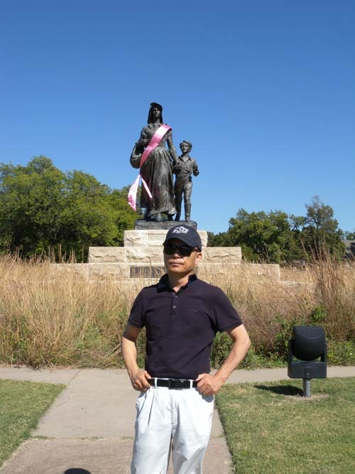  
판카 시티 입구의 'Pioneer Woman 상[1930년 Bryant Baker 작/청동 상]'앞에서

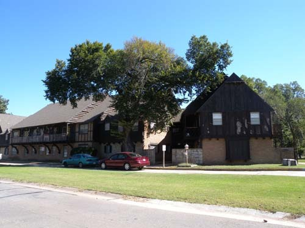  
판카 시티 입구의 멋진 집들

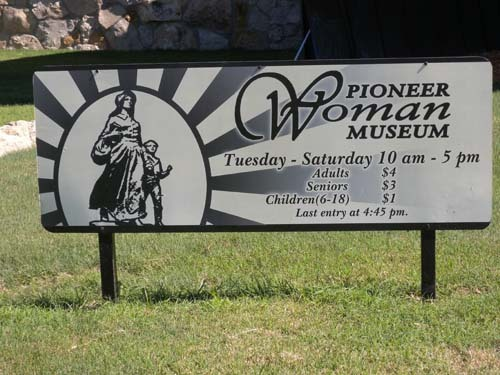  
판카 시티 'Pioneer Woman Museum' 입간판

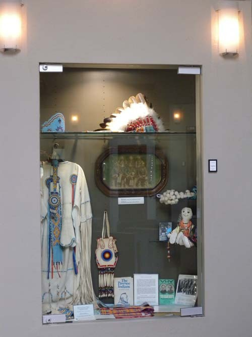  
'Pioneer Woman Museum' 의 소장품[인디언 의상 및 소품들]

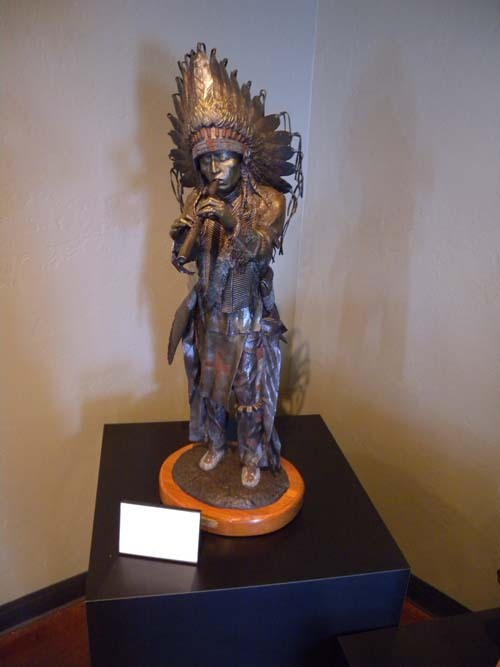  
'Pioneer Woman Museum' 소장품[피리 부는 인디언 추장]

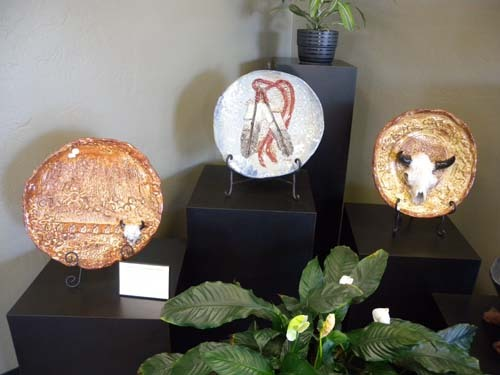  
'Standing Bear Museum and Education Center'의 소장품

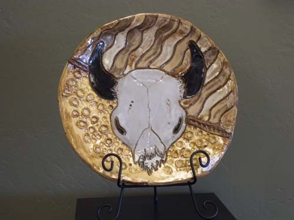  
'Standing Bear Museum and Education Center' 의 소장품

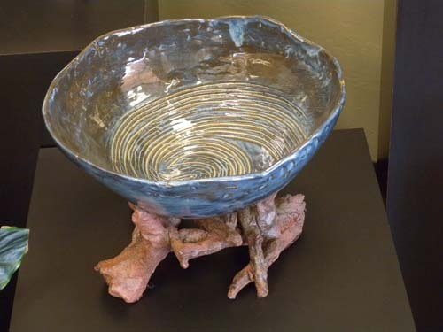  
'Standing Bear Museum and Education Center'의 소장품

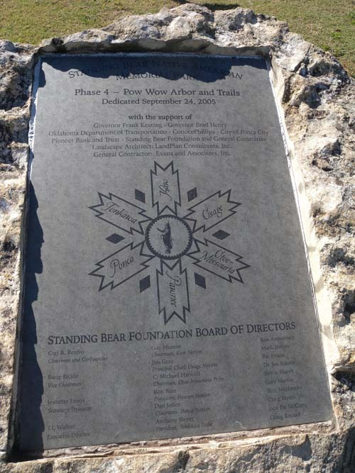  
'Standing Bear Native American Memorial Park'-판카 부족과 가까이 지내던 인디언 부족들

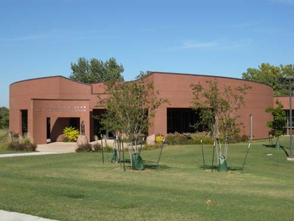  
'Standing Bear Native American Memorial Park'

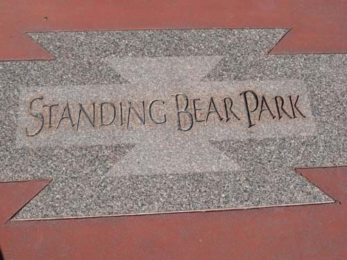

'Standing Bear Park' 표지

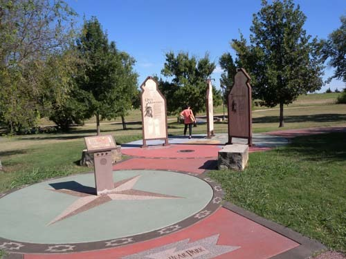  
'Standing Bear Native American Memorial Park'

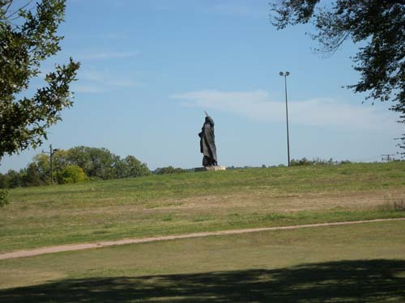  
Standing Bear 상-'Standing Bear Native American Memorial Park'

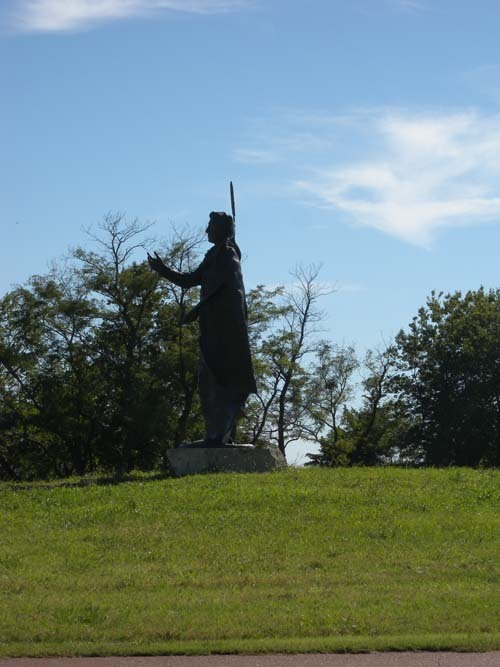  
Standing Bear 상-'Standing Bear Native American Memorial Park'

스틸워터의 이웃동네에서 만난 판카(Ponca)인디언들

작년 가을 무렵. 스틸워터에 정착한 지 한 달 반이 지나자 거주지 주변의 것들이 하나하나 마음에 들어오기 시작했다. 멀지 않은 곳에 ‘판카 시티(Ponca City)’가 있다는 말을 들어오다가 캐나다에서 날아 온 큰 아이와 함께 답사에 나섰다. 원래 우리는 ‘폰카’로 발음했지만, ‘판카’ 혹은 ‘팡카’로 발음하는 이곳 사람들을 따라 ‘판카’로 바꾸었다. 집을 나서서 177번 하이웨이에 접어든 후 정북 방향 직선으로 대략 한 시간 반 정도의 거리에 있는, 아름다운 곳이었다. 울창한 나무숲에 숨듯이 들어선 집들은 모두 고급스러워 대체 어디에 판카 인디언들이 있다는 건지 어리둥절할 정도였다. 아칸사 강(Arkansas River)이 감돌아 흐르고 호수[Lake Ponca]가 고여 있어 풍광도 ‘짱’이고, 인구 또한 많지 않은지 거리는 대체로 한산했다.

판카 족은 수어족[Siouan-language group] 가운데 데기한 어[Dhegihan language]를 사용하는 사람들인데, 캔자스 주 오세이지 카운티의 오세이지 족・네브라스카의 오마하 사람들・ 오클라호마와 네브라스카의 판카 사람들이 사용하던 수어가 바로 데기한 어다. 미 연방정부가 인정한 두 종의 판카 족이 있는데, 네브라스카의 판카 족과 오클라호마의 판카 인디언들이 그들이다. 후자가 바로 우리가 만나러 간 사람들이었다. 그들은 미시시피 강 동쪽의 한 부족으로서 원래 오하이오 강 계곡에 살다가 사냥터를 찾아 서쪽으로 이동한 사람들이었다. ‘Ponca’는 칸사(Kansa), 오세이지(Osage), 쿼포(Quapaws) 사이의 한 클랜 명칭으로서 어원상 ‘살인자[Cut Throat]’란 무시무시한 뜻을 갖고 있다 했다. 

이 부족 역시 여타 인디언들과 마찬가지로 백인 강제이주 정책에 의한 희생의 역사를 갖고 있었다. 판카 족의 역사는 꽤 길어서 구비전승에 따르면, 컬럼버스가 미 대륙으로 오기 전에 미시시피의 동쪽 지역으로부터 이주했다고 한다. 뉴욕 주에 살던 이로쿼이(Iroquois) 족의 침략을 받아 북쪽에 있던 전통 거주지역을 버리고 오하이오 강 지역으로 밀려났던 것이다. 그 후 거기서 서쪽으로 이동했다는 것인데, 그 정확한 시기는 알 수 없다는 것이었다. 1701년 지도상에 모습을 드러낸 이후 서양 상인들과의 교섭을 지속해 오다가 중간에 천연두가 창궐하여 800여 명 되던 인구가 200으로 줄었으며, 19세기 후반에 이르러서야 다시 700으로 회복되었다 한다. 평원에 사는 대부분의 다른 인디언들과 달리 이들은 옥수수와 채소들을 재배했고, 바이슨 사냥을 하며 살았다.

1817년의 평화조약을 필두로 1865년까지 판카 족은 미국정부와 여러 차례 조약들을 맺으며, 그 과정에서 많은 우여곡절을 겪으면서도 자신들의 주권과 영역을 지키기 위해 애썼다. 특히 조약을 맺는 과정에서 미국의 실수로 자신들의 땅을 다 잃어버리게 되는 위기를 맞게 되자 이들은 미국 정부의 방침에 대항하여 집단 거주지로 이주하지 않는 방법을 쓰게 된다. 미 의회가 1876년 강제로 북쪽의 여러 인디언 부족들을 현재 오클라호마의 집단 거주지로 옮기기로 결정했음에도 새 보호구역이 농사에 부적합하다는 이유로 거부하게 된 것이다. 그러나 결국 강제로 옮겨야 했고, 새 땅에서 판카 족은 말라리아와 더운 날씨, 식량 부족 등으로 고생하다가 첫해에만 25%의 부족원들이 세상을 떠나는 비극을 당하기도 했다.

1877년 인디언 구역의 쿼포 보호구역으로 강제 이주된 뒤, 판카 족은 아칸사와 솔트 폭 강에 접한 자신들의 땅으로 이주했으며, 동친혈연(同親血緣) 주민들은 티피(tipi) 마을을 구성했고, 혼혈 주민들은 치카스키아 강 언저리에 정착하게 되었다. 판카 지도부가 미 정부에 맞서는 동안 미국 정부는 커티스 법(Curtis Act)으로 부족의 정부를 해체하고 타 부족들과의 동화를 강요하면서 1891년과 1892년의 도스 법(Dawes Act) 아래 개개 구성원들에게 보호구역의 땅을 나누어 주었고, 분양 후 남은 땅은 인디언 아닌 사람들에게 팔 수 있도록 했다. 오클라호마 주가 성립된 후 나머지 판카 땅들은 풀려서 101개의 목장의 주인들에게 팔렸고, 판카 주민들은 이곳에 고용되기도 했다. 1911년 판카 족의 땅에서 원유가 발견되면서 수익을 얻었으나, 정유공장들이 아칸사 강에 폐유를 방류함으로써 환경에 재앙을 입기도 했다. 1950년에는 오클라호마 인디언 복지법에 의거, 판카 족은 새 정부를 만들었고, 같은 해 9월 20일에는 부족 헌법을 만들기도 했다. 판카 족 행정의 중심은 오클라호마 주의 화이트 이글(White Eagle)에 있으며, 현재 판카 족 인구는 4,200명에 달한다.

현재의 판카 족이 안정을 찾기까지 미국 정부와의 투쟁에서 중심 역할을 한 인물이 바로 스탠딩 베어(Standing Bear)라는 인물이었다. 사실 판카 족을 찾아 온 우리도 그의 행적과 모습이 궁금했다. 여느 인디언 추장도 마찬가지였겠지만, 그 역시 강제이주에 격렬히 저항했다. 심지어 그의 큰 아들이 죽을 때 그는 부족의 조상 땅에 묻어주겠다는 약속을 할 정도였고, 실제로 그는 보호구역에서 판카 족의 고향으로 되돌아가다가 체포되어 포트 오마하에 구금되기도 했다. 미국 정부의 허락 없이 보호구역을 이탈했다는 이유였다. 그의 체포와 구금에 많은 사람들이 법정 투쟁으로 그를 도왔고, 뛰어난 두 명의 변호사가 무료로 소송을 대리해 주기도 했다. 1879년 네브라스카의 오마하에서 열린 재판에서 미 연방 지방법원은 사상 최초로 미국 인디언들도 ‘미합중국 법 안의 사람들’임을 인정하게 되었고, 그 결과 그들은 시민으로서의 권리를 쟁취하게 된 것이다. 말하자면 스탠딩 베어가 보여준 불굴의 저항 덕분에 결국 그들은 자신들의 법적인 권한을 얻게 되었던 것이다.

\*\*\*

과연 우뚝 서서 내려다보고 있는 스탠딩 베어의 모습에서 비장함이 느껴졌다. 미합중국 정부의 부당한 명령에 목숨을 걸고 항거함으로써 자신의 부족은 물론 여타 인디언들이 보편적인 생존권을 부여받을 수 있도록 한 점에서 그는 인디언 사회의 진정한 영웅이었다.

석양을 등지고 서서 주변을 압도하는 그의 거대한 동상을 바라보며 특정 부족이나 민족의 미래를 개척하는 지도자의 온당한 리더십이 무엇보다 중요함을 깨닫게 되었다. 백인들과 여타 부족들이 섞여 살아가고 있는 그 공간에서 스탠딩 베어의 정신 덕에 판카 족은 인디언 사회로부터 존경받고 있음을 진하게 느낄 수 있었다.

 

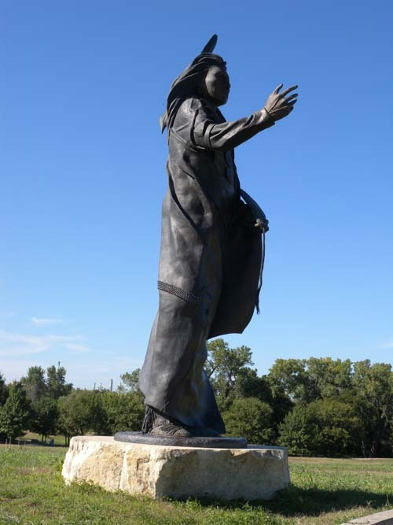  
Standing Bear 상-'Standing Bear Native American Memorial Park'

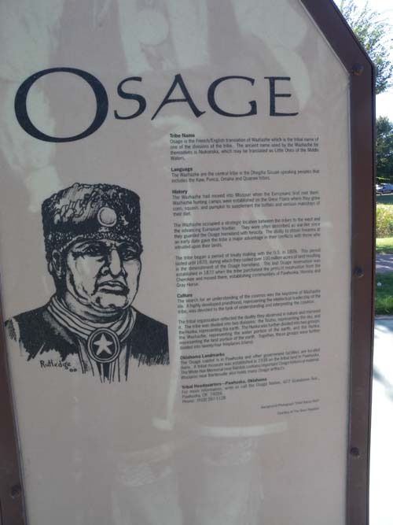  
오세이지 족에 대한 설명-'Standing Bear Native American Memorial Park'

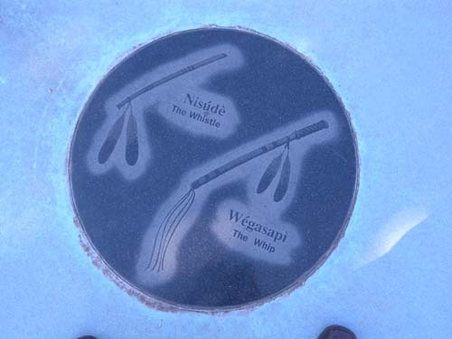  
판카 어 물건 명칭-'Standing Bear Native American Memorial Park'

  
판카 어 물건 명칭-'Standing Bear Native American Memorial Park'

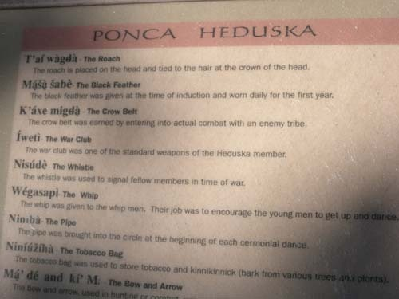  
판카 어 문장과 뜻-'Standing Bear Native American Memorial Park'

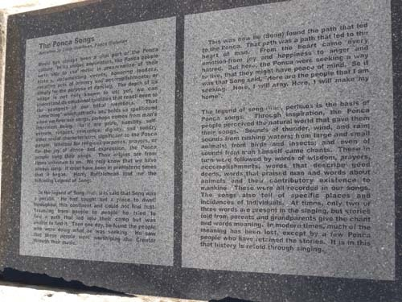  
판카 부족 서사시-'Standing Bear Native American Memorial Park'

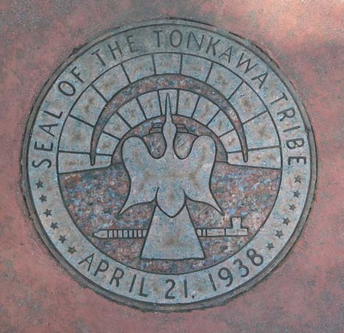  
톤카와 부족의 문장-'Standing Bear Native American Memorial Park'

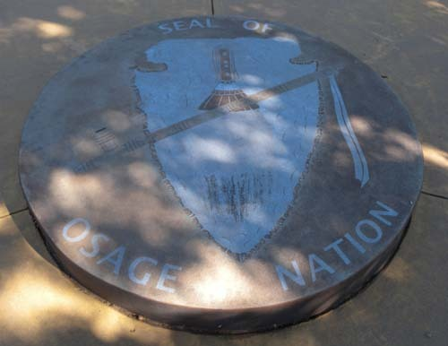  
오세이지 네이션의 문장-'Standing Bear Native American Memorial Park'

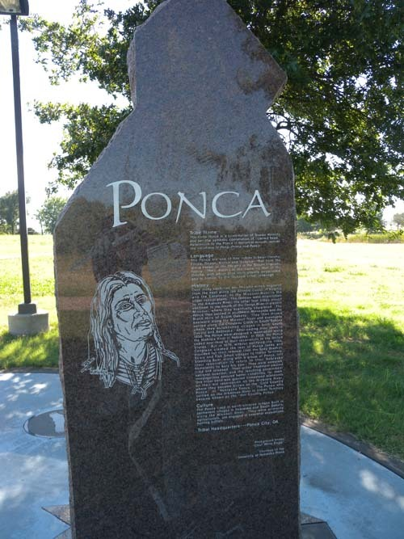  
판카 족에 대한 설명-'Standing Bear Native American Memorial Park'

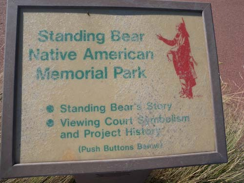  
스탠딩 베어에 대한 전자 설명-'Standing Bear Native American Memorial Park'

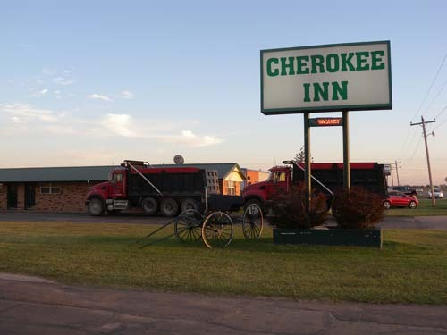  
Waynoka에서 일박을 한 체로키 인

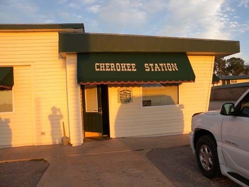  
웨이노카 숙소 앞의 소박한 식당-Cherokee Station

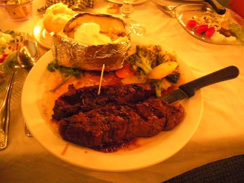

Cherokee Station의 저녁식탁

공유하기

게시글 관리

**백규서옥\_Blog ver.**

[저작자표시 비영리 변경금지
(새창열림)](https://creativecommons.org/licenses/by-nc-nd/4.0/deed.ko)