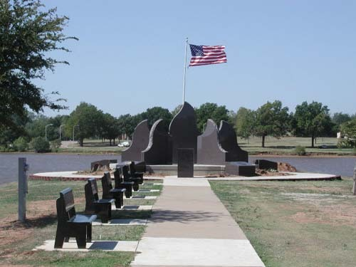
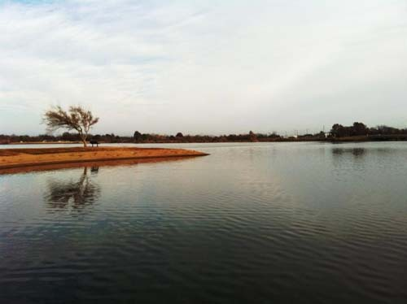
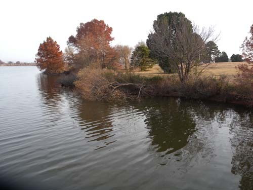
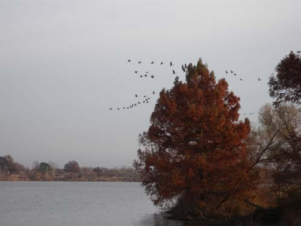
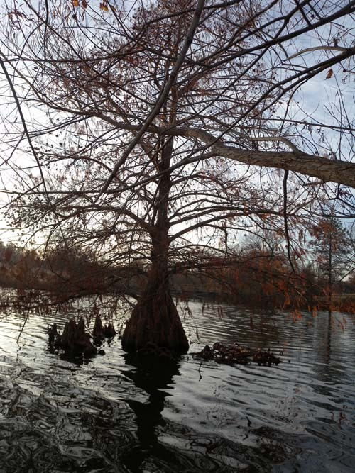
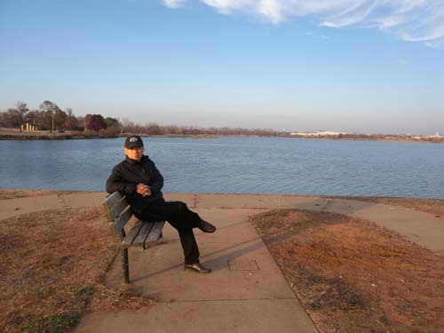
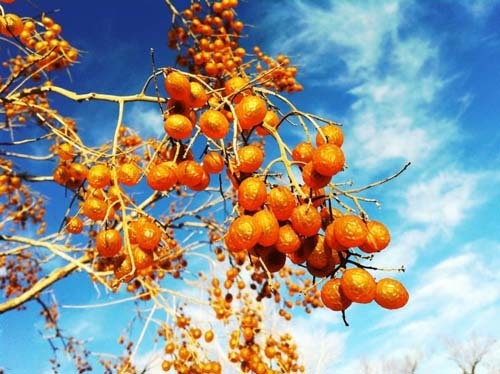
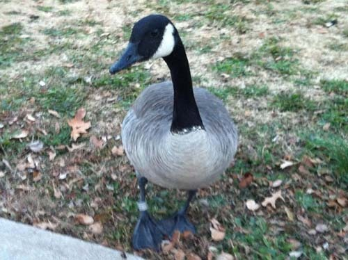
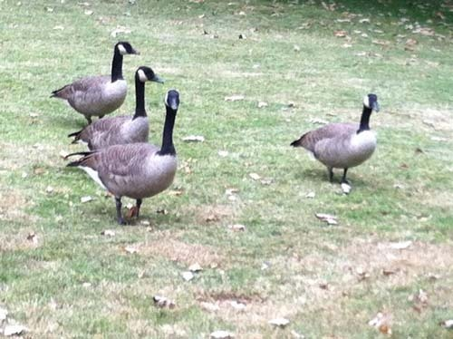

  
부머 호수 조성 기념비

  
모진 바람을 견뎌내는 부머의 서정

  
늦가을과 초겨울의 어름에서

  
부머의 새들은 어디로 날아가는가?

  
부머의 나무들은 물에서도 뿌리를 내리는구나

부머(Boomer) 호수에서 찾은 마음의 고요

잠시 머물다 떠나온 스틸워터는 말 그대로 낙원 같은 곳이었다. 앞의 글 어디에선가 ‘스틸워터’의 어원을 밝힌 바 있지만, 말 그대로 ‘고요한 물’ 그 자체였다. 맑은 공기, 녹색 풀과 나무, 알록달록한 꽃들, 자유롭게 날아다니는 갖가지 새들, 기분 좋은 촉감으로 끊임없이 스쳐가는 바람, 그리 많지 않은 사람들, 차량 대수에 비해 아주 넓은 도로, 나지막하고 예쁜 집들... 집의 출입문을 닫으면 심심산골의 절간이요, 문을 열고나서면 한적한 시골 마을의 확대판이었다.

특히 우리를 매료시킨 두 가지가 이곳에 있었다. 첫째는 숙소를 나와 도보로 500m만 걸어가면 5km 남짓의 크로스 컨트리 코스(cross country course)가 있는데, OSU가 소유한 공인 경기장이자 주민들의 산책코스였다. 울창한 숲과 목초지, 목장을 뚫고 구불구불 이어진 낭만의 오솔길이었다. 둘째는 자동차로 10분 거리의 부머 호수. 스틸워터의 북쪽 면을 접한 아름다운 호수였다. 여러 나라에서 호수들을 구경했지만, 스위스 베른의 시가지에 거울같이 고여 있던 호수를 제외하곤 아직 부머 만한 곳을 기억하지 못한다. 더군다나 그것은 인공 호수였다!

그런데, 왜 ‘부머(Boomer)’일까. 오클라호마 사람들은 이주해 온 시기에 따라 ‘수너(Sooners)’와 ‘부머(Boomers)’로 불린다. 그로버 클리블랜드(Grover Cleveland) 대통령이 1889년 ‘인디언 세출법안’에 서명함으로써 지금 오클라호마 지역인 ‘(인디언들에게)할당되지 않은 땅들[Unassigned Lands]’을 (백인)정착민들에게 개방하려 했는데, 대통령의 서명 직전 그 지역들에 들어가고자 시도한 미합중국 남부 정착민들이 있었다. 그들이 바로 ‘부머들’이었고, 그들보다 10년 정도 먼저 들어간 사람들이 ‘수너들’이었다. 먼저 자리를 잡은 인디언들과 함께 그 두 종류의 백인들이 오클라호마 주민을 형성한 것이었다.

스틸워터에 인공 호수를 조성하고 ‘부머 레이크’라 호칭한 것은 그들이 아끼는 이 지역의 보물에 자신들의 역사성을 새겨 놓으려는 욕망 때문이었으리라. 어쨌든 스틸워터 사람들은 부머 호수를 사랑하고 있었다. 틈나는 대로 호숫가를 걷거나 달리고 자전거 페달도 열심히 밟았다. 낚싯대를 드리우고 시간을 낚는 태공들도 심심찮게 보이고, 물 위를 새까맣게 덮은 새떼를 관찰하는 사람들도 적지 않았다.

OSU의 아름다운 연못 쎄타 폰드(Theta Pond)에는 캐나다 기러기들(Canadian Geese)과 오리들이 공존하고 있었다. 캐나다 기러기는 철새인데, 쎄타폰드의 녀석들은 계절이 바뀌어도 고향으로 돌아갈 생각을 하지 않았다. 낙원 같은 그곳을 떠날 생각들을 아예 접어버린 듯 했다. 오후쯤엔 가끔씩 휘익 날아올라 대열을 유지한 채 어디론가 날아가곤 했다. 그러나 다음날 쎄타폰드에 나가보면 그 녀석들은 언제 그랬느냐는 듯 여전히 풀밭을 뒤지고 있었다. 부머 호수에 가보고 나서야 우리는 녀석들이 어디를 다녀오는지 알게 되었다. 쎄타폰드에서 보던 녀석들을 부머 호수에서 만났기 때문이다. 말하자면 부머 호수는 녀석들의 임시 고향 혹은 새로운 정착지인 셈이었다. 유럽의 백인들이 밀고 들어와 인디언들을 몰아내고 이 땅에 정착했듯이. 그곳에는 호수 인근의 여러 지역에서 날아온 캐나다 기러기들이 지천으로 깔려 있었다. 몸집도 크고 생김새도 화려한데, 퍼런 색 똥은 문제였다. 아무데나 갈겨대는 까닭에 포장도로는 퍼렇게 도색되어 있었다. 하루 종일 각자의 영역에 나가 먹이활동을 한 다음, 저녁 무렵이면 부머 호수로 돌아와 가족 친지들과 대화를 나누고 밤을 지내는 모양이었다.

1925년에 완공된 부머 호수는 지역 발전소에 냉각수를 공급하기도 하고 시민들에게 오락과 휴식 공간의 역할을 하기도 했다. 표면적 251 에이커[307,224 평], 유역면적 8,954 에이커[10,959,696 평], 호숫가의 길이 8.6 마일[13.76 km], 평균 수심 9.7 피트[2.96 m]로 꽤 큰 규모였다. 부머 호수에 살고 있는 주된 어종은 큰 입 배스[largemouth bass]로서 현재 우리나라 내수면에서 토종물고기들을 멸종시키고 있는 몹쓸 존재들이다. 이외에도 얼룩메기, 넓적머리 메기, 크래피 등이 많이 살고 있었다.

\*\*\*

물론 흐르는 물도 좋고, 필요하다. 그러나 거울처럼 잔잔하여 마음까지 비춰볼 만한 호수는 더 좋다. 벤치에 앉아 하염없이 새들을 바라보는 노인들, 땅으로 올라온 오리와 기러기들을 아장거리며 쫓아다니는 아가들, 수면에 비친 버드나무를 바라보며 고향을 떠올리는 나그네 백규, 희한하게 생긴 탈 것에 몸을 누인 채 호숫가를 질주하는 장애인 남성, 열심히 달리면서 살을 빼고 있는 젊은 여성들... 모두들 자연의 한 부분이 되어 부머 호수에 안겨 있는 모습. 스틸워터가 낙원인 이유를 여기서 발견할 수 있었다.

  
차가운 겨울날 부머 호수에서

  
시린 물에서 피할 수 없는 일상을 즐기며

  
부머 호숫가에서 만난 이름 모를 열매들

  
부머 호숫가에서 만난 캐나다 기러기

  
부머 호숫가에서 만난 일군의 캐나다 기러기들

공유하기

게시글 관리

**백규서옥\_Blog ver.**

[저작자표시 비영리 변경금지
(새창열림)](https://creativecommons.org/licenses/by-nc-nd/4.0/deed.ko)