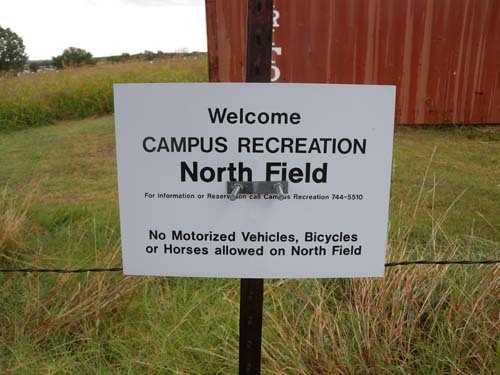  
크로스 컨트리 경기장이 있는 캠퍼스 리크리에이션 노쓰 필드 표지판

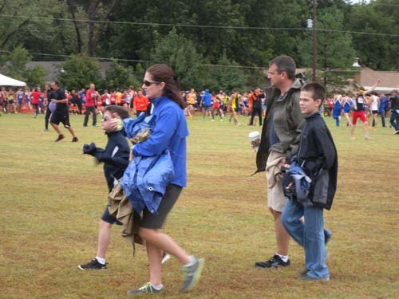  
누굴 응원하러 온 것일까. 행복한 가족의 모습

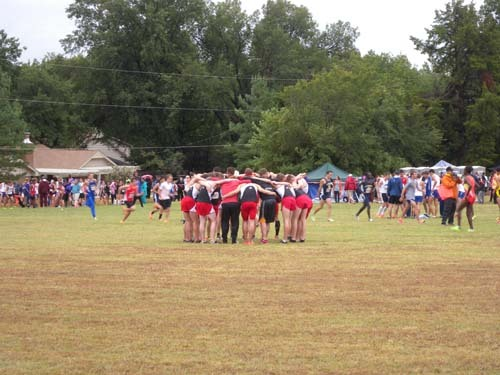  
출전 팀이 단합을 도모하는 모습

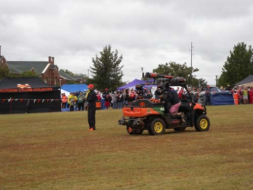  
출발의 포를 쏘기 위한 차량

  
막 출발선을 뛰어나가는 선수들

  
필드 위의 건강한 청춘들

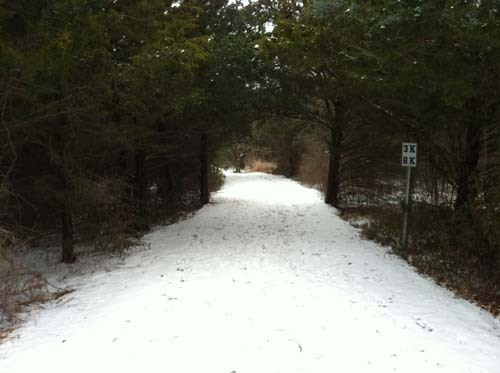  
눈 내린 산책길

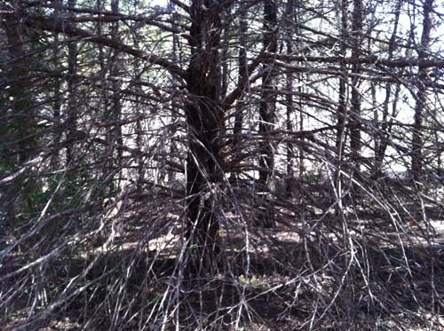  
산책길의 나무들

낙원 속의 산책로: OSU 크로스 컨트리 코스의 안식과 힐링

미국에 머문 지 한 달이나 되었을까. 어느 토요일 아침 늦잠으로 뒤척이고 있는데, 갑자기 문밖이 시끄러워졌다. 절간 같은 곳이라 좀처럼 없는 일이었다. 후다닥 일어나서 문을 열어보니 많은 사람들이 아파트 뒤쪽으로 몰려가고 있었다. 호기심에 대충 아침을 챙겨먹은 우리도 덩달아 따라 나섰다. 날씨는 우중충하고 간간이 빗방울도 떨어졌지만, 사람들은 아랑곳하지 않았다. 도로를 따라 철조망이 쳐 있는 곳이라서 ‘어느 개인 소유의 땅인가 보다’ 라고 대수롭지 않게 보아 넘겼는데, 알고 보니 그곳이 바로 OSU의 크로스 컨트리(cross country) 경기장이었다. 더구나 이곳이 미국에서 가장 오래 된 크로스 컨트리 경기가 열리는 곳이기도 하였다. 무엇보다 경기하는 날만 제외하곤 언제나 공개되는 시민들의 산책로라는 사실이 놀라웠다.

전국의 고등학교와 대학교 선수단은 물론 그 가족들, 스틸워터 시민들까지 몰려와 북적거리고 있었다. 경기를 앞두고 선수들이 몸을 풀거나 이마를 맞대고 파이팅을 외치는 열기에 가을비의 찬 기운도 잊을 만 했다. 숲속 잔디와 나무들 사이를 꽉 채우고 있던 깨끗한 정밀(靜謐)이 참으로 오랜만에 젊은 열기로 인해 흩어지는 순간이었다. 숲을 뚫고 지나가는 이곳 경기 코스의 길이는 대략 5km 정도라 하는데, 느낌으로 7km는 족히 되어 보였다. 스타트 지점과 골인 지점이 같은 곳에 있는 점으로 미루어 마라톤과 비슷한 방식인 듯했다. 구경하기에는 크게 재미없는 게임이었지만, 특별히 뒤에 쳐지는 선수들을 응원하는 사람들의 열기가 대단했다. 게임 방식도 의미도 잘 모르는 우리로서는 이 코스가 바로 환상적인 산책로라는 점에만 관심을 갖기로 했다. 경기가 끝난 다음날 우리는 이 코스로 산책을 나갔다.

맑은 햇볕이 내려 쪼이는 잔디밭 길과 나무껍질을 두껍게 덮은 숲속 길은 촉촉하고 부드러웠다. 몇 번이나 열린 공간과 숲속을 들락거리며 작은 언덕들을 오르내리다가 갑자기 뻥 뚫린 목초지와 목장을 만났고, 멀리에 묵묵히 서 있는 말들도 보았다. 햇볕에 반사된 저 멀리의 지역 발전소가 은빛으로 반짝이고 숲속과 넓은 들판 길로 미니어처 같은 자동차들이 달리고 있었다. 무리무리 온갖 새들은 신비스런 소리로 노래를 부르고 관목과 교목이 빽빽하게 들어찬 숲속에는 동물들의 발자국들이 어지럽게 널려 있었다. 시민들에게 개방된 산책로라 하나, 하루 산책 두 시간 남짓에 사람을 만나는 경우는 드물었다. 숲속의 적막을 깨는 것은 크고 작은 새소리 뿐. 간혹 마음이 평안한 날에는 나무들의 숨소리까지 들리는 듯 했다. 목초지를 빙 돌아 목책이 둘려 있고, 목책을 따라 나무껍질이나 부스러기들이 깔려 있는 길을 밟아 가노라면 염소・오리・닭・사슴 등을 기르는 농가가 나무들 속에 숨듯이 앉아 있었다. 언젠가는 철망 너머로 어미 염소를 애타게 찾는 새끼염소를 만난 적이 있었다. 내가 염소 엄마의 소리를 내자, 그 녀석이 바로 내 앞으로 쫓아오는 것이었다. 배고픈 녀석이 보이지 않는 엄마를 찾아 헤매던 중이었을까. 젖떼기 전의 어린 자식이 엄마에게 매달려 사는 건 사람이나 짐승이나 일반임을 배우는 깨달음의 공간이기도 했다. 거기서 몇 발짝만 더 옮기면 캐나다 기러기들이 밤에 날아와 자고 가는 공간도 훔쳐 볼 수 있었다. 저녁 무렵 돌아 왔다가 해 뜨면 수백 마리가 함께 날아올라 부머 호수로 가는 모양이었다.

       \*\*\*

우리의 산책로는 그런 곳. 말없이 생명이 자라고 세대가 바뀌는 곳이었다. 각자 제 목소리와 모습을 지니고 있으면서도 흡사 누군가 휘두르는 지휘봉에 맞추기라도 하듯 아름다운 화음을 이루는 곳이었다. 숲속 길을 빠져 나오면 비스듬히 올라가는 풀밭 언덕에 언제나 변함없이 한 그루 활엽수가 묵상하듯 서 있었다. 그 나무를 보는 순간이면 늘 지친 가슴에서 밀려나오던 가쁜 숨이 멎고, 거짓말처럼 마음이 고요해졌다. 마치 산책로를 빠져 나온 모든 사람들이 그러리라고 예상이라도 한 것처럼 나무는 늘 빙그레 미소 지으며 서 있었다. 나도 그렇게 서 있고 싶은 마음이 들 정도로 그 나무는 의연하고 평화로웠다. 다시는 만나기 어려울 듯한 10릿길 남짓의 크로스 컨트리 코스가 그리워지는 오늘이다.

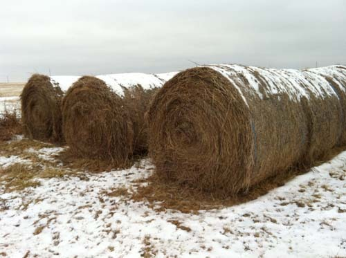  
목초지에서 베어 말린 다음 말아놓은 건초더미들

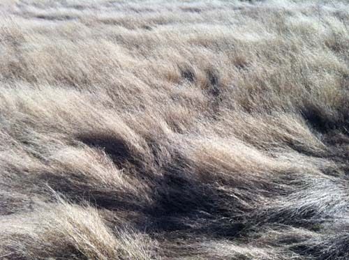  
세찬 바람에 비스듬히 누운 산책길의 풀밭

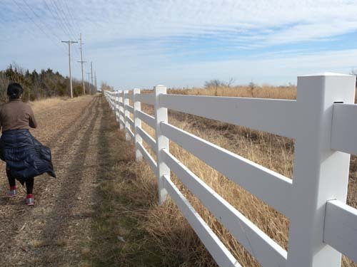  
목초지에 둘러친 목책

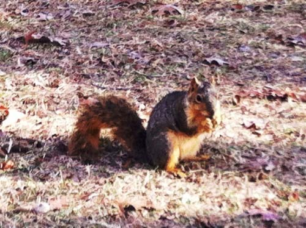  
뭔가를 맛있게 먹고 있는 산책길의 청설모

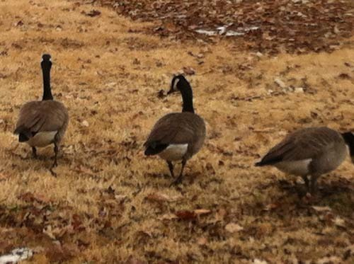  
이곳에도 어김없이 캐나다 기러기들이 있었다!

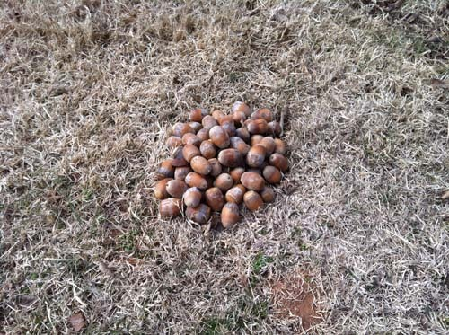  
누가 모아 놓았을까?

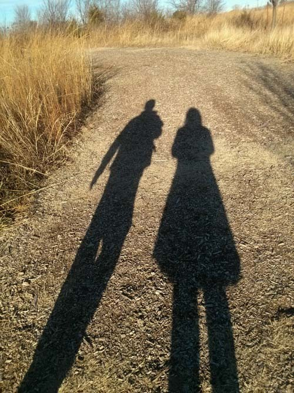  
산책길의 풍경

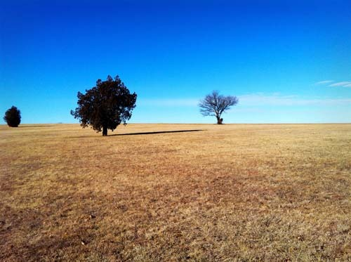  
고요, 평안, 그리고 힐링...

공유하기

게시글 관리

**백규서옥\_Blog ver.**

[저작자표시 비영리 변경금지
(새창열림)](https://creativecommons.org/licenses/by-nc-nd/4.0/deed.ko)