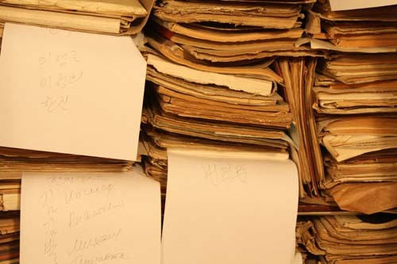
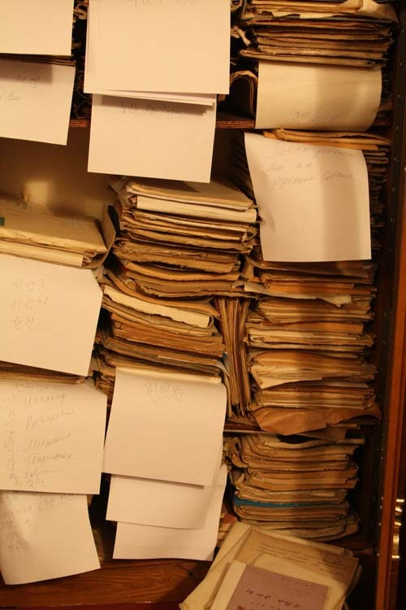
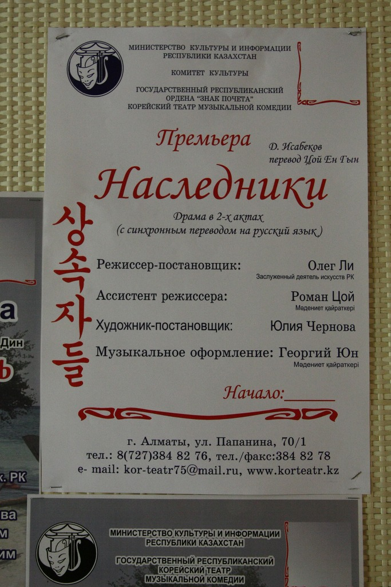
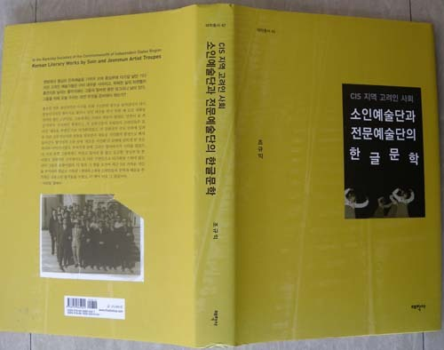
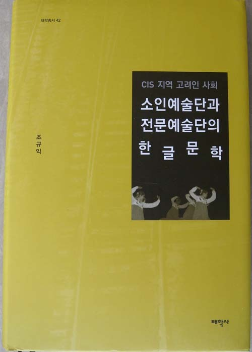

  
고려극장 창고에 쌓인 연극대본들

  
고려극장 창고에 쌓인 연극대본들

  
고려극장에서 공연된 연극 심청전의 포스터

  
고려극장에서 공연된 연극 상속자들의 포스터

치원(致遠)의 성과

-조규익의 <<소인예술단과 전문예술단의 한글문학>>(태학사, 2013)을 읽고-

                                                                                                                            이경재(숭실대 국문과 교수)

1. 학문이 다다른 곳

조규익 교수의 <<소인예술단과 전문예술단의 한글문학>>을 읽으면서, 제갈공명이 쉰 넷의 나이로 세상을 떠날 때 여덟 살이었던 아들에게 남긴 ｢계자서｣가 생각났다. ｢계자서｣의 핵심 내용은 주지하다시피 ‘담박명지(淡泊明志), 영정치원(寧靜致遠)’라는 여덟 글자로 압축된다. 이 중에서도 조규익 교수의 <<소인예술단과 전문예술단의 한글문학>>은 ‘치원’이라는 단어를 자연스럽게 떠올리도록 만든다. ‘먼 곳에 도달한다’는 뜻의 ‘치원’은 남들보다 크고 무겁고 많은 성취를 이룬다는 뜻이다. 평생 한 동네에 살면서 산 너머의 이웃 동네를 둘러보는 일도 어려웠을 옛사람의 관념을 드러내는 이 말은, 자신이 갈 방향을 뚜렷하게 정한 채 그 길을 꾸준하게 가면 마침내 먼 곳에 도달할 수 있다는 의미이다. 이 저서야말로 필자가 초인적 노력의 결과 다다른 학문적 ‘먼 곳’에 해당한다고 말할 수 있다.

조규익 교수의 <<소인예술단과 전문예술단의 한글문학>>은 꼴호즈나 솝호스 등 CIS 지역 고려인들의 생산 및 생활 공동체를 중심으로 활동하던 자생적 소인예술단과 고려극장으로 대표되던 전문예술단의 한글문학을 살펴보았다. 소인예술단은 꼴호즈 등 집단농장에서 운영하던 아마추어 단체이고, 전문예술단은 국가에서 설립 운영하던 예술인 집단으로 중앙아시아 고려인 사회에서는 블라디보스톡에서 창립되어 중앙아시아로 이주된 고려극장이 유일하다. 구소련 체제의 대중예술은 전문예술과 소인예술의 분담과 협업으로 지탱되어 왔다. 인적 차원에서나 예술적 차원에서 전문예술단의 근원은 소인예술단에 있었으나, 상호 보완의 역할을 수행하는 단계에 이르자 양자는 구소련의 공연예술을 완성시키는 두 축으로 정립되었다.

원래 소인예술단의 경우 연극, 노래, 춤 등이 주된 장르였고, 전문예술단인 고려극장의 경우 연극 전문으로 출발했다가 공연예술로서의 노래와 춤이 추가되었다. 고된 생산의 현장에서 괴로움을 달래준 동시에 민족적 동질감을 확인시켜 준 무명 예술인 집단이 소인예술단이었고, 탁월한 예술적 재능으로 민족의 애환을 대신 표출함으로써 고려인들을 정서적으로 결집시킨 예술인 집단이 전문예술단으로서의 고려극장인 것이다.

고려극장에 소속되어 활동하던 당시 극작가들은 민족정신의 유지와 확인이라는 현실적 이유 때문에 고전작품들을 연극의 소재로 많이 다루었다. 창작극 외에 그들이 집착한 분야는 고전의 각색이었다. 고전의 각색은 민족정신이나 민족어의 보존과 전승에 절대적으로 필요한 작업이다. 결국 고려극장은 고려인들의 정체성을 함양시켜온, 일종의 ‘민족 정체성 고양의 메카’ 역할을 하게 되었다. 무엇보다 수많은 극작가들을 등장시켜 활약하게 한 일은 고려극장의 가장 빛나는 공적이다. 그 가운데 극장의 초석을 놓은 인물은 연성용과 태장춘이었고, 최고의 연극미학을 보여준 인물은 한진이다. 한진에 대한 필자의 관심은 집요한 바가 있어, <<소인예술단과 전문예술단의 한글문학>>이 발간된 거의 동시기에 <<한진의 삶과 문학>>(글누림, 2013)이라는 책을 김병학 선생과 공저로 출판하였다.

  
<<CIS 지역 고려인 사회 소인예술단과 전문예술단의 한글문학>>

2. 지속과 변이

자료는 말한다. 이 명제는 반은 진실이고 반은 거짓이다. 자료는 연구자의 문제의식과 만났을 때, 비로소 고유의 목소리를 내는 까닭이다. 이만한 두께의 단일저서가 그에 걸맞은 하나의 문제의식을 가지고 있지 않기는 힘들다. 이 작품이 고려인들의 문학을 바라보는 기본 관점은 ‘지속과 변이’라는 것이다. 그것을 간단하게 정리하면 다음과 같다.

고려인들은 원동지역에서 중앙아시아로 강제 이주된 타율적 디아스포라들이었다. 현실적으로는 구소련 혹은 중앙아시아 국민의 일원이었고, 정서적으로는 고려인이라는 민족의식을 갖고 있던 이중적 존재들이었다. 구소련 시절에는 구소련의 다수민족에 의해, 공화국의 독립 이후에는 공화국의 주도 민족에 의해, 힘들게 찾아온 할아버지의 나라에서는 고국의 사람들에 의해 3중의 타자 체험을 한 사람들인 것이다. 그들은 현실적으로는 구소련 혹은 중앙아시아 국민의 일원이었고, 정서적으로는 고려인이라는 민족의식을 갖고 있었기 때문에 두 방향으로부터 상반되는 인력을 느끼는 존재들이었다. 노래나 춤을 통해 표출되는 이념 지향적 의식이나 디아스포라 의식은 상반되는 인력에 상응하는 주제의식이다.

스탈린은 러시아 중심의 언어 예술 정책을 폄으로써 고려인을 포함한 비 러시아인들은 예술의 창작과 향유에서 큰 난관에 봉착하였다. “스탈린의 폭압적인 동화정책에 어쩔 수 없이 그 무거운 민족의 표지를 내려놓”(5)을 수밖에 없는 상황에서, 고려인들은 ‘자민족 중심의 전통 형식 고수라는 구심력과 소련의 사회주의 추구라는 원심력’을 적절히 조정한 미학을 고안했다. 그로부터 나온 것들이 민요를 비롯한 우리 전통노래들의 음곡에 사회주의 사상을 내용으로 하는 노랫말을 올려 부른, 새로운 스타일의 노래들이다. 이를 통해 집단주의라는 사회주의 통치이념의 폭력적 군림에 순응하는 방법으로 민족 정서의 실낱같은 생명만큼은 이어 나갈 수 있었다. 언어와 문화의 동화정책을 밀어붙인 스탈린 체제의 폭력성에도 불구하고, 고려인들이 우리 전통예술의 한 부분이나마 유지할 수 있었던 것은 사회주의 리얼리즘의 ‘민족적 형식에 사회주의적 내용을 담아야 한다’는 사회주의 리얼리즘의 규정 덕분이다.

고려인들의 노래는 우리나라 전통 민요의 운율과 사설들을 그대로 옮겨 놓은 경우도 있고, 노랫말을 러시아의 정치적 사회적 현실에 맞게 새로 만든 것들도 있다. 전자를 지속의 측면에서 후자를 변이의 측면에서 각각 설명할 수 있다. 지속의 측면은 고려인 혹은 한인이라는 민족의 정체성이 유지되는 한 변할 수 없는 불변의 정서적 형태적 전승소이며, 변이의 측면은 적응의 현실적 필요에 의해 조정될 수밖에 없는 가변적 요소다. 이처럼 고려인들이 갖고 있던 전통 노래의 관습적 레퍼터리는 새로운 정착지의 생경한 분위기와 충돌을 일으키며 보다 합리적인 방향으로 조정되어 가는 모습을 보여준다. 그것이 바로 고려인들의 노래문화에서 찾아볼 수 있는 ‘다문화 접변 현상’이다. 고려인들이 접변을 통해 새로운 공연예술을 창출할 수 있었다면, ‘디아스포라의 현실과 새로운 이념에의 적응’이라는 복잡한 원리가 그 근저에서 작동되고 있었음을 암시한다.

3. 학문적 가치와 필자의 노력

이상으로 <<소인예술단과 전문예술단의 한글문학>>의 기본적인 내용을 살펴보았다. 이 작품이 던져주고 있는 중요한 논점들을 정리해 보면 다음과 같다. 첫 번째는 제목에도 뚜렷하게 표현되어 있는 한글문학이라는 개념이다. 보통 국문학자는 국문학을 연구의 대상으로 삼으며, 이때의 국문학이 ‘한국인이, 한국어로, 한국인의 사상과 감정을 표현한 문학’이라는 세 가지 조건을 갖춘다는 것은 상식에 속한다. 한글 창제 이전의 문학은 세 가지 조건을 모두 갖춘 것은 아니지만, 특수한 사정을 고려하여 국문학으로 인정한다. 그러나 해외동포들의 작품을 과연 국문학으로 볼 수 있는지에 대해서는 많은 논란이 있는 실정이다. 조선 국적을 포기하지 않은 재일교포들의 일본어 작품이나, 미국인이라는 정체성을 가진 작가가 쓴 영어 작품이나, 국적을 포기하지 않은 교포의 한국어 작품 등을 과연 국문학에 포함시킬 수 있는지 판별하는 것은 뜨거운 난제일 수밖에 없다.

사실 언어, 국적, 사상과 감정이란 세 가지 요소는 일종의 형식논리에 불과한 것인지도 모른다. 정말 중요한 것은 공동운명체로서 느끼는 실감일 것이다. 이에 비추어 볼 때 오래 전에 한반도를 떠나 고려인으로 살아가는 이들이 창작한 문학을 과연 국문학으로 볼 수 있는지에 대해서는 여전히 많은 문제가 남을 수밖에 없다. 연구자는 이러한 난관을 나름의 방식으로 돌파하고 있는데, 그것은 이들의 문학을 ‘한글문학’으로 칭하는 것이다. 조규익 교수는 이 저서에서 각지의 소인예술단들과 고려극장으로 대표되는 전문예술단이 지난 시절 만든 한국어 노랫말과 극본들을 중점적으로 분석하고 있는 것이다.

두 번째로는 백여 년 전에 한반도를 떠나 멀고 먼 중앙아시아에서 우리와는 다른 삶을 산 사람들의 문학을 이해하는 방식에 대해서이다. 이것은 첫 번째 문제와도 관련된다. 이 고려인들을 우리와 똑같다고 말하는 것은 물론 오만일 것이다. 그렇다고 우리가 이 고려인들을 우리와 완전히 다른 사람이라 말하는 것은 섣부른 편견일 것이다. 그렇기에 우리는 지난 시절 고려인들의 문학을 ‘우리 것’이자 동시에 ‘우리 것이 아닌 것’으로 이해하는 어찌 보면 불가능에 가까운 섬세한 관점이 필요한지도 모른다. 이러한 (불)가능한 입장을 저자는 누구보다 예민하게 의식하고 있다. 이 저서의 서론격인 1부의 마지막은 “조속히 청산해야 할 중심부의 시각으로 우리 정서의 맥을 힘겹게 이어 온 변방의 정서적 산물들을 찬찬히 살펴보려는 것이다.”(36)라는 문장으로 끝난다. 이 문장은 고려인 문학을 접하는 한국인 연구자의 솔직하고도 곤혹스러운 관점을 잘 드러낸 고백으로 읽혀 무척이나 인상적이다.

그러나 필자는 아무래도 고려인 문학은 ‘우리 것’이라는 입장에 한층 가까운 것으로 보인다. “고려인들의 전통노래를 발전적으로 지속시켜 나가야 하는 것은 해외에 우리의 문화영토 혹은 정신적 영역을 화복해 나가야 한다는 관점에서 무엇보다 시급한 과제라고 할 수 있다.”(108)는 문장에서 ‘고려인=대한민국인’이라는 관점을 직접적으로 확인할 수 있다. 또한 이 저서의 마지막 문장인 “‘갈 짓 자’ 행보 속에 마구 변해버린 또 다른 중심부 한반도. 그 중심부와의 행복한 합일을 꿈꾸는 주변부의 오늘과 내일을 바라보며, 우리 스스로 성찰적 질문을 던져야 할 때이다. 그들을 위해 오늘 우리는 과연 무엇을 준비해야 하는가?”(356)라는 격정적인 문장에서도 ‘중심부와의 행복한 합일을 꿈꾸는 주변부’로서의 고려인들을 사유하게 된다.

마지막으로 이 저서에 담겨 있는 학문적 가치와 필자의 노력에 대해서이다. 이 저서에서 조규익 교수는 소인예술단 공연 때 불리던 국문노래의 존재양상과 이념, 고려인 민요의 전통노래 수용 양상, 고려인 한글노래에 나타난 디아스포라의 양상 등에 대한 분석을 통하여 소인예술단의 한글문학이 지닌 본질을 찾아보았고, 1932년 고려극장 창립 이래 최근까지 공연된 연극들(200여 편)을 개관한 다음 고려인 사회 연극의 초석을 놓은 연성용, 태장춘의 연극세계와 함께 구소련 고려인 문단에서 최고의 미학을 성취한 한진의 연극을 분석하였으며, 연극무대 혹은 그 바깥에서 가창된 노래들까지 살펴봄으로써 고려극장의 한글문학이 지닌 본질을 밝히고자 했다.

이상의 내용 중에서 어느 하나 새롭지 않은 것이 없으며, 어느 것 하나 책상머리에서 자판 몇 번 두드려 얻을 수 있는 자료에 바탕한 것이 없다. 거의 지구 반대편까지 날아가 직접 발로 뛰며 얻은 자료를, 별다른 선행 연구의 도움 없이 스스로 해결해 나가며 이룩한 업적인 것이다. 후학으로서는 감히 고개를 숙이지 않을 수 없는 대목이다. 또한 책 한 권을 만들기 위해 저자가 기울인 공력은 후학들에게 많은 귀감이 된다. 발로 뛰며 쓴 자만이 보여줄 수 있는 각종 사진으로 책의 여러 부분이 채워진 것이 그러하고, 전 세계인의 이해를 돕기 위해 책 뒤에 15페이지에 이르는 영문 초록을 붙인 것이 또한 그러하다. 조규익의 <<소인예술단과 전문예술단의 한글문학>>은 앞으로 고려인 문학을 연구하는 모든 연구자들이 모자를 벗고 경의를 표할 수밖에 없는 우리 시대의 명저이다.

“<<한국문학과 예술>> 12, 숭실대학교 한국문예연구소, 2013. 9. 30.”에서 퍼옴

 

공유하기

게시글 관리

**백규서옥\_Blog ver.**

[저작자표시 비영리 변경금지
(새창열림)](https://creativecommons.org/licenses/by-nc-nd/4.0/deed.ko)