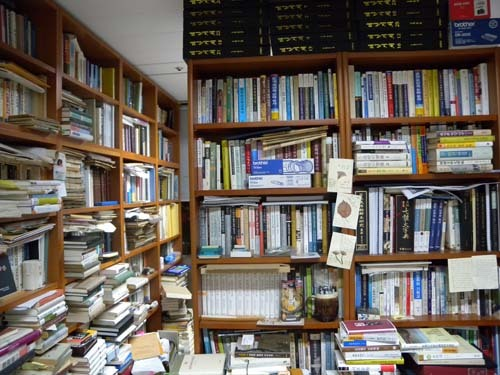

책 단상

초년병 시절. 책을 한 권 내면 세상의 한 모퉁이라도 정복한 듯 설렘으로 붕 뜬 채 며칠을 지내곤 했다. ‘사람들이 아마 요건 모르고 있었을 거야!’ 초등학교 소풍 날 보물찾기 시간, 후미진 곳에서 하얀 쪽지를 찾아낸 뒤 콩닥거리는 가슴을 어쩌지 못하던 아이가 그러했으리라. 책도, 책을 내는 사람들도 그리 많지 않았던 시절. 내로라하는 학계의 거물들이 존재감을 드러내시던 유일한 지표가 저서였다. 잘 나가는 일간지들의 신간안내에는 무게 있는 학술서들이 가끔 소개되었고, 나는 그 기사를 오려갖고 다니다가 서울 가는 기회에 그것들을 사서 소중하게 모셔오곤 했다. 요즘과 달리 방방곡곡의 제제다사들이 총집합하는 학회에 갈 때는 혹시 이 거물들을 뵐 수도 있다는 생각에 최소한 그 분들이 출판한 책 제목과 목차라도 몇 번씩 훑어보고 가는 것이 내 습관이었다.

저자의 급에 따라 달랐겠으나, 책을 내면 초판 1,000권이 기본이었고, 초짜인 내게는 인세조로 100부가 들어오는 것이 다였다. 평소 손꼽아 두었던 학계의 어른들과 동학들에게 정성스레 헌사를 써서 우편으로 보내드리는 것도 특별한 즐거움이었다. 누구 말대로 ‘출신이 한미하여’^^ 대면할 기회는 없었지만, 책과 논문 혹은 입소문을 통하여 익히 알고 있는 그 분들에게 내 목소리를 보낸다는 것은 영광스런 일이었다. 이 분들로부터 무슨 반응이 오리라는 기대는 애당초 없었고, 다만 비웃음이나 사지 않았으면 하는 간절한 바람뿐이었다. 몇 차례 그런 일 들이 반복되는 중에도 ‘가뭄에 콩 나듯’ 몇 분들로부터 반응이 있었는데, 잊히지 않는 몇몇 분들이 있다. 소재영, 김대행, 이규호, 성호주, 박노준, 이상보, 조재훈 선생님 등이 그런 분들이었다. 어떤 분은 전화로, 어떤 분은 편지 혹은 엽서로 감사의 마음을 보내주셨는데, 의례의 수준을 넘는 곡진함을 느낄 수 있었다. 그 가운데 돌아가신 성호주 선생님은 내게 큰 가르침을 주신 분이었다. 책을 보내드리고 나서 한 주쯤 되었을까. 소포가 하나 배달되어 왔다. 뜯어보니 속옷과 양말 한 세트, 그리고 정성스런 편지가 들어 있었다. 편지의 내용도 물건도 감동이었다. 그로부터 책을 받으면 최소한 답장만이라도 정성스럽게 해야겠다고 마음먹게 되었다.

  
매우 혼잡한 어떤 인사의 서재

그 뒤로 세상은 마구 변했다. 누구 말대로 ‘아무나 책을 내는’ 시절이 되었다. 학술서의 원고를 들이밀면 출판사에서도 외면을 한다. 거짓말이나 허접한 거라도 좋으니, 세상 사람들의 이목을 끌만한 원고를 가져 오란다. 돈이 될 만한 원고를 말하는 것이리라. 마음만 먹으면 경천동지(驚天動地)할 학술서를 낼만한 모모 인사들도 이젠 가벼운 대중서를 통한 매명(賣名)의 덫에 걸린 것 같아 안타까운 요즈음이다. 재미있는 책도 안 읽는 세상이니 고리타분한 학술서를 읽을 턱이 없다. 학술서는 초판 500부 혹은 300부가 고작이다. 그나마 정부에서 ‘우수학술도서’ 제도를 통해 돈을 주니 찍어내는 것이겠지만, 그 ‘우수학술도서’라는 것도 ‘로또’일 수밖에 없다. 선정되는 우수학술도서 저자들의 분포를 보며 심사위원들을 점쳐보기도 하는데, 나중에 공개되는 것을 보면 대개 맞는다. 누군가는 “그것도 권력이라고, ‘짬짜미’가 있다”는 말도 하지만, 대체 한 두 번 책을 만지작거린 뒤 수천수백 권의 책 더미 속에서 어떻게 ‘우수학술도서’를 골라낸단 말인가.

이제 책은 천덕꾸러기로 전락했다. 책을 놓아둘 자리가 없는 아파트는 현대판 ‘노마드의 텐트’일 뿐이다. 어느 곳에 풀이 무성하게 자랐다는 소문에 서둘러 텐트를 걷는 노마드처럼, 춤추는 아파트 시세에 따라 수시로 짐을 싸는 존재들이 오늘날의 우리다. 그런 와중에 책만한 천덕꾸러기도 없다. 무겁지, 돈도 안 되지, 놓을 자리도 없지... 이삿짐 센터가 가장 싫어하는 것이 책짐이다. 그래서 이사철 아파트의 쓰레기장에는 책들이 수북수북 쌓이는 것이다.

그런데도 ‘배운 도둑질’이라고, 책을 내지 않을 수 없다. 책을 내면 누군가에게 보여주지 않을 수 없다. 그들이 자발적으로 사볼 이유는 없으니, 내 돈을 들여서라도 사서 보내주어야 한다. 요즘엔 주변에 있는 사람들에게는 먼저 물어본다. “내가 이러이러한 책을 냈는데, 한 부 주어도 되겠나?”라고. 인사치레겠지만, 그럴 경우 대부분 “주세요!”라고 하지만, 속내는 믿을 수 없다. 아마도 50~60%는 쓰레기장으로 가거나, 라면 냄비 받침으로 쓰이리라 생각하면서도 ‘배냇짓처럼’ 헌사를 써서 건네곤 한다. 문제는 멀리 떨어져 있는 사람들이다. 요즘엔 우편으로 책을 부치는 일이 힘도 들지만, 비용도 만만치 않다. 그런데 더 힘 빠지는 경우는 아무런 반응이 없을 때다. 나보다 연상으로부터 반응 없음은 ‘늙어 귀찮으니 그렇겠지’하고 이해할 수 있으나, 동년배나 연하의 동업자들에게 반응이 없는 일은 참으로 이해할 수 없다. 그들은 그럴 지도 모른다. ‘누가 그깟 책 보내라 했나?’ 그렇다. 그들이 원하지도 않았는데, 책을 보내놓고 서운해 하는 내가 바보인지 모른다. 어쩜 가뜩이나 연구실도 좁고 집도 좁은데 책까지 보내왔으니, 투덜거리며 뜯지도 않은 채 던져 놓고 잊어버렸을지도 모른다. 더 심한 추정을 해보자면, 발송인을 확인도 아니 한 채 아예 쓰레기통으로 던져 넣었을 수도 있다.

그러나 보내온 책이 어떻든 상대방이 고심참담 끝에 만들어, 정성스런 헌사와 함께 우편으로 보내온 선물이다. 학자가 자신의 저술을 보내는 행위는 ‘적어도 당신은 내 공부를 이해하고 조언해줄만한 분으로 생각하기에 이 책을 보낸다’는 영광스런 믿음을 전제로 한다. 한 손으로 밥을 떠 넣으며, 다른 한 손으론 SNS를 희롱하는 시절이다. 설사 방금 전 그 책을 쓰레기통에 쳐 박았다 해도, “선배, 좋은 책 잘 받았어요. 언제 그렇게 좋은 책을 내셨어요? 참 놀랍네요. 잘 읽고 많이 배우겠습니다.” 잠시 엄지 손가락 몇 번 움직여 무성의한 문구 하나 스마트폰으로 날리는 게 그리도 어려울까. 하기야 책을 받은 뒤 전화 통화를 해도, 직접 대면하고도, 모르는 척 하는 것이 요즘 세태이니 무슨 말이 더 필요할까.

이제부터라도 어쭙잖은 책 내려 하지 말고, 잘 있는 산의 나무들이나 건사할 일이다.

공유하기

게시글 관리

**백규서옥\_Blog ver.**

[저작자표시 비영리 변경금지
(새창열림)](https://creativecommons.org/licenses/by-nc-nd/4.0/deed.ko)