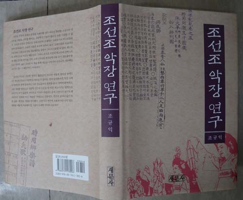
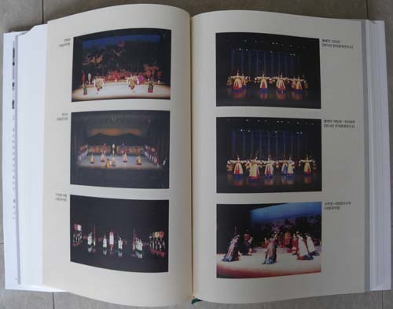

[서평] 조규익, 《조선조 악장 연구》(새문사, 2014)

본질 탐구로 길어낸 악장 연구의 새로운 이정표

                                                                             박수밀(한양대 국문학과)

1.

조규익 교수의 《조선조 악장 연구》(2014)는 저자가 수십 년간 줄기차게 매달려온 악장 연구의 3부작 완결판이다. 악장은 고전시가에서 자립적인 위상을 지닌 양식임에도 불구하고 연구하는 학자는 극히 적다. 연구 초기 장르상의 귀속이 애매했을 뿐더러 특정한 시기에만 나타났다 사라진 장르라는 점, 소수 계층의 욕망을 대변한 승리자의 노래라는 관점이 작용한 결과이다. 저자가 지적해 왔듯이 악장은 ‘아부문학’이라는 생각이 널리 퍼진 결과 학자들의 외면을 받아왔다. 그럼에도 불구하고 저자는 3권의 악장 연구서를 간행해 왔다. 첫 연구서인 《선초악장 문학 연구》가 1990년도에 간행되었으니 최소한 족히 삼십년 이상을 악장 연구에 매달려온 셈이다. 하나의 주제에 대해 삼십 년 이상 지속적으로 꾸준한 성과를 보여주는 학자도 드물거니와 소외된 문학에 대해 지속적인 애정을 쏟는 일도 쉽지 않다. 기왕이면 많은 학자들이 인정하는 영역에서 주목받는 글을 쓰고 싶은 것이 연구자들의 인지상정이다. 하지만 저자는 주위의 시선에는 아랑곳 않고 그다지 건질 것이 없어 보이는 악장 연구에 매달려왔다. 이 집념이 묘한 흥미를 끈다. 저자는 성산학술상, 도남국문학상, 한국시조학술상 등의 이력에서 확인할 수 있듯이 고전시가에서 탁월한 연구 역량을 보여주고 있는 학자가 아니던가. 저자는 이번 저술이 25년 악장 연구사에 대한 마무리라고 고백했다. 과연 오랫동안 악장 연구를 진행하면서 저자는 무슨 말을 하고 싶었던 것일까? 수십 년간 한 우물을 판 노고는 그 자체로 인정받아야 할 것이다. 그러나 연구의 햇수와 연구의 질은 별개의 문제이므로 연구서가 얼마만큼의 성취를 보여주고 있는지, 저자의 문제의식이 어디를 향해 있는지를 꼼꼼히 확인해 볼 필요가 있다.

2.

악장에 대한 본격적인 저자의 첫 연구서라 할 《선초악장 문학 연구》(1990)은 선초 악장의 형성 및 장르적 성격을 밝히고 악장의 국문학 장르상의 위상에 대해 논한 저술이다. 악장에 대한 학계의 인식이 부정적인 상황에서 악장의 위상을 새롭게 제시함으로써 선초 악장 연구서의 바이블이라는 평가를 받았다. 그로부터 9년 뒤엔 《조선조 악장의 문예미학》(2005)을 간행하여 악장의 가치와 전개 양상을 구체적으로 파고들었다. 이 책에서는 조선조 악장의 현상과 미적 본질, 조선조 악장과 왕조의 현실, 개인의식과 집단이념의 조화, 조선조 악장의 흐름 등을 밝혔다. 저자는 종합예술이라는 관점에서 악장의 독자적 미학을 치밀하게 탐구, 악장에 대한 편견과 오류를 해소하고 악장을 경세의 문학으로 끌어올렸다.

이번에 펴낸 《조선조 악장 연구》는 악장 연구사를 마무리 짓는 세 번째 연구서이다. 저자의 말대로라면 기존 연구에 ‘새로운 보완의 시각’을 제공하고자 한 것이다. 그 동안의 악장 연구에 대한 저자의 성과를 종합하고 아악악장과 향‧ 당악악장에 해당하는 개별 악장들의 성격과 주제의식에 대해 분석함으로써 악장의 연구 폭을 크게 확장하고 있다. 궁극적으로 악장연구를 통해 얻은 성과를 바탕으로 고전시가 연구의 패러다임을 바꿀 것을 제안하고 있다.

먼저는 연구서의 구성에 대해 간단하게 살펴보기로 하자. 책은 총 5부로 구성되었다. 5부가 총론에 해당한다는 점을 고려하면 실질적으로는 4부로 이루어진 셈이다. 1부에서는 조선조 악장의 성격을 밝혔는데, 저자는 조선조 악장이 ‘지속과 변이의 원리를 구현’하고 있다고 주장한다. 무엇이 지속인가? 고려조 악장의 음악적 측면을 물려받았다는 것이다. 무엇이 변이인가? 조선왕조라는 특정 집단의 이념을 강조한 새로운 내용으로 바뀌었다는 것이다. 곧 조선조 악장은 고려조에서 중국으로부터 받아들인 아악이나 아악악장들과 함께 고려조에서 수용한 삼국 이래 속악의 악장들이 조선조에서 새롭게 제작된 노래들과 합쳐진 것이라는 것이다.

저자는 악장을 크게 아악악장과 향 ‧ 당악 악장으로 나눈다. 각종 제향 악장이 전자라면 각종 연향 악장은 후자에 속한다. 2부와 3부는 아악 악장과 향 ‧ 당악 악장의 성격을 다룬 것이다. 2부의 아악악장에 대해서는 악장의 중세적 문명론의 표준과 보편성의 확보라는 관점에서, 3부의 향, 당악 악장은 조선 왕조의 문화적 독자성과 정체성의 확보라는 관점에서 살폈다. 아악악장은 종묘제례, 문묘제례, 사직제례, 선농제례 등 제례에 쓰인 악장을 말한다. 저자에 의하면 조선조는 문묘제례와 종묘제례를 통해 왕조의 정치적 이념적 정당성을 주장하고 왕조 존립의 보편적 가치와 당위성을 선양하고자 했다. 그리하여 중국의 <시경>, <주역> 등에서 악장의 주요 문구나 모티프를 직접 차용해 악장으로 쓰거나 혹은 선행 악장들의 구절이나 모티프 등을 차용해 선초 악장에 사용해 왔다. 곧 아악악장을 통해 동아시아적 ‧ 중세적 문명론의 표준과 보편성을 확보하려 했다는 것이다. <문선왕 악장>, <사직악장>, <선농악장> <선잠악장>, <풍운뇌우 악장>을 분석하여 이러한 주장에 대한 논거를 확보한다.

이에 비해 3장의 향 ‧ 당악 악장에서는 ‘조선조 악장의 독자성’을 살핀다. <문소전 악장>, <석전음복연 악장>, <창수지곡 악장>, <경근지곡 악장>, <오륜가>, <봉래의 악장> 등을 다루었다. 향 ‧ 당악 악장에서는 우리의 고유한 노래 장르를 악장으로 수용함으로써 우리만의 독자적이고 특수한 미의식을 담아냈다고 주장했다. 이들 노래에서 발견되는 텍스트의 구성이나 주제의식의 실험성은 아악악장과 구별되는 지점이며 악장이 고전시가사 전개에 큰 기여를 한 점이라고 보았다.

4부는 ‘다른 각도에서 본 조선조 악장의 본질적 속성’이란 제목을 붙였는데, 정재 악장에 나타나는 송도 모티프와 선계 이미지의 연원을 밝힌 대목이 흥미롭다. 이 외에도 저자는 악장에 대한 북한문학사의 관점을 살펴본다. 북한의 연구자들은 악장을 아부문학이나 무조건적 송축문학으로 배척해온 남한 학자들과 입장을 같이 해오고 있는데 북한 역시 악장을 백성들의 문화생활과 거리가 멀기 때문에 무가치하다고 폄하한다는 것이다. 경직된 이념이나 선입견에서 벗어나야 악장의 참모습을 볼 수 있다는 것이 저자의 주장이다.

연구서는 악장의 문학성을 다룬 것이 아니라 악장의 본질과 성격에 대한 탐구이다. 양식의 문학성을 파고든 것이 아니라 양식을 둘러싼 맥락에 주목했기에 문학 연구라는 관점에서 보자면 저술의 가치는 덜할지도 모르겠다. 그러나 악장 연구를 둘러싼 저자의 궁극적인 문제의식, 주제에 접근하는 남다른 방식, 실사구시에 입각한 꼼꼼하고 치밀한 논증의 결과를 들여다보노라면 이 저술이 갖는 의미와 무게는 남다르게 다가온다. 어쩌면 이 연구서의 진정한 가치는 고전시가를 접근하는 시각에 대한 새로운 통찰력을 보여준데 있을지도 모른다.

3.

저자는, 텍스트와 콘텍스트 및 상호텍스트에 대한 면밀한 고찰 없이는 고전시가론이나 고전시가사 혹은 국문학사는 완벽을 기할 수가 없다고 주장한다. 이는 연구서를 관통하는 문제의식이기도 하다. 텍스트 측면은 관찬문헌인 조선조의 악서들에 지금 고려속요로 불리는 고려의 악장들이 기록되어 있다는 것이고 콘텍스트 측면은 악장은 조선과 고려의 궁중 무대예술이라는 점이다. 상호텍스트 측면은 악장은 당악을 비롯한 외래 음악이나 공연과의 연계에서 이루어진다는 점이다. 악장은 이와 같은 외적 맥락을 종합적으로 고려해야 그 본질이 선명하게 드러난다는 것이다. 문학은 그 시대의 사회, 문화, 정치와 긴밀하게 연결되어 있다는 의식에서 나온 발언이라 본다. 지식은 고정된 실체가 아니다. 지식은 순수하고 객관적인 결과물이 아니라 그 시대의 사회 구조와 공동체 구성원에 따라 의미를 형성하고 바꾸어간다. 곧 지식은 맥락과 관계에 따라 구성되는 것이다. 그런 점에서 문학을 둘러싼 맥락에 주목하는 저자의 관점은 충분히 설득력 있으며 답보 상태에 빠진 고전시가 연구 방법론에 새로운 활로를 뚫어줄 것으로 기대가 된다.

다만, 말했듯이 작품의 문학성 자체에 대한 탐구가 부족하다는 점을 지적받을 수 있겠는데, 가만히 반추해보면 그렇지만도 않다. 저자는 악장의 본질을 제대로 간파하고 악장 문학에 접근하는 가장 올바른 방향을 잡아낸 것이다.

조선조 악장은 국가의 공식 행사에서 사용되던 악사(창사)이다. 저자는 말하길, 악장은 정재라는 틀 안에서 음악과 춤이 결부될 때 비로소 그 생명성이 온전히 드러날 수 있다고 한다. ‘고려조에서 중국으로부터 받아들인 아악이나 아악악장들과 함께 고려조에서 수용한 삼국 이래 속악의 악장들이 조선조에서 새롭게 제작된 노래들고 합쳐진 것이 조선조의 음악이고 악장’(45쪽)이라는 것이다. 악장이 가(歌), 무(舞), 악(樂)의 예술이 함께 어우러지는 종합무대예술인 정재에서 가창되었다는 점을 감안하면, 악장은 춤까지 관여되어 복잡한 내포를 지닌 언어예술이라는 것이다.

그러므로 저자는 악장을 문학적으로만 재단해온 지금까지 연구는 악장의 본질을 왜곡시켰을 가능성이 크다고 본다. 악장이 상대적으로 문학성이 쳐진다는 평가를 받아왔다면 이는 악장을 악장답게 다루지 않은 데서 초래된 결과였음을 인정하고 새로운 접근 방법을 찾아야 한다는 것이다. 악장에 대한 저자의 접근 방식은 바로 이와 같은 문제의식에서 출발한 것이다. 그러므로 악장이란 장르를 ‘문학성’이라는 프레임으로 접근하는 것이, 저자에게는 오히려 왜곡의 위험성을 만드는 것이다.

따라서 악장의 본질은 텍스트를 둘러싼 외부 맥락과의 관련 아래 탐구해야 한다. 악장의 본질, 그것은 가무악이 어우러진 궁중의 정재이다. 노래로서의 악장이 실현되는 사회 문화적 맥락을 따져보아야만 악장의 진면목을 파악할 수 있는 것이다. 그렇다면 저자의 접근 방식이 얼마나 의미 있는 성과를 보여주고 있는지를 따져보지 않을 수 없다.

저자의 관점이 정채를 발하는 장면은 정재 악장에서 확인되는 송도 모티프와 선계 이미지의 연원과 지속 양상을 밝힌 곳에 있다. 조선조 악장을 관통하는 주제의식은 왕에 대한 송축이나 송도를 통한 왕조 영속의 당위성 선양이다. 당악정재를 살펴보면 왕을 송축하기 위해서 ‘신선의 이미지’를 차용하고 있다. 당시 당악정재들에 등장하는 중심 배역은 선모나 신신들이었고 그들의 창사나 담화에는 송도 모티프가 담겨 있다. 신선으로 분장하여 왕에게 드리는 송도의 말이 바로 송도시자이자 선어였다는 것이다.

이 점을 논증하기 위해 저자는 동동정재를 살핀다. 《고려사악지》에는 동동에 대해 “동동 놀이는 송도지사가 많은데 대개 선어(仙語)를 본떠 마든 것이다[動動之戱 多有頌禱之詞 盖效仙語而爲之]”라고 언급하고 있다. 여기에 나타나는 송도와 선어(仙語)는 동동의 성격을 이해하는 관건이 되는 까닭에 많은 학자들이 이 뜻을 밝히기 위해 다양한 주장을 펼쳐 왔다. 중국 전래의 도교 사상과 관련시키거나, 화랑, 풍류 등에 연원을 둔 무속과 같은 연장에서 이해하거나 팔관회 때 상연되는 백희가무에서 불린 노래로 보기도 했다. 신선 기녀와 연관 짓거나 무격(巫覡), 우인(優人)의 말로 보기도 했다. 그야말로 각자 입론에 따라 다양한 견해가 제시되어 왔는데, 이에 대해 저자는 선학들이 〈동동〉을 둘러싸고 있는 콘텍스트로서의 속악정재나 속악정재의 표본으로 기능했을 당악 정재에 시선을 주지 못한 까닭에 송도지사와 선어의 의미를 잘못 이해하고 있다고 주장한다.(364쪽) 노래의 주제적 측면을 지칭한 송도지사와 표현적 측면을 지칭한 선어 모두 동 시대의 당악정재에 근원을 두고 있는데, 그런 표현법이나 주제의식은 당대 궁중에서 성대하게 공연되던 당악 정재의 창사를 본뜬 것들이다. 선어는 바로 이들 정재에서 서왕모 등 신선으로 분장하여 송도의 노래를 가창하던 여기(女妓)들의 창법에서 비롯되었다는 것이다. 곧 헌선도(獻仙桃), 수연장(壽延長), 오양선(五羊仙) 등 당시에 성행하던 당악정재들 속의 선모(仙母)를 비롯한 신선(神仙)들이 잔치 자리의 좌상객인 임금에게 바치던 '송도(頌禱)의 말'이 바로 ‘선어’, 즉 신선의 말이라는 것이다.

악장의 본질을 간파하고 상호 텍스트적 상황에 의거하여 송도지사와 선어의 의미를 밝힌 저자의 주장은 상당히 설득력이 있다. 선어에 대한 제 학자들의 주장을 살펴보면 저자의 글을 읽었음에도 이 주장을 비판하지 못한 채, 각자의 입론을 만들어 제각기 주장을 펼치고 있다. 고려가요를 악장의 한 형태로 보려는 저자의 생각을 의도적으로 회피하고 있다는 느낌을 갖게 한다. 저자의 주장을 극복할 수 있는 논거를 대거나 저자의 주장을 수용하거나 하는 엄정한 학문 태도가 필요하리라 본다.

4.

본 저술의 진정한 가치와 의미는 집요하고도 치밀하게 악장의 본질과 성격을 탐구함으로써 별 문학성이 없어 보였던 양식을 의미 있는 양식으로 끌어올린데 머물지 않는다. 저자의 궁극적 시선은 고전시가사와 고전문학사를 재편하는 데로 향한다. 저자는 조선조 악장의 존재나 본질을 도외시할 경우 아무리 현란한 고전시가 장르론을 펴더라도 공허할 뿐이며, 국문학사 기술의 합리성도 기대할 수 없다고 말한다. 과연 이러한 주장은 타당한 것일까? 저자에 따르면 고려의 노래들은 대중가요로서의 속요이기 이전에 궁중악으로서의 속악가사이다. 곧 고려 노래의 1차적 분류 범주는 악장이 된다. 그러므로 고려가요는 1차적으로는 악장론을 거쳐야 의미를 갖게 되는 것이다. 조선조 악장의 콘텍스트 안에 엄연히 존재하는 고려가요의 텍스트를 고려의 시대적 속성에 맞추어 놓고 고려시대의 속요라는 이름으로 재단해본들 결과가 신통할 리 없다는 것이 저자의 생각이다. 고려가요가 악장으로 수렴된다면 의당 고려가요는 악장이라는 틀에서 이해되어야 하며 고려가요의 성격과 위치에 대한 재검토가 요청된다. 조선조의 시조와 악장을 다룬 〈시조와 궁중악장의 관계〉 장을 읽노라면 악장과 시조 간의 새로운 관계 설정도 필요해 보인다.

또 악장의 본질이 문학이 아닌 정재로서의 성격에 있다면 “악장과 관련되는 중세 고전시가 연구의 패러다임이 문화론이나 예술론 차원으로 전환”되어야 한다는 저자의 주장에 귀를 기울여야 한다. 고전시가를 문학과의 연관 아래서만 기술하려는 기존의 관행에서 벗어나 음악 무용 등의 예술 및 당대 사회 문화와의 관련성을 종합적으로 고려하는 새로운 접근 방식이 요구되는 것이다. 이는 고전시가의 문학성을 훼손하는 것이 아니라 고전시가 연구의 폭과 깊이를 확장하고 장르의 본질을 회복하는 것이다. 문학을 고립적으로 가두지 않고 여타 분야와 폭넓게 소통하면서 통섭하려는 오늘날의 시대적 흐름과도 궤를 같이한다.

악장의 본질을 규명하려는 치열한 노력과 성과가 기성과 관행을 타파하고 새로운 변화의 방향으로 나아가도록 이끌어준다는 점이 본 연구서의 진정한 미덕이자 가치라고 생각한다. 과연 저자의 바람대로 조용하지만 의미 있는 변화가 새롭게 추동될 수 있을 것인가? 본 연구서의 성과와 제안을 비판하든 극복하든 간에, 애써 외면하기보다는 저자의 주장에 귀를 기울여주고 활발한 토론과 치열한 논쟁이 벌어졌으면 하는 마음이다. 저술에서 보여주는 꼼꼼한 논증과 묵직한 문제의식은 저자가 학계에서 보여준 성실함과 무게에 값한다고 본다. 삼십 여년에 걸쳐 남들이 관심두지 않은 길을 뚝심 있게 밀고나간 저자의 학식과 공력이 《조선조 악장 연구》에 오롯하게 담겨 있다.

  \*이 글은 <<한국문학과 예술>> 14집(한국문예연구소, 2014)에 실려 있습니다.

공유하기

게시글 관리

**백규서옥\_Blog ver.**

[저작자표시 비영리 변경금지
(새창열림)](https://creativecommons.org/licenses/by-nc-nd/4.0/deed.ko)