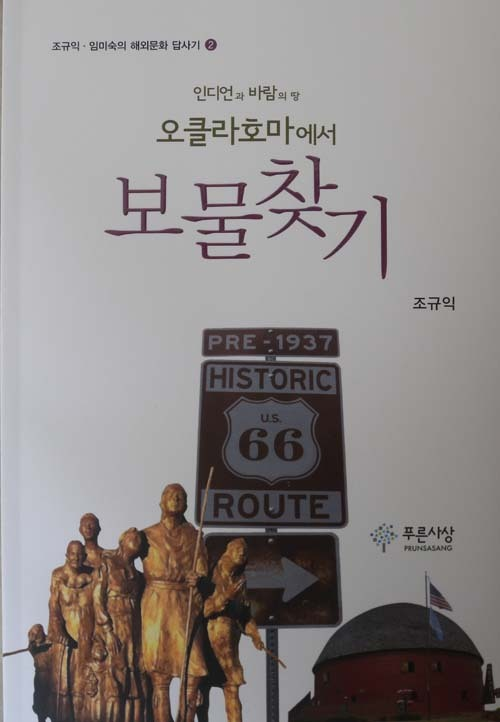
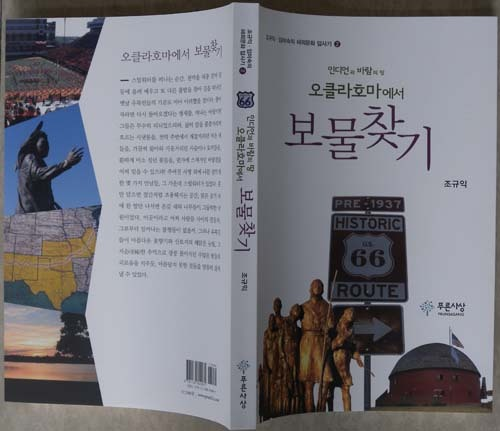
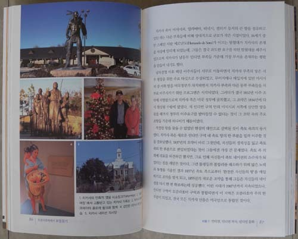

저는 2013년 2학기 ‘풀브라이트 방문학자(Visiting Fulbright Scholar)’로 오클라호마 주립대학(Oklahoma State University) 역사학과에서 연구를 진행하는 동안 현지를 틈틈이 답사하고 체험한 기록들을 정리하여, 최근 <<인디언과 바람의 땅 오클라호마에서 보물찾기>>(푸른사상)라는 제목의 문화 답사기를 펴냈습니다. 한국인들에게는 토네이도의 본고장으로만 알려졌을 뿐인 오클라호마를 ‘보물찾기’라는 테마를 통해 새롭게 읽어내고자 했지요. 책 내용은 다음과 같습니다.

보물 1: 스틸워터와 OSU, 그 안식과 탐구의 낙원

●평온과 정밀(靜謐)의 오클라호마에 안착

●역사학과를 찾아

●학과 비서들과의 만남

●카우보이 풍의 노신사, 학과장 로간 교수와의 만남

●브렛 학장과의 만남

●평원 속 지성의 오아시스, OSU에서

●역사학과 학생들을 위한 특강을 마치고: 한국의 이미지를 새것으로!

●카우보이들, 풋볼의 진수를 보여주다!

●미국 대학의 졸업식과 감동: 왜 우리는 이렇게 하지 못하는가?

●안식과 힐링의 낙원 스틸워터에서

보물 2: 인디언, 인디언 역사, 인디언 문화

●오클라호마와 인디언 부족들

●대초원에서 만난 오세이지 인디언들

●체로키 후예의 집을 찾아 패러다임 전환의 증거를 찾다

●오클라호마 동쪽에서 체로키 인디언들을 만나다!

●체로키어‘ 오시요(Osiyo)’와 우리말‘ (어서) 오세요!’의 정서적 거리

●스틸워터의 이웃동네에서 만난 판카 인디언들

●길 가다 우연히 만난 아이오와 인디언 족

●지혜로운 치카샤 족, 인디언 사회의 자존심

●촉토 족의 뿌리와 투쟁, 그리고 예술

●촉토 족의 탁월한 교육열, 풍부한 역사 자취

●놀라운 세미놀 인디언들의 역사와 문화의식

●카이오와, 아파치, 코만치, 그리고 대평원의 서사시

●카이오와 족의 삶과 예술

●무서운 코만치에서 상식의 미국인으로!

●크릭 족의 꿈과 현실을 찾아

●오클라호마 밖의 인디언: 뉴멕시코의 앨버커키와 스카이 시티, 그리고 푸에블로족

●암굴 속에 서린 생존 의지‘, 반델리어 국립 유적지’와 푸에블로 족의 말 없는

외침

●부드러운 어도비, 완강한‘ 타오 푸에블로’ 인디언들

보물 3: 미국의 길, 66번 도로(Route 66)의 낭만

●미국에서 길을 찾으며: 우리도 스토리가 있는 길을 한 번 만들어 봅시다!

●작은 일탈을 꿈꾸는 66번 도로, 그 낭만과 허구

●엘크 시티와 ‘국립 66번 도로 박물관 단지’

●클린턴 시티와 ‘66번 도로 박물관’

●엘 르노 시티와 ‘캐나디언 카운티 뮤지엄’

●66번 도로에 살아 있는 역사의 공간, 유콘 시티

●누구 혹시 이 소녀를 아시나요?: 유콘에서 만난 우리들의 누이

●한국전 참전용사의 아들 리차드 카치니와 ‘유콘 참전용사 박물관’

●오클라호마의 숨은 별: 거쓰리 시티/ 66번 길의 경이로운 옛 건축물: 아카디아 라운드

반

보물 4: 박물관과 미국 역사

●서부 개척시대 미국의 소리: 국립 카우보이와 서부유산 박물관

●예술로서의 역사, 역사로서의 예술: 털사의 길크리스 박물관에서 길을 잃다!

●인간의 악마성을 깨우쳐 준 공간: 오클라호마 시 메모리얼 뮤지엄  
●오클라호마 밖의 박물관: 예술과 역사의 도시 산타페와 박물관들

보물 5: 열정과 도전의 대학인들

●미국의 중남부에서 아시아 역사를 가르치는 젊은 학자: 용타오 두 교수

●학자와 목자의 삶: 한인 교수 장영배 박사

●빛나는 한국학생 브라이언

●한반도에 관심이 큰 소련 역사 전문가 림멜 교수

●탁월한 젊은 영어 교육자 제이슨 컬프

●역사학의 새로운 분야를 개척해온 프레너 교수

보물 6: 아름다운 자연, 안식의 낙원

●부머 호수에서 찾은 마음의 고요

●리틀 사하라에서 되찾은 고향의 꿈

●대초원에서 멋진‘ 울음 터’를 발견하고

●낙원 속의 산책로: OSU 크로스 컨트리 코스의 안식과 힐링

\*\*\*

일반적으로 미국은 역사가 짧고, 넓은 땅에 비해 인구가 상대적으로 적기 때문에 ‘역사 문화유적의 답사’라는 여행 목적에 부합하지 않는 공간으로 잘못 알려져 있는 것이 사실입니다. 그러나 백인들의 이주 후 200여년, 인디언으로부터 따지면 그보다 훨씬 더 긴 역사가 이어져 온 땅이고, 그에 따르는 문화유산들이 적지 않은 곳입니다. 더구나 경쟁력으로 세계에서 가장 우위를 점하고 있는 미국의 대학들이나 자연과 조화를 이루고 있는 도시문화를 생각하면, 미국은 유럽과 또 다른 차원의 매력을 지닌 지역입니다. 무엇보다 39개에 달하는 인디언 부족의 보호구역들이 도처에 널려 있는 오클라호마는 대초원(Tall Grass Prairie)과 대평원(The Great Plains)등 풍부한 목초지와 함께 지하에 매장되어 있는 원유 등으로 오랜 동안 풍요를 구가해온 지역이기도 합니다. 풀브라이트(Fulbright) 재단의 지원을 받아 이곳의 대표적인 교육기관 ‘오클라호마 주립대학(Oklahoma State University)’에서 연구를 하게 되었습니다만. 이곳에 오자마자 연구 과제 외에 이 지역의 역사적・문화적 의미에도 관심을 갖게 되었습니다.

특히 제가 관심을 가졌던 대상은 인디언의 역사와 문화였습니다. 저는 사람, 자연, 도시, 제도, 역사, 문화 등 감고 있던 마음의 눈을 뜨게 한 모든 것들이 보물로 생각되었습니다. 그간 모르고 지내온 것들이 그의 편견을 바로잡아 주었기에 보배로웠습니다. 그 중에서도 인디언들과의 만남은 무엇보다 소중했습니다. 인종에 대한 편견과 무지에서 벗어나지 못하고 있었음을 비로소 깨닫게 된 것은 무엇보다 소중한 체험이었습니다. 백인들에 의해 고통을 받아온 인디언이야말로 역사의 거울에 비친 우리 모습이라는 점에서 가치 있는 보물이었던 것입니다. 서부영화나 백인들에 의해 저술된 책들을 통해 제 마음에 뿌리 내린 ‘왜곡된 인디언의 이미지’가 비로소 바로잡혀지게 된 점을 가장 ‘곰지게’ 생각합니다. 다시 말하면 지배자들이 펼쳐 온 자기 합리화의 억설(臆說)에 의해 일그러진 인디언들의 실체를 삶의 현장에서 바로잡음으로써 내면에 고착된 편견을 해소할 수 있었다는 것입니다.

제 입장에서 인디언에 대한 발견과 함께 빼놓을 수 없는 것은 오클라호마 주립대학을 통해 미국 대학들의 경쟁력이 바로 미국의 경쟁력임을 깨닫게 된 점입니다. 대학의 역사와 현실을 통해 학생들이 마음껏 공부하고 체력을 단련하며 단합정신을 함양할 수 있도록 치밀하게 운영되는 미국 대학의 장점을 읽어낸 것은 제 글 내용의 핵심적인 축입니다.

인디언이나 대학의 힘에 대한 발견과 함께 오클라호마나 스틸워터의 깨끗한 자연으로부터 얻게 된 힐링의 감동은 이 책 내용의 또 다른 축입니다. 부머 호수, 리틀 사하라, 산책로로 쓰이고 있는 크로스 컨트리 코스 등 ‘잘 보존된 자연’이 인간의 내면적 평정이나 행복을 위해 얼마나 큰 힘을 발휘할 수 있는가에 대하여 체험적으로 진술하고자 했습니다. 제 글의 에필로그 가운데 마무리 부분은 다음과 같습니다.

“풀브라이트 학자로서의 가볍지 않은 사명을 짊어지고 오긴 했지만, 연구 외

에 이곳에서 발견한 또 다른 것들이 나를 달뜨게 했다. 오클라호마 사람들과의

만남, 인디언의 역사나 문화와의 만남, 길(특히 Route 66)과의 만남, 아름답고

깨끗한 환경과의 만남 등등. 그러나 무엇보다 소중했던 스틸워터는 문만 닫으

면 절간처럼 조용해지는 공간이었다. 맑은 공기 속에 한 발만 나서면 온갖 새

와 나무들이 그들먹한 낙원이었다. 그래서 기대 이상의 힐링을 체험하며 마음

속의 온갖 찌꺼기들을 날려 버릴 수 있었다. 물론 이곳이라고 어찌 사람들 사

이의 갈등과, 그로부터 일어나는 불행들이 없을 수 있을까. 그러나 유목민들이

아름다운 꽃향기와 산토끼의 해맑은 눈빛, 그 지순(至純)한 추억으로 광풍 몰

아 치던 수많은 밤들의 괴로움을 지우듯, 아름답지 못한 것들을 걸러내는 능력

이야말로 지혜로운 인간의 전유물 아닌가. 사실 짧지 않은 6개월 동안 걸러내

야 할 단 하나의‘ 씁쓸함’도 만나지 못한 나였다.

                                                          \*\*\*

스틸워터에서 화려한 행복보다는 작고 따스하며 담백한 즐거움 속에 거의

완벽한 힐링의 추억을 간직하게 되었으니, 이제 맛있고 영양가 풍부한 풀들이

많이 자라 있기를 기대하며 다시 옛 고향으로 노마드의 소떼를 몰고 재입사(再

入社)하기로 한다.”

그곳에 가보지 않은 사람도 책을 펼치기만 하면 오클라호마와 스틸워터의 감동과 아름다움이 손에 잡힐 듯 생생하게 느껴지리라 생각합니다. 강호제현의 질정(叱正)을 고대합니다.

<<인디언과 바람의 땅 오클라호마에서 보물찾기>>, 푸른사상, 2014.

공유하기

게시글 관리

**백규서옥\_Blog ver.**

[저작자표시 비영리 변경금지
(새창열림)](https://creativecommons.org/licenses/by-nc-nd/4.0/deed.ko)