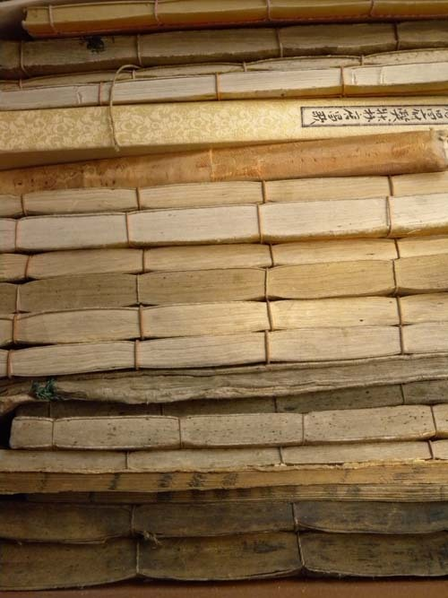
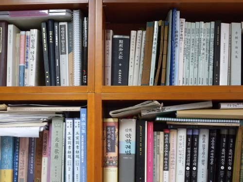
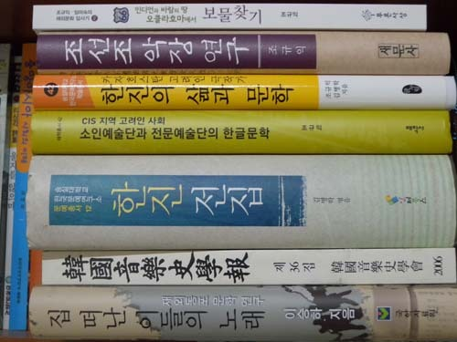

내 등짝을 내려친 출판사 사장의 죽비

오늘 두 사람의 출판사 관계자가 내 연구실에 찾아왔다. 언제나 출판사 사람들이 방문을 열고 들어설 때마다 내 가슴은 출렁 내려앉곤 한다. 당장 필요도 없는 책을 사야 하거나 그들의 푸념을 들어야 하고, 내 가슴에 그득 들어 있는 탄식을 쏟아내야 하기 때문이다. 그런 점은 오늘도 마찬가지였지만, 또 다른 의미의 깨달음을 얻게 되었다는 점에서 특별했다.

최근에 나는 나 자신이 알 수 없는 우울증에 빠져 있음을 깨닫게 되었다. 작년 전반기에 두 권의 책을 냈고, 미국 체류를 끝내고 돌아온 올해 들어 두 권의 책을 냈으며, 비록 공저와 공편일망정 연말까지 두 권의 책이 더 나올 예정이니, 그런대로 쏠쏠한(?) 수확이라 할 만한데, 왜 이리 마음이 무거운 걸까? 내가 책을 내면서도 우울해지는 것은 ‘아무도 책을 읽지 않는 이 시절의 우울한 현실’ 속에서 ‘또 하나의 민폐를 끼치고 말았다’는 자괴감 때문이다. 미국에서 돌아온 이후 작년에 책을 낸 그 출판사에 전화 한 통화 걸어볼 엄두를 못낸 것도 보나마나 내 책들이 ‘재고’의 딱지를 붙인 채 창고 한 켠에 그득 쌓여 있으리란 확신 때문이었다.

책 내는 일이 수월하지 않던 지난 시절. 책을 내고자 하던 젊은 나이의 누구나 그랬으리라. 자신이 갖고 있는 원고로 책을 만드는 출판사는 ‘대박’을 치게 될 거라는 착각과 환상이 바로 그것이다. 이른바 그 옛날 ‘낙양(洛陽)의 지가(紙價)를 올린 일’이 자신으로 인해 이 시대에 재현되리라는 행복한 착각 속에 며칠을 보내게 된다는 것. 중국 진나라의 좌사(左思)가 10년을 고심참담하며 완성한 명문 <삼도부(三都賦)>를 낙양 사람들이 다투어 베끼자 종이 값이 오르게 된 그 사건이 자신에겐들 일어나지 말란 법이 있겠느냐는 ‘병아리 셈’으로 숱한 밤을 곱게 지새우는 책상물림들이 좀 많았으랴.

그러나 시절은 무섭게 변했다. 코흘리개부터 백두옹(白頭翁)에 이르기까지 ‘자라목 증후군’이 세대를 초월한 병증으로 자리 잡을 만큼 스마트폰 중독시대에 이르자 책은 한갓 귀찮은 쓰레기로 전락하고 말았다. 세상의 시름을 말끔히 풀어주는 온갖 소문과 기문(奇文/奇聞)들이 사각형의 오묘한 기계 속에 그득한데, 신국판ㆍ국배판의 무겁디 무거운 종이책들을 지고 다니는 오기를 부릴 만큼 미련하지 않다고 스스로 착각들을 하고 있는 것이 요즘의 우리들이다. 오늘 아침에도 쓰레기를 버리러 쓰레기장에 나갔다가 쓰레기로 버려진 수십 권의 멀쩡한 책들을 만났다! 80년대 중반, 본격적으로 진입한 국민소득 1만불의 산업화 단계에서 이른바 3S(SEX. SPORTS, SCREEN)의 우민화 정책이 빛을 발하여 책은 우리의 삶에서 자꾸만 멀어져 갔고, ‘정보화-고도정보화’ 시대의 격랑을 지나면서 ‘도(독)서 소외’는 우리 사회 문화적 퇴행의 한 현상으로 고착된 것이다.

출판사 사장은 울상이었다. 제작비를 맞추기 위해 300부만 찍는데, 그 반도 안 나간다는 것이다. 심지어 교재도 안 나간다고 했다. 학생들 몇이서 교재 한 권만 돈 주고 산 다음 PDF 파일로 만들어 공유하고 그 때 그 때 필요한 부분만 각자 출력하여 강의시간에 갖고 온다는데, 그런 세대에게 교재를 사라고 권할만한 강심장은 더 이상 없다. 출판사 사장은 내 체면을 보고 책을 내준 것 같은데, 아니 그보다는 대학에 있으니 적어도 기본 부수는 팔리지 않을까 하여 책을 내 준 것 같은데, 내 책에 대한 시장의 반응을 물어볼 엄두도 못 내는 나로서는 우울해질 수밖에 더 있는가. 그래서 적어도 내게 ‘책을 내는 일’은 ‘민폐’였다. 그래서 앞으로 원고가 완성된다 해도 책은 내지 않겠노라는 결심을 하게 되었고, 그 생각을 연구실로 찾아온 사장에게 말했다. 그저 완성된 원고의 부분 파일을 홈피에 올리고 필요한 사람은 출력해 가도록 하겠다는 것이 내 아이디어였다. 그러자 그 사장은 다급하게 소리쳤다. “그럼 우리 일을 접으라고요? 그나마 안 팔리는 책일망정 만들며 근근이 연명하고 있는 상황인데, 아예 책을 안 쓰시겠다니, 우리 보고 문을 닫으라는 말씀인가요?”

다급한 그의 말을 듣고 나서야 내가 배부른 생각을 하고 있었음을 깨달았다. ‘아랫돌 빼서 윗돌 괴고 윗돌 빼서 아랫돌 괴기’일지언정 그래도 먼 훗날 언젠가를 위해 이들은 책을 만들고 있었다. 그저 책짐을 짊어지고 다니며 팔지 않아도 먹고 사는 데 큰 어려움을 겪지 않는다는 이유로 태평한 생각을 하고 있는 나임을 비로소 알게 되었다. 그래, 스피노자는 왜 ‘내일 세상이 망한다 해도 오늘 사과나무를 심겠다’고 했을까. 앞이 보이지 않는 암담한 상황에서도 내일엔 뭔가 나아질 거라는 희망을 갖는 것이 이 땅의 우리 세대가 견지해야 할 삶의 태도 아니겠는가. 비록 내 책이 후세인들의 간장 병 마개나 펄펄 끓는 라면 냄비의 밑받침으로나 쓰인다 해도 지금 그걸 당겨서 걱정할 필요는 없을 것이다. 이 시대의 나는 이 시대의 논리에 충실하며 살아갈 따름이다. 모름지기 학자라면 힘이 남아 있는 한 고심참담 저술을 해야 함을 내게 깨우쳐 주고 그 출판사 사장은 황황히 떠났다.

공유하기

게시글 관리

**백규서옥\_Blog ver.**

[저작자표시 비영리 변경금지
(새창열림)](https://creativecommons.org/licenses/by-nc-nd/4.0/deed.ko)