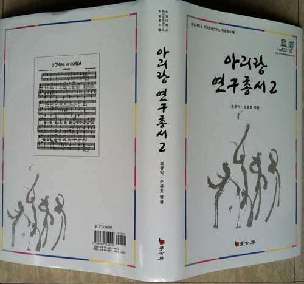
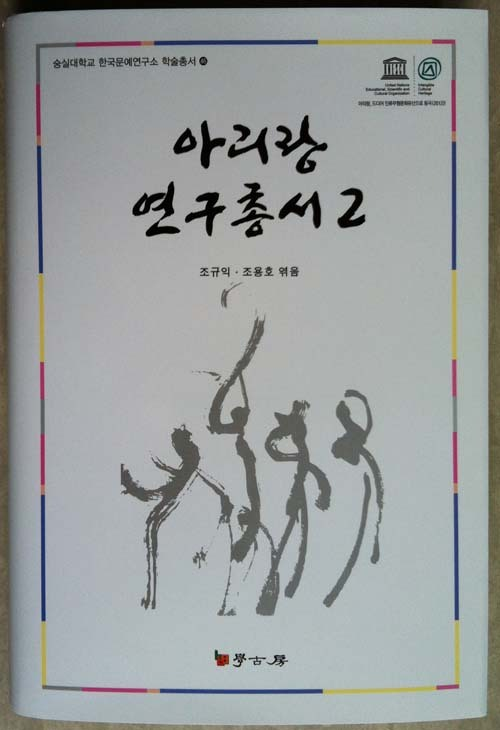

<<아리랑연구총서 ②>>가 출판되었습니다!

‘아리랑 연구는 어디서부터 시작해야 하나? 가장 최근에 이루어진 아리랑 논고에는 어떤 것들이 있을까? 어떠한 텍스트를 바탕으로 아리랑 연구를 시작해야 하는가?’

아리랑을 본격적으로 시작하려 한다거나, 좀 더 심도 있는 연구를 원하는 학자들은 흔히 이러한 의문과 곤란에 부딪치게 됩니다.

이번에 출판된 <<아리랑 연구총서 2>>는 2010~2013년 사이에 발표된 논문들을 모은 것으로, 최근에 이루어진 아리랑 논고의 정화(精華)라 할 수 있습니다. 아리랑을 왜곡한 당대의 역사관에 대한 학술적 비평 및 기록을 바탕으로 한 원형적 모습에 대한 역사적 고찰(숭실대 조용호 교수), 북한(한양대 김영운 교수)·강원(민족사관고 박관수 박사)·경상(부산대 서정매 교수)·전라(전남대 이용식 교수) 등 지역별로 존재하는 아리랑에 대해 심화된 연구, 기호학(서강대 송효섭 교수) 및 정신분석(서강대 김승희 교수) 측면에서 시도하는 새로운 분석 기법, 음악학적 논의(경인교대 김혜정 교수), 호머 헐버트에 대한 분석적 고찰(전주대 김승우 교수), 지금까지 존재하는 아리랑의 주요 담론에 대한 정밀한 비평(숭실대 조규익 교수) 등 축적된 연구물의 결정판이라는 것이 보신 분들의 평입니다. 나아가 향후의 연구 방향을 가늠할 수 있는 중요한 시금석이 되고 있기도 합니다.

아리랑 연구 총서 작업은 전10집을 목표로 진행 중입니다. 제1집은 초창기 연구자들의 주요 담론들을 수록함으로써 원문 탐색에 어려움을 겪고 있는 국내외 연구자들에게 질 높은 자료를 제공하는 의미를 갖습니다. 제2집은 초기의 상황과 대비하여 어떠한 발전 도상에 있는지 반성하는 측면에서 최근의 논의들을 담게 되었습니다. 앞으로 나오게 될 제3집에는 1920년대 이후 본격적으로 제기되어 온 일본관련 학자들의 아리랑 논고들을 모아 실을 예정입니다. 국내에서 처음으로 기획된 숭실대학교 한국문예연구소의 아리랑 연구총서를 아리랑 연구의 길잡이로 보는 이유도 이 점에 있습니다.

\*\*\*\*\*\*\*\*\*

참고로 <<아리랑 연구총서 2>>의 머리말을 들겠습니다.

머리말

2012년 12월, ‘인류무형유산’으로 등재되면서 아리랑은 새로운 단계에 접어들었다.

아리랑의 연고권에 관한 특정 국가와의 갈등을 극복하고 이룩한 쾌거라서 더욱 값진 일이긴 하나, 새롭게 지게 된 부담 또한 만만치 않다. 현재 아리랑이 우리 민족의 자랑스러운 정신적⋅예술적 유산임을 부인하는 사람은 세계 어디에도 없다. 그럼에도 유관국은 자국 내 조선족의 존재를 내세워 자신들이 아리랑을 선점하려는 의욕을 내보였다. 그 뿐 아니다. 그들이 그런 의욕을 내보인 데는 ‘아리랑이 우리 것이라는 사실만 믿고 그것을 갈고 다듬는 일에 소홀한 우리의 게으름’도 한몫을 했다는 점이 섬뜩하다. ‘아리랑에 대한 내력을 제대로 알지 못하는 여타 외국인들로서야 제대로 된 논리나 근거를 먼저 들고 나오는 쪽의 손을 들어줄 것 아닌가?’라고 생각한 것이 그 나라의 계산이었을 것이다. 그간 아리랑에 대하여 태평하게 세월만 까먹으며 살아온 우리가 화들짝 놀란 건 당연한 일이다.

과연 아리랑에 대하여 우리가 해놓은 건 무엇인가? 어느 날 이웃나라가 아리랑을 내놓으라고 달려들 때 그들에게 내세울 수 있는 논리적⋅사실적 근거를 얼마나 확보하고 있으며, 현재와 미래를 위해 아리랑을 얼마나 활용하고 있는가? 아리랑의 학술적 담론들은 얼마나 창출되었으며, 그것들을 통해 아리랑의 본질은 얼마나 밝혀졌는가? 등등 가장 현실적인 질문들에 딱히 내 놓을 게 별로 없다. 이 물음들 대부분이 학계에 던져지는 것들일 텐데, 속 시원하게 보여 줄만한 답지가 없어 안타깝다. 지금 아리랑 연구가 꽉 막혔다고들 하는 것도 그 때문이다. ‘아리랑이 무엇인가?’에 대하여 대답을 못하니, 연구 활동들 역시 변죽만 울릴 따름이다.

이런 상황인식을 전제로, 아리랑 연구의 주된 결실들을 한 군데로 모으는 것이 난국 타개의 첫 단계라는 판단이 들었다. ‘아리랑 담론들은 어떻게 생겨났고, 후대 연구자들에게 어떻게 수용되었으며, 향후 연구의 진로는 어떻게 잡아야 하는가’를 알기 위해서라도 아리랑 연구의 업적들을 모으는 일이 중요했다. 아리랑이 인류무형유산으로 등재되기 전에 발간한 것이 <<아리랑 연구총서 1>>인데, 여기에 실린 글들은 다음과 같다. 

1. 이광수, <民謠 小考(一)>

2. 김지연, <조선민요 아리랑–朝鮮民謠의 硏究(二)>

3. 김지연, <조선민요 아리랑(二)–朝鮮民謠의 硏究(三)>

4. 고권삼, <‘아이롱’ 主義>

5. 이병도, <‘아리랑’ 곡의 유래>

6. 양주동, <<도령>과 <아리랑>>–古歌硏究 二題

7. 심재덕, <아리랑 小考>

8. 정익섭, ｢珍島의 민요>

9. 임동권, <아리랑의 기원에 대하여>

10. 최재억, <한국민요연구–아리랑 민요고>

11. 원훈의, <아리랑 系語의 造語論的 考察>

이 글들이 바로 초기 학자들의 아리랑 담론들이다. 과연 현재의 우리들은 이들과 비교하여 어떤 진보 혹은 발전을 이룩했는가. 우리 모두 함께 고민해야 할 시점에 이르렀다.

이번에 펴내는 2집에는 반성적 시각을 제공하려는 뜻에서 최근의 논의들을 담았고, 이어 나오게 될 3집에는 일제 강점기 일본학자들의 아리랑 관련 글들을 싣고자 한다. 아리랑이 인류무형문화재로 등재되었다하여, 우리의 할 일이 끝난 건 아니다. 치열한  논쟁과  연구를  통한  학자들의  뒷받침은 이제 시작일 뿐이다. 아리랑의  문헌들과  현장에  대한  재 탐사를  바탕으로 그간  선진국에서  배워  온  발전된  학문 방법론들을 총동원해서라도 아리랑의 본질 모색에 착수해야 한다. 그  디딤돌  혹은  마중물의  역할을  하 려는  뜻에서 ‘아리랑 연구총서’를  기획했고, 앞으로  계속  발간할  예정이다. 아리랑과  민족  전통예술에  뜻을  갖고  있는  학자들의  서재에  이  책이  연구의  길잡이로  꽂히게  될  것을  고대하며, 강호제현의 질정을  기다린다.

 

갑오년 겨울

한국문예연구소

소장 조규익

공유하기

게시글 관리

**백규서옥\_Blog ver.**

[저작자표시 비영리 변경금지
(새창열림)](https://creativecommons.org/licenses/by-nc-nd/4.0/deed.ko)