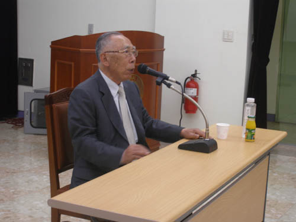
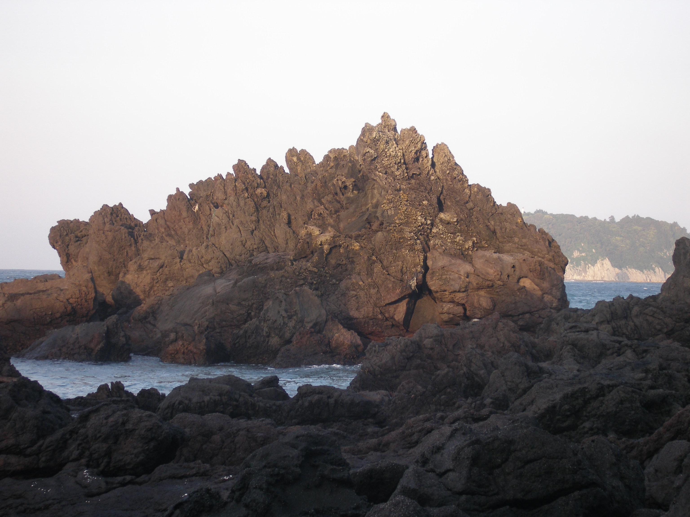
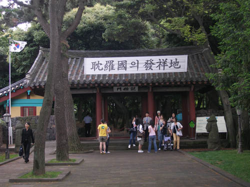
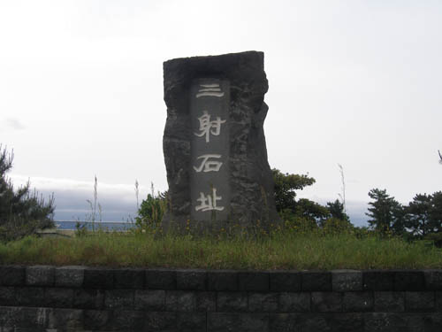
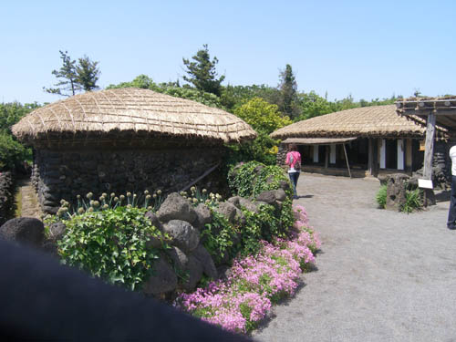

노학자와 서귀포의 밤

                                                                         조규익

 제주 민속 혹은 문학기행에 나선 숭실 국문인 135명. 에머럴드빛 바닷물 넘실대는 서귀포 해안에 올려 지은 제주대학 연수원은 고요하고 청수(淸秀)했다. 쉼 없이 울려대는 파도소리와 솔잎을 비벼대는 바람소리만 빼곤 적막 그 자체였다.

강의중인 현용준 선생

 우리가 제주에 온 것은 공부를 위해서였다. 첫날 저녁 제주 민속연구의 대부이신 현용준 선생을 모셔 이른바 ‘제주학’강의를 들었다. 금년 76세의 무거운 연세와 썩 좋아 보이지 않는 건강에도 육지에서 찾아온 우리를 위해 서귀포까지 한 시간 여의 거리를 달려 오셨다.

제주대학 연수원 뒷편 해안의 바위들

 형형하신 눈빛이 예사롭지 않은 선생은 자리에 앉자마자 제주의 풍토, 제주인의 삶, 그리고 민속을 천천히 말씀하셨다. 우리는 이미 제주시에서 탐라국의 단초를 보여주는 삼성혈(三姓穴)을 보았고, 삼사석(三射石)도 만났다. 어느 씨족이나 민족을 막론하고 조상들의 출자(出自)는 신성하고 경이로운 법. 제주라고 예외일 수 없었다.

삼성혈 유적의 정문

 선생의 말씀대로 본토의 시조들이 대부분 하늘에서 내려온 반면, 삼성의 시조들은 땅에서 용출(湧出)된 점이 다를 뿐이었다. 땅에서 솟은 세 젊은이가 벽랑국에서 건너온 세 처녀와 결혼하여 탐라국을 건설했다는 삼성신화. 그것은 제주도에 편재해 있는 당신화(堂神話)의 모티프와 연결되어 있다고 노학자는 강조하셨다.

화살이 박힌 세 개의 돌덩이를 보관하고 있는 삼사석지

선생은 ‘안거리(안채)와 밖거리(바깥채)’로 나뉘어 있는 제주 가옥의 이중구조와 혼성(混姓)의 마을구조, ‘이레잔치’로 표현되는 혼속(婚俗), ‘해녀 노 젓는 소리’를 비롯한 민요 등을 중심으로 제주 민속의 특징과 제주의 역사, 그리고 제주인들의 의식을 하나하나 설명해 나갔다.

마주 보는 두거리 집(제주 민속촌)

 두 시간 가까운 강의 말미에 학생들로부터 질문을 받은 노학자는 하나의 화제를 갖고도 많은 말씀을 이어나가셨다. 제주에서 태어나 제주와 함께 자라고, 제주를 연구해온 노학자의 저력이 빛나는 순간이었다.

           \*\*\*

제주의 ‘맛집’들을 탐사하여 신문에 소개해온 허남춘 교수(제주대 탐라문화연구소장)의 안내로 찾아간 ‘쌍둥이식당’(서귀포시 서귀동 274-3/064-762-0478). 앞 바다의 섶섬을 바라보는 그곳에 제주의 미각은 꿈틀대며 살아 있었다. 음식 상 앞에서도 현선생은 당신의 학구시절을 회상하셨고, 우리는 말씀들의 갈피마다 숨어있는 노학자의 학계에 대한 ‘노파심’을 읽을 수 있었다. 세대를 초월한 학자들의 정담은 끝없이 이어지고, 그렇게 서귀포의 밤은 깊어가고 있었다.

                                                                      <2007. 5. 16.>

공유하기

게시글 관리

**백규서옥\_Blog ver.**