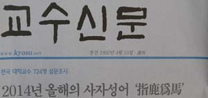

**轍鮒之急

飽食煖衣**

‘교수신문’이 올해의 사자성어(四字成語)로 ‘지록위마(指鹿爲馬)’를 선정했다는 보도가 한동안 사람들의 입에 오르내렸습니다. 사슴을 가리켜 말이라 한다는 것. 즉 거짓으로 윗사람과 주변사람들을 농락한다는 뜻입니다. 이 말을 올해의 사자성어로 선정한 일에 대하여 딱히 반론을 제기할 이유는 없습니다.

사실 저도 이 달 초 같은 신문으로부터 올해를 대표할만한 사자성어 두 건을 추천해달라는 요청을 받은바 있습니다. 당시 저는 조용히 눈을 감은 채 한 해의 영상을 뒤로 빠르게 돌려보았습니다. ‘지록위마’가 떠오르지 않은 것은 아니지만, 사실 그건 너무 싱거운 말이라고 생각했습니다. 언제 우리네가 ‘지록위마’의 거짓과 비리로부터 자유로울 때가 있었던가요. 특히 지도층의 가식과 위선, 혹은 ‘갑질’의 행태에서 한 번이라도 벗어나 본 적이 있었나요. 지금까지, 아니 지금부터 앞으로 언제까지나 ‘지록위마’의 상황을 그러려니 여기며 살아가는 게 속 편한 것이 우리 장삼이사(張三李四)들의 팔자가 아닌가요. ‘지록위마’가 새삼 올해만의 사자성어라 할 이유가 없다고 생각한 것도 그 때문입니다. 그래서 저는 ‘철부지급(轍鮒之急)’과 ‘포식난의(飽食煖衣)’ 등 두 가지 성어를 추천했습니다. 우리의 현실을 적실하게 나타낸 말이라고 본 것입니다.

‘수레바퀴(자국) 속의 붕어’ 즉 ‘생존을 위해 당장 한 바가지의 물이 필요할 뿐 장강대하(長江大河)의 물은 먼 훗날에나 필요하다’는 것이 ‘철부지급’의 뜻이고, ‘생활고로 죽어가는 서민들을 살려내는 것이 시급한데, 나라를 운영하는 사람들은 너무 멀리만 바라보고 있다’는 현실 비판이 그 말의 속뜻입니다. 당장 한 줌의 곡식이 없어 죽어가는 서민들을 바라보며 ‘100년 대계(大計)’를 고창(高唱)하던 그 시절의 위정자들을 장자(莊子)는 한심하게 바라보며 이 말을 했을 것입니다. ‘송파 세 모녀 자살 사건’ 같은 비극이 날마다 일어나고 있는 것이 우리의 현실인데, 당장 이들을 살려내지 못하는 위정자나 정치인들은 대체 무얼 쳐다보고 있는 걸까요.

‘포식난의’는 <<맹자>> ‘등문공 상편’의 ‘배불리 먹고 따뜻하게 입으면서 가르침이 없다면 짐승에 가까워진다[飽食煖衣 逸居而無敎 則近於禽獸]’는 맹자의 일갈(一喝)에서 나온 말입니다. 따라서 ‘제대로 된 가르침’이 전제될 때 비로소 이 말의 의미는 온전해지는 것이지요. 국회의원 김현의 대리기사 폭행사건, 대한항공 조현아 전 부사장의 기내(機內) 패악사건 등 올해 일어난 이른바 ‘갑질 사건’들의 근저를 설명하기 위해 이 말은 필수적이라 본 것입니다. 이들은 권력이나 부를 거머쥐고 ‘포식난의’를 즐기는 대표적 부류입니다. 그런데 ‘포식난의’를 즐기면서도 제대로 된 교육을 받지 못함으로써 그들은 맹자의 말처럼 결국 ‘짐승에 가까운 행태’를 보여주게 된 것이지요. 여기서 말하는 교육이란 ‘지식교육’ 아닌 ‘인간교육’을 말하는데, 그 출발점이자 종착점이 바로 ‘가정교육’입니다. 1차적으로 김현의 부모나 조현아의 부모에게 비난의 화살이 쏠리는 것도 그 때문일 겁니다.

\*\*\*

그래서 저는 ‘철부지급’과 ‘포식난의’를 올해 이 땅에서 근근이 살아온 서민들의 곤경을 대표적으로 드러낸 사자성어로 들어야 한다고 보았습니다. 새해에는 정말로 정치인들이나 부자들이 대오각성(大悟覺醒)하여 수레바퀴 자국에 고인 한 모금의 물속에서 몸부림치는 서민들의 급박한 사정을 헤아려야 합니다. 요즘 종북주의자들로 매도되는 일부 인사들이 그 ‘종북’의 혐의에서 벗어나기 위해서라도, ‘철부지급’ 중에서도 최고로 급박한 처지에 놓인 북한 주민들의 삶을 먼저 걱정하는 자세를 보여야 할 것이고, 이 땅의 정치인들은 자신들에게 붙어 다니는 ‘무책임’의 꼬리표를 떼기 위해서라도 어려운 서민들이 겪고 있는 ‘철부지급’의 상황을 해소하는 데 최선을 다해야 할 것입니다. 새해엔 서민들이 진정으로 ‘포식난의’를 즐기는 원년이 되었으면 합니다. 새해를 기대해 보겠습니다.

공유하기

게시글 관리

**백규서옥\_Blog ver.**

[저작자표시 비영리 변경금지
(새창열림)](https://creativecommons.org/licenses/by-nc-nd/4.0/deed.ko)