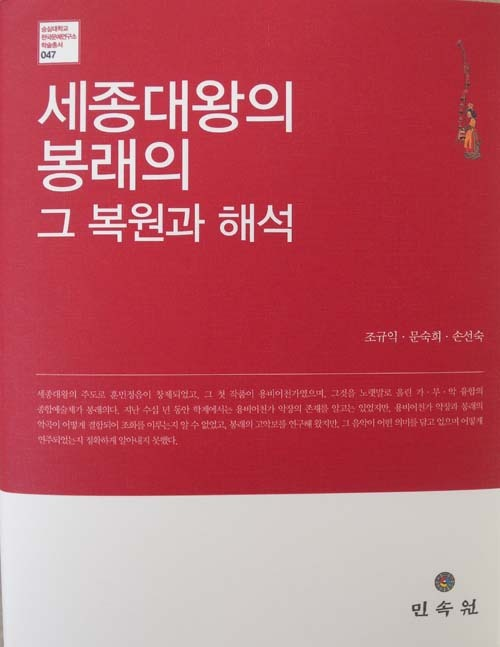

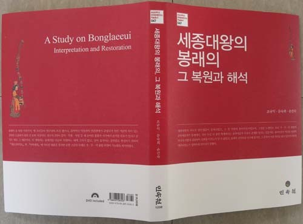

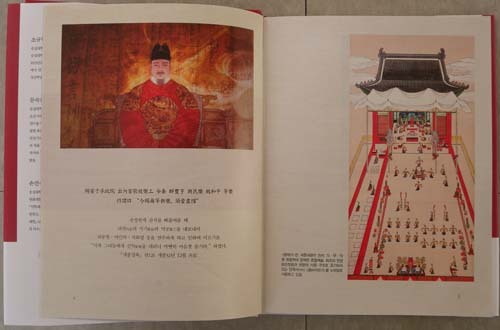

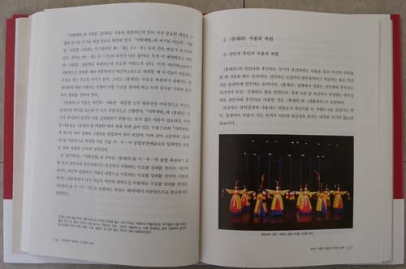

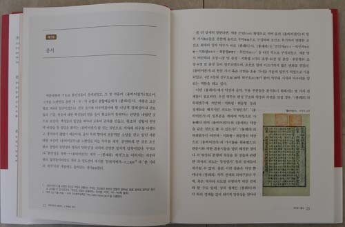

세종대왕이 만든 조선조 최고의 악무  봉래의를 복원ㆍ해석  

봉래의에 대한 음악ㆍ문학ㆍ무용의 융합 연구결과를

<<세종대왕의 봉래의, 그 복원과 해석>>으로 출간

 

숭실대학교 한국문예연구소 소장을 맡고 있는 저는 을미년 벽두에 문숙희 박사(전 숭실대 한국문예연구소 연구원)ㆍ손선숙 박사(숭실대 한국문예연구소 연구원) 등과 함께 <<세종대왕의 봉래의(鳳來儀), 그 복원과 해석>>(민속원)을 ‘숭실대 한국문예연구소 학술총서 47’로 출간했습니다.

지난 3년간 3회에 걸쳐 ‘봉래의 복원 공연’을 국립국악원의 무대에 올렸고, 그 결과를 DVD로 담아 이 책에 붙여 놓기도 했습니다. 문학 분야인 악장의 연구를 제가 맡았고, 음악을 문숙희 박사가, 무용을 손선숙 박사가 각각 맡았습니다. 제 분야인 악장이야 그다지 보실 만한 건 없으나 음악이나 무용 분야에서 새로운 시각으로 접근하여 봉래의를 복원한 점은 무엇보다 내놓고 자랑할 만합니다. 이 책을 찬찬이 읽어 보시면 세종대왕이 그리던 새 왕조 조선의 미래가 어떤 것이었는지를 짐작하실 수 있으리라 봅니다. 이번 연구 작업을 통해 왕조의 미래에 대한 꿈을 엄청난 규모의 예술로 승화시켜 놓은 세종대왕의 능력과 통찰에 새삼 감동하게 되었습니다. 대강의 내용을 추려 아래에 붙여 놓습니다.

\*\*\*

‘2014년 한국연구재단 우수 연구 성과’로 선정된 바 있는 이 책은 문학ㆍ음악ㆍ무용 분야를 전공한 세 저자들이 융합적 시각에서 세종대왕이 지은 조선조 최대 악무(樂舞) 봉래의를 복원하고 해석한 결과물이다. 1443년 세종대왕은 훈민정음을 창제했고, 그 훈민정음으로 <용비어천가>를 제작하게 했으며, <용비어천가>를 노랫말로 올린 가ㆍ무ㆍ악의 종합예술체인 봉래의를 몸소 만들었다. 즉 1445년(세종 27년) 왕명으로 지어올린 <용비어천가>의 일부 가사를 악곡에 올리고 무악(舞樂)으로 구성하여 조선조 후기까지 연행(演行)한, 조선조 최대의 창작 악무가 바로 봉래의인 것이다.

봉래의는 ‘여민락ㆍ치화평ㆍ취풍형’으로 이루어진 최대 규모의 악무다. <<서경>> <익직(益稷)>으로부터 나온 ‘봉래의’란 말은 ‘잘 다스려진 상황’을 비유한 표현인데, 태평성대를 찬양하는 노래를 지어 ‘봉황래의(鳳凰來儀)’라는 명칭을 붙인 후대의 관습에서 유래되었다.

‘여민락(與民樂)’은 ‘여민동락(與民同樂)’ 혹은 ‘여민해락(與民偕樂)’과 같은 뜻으로 <<맹자>> <양혜왕 장구 하>에 등장하는 ‘여민동락’에서 나온 말이다. 임금이 덕을 지닌 경우 징발하지 않아도 백성들은 자발적으로 참여하여 임금을 위해 정원을 만들고 그 정원에서 임금이 즐기는 모습을 기뻐한다는 말인데, 그것이 바로 ‘여민동락’의 모습이라는 설명이다. 봉래의 악무의 첫 정재를 여민락으로 잡은 세종의 뜻은 ‘하늘의 뜻으로 세운 왕조에서 태평성대를 만들 수 있는 첫 조건이 백성과 함께 즐거움을 누리는 일’이라는 점에 있다. <용비어천가>의 1~4장과 졸장 등 다섯 개의 장을 뽑아서 구성해 놓은 것이 바로 여민락이다.

‘치화평(致和平)’은 <<주역>> <하경> ‘택산함’괘에 대한 정자(程子)의 설명에 등장하는 말로서 천지와 인심의 감통(感通)에 바탕을 둔 조화가 천하태평의 요체임을 보여주는 개념이다. 정자의 설명 가운데 핵심은 ‘천지가 서로 감응하여 만물을 화생하는 이치와 성인이 인심을 감동시켜 화평을 이루는 도를 관찰하면 천지만물의 정을 가히 볼 수 있다’는 부분이다. ‘인심을 감동시켜 화평을 이루는 도’ 그것이 바로 ‘치화평’이다. 치화평에서는 <용비어천가> 1~16장과 125장의 국한문 가사들을 악장으로 끌어다 사용했다.

취풍형은 <<시경>> <주송> ‘집경’의 13구인 ‘기취기포(旣醉旣飽)’와 <<주역>> <하경> ‘뇌화풍(雷火豐)’괘에서 따온 개념이다. 취풍형이란 말 속에는 ‘군신이 배불리 취해도 예에 어그러짐이 없음/풍형에도 절제가 있어야 함’이란 두 가지의 뜻이 들어 있다. 즉 군신이 태평세월을 구가하고 즐기면서도 예에 어그러지지 않는 절도를 지켜야 하며, 아무리 풍요로워도 그에 지나치게 도취하여 절제를 잃어버리면 안 된다는 것이다. <용비어천가> 1~9장 및 125장의 국ㆍ한문 가사를 악장으로 끌어다 쓴 것이 취풍형의 악장이다.

이처럼 봉래의 악무에 들어 있는 세 정재[여민락, 취화평, 취풍형]들은 서로 독자적이면서도 <용비어천가>의 주제로 제시된 ‘경천근민[敬天勤民: 하늘을 공경하고 백성들을 위해 부지런해야 함]’의 행동강령을 공유한다. 말하자면 백성들과 함께 하거나 신하들과 함께 하며, 백성ㆍ신하와 함께 해도 공통적으로 잊지 말아야 할 것은 후왕들이 ‘경천근민해야 한다’는 원칙이다. 이처럼 여민락ㆍ치화평ㆍ취풍형을 종합한 봉래의 악무에는 신하들과 백성들을 상대로 조선왕조 건국의 의의와 육조(六祖)의 시련을 깨우쳐 주고, 후왕들이 나라를 잘 보수(保守)함으로써 왕조가 영속될 수 있도록 하라는 세종의 뜻이 주제의식으로 담겨 있다고 할 수 있다.

봉래의 다섯 곡은 전인자 3소박 8박자→여민락 2소박 8박자→치화평 3소박 4박자→취풍형 3ㆍ2ㆍ3 혼소박 6박자→후인자 3소박 8박자의 리듬으로 진행된다. 음악의 템포는 노래와 무용 모두를 좌우하기 때문에 가ㆍ무ㆍ악의 관계 속에서 찾을 수 있었는데, 궁중 정재의 특성을 잘 나타내고 또 가사의 의미를 잘 전달할 수 있는 템포가 타당한 것으로 파악되었다. 봉래의를 구성하는 여민락ㆍ치화평ㆍ취풍형의 본체는 만(慢)ㆍ중(中)ㆍ삭(數)으로 구분되었고, 여민락과 치화평의 템포는 메트로놈 상으로 유사했고, 취풍형은 이 둘보다 훨씬 빠른 템포로 나타났다. 여민락은 2소박이고 치화평은 3소박이기 때문에 여민락이 치화평보다 조금 더 느리다고 할 수 있다. 여민락ㆍ치화평ㆍ취풍형은 각각 길고 복잡한 장단으로 되어 있으나, 이번 복원 공연에서는 긴 장단 속에 세분되어 있는 리듬 단위로 장단을 짧게 단순화하여 연주했다. 그 결과 장고가 음악과 무용을 이끌기에 용이했고 또 액센트가 짧은 주기로 분명히 드러나기 때문에 음악과 무용에 생동감을 주었다.

무용의 경우 확실한 기록이 부족하다는 난점이 있었다. 즉 문헌에는 무기(舞妓)들의 대형 형태, 이동과정, 춤사위 등만 간략하게 기록되어 있을 뿐, 어느 시점에 어떤 발로 어떤 속도로 어떤 방향으로 돌아 어느 위치로 이동해야 하는지 등 실연(實演)에 필요한 내용들이 생략되어 있기 때문이다. 봉래의의 무용을 복원함에 있어서 이런 부분들은 <<악학궤범>>에 수록된 여러 정재들과 정재의 무도(舞圖)들을 통합ㆍ비교하여 음악과 노래, 무기들의 위치 및 이동 공간 등의 상호 관계를 통해 찾아냈다. 문헌에 기록되어 있지 않은 춤사위는 봉래의 춤 전체의 진행 구조를 통해 찾아냄으로써 봉래의 춤에 통일성을 부여했다. 음악이나 무용도 악장 내용의 전개와 함께 함을 확인했는데, 이렇게 가ㆍ무ㆍ악으로 임금에게 교훈적인 말을 전달하고자 한 제작 의도는 가ㆍ무ㆍ악의 융합정신이 봉래의라는 종합예술 속에서 충분히 구현되었음을 보여주는 실례였다.

이상과 같이 세 연구자는 음악이 기보되어 있는 <<세종실록악보>>와, 춤 순서 및 노래 가사가 기록되어 있는 <<악학궤범>>을 통해 봉래의를 융합적으로 복원하는 데 성공했다.

가ㆍ무ㆍ악에 관련된 여러 전제조건들을 바탕으로 텍스트를 분석하고 해석하여 봉래의의 종합예술체적 성격을 완벽에 가깝도록 복원한 점이 이 책의 최대 장점이고, 그것은 세 차례의 공연을 통해서도 입증된 바 있다.

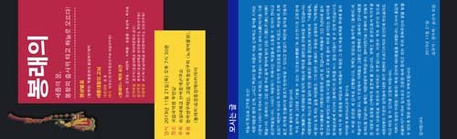  
공연 팸플릿

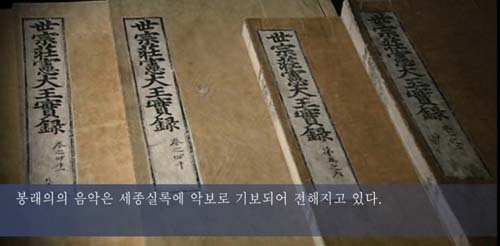  
세종실록

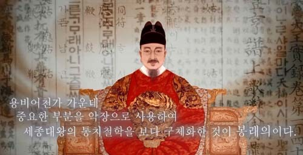  
세종대왕

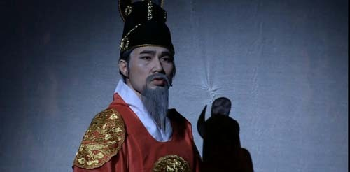  
공연에서 세종으로 분장한 배우 정훈씨

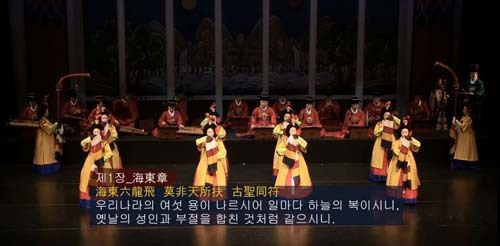  
봉래의 공연

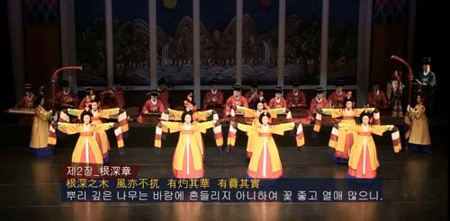  
봉래의 공연

  
봉래의 공연

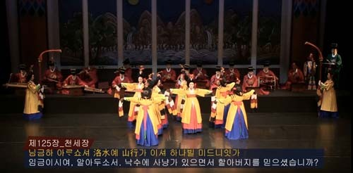  
봉래의 공연

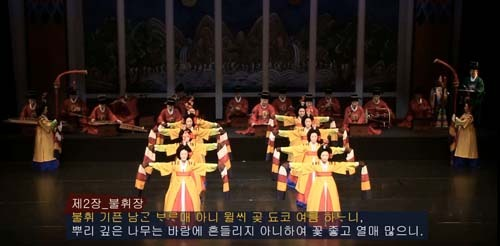  
봉래의 공연

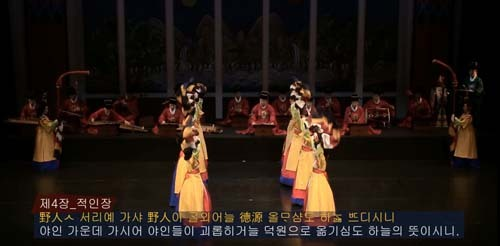  
봉래의 공연

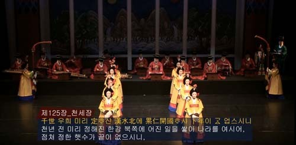  
봉래의 공연

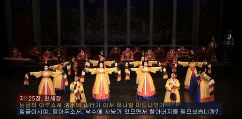  
봉래의 공연

공유하기

게시글 관리

**백규서옥\_Blog ver.**

[저작자표시 비영리 변경금지
(새창열림)](https://creativecommons.org/licenses/by-nc-nd/4.0/deed.ko)