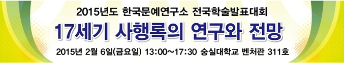

한국문예연구소 2015년도 상반기 전국학술발표대회 안내

안녕하신지요?

을미년도 벌써 한 달이 지나고 있습니다.

저희 숭실대학교 한국문예연구소는 작년 여러 권의 학술총서들을 발간했고, 논문집 <<한국문학과 예술>>이 한국연구재단의 등재(후보)지로 승격되었으며, 연구소의 과제[｢용비어천가와 악무 <봉래의>의 복원과 문화코드 탐색｣]가 2014년 한국연구재단 기초연구지원사업 '인문사회 우수성과'로 선발돼 표창을 받은바 있습니다. 연구소의 발전을 위해 힘써 주시고 성원해주신 모든 분들게 감사드립니다.

저희들은 다음과 같이 17세기 연행록을 중심으로 2015년도 상반기 전국학술발표대회를 갖고자 합니다. 많이들 참석하시어 경청해 주시고, 고견을 들려주시면 고맙겠습니다.

추운 겨울, 특별히 건강에 유의하시기 바랍니다.

한국문예연구소 드림

학술대회 안내

일시 : 2015년 2월 6일 금요일 오후 1시~오후 5시 30분

장소 : 숭실대학교 벤처관 311호

주최 : 숭실대학교 한국문예연구소

사회 : 허명숙(숭실대)

○ 13:10~13:50 17세기 사행록의 연구현황과 전망

발표 : 정영문(숭실대)

토론 : 박성순(동국대)

○ 13:50~14:30 17세기 초 사행록 서술의 양상

발표 : 김지현(한중연)

토론 : 김동석(성균관대)

○ 14:30~15:10 17세기 초 사행록에 나타난 조선 지식인의 대외인식

- 정두원의 [조천기지도]를 중심으로

발표 : 서지원(숭실대)

토론 : 신춘호(방송통신대학 TV)

○ 15:10~15:20 중간휴식

○ 15:20~16:00 17세기 명청교체와 대중국사행의 변화

발표 : 김경록(전쟁기념관)

토론 : 황민호(숭실대)

○ 16:00~16:40 17세기 초 사행록에 나타난 중화질서의 혼란양상

발표 : 윤세형(서일대)

토론 : 양훈식(숭실대)

○ 16:40~16:20 휴식 및 회의장 정리

○ 16:20~17:30 종합토론

좌장 : 조규익(숭실대)

오시는 길

xml:namespace prefix = "v" /xml:namespace prefix = "o" /xml:namespace prefix = "w" /○ 지하철 : 7호선 숭실대학교 입구(살피재)역 3번 출구

○ 용산역 택시 : 15분

버스 : 신용산역 이동(4분 소요) 후에 501, 506, 750A, 750B, 751 승차, 26분

○ 노들 역 택시 : 8분

버스 : 노들역에서 501, 752, 5517, 751, 501 승차, 20분

공유하기

게시글 관리

**백규서옥\_Blog ver.**

[저작자표시 비영리 변경금지
(새창열림)](https://creativecommons.org/licenses/by-nc-nd/4.0/deed.ko)