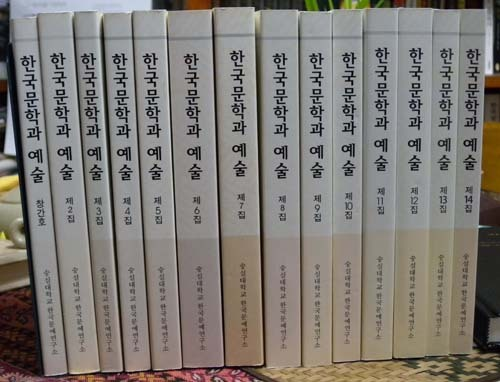
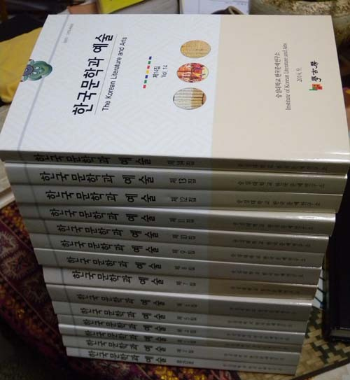

등재후보지 <<한국문학과 예술>>15집에 게재할 논문을 공모합니다.

숭실대학교 한국문예연구소에서는 한국문학과 예술 전문학술지인 <<한국문학과 예술>> 15집에 게재할 논문을 아래와 같이 공모합니다. 사계 연구자들의 적극적인 참여를 부탁드립니다.   
  
  
◈ 다음 ◈   
  
  
  
1. 공모 분야: 한국의 문학과 예술 및 문화 전반에 관련된 분야로, 독창적인 연구결과이거나 그러한 연구에 도움이 될 수 있는 논문을 대상으로 합니다.   
(현대와 고전문학을 포함한 국문학, 한문학, 전통시대의 음악ㆍ무용ㆍ미술 등 문화예술을 대상으로 하며, 학제 간 연구결과도 환영합니다.)  
  
  
2. 투고 방법   
  
① 투고하실 분은 논문투고신청서, 연구 윤리 확약서, 논문을 숭실대학교 한국문예연구소 편집위원회에 다음과 같이 전자우편으로 제출하셔야 합니다.   
o 전자우편: [ktla@ssu.ac.kr](mailto:ktla@ssu.ac.kr)(숭실대학교 한국문예연구소)   
  
② 논문은 200자 원고지 150매 이내(국문요약, 영문초록, 참고문헌 포함)로 하며, 자세한 내용은  <<한국문학과 예술>>의 논문 작성 형식을 참조해 주십시오.   
  
투고 시 투고자의 성명, 소속, 주소, 연락처(전화번호 및 이메일 주소) 등이 기재된 신청서를 별도의 파일로 첨부하셔야 합니다.(첨부 참조).  
  
  
3. 발간 일정   
  
o 논문 투고 마감: 2015년 2월 21일(토) 24:00   
  
o  <<한국문학과 예술>> 발간일(연 2회)   
  
- 제15집 : 2015년 03월 31일(발간예정)   
- 제16집 : 2015년 09월 30일(발간예정)   
  
  
  
4. 기타  
  
o 한국연구재단 KCI 등재후보지  
o 심사료 및 게재료 없음  
o 투고일로부터 20일 안에 심사결과 공지  
o 게재본, 별쇄본 무료송부   
  
  
5.  <<한국문학과 예술>>15집의 논문투고에 관한 문의   
  
o 전화 : 02-820-0846, 010-6799-4670   
o E-mail : [dull-baram@hanmail.net](mailto:dull-baram@hanmail.net)   
o 우편 (우)156-743 서울특별시 동작구 상도로 369 숭실대학교 한국문예연구소 <<한국문학과 예술>> 편집위원회   
  
  
숭실대학교 한국문예연구소 (커밍홀 311호)  
02-820-0846 / 02-820-0326

공유하기

게시글 관리

**백규서옥\_Blog ver.**

[저작자표시 비영리 변경금지
(새창열림)](https://creativecommons.org/licenses/by-nc-nd/4.0/deed.ko)