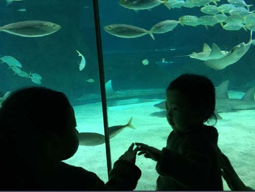

  
Fishing in the Lake Boomer

   
 YB speaking to her fish friends in aquarium

 긴긴 설 명절 내내 서울을 지키다 보니 좀이 쑤셨던 걸까.

점심을 사겠다는 핑계로 밖에서 영빈(永彬)을 만난 것도 그 때문. 이제 막 돌 지낸 녀석의 말하려 애쓰는 모습이 신기하다. ‘할아버지’를 불러보라 애타게 주문해도 어렵사리 내놓는 발음은 한결같이 ‘하메이~’다. ‘할아버지 어디 있나?’라는 물음에 손가락으로 정확히 짚어내긴 하는데, 발음은 여전히 ‘하메이’다. 어찌어찌 ‘할머니’까지는 성공했는데, 네 음절을 뱉어내기에는 아직 역부족인가. 네 음절 발음을 주문하는 성화에 가까스로 세 음절을 뱉어내곤 녀석도 쑥스러운지 웃음으로 눙친다. 인간이 말을 익혀가는 모습을 녀석에게서 새삼 흥미롭게 발견한다.

 지금의 녀석처럼 호사스럽진(?) 않았지만, 내게도 저렇게 말을 배우던 시절이 있었으리라. 문득 녀석의 부모를 보니, 재롱부리던 어린 시절의 모습이 솜털처럼 아련히 남아 있는 것 아닌가. 벌써 아버지의 포스를 갖춰가고 있는 모습. 그동안 내게도 네게도 시간은 여지없이 흘렀구나!     

                                                \*\*\*

 모두들 잠들어 사방이 적막할수록 내 의식은 또렷해진다. 책상에 앉으니 당장 생각을 굴려야 할 일들과 밀린 글들이 산적해 있지만, 여러 갈래로 마음이 부서진다. 이제부터 어떻게 살아가야 하는가. 먹고 사는 문제 뿐 아니라, 이제 어떤 마음과 표정, 태도로 살아가야 할 것인가. 갓난아기와 젊은 아이들이 ‘뒷물’이 되어 나를 밀어내고 있는데, 방향을 제대로 잡고 밀려가는 ‘앞물’의 모습을 아름답게 갖추기란 여간 어렵지 않다.

 ‘어떻게 살아가야 할 것인가?’의 문제이리라. 세대마다 다르기 마련인 그 문제를 공자 문하의 똑똑한 제자들도 깨달았던 것일까. 그 점이 궁금한 듯 선생께 여쭈었다. <<논어>> ｢공야장(公冶長)｣ 26번째 대목이 바로 그것. 자로(子路)는 ‘수레와 말과 가벼운 가죽옷을 친구와 함께 쓰다가 망가져도 원망하지 않았으면 한다’고 했으며, 안연(顔淵)은 ‘남에게 착하게 했노라 자랑하지 않고 남에게 공치사하지 않았으면 한다’고 했다. 그러자 공자는 ‘늙은이들이 편안하게 여기고, 친구들이 믿음직하게 여기며, 젊은이들이 기억하고 그리워해주었으면 한다(老者安之 朋友信之 少者懷之)’고 말했다.

 바로 그것이다. 바른말 한답시고 가까이에 있는 부모와 주변 어른들의 마음을 편안치 못하게 한 일, 가까운 친구들을 살갑게 대하지 못해 믿음을 주지 못한 일, 그런 가운데 아름답지 못한 말을 무사려하게 내뱉어 주변 어린아이들의 마음을 사지 못한 일 등등. 내 아픈 곳을 어찌 이리도 정확히 짚어냈을까. 혹시 공자도 만년에 이르러서야 모든 문제의 근원이 가까이에 있음을 깨달았던 것일까.

 가까운 사람들로 하여금 나를 ‘편안하고, 믿고, 그리워하게 만들려면’ 어떻게 해야 할까. 법대로 원칙대로만 되지 않는 것이 세상사다. 나이 든 자의 여유와 너그러움, 그리고 ‘스스로 즐거워함으로써 남들을 즐겁게 하는 것’만이 해결책임을 아는 사람이 많지 않은 게 세상이다. 정치도 마찬가지. 틈만 나면 ‘신뢰와 원칙’을 언급하는 박 대통령은 왜 주변에 사람들이 없어 긴긴 설 연휴에 혼자 구중궁궐을 지키시는가. 혹시 대통령의 언행이 나이 든 사람들을 불편하게 하고, 친구들을 미덥지 못하게 하며, 어린 사람들을 소원(疏遠)하게 만드는 건 아닌가. 섭공(葉公)이 정치를 묻자 공자는 “가까이에 있는 자가 즐거우면, 먼 곳에 있는 자들이 몰려온다(近者悅 遠者來)”고 했다. 굳이 대통령까지 갈 필요도 없다. 주변 사람들과 즐겁게 살아가는 것만이 세상의 무대에서 사라질 때까지 외롭지 않게 살아갈 수 있는 방법임은 나 같은 필부(匹夫)들도 마음에 새겨야 할 ‘삶의 진리’이리라.

공유하기

게시글 관리

**백규서옥\_Blog ver.**

[저작자표시 비영리 변경금지
(새창열림)](https://creativecommons.org/licenses/by-nc-nd/4.0/deed.ko)