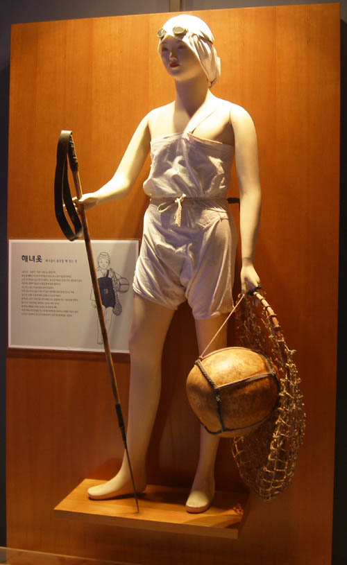
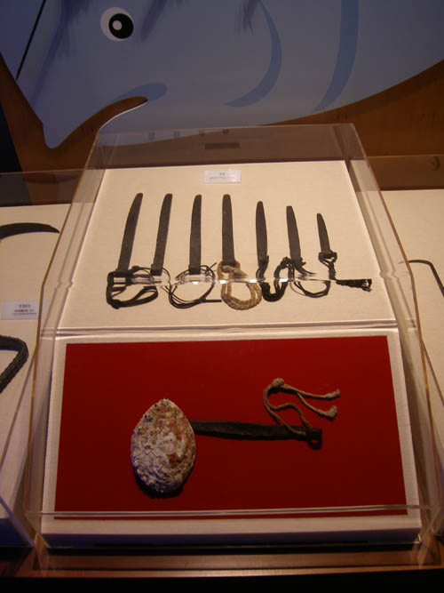
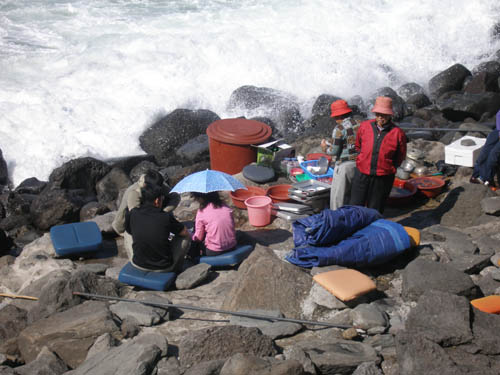

“여자로 나느니 쉐로 나주”

 -아, 제주 여성의 운명이여!-

아주 어릴 적 안데르센의 동화 <<인어공주>>를 읽었다. 오래 전의 일이라 자세한 것은 기억나지 않으나, 마지막 장면은 지금까지 가슴에 오롯이 남아있다. 사랑하는 왕자님의 배를 따라가던 인어공주. 그 왕자님은 이웃나라 공주와 결혼하러 가는 길이었다. 마법의 힘으로 꼬리는 뗐지만 말을 못하게 된 인어공주였다. 왕자와의 사랑을 이루기 위해 인간세상으로 환생했으나, 말을 잃어 사랑의 성취에 실패하고 말았다. 그 굴레에서 벗어나 다시 인어공주로 돌아가려면 왕자의 가슴을 찌르고 그 피를 자신의 다리에 발라야 했다. 가까스로 왕자의 침실에 들어갔으나 결국 그 일을 포기하고 물에 몸을 내던져 포말로 사라졌다는 인어공주의 슬픈 이야기였다. 처절한 자기희생을 통해 결국 ‘영원한 사랑’을 성취한 것일까. 그게 바로 인어공주의 운명이었다. 고귀한 것을 위해 운명에 순응하는 모습은 이처럼 비장한 아름다움을 자아낸다.

   \*\*\*

미끈하게 심해를 유영(遊泳)해 들어가는 해녀들의 모습에서 인어공주와의 유사성을 떠올린 것은 아니다. 듣기에 따라 ‘이미지의 폭력적 결합’이라 할 만큼 둘 사이의 유사성을 거론하는 것 자체가 ‘어불성설(語不成說)’일 수 있다.

제주 해녀의 모습(해녀박물관)

그러나 상상의 공간이든 현실의 공간이든 양자 모두 바다를 무대로 한다는 점. 억척스레 자신의 꿈을 가꾸지만, 운명을 거역하기보다 순응한다는 점 등이 해녀와 인어공주에 대한 내 생각을 결정한 요인이리라. 어려서부터 물질로 세월을 보내 바닷물과 해풍에 주름이 깊어진, 나이 든 해녀들을 보라. 그들의 모습에서 찾아낼 수 있는 것은 환상과 낭만의 서정이 아니라 현실과 투쟁의 서사다.

전복 딸 때 사용하는 빗창

 추우나 더우나 365일 삶과 죽음의 경계선에 서 있는 제주 해녀들. 그들은 자신들에게 부여된 삶의 엄혹(嚴酷)함을 확인하기 위해 죽음의 공간을 밥 먹듯 드나들고 있는 것이다. 깊은 바다를 자맥질하는 수십 초의 짧은 순간. 가쁜 숨비소리와 함께 눈으로 확인하는 것은 한 알의 전복이 전부이지만, 죽음의 허무보다는 삶의 뿌듯함으로 가슴이 부풀어 오르는 존재가 해녀들이다.

   \*\*\*

정방폭포 앞 해변에서 좌판을 벌이고 갓 따온 해물들을 팔고 있는 늙은 해녀와 제주 민속촌박물관, 해녀박물관 등에서 ‘박제된 해녀들’을 만났다.

정방폭포 아래 쪽 해변에서 해산물 좌판을 벌이고 있는 해녀들

모두 시간을 초월하여 ‘삶에 봉사하는’ 제주해녀들의 본질을 극명하게 보여주는 존재들이었다. 그들은 삶을 통해 ‘억척스러운 제주의 여성성’을 형성해왔지만, 결코 자신들의 삶이 즐거운 것은 아니었으리라. 그래서 가끔은 여성으로 태어난 것을 원망하기도 했으리라. 특히나 제주도에 태어난 것을.

 사방을 둘러봐야 시퍼런 바다. 그 장벽이 가로막고 있으니, 그들은 그 바다에 뛰어들 수밖에 없었을 것이다. 제주 해녀의 바다 개척은 그런 현실적 한계를 뛰어넘으려는 욕망과 투지 의 소산이었다. 그래서 그녀들은 ‘여자로 나느니 쉐로 나주’라는 속담을 만들어냈다. ‘여자로 태어나느니 소로 낳지’라는 뜻이다. 운명에 순응하면서 살길을 개척하는 제주 해녀들의 실상이 고스란히 들어있는 속담이다. 가족을 살리고, 제주를 살려온 해녀들의 삶. 그 정신을 다시 살려내고, 우리는 그것을 배워야 한다.

제주 해녀 만세!!!

                                      <2007. 5. 19. 아침, 제주도 한경면 청수리에서>

공유하기

게시글 관리

**백규서옥\_Blog ver.**