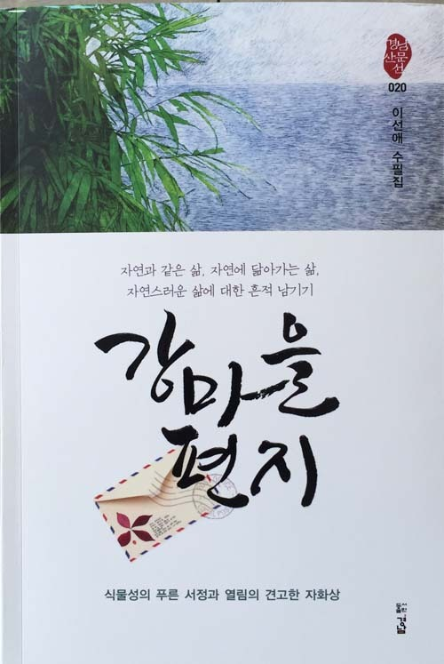
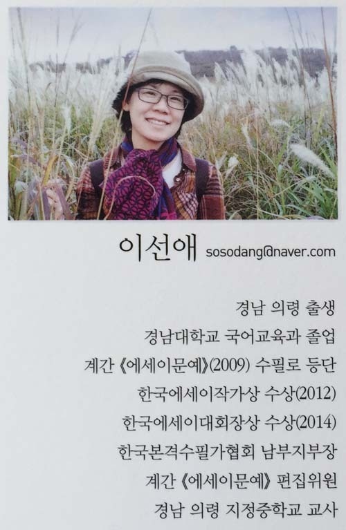

이선애의 <<강마을 편지>>를 받아들고

해군사관학교에서 전역한 뒤 자리 잡은 경남대학교 국어교육과. 당시 그곳엔 국어 선생님의 꿈을 갖고 몰려 든 지역의 인재들로 그들먹했다. 마산은 이은상, 이원수, 김수돈, 조향 등 별처럼 많은 문인들이 거쳐 간 문향이었다. 해동 최고의 문장가로 꼽힌 최치원의 발자취가 남아있는 월영동 캠퍼스, 그 발아래 펼쳐진 합포만, 그리고 합포만 건너편에 앉아있던 돝섬 등이 캔버스처럼 한 세트로 엮여 있었다. 가끔씩 길 잃은 갈매기들이 연구실 창문으로 날아와 기웃거리며 책상 앞에 앉아 있는 나를 들여다보던, 기가 막힌 ‘에코 유토피아’이기도 했다.

월영동을 떠난 뒤 십년쯤 되었으리라. 내 고향 태안으로 시집 와 멋지게 살고 있는 제자 김난주 시인을 통해 말을 걸어오기 시작한 이선애였다. 월영동에서 만난, ‘작고 말 없던 문학소녀’ 이선애. 가끔씩 내 홈피의 게시판에 ‘강마을 편지’를 올렸고, 경남 의령의 시골마을에 피어나던 풀꽃들을 말려서 보내주기도 했다. 그가 꽃 소식을 보내올 때마다 그 향내 속에서 내 어린 시절을 떠올리며 향수를 달랠 수 있었다. 월영동의 연구실에 앉아 녹차를 마시며 합포만을 내려다 볼 때의 내 마음처럼, 처음 그의 글은 담담하고 잔잔하기만 했다. 횟수를 더해갈수록 ‘담담함과 잔잔함’은 ‘옷소매를 당기는 매력’으로 바뀌기 시작했다. 간결하면서도 깔끔한 문장은 더더욱 좋았다. 그래서 한동안 ‘강마을 편지’가 배달되어 오지 않으면 은근히 궁금해지고, 걱정스러운 생각이 들기도 했다. ‘혹시 이선애가 강마을에서 북적대는 도시로 옮겨간 것은 아닐까’, ‘요즘 중‧고등학교 교단이 만만치 않다던데 글쓰기를 그만 둔 거나 아닐까’ ‘혹시 몸이 아픈 건 아닐까’ 등등. 별별 요사스런 생각이 들기도 했다.

그 긴 세월. 목소리 한 번 들려주지 않은 그였다. 의령의 남강에서 길어 올린 ‘청수 같은 글 몇 단락’으로 할 말을 대신하던 그였다. 이역만리 해외에서도 버튼만 누르면 이웃집 친구처럼 대화할 수 있는 요즈음이다. 맑은 글로, 말린 들꽃으로 수다를 대신할 수 있다니! 정녕 이건 ‘시대를 거스르는 기적’이다. 진정으로 아껴야 할 추억을 간직한 사람들이라면, 그들 사이에 무슨 말이 필요할까. 석가모니가 모여 있던 제자들에게 연꽃을 들어보이자, 그 가운데 가섭만이 홀로 빙그레 웃었다지 않는가. 그래서 ‘염화시중(拈華示衆)의 미소’란 말이 나왔고. 원래 그는 나의 제자였으나, 의령 남강 가에서 이십년 가까이 수도했으니, 그와 내가 자리바꿈할 때도 되었으리라. 그래서 그가 자신의 마음을 담아 들어 보이는 ‘말린 들꽃’에 내 미소로 답하노라. 부처의 연꽃에 미소로 답한 그 옛날의 가섭처럼.<2005. 2. 24.>

공유하기

게시글 관리

**백규서옥\_Blog ver.**

[저작자표시 비영리 변경금지
(새창열림)](https://creativecommons.org/licenses/by-nc-nd/4.0/deed.ko)