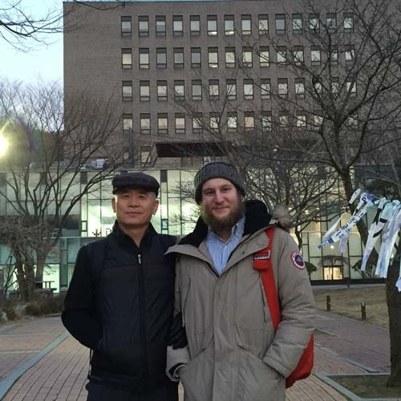
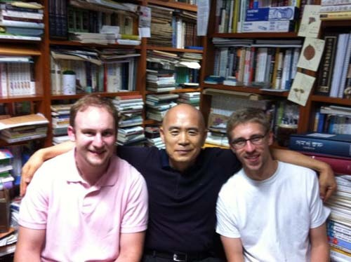
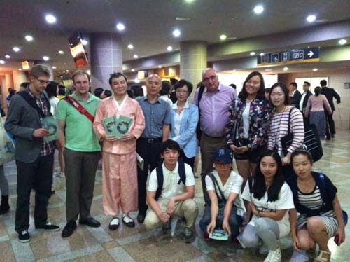
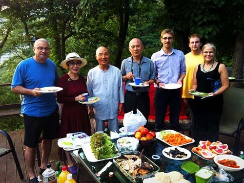

  
떠나기 전날 찾아온 게리와 함께 숭실교정에서

  
어느 여름날 찾아온 두 사람.   
왼쪽부터 게리, 백규, 세바스티안(시조를 전공하는 독일인)

게리(Gary Younger)를 보내며

작년 9월부터 한국학중앙연구원의 ‘차세대 한국학자 프로그램’에 참여하여 6개월을 보낸 게리(Gary Younger)가 미국으로 돌아갔다. 그간 한국말을 열심히 배운다고 했는데, 30여년 모어(母語)인 영어만 쓰다가 처음으로 한국어를 접해서인가. 귀국 인사차 연구실로 찾아온 그의 한국어 실력을 테스트하다가 안타까움을 금치 못했다. ‘참 외국어를 익히는 것이 이렇게도 어렵구나!’란 깨달음과 함께, 나이 들 만큼 든 지금도 영어 책을 놓지 못하고 있는 내 모습이 그에게 오버랩되는 건 어쩔 수 없다.

\*\*\*

2013년 9월 1일부터 오클라호마 주립대학(Oklahoma State University) 역사과에서 나는 한 학기 예정의 ‘풀브라이트 방문학자(Fulbright Visiting Scholar)’ 생활을 시작했다. 맨 처음 공항으로 픽업 나왔던 중국인 두 교수(Du, Yongtao), 학과의 비서인 수잔(Susan Oliver)과 다이아나(Diana Fury) 등이 일상적으로 만나던 사람들이었고, 연구실로부터 가까운 우편함이나 복사실 혹은 간식이 준비되어 있던 휴게실에서 만나는 교수들이 주로 접하는 대학인들의 대부분이었다. 사실 두 교수도 ‘강의실-연구실-복사실’ 등을 통통거리며 굴러다니듯 바쁘게 지내는 바람에 대면할 틈은 그리 많지 않았다. 그런데 그곳 생활을 시작한 지 한 달쯤이나 되었을까. 두 교수가 메일과 전화로 ‘강사 중 누군가가 나를 만나고 싶어 한다’는 연락을 보내 왔다. ‘한 공간에 살면서 그냥 찾아와 문을 두드리면 되지, 중간에 누구를 넣는 건 뭐란 말인가?’라고 생각하면서도 ‘Any time okay!’라는 답신을 보내게 되었다. 그리고 나서도 한 주일이나 되어서야 그는 조심스럽게 내 연구실로 찾아왔다. 전형적인 ‘코카서스 인종’의 미국인이었다. 말을 들어보니, ‘예의 바르다’고 할 수도, 낯을 가린다고 할 수도 있는 그의 모습이었다. 고등학교 역사교사로 있다가 사직한 뒤, 이곳에서 박사과정을 밟으며 ‘한-미 외교사’에 큰 관심을 갖고 있는 젊은이였다.

그 때부터 우리는 간간이 만났다. 주로 내 연구실에서, 가끔은 학교 안팎의 식당들에서. 대화의 주제는 그와 내가 번갈아 정했다. 나는 한국의 정치 외교적 이슈들에 관해 주로 Korea Herald에 실리는 칼럼들을 소개했고, 그는 NYT나 WP 등에 실리는 미국의 정치 외교 관련 기사들을 준비해왔다. 내가 말하는 한국의 사정, 그가 말하는 미국의 사정은 수산시장의 새벽 경매에 나온 물고기들처럼 늘 싱싱했다. 그래서 우리의 대화는 항상 종횡무진이었다. 그는 내게 최고의 미국 선생님, 나는 그에게 최고의 한국 선생님이었다.

그런 과정에서 나는 가끔 호기를 부리며 “여기서 나를 몇 달 동안 만나고 직접 한국으로 가서 공부하게 되면, 머지않아 당신은 미국 최고의 한국 전문가가 되리라!”고 큰소리치며 그에게 용기를 불어 넣었다. 사실 그는 경제적으로 여유롭지 못했고, 그런 이유로, ‘돈 한 푼 안들이고’, 아니 오히려 ‘약간의 돈이라도 지원을 받는 조건’으로 한국에 체류하며 한국을 배우고 싶어 했다. 내 분야이든 정치 외교 분야이든 외국인의 한국 연수에 관한 정보를 전혀 갖고 있지 못하던 나로서 약간 켕기기는 했지만, ‘나중에 어떻게 되겠지’ 라는 생각으로 대책도 없이 그에게 용기를 불어넣기에 바빴던 것이다. 그러나 내 미국 체류 예정기간이 점점 줄어들면서 그도 내 눈치를 보는 듯 했고, 나 역시 ‘뱉어놓은 말들’ 때문에 초조해지기 시작했다.

하는 수 없이 한국학중앙연구원, 동북아역사재단 등에 연락을 넣자 한국학중앙연구원에서 답이 왔다. 게리에게 맞는 프로그램이 있다는 것이었다. 이른바 ‘차세대 한국학자 프로그램’으로, 외국의 젊은 학자 혹은 학자 지망생이 돈을 받으며 공부도 할 수 있는 기회였다. 목 말라오던 차에 발견한 오아시스가 바로 이런 것인가. 다음날 게리를 만나 상세한 정보를 넘겨준 다음, 두 주의 여유를 줄 테니 양식에 맞추어 작성한 프로포절을 보여 달라고 했다. 그러자 그는 득달같이 프로포절을 작성하기 시작하여 지도교수의 확인을 거친 다음 약속날짜 이전에 건네주는 게 아닌가. ‘한국전쟁 이후 한-미 외교 현안들의 이념적 기조’라는 제목의 글. 아마 그가 박사논문으로 쓰려고 준비하던 내용의 일부인 듯, 논리가 매우 치밀하고 온당했다. 한국학중앙연구원의 프로그램이 요구하는 기대지평을 훨씬 뛰어넘는 수준이라 판단했는데, 과연 그는 선정되어 한국으로 올 수 있었다.

그는 처음 넉 달 동안 연구원 내에서 한국어를 열심히 수강했고, 나머지 두 달 동안은 국립중앙도서관을 오가며 자료수집에 몰두했다. 간혹 내게 찾아와 삼겹살에 소주를 즐기며 자신의 한국생활을 말하곤 했다. 작별의 인사를 하러 온 날. 그의 턱과 볼을 에워싼 멋진 수염을 보게 되었다. 객지에서 매일 수염 깎는 일이 귀찮아서였을 수도 있겠지만, 무언가 자신의 변화를 가시화 시키고자 하는 뜻이 들어 있었으리라.

많은 말들을 남긴 채, 또 멋진 수염을 통한 모종의 암시를 남긴 채, 그는 떠났다. 난생 처음 겪는다는 해외 체류이자 한국 체류 6개월. 그는 앞으로 어떻게 변해갈까. 내가 큰소리 친 것처럼, 머지않은 장래에 그는 ‘미국 내 최고의 한국 전문가’가 될 수 있을까.

  
    추석 지난 뒤 문현 선생의 작품 발표회에서. 왼쪽부터 세바스티안, 게리, 문현 박사, 백규,   
송지원 박사(국립국악원 연구실장), 케이트 교수(영국 런던대 음악과) 등과   
숭실대 국문과 학생들(이수빈, 박문성, 리아, 최연, 권리나)

  
2014년 추석날의 멋진 모임.  
선무치료학의 대가 이선옥 박사 자택 뒷산의 '노래와 담소 모임'에 합류한 게리와 세바스티안.  
왼쪽에서 두번째 인사가 이선옥 박사, 그 다음이 범패의 대가 범진 스님, 백규.

공유하기

게시글 관리

**백규서옥\_Blog ver.**

[저작자표시 비영리 변경금지
(새창열림)](https://creativecommons.org/licenses/by-nc-nd/4.0/deed.ko)