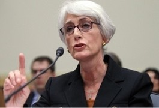

정신 차립시다!-웬디 셔먼의 말을 듣고

#1 유럽 여행 중, 독일의 본(Bonn)에 들른 적이 있다. 여행 정보가 필요하여 시내의 관광안내소를 찾았다. 직원이 환하게 웃으며 우리를 맞더니 대뜸 “일본에서 오셨지요?”라고 물었다. 내가 “아니오. 한국인이오!” 하고 대답했더니, 순간 표정과 응대가 사뭇 사무적으로 바뀌는 것을 경험했다.

#2 정확한 장소는 잊었지만, 유럽 또 다른 도시에서의 일이다. 민박을 하게 되었는데, 주인이 우리에게 ‘야뽕이냐’고 물었다. 우리를 일본 사람으로 확신하고 물었을 것이다. 내가 대뜸 “아니오!” 라고 대답하자, ‘그럼 시이나인가?’ 라며 또 물었다. ‘일본 사람 아니면 중국 사람이겠지!’라는 판단에서였을 것이다. 그래서 나는 “아니오. 한국인이오!”라고 약간 목소리를 높여 대답하자 머쓱해하며 물러났다. 다음 날 아침 식당에서 주인이 서빙을 하다가 지도 한 장을 펴 보였다. 우리나라를 가리키며 ‘여기서 당신네 나라를 찾았소. 그럼 남이냐 북이냐?’를 물었다. 그래서 나는 “남쪽에 사는 한국인이오!” 라고 대답하자, 그 때서야 미소를 보였다. 그는 한국 사람을 처음 만난 듯 했다.

#3 재작년 미국 오클라호마 주. 지역 박물관들 몇 군데를 도는 동안 6‧25 참전용사를 만났고, 다른 곳에서는 이미 작고한 참전용사의 아들을 만나기도 했다. 말하자면 그들은 1950~53년 어름의 한국을 직·간접적으로 체험한 사람들이었다. 말을 나누다 보니, 그들 마음속의 한국은 아직 ‘1950년대 초반’에 머물러 있었다. 그래서 그런가. 우리를 바라보는 그들의 시선에는 ‘연민과 경이’의 상반된 정서가 착종되어 있었다. 폐허 속에서 코를 찔찔 흘리며 초콜릿을 구걸하던 그 모습과, 그나마 외국여행이랍시고 나선 우리에게서 일종의 심각한 언밸런스를 발견했을 것이다.

#4 최근 다녀 본 미국과 유럽, 중앙아시아나 러시아 등의 도로들엔 일본차들이 부지기수로 달리고 있었으며, 새 차는 물론 중고차도 일본차들은 ‘인기 만점’이었다. 미국에서 차를 사려고 하니 대부분 ‘이왕 사려면 일본차를 사야 한다’는 충고를 해주었다. 품질도 믿을만하고 중고로 팔 때 제값을 다 받을 수 있다는 것이었다. 심지어 어떤 한국인은 삼성 폰을 만지작거리던 미국사람에게 ‘그게 어디서 만든 것인지 아느냐’고 물었더니 대뜸 ‘일본 제품’이라고 답하더라며 탄식을 했다. 그 정도로 서양에서 ‘일본 브랜드’의 위력은 대단했다.

#5 우리나라에 체류하고 있는 ‘원어민 영어 교수’와 가끔 만난다. 서로 간에 흉허물이 없어졌다싶을 즈음 싱거운 질문 하나를 던졌다. “왜 당신을 포함한 서양인들은 일본이나 일본인을 좋아하는가? 2차 세계대전에서 맞붙어 싸운 적국 아닌가?” ‘이 친구도 일본을 좋아하겠지?’라는 내 추정을 확신으로 깔고 던진 물음이었다. 대부분의 한국인들이 일본인을 좋아하지 않음을 잘 알고 있으면서도 그는 분명히 말했다. 아니나 다를까 “우리가 일본을 좋아하는 이유는 간단하다. 그들이 만들어 온 물건들과 그들이 지속해온 문화와 깔끔한 성품 땜에 일본이 좋다.”는 것이었다. 그래도 “과거에 전쟁을 일으켰고, 함부로 역사를 수정하려 하며, 약삭빠른 그들을 꼭 좋아해야 하는가?”고 다시 물었더니, “지난 일은 내가 알 바 아니고, 지금 좋으면 된다.”고 답했다.

‘과거사는 한·중·일 3국 모두가 책임이 있으니까 빨리 정리하고, 북핵 같은 당면 현안에 치중해야’/‘민족 감정은 악용될 수 있고, 정치인들이 과거의 적을 비난해 값싼 박수를 받는 것은 어렵지 않은 일’ 등은 최근 웬디 셔먼(Wendy Sherman) 미 국무차관이 공식석상에서 했다는 말의 요지다. 일본 편을 들어 우리를 비난하고 있음은 불문가지다. 누구는 ‘뭐 한갓 아녀자의 말이니 그냥 모른 척 하자’고 하는 모양이지만, ‘세계의 조정자’를 자처하는 미국의 외교 수뇌부가 공식석상에서 뱉은 말에 우리가 대범할 수는 없게 되었다.

미국인들을 몇 번 만나 보면 개인이든 공인이든 마음과 달리 ‘외교적 언사’가 매우 매끄럽고, 이른바 ‘포커 페이스’(poker face)에 능하다는 점을 깨닫게 된다. 그래서 구한말의 “일본 놈 일어난다. 소련 놈에게 속지 말고, 미국 놈 믿지 말자”는 항어(巷語)도 나왔으리라. 미국 고위관료의 말과 표정만 믿고 돌아와 ‘걱정 말라’고 큰소리치다가 된통 당하기만 하던 과거 우리나라 관료들의 순진함도 이런 외교적 언사와 포커 페이스에 당한 결과들이리라.

유럽이나 미국인들이 일본과 일본인들을 좋아하는 이유를 사실 우리는 잘 이해할 수 없다. ‘6‧25 때 자국의 군대를 파견하여 우리를 위해 피를 흘려주었으니, 당연히 우리 편을 들어주겠지’, ‘세계대전에서 악랄한 일본군으로부터 몹쓸 시련을 받았으니 당연히 우리 편을 들어주겠지’ 등등. 우리는 너무 순진해서 탈이다. 미국에 가보면 주류사회에 많은 일본인들이 진출해 있고, 일본 여자와 결혼한 미국의 고급관료들이나 오피니언 리더들을 꽤 보게 된다. 그 뿐인가. 얼마 전까지만 해도, 어린 시절엔 소니의 게임기에 빠져 살았고, 자라면서 워크맨이나 모바일, PC 등에 조종당하며, 토요타 등이 생산하는 일본차를 타고 일생을 보내던 사람들이 잘 나가는 미국인들이었다. 1998년 미국에서 만난 어떤 아이에게 ‘나중에 자라면 어디를 젤로 가고 싶냐?’고 물었더니, ‘일본’이라고 서슴없이 대답했다. 왜 그러느냐 물었더니 ‘이렇게 재밌는 게임기를 만들어낸 나라에 꼭 가보고 싶다’는 대답이었다.

\*\*\*

유럽과 마찬가지로 미국 역시 일본 편일 수밖에 없다. 간혹 오바마 대통령이 짐짓 일본을 꾸중하는 듯한 표정을 짓기는 하지만, 경험칙으로 보아 포커 페이스임이 분명하다. 이쯤 우리는 집단적 착각에 빠져 있는 우리의 모습을 깨달아야 한다. 세계 사람들은 우리를 그리 대단하게 여기지 않는다. 언론들은 우리 전화기, 자동차, K-POP이 세계를 제패한 듯 떠들고, 흡사 세계인들이 모두 우리를 주목하는 듯 하지만, 사실은 그렇지 않다. 우리가 망한다 해도 더이상 군대를 보내주는 나라는 없을 것이다. 우리의 민족적 자존심이나 생존의 문제를 그들은 결코 자신들의 일로 생각해 주지 않는다는 점을 이 순간 아프게 깨달아야 한다. 국제사회의 냉혹함에 언제까지 둔감할 것인가.

공유하기

게시글 관리

**백규서옥\_Blog ver.**

[저작자표시 비영리 변경금지
(새창열림)](https://creativecommons.org/licenses/by-nc-nd/4.0/deed.ko)