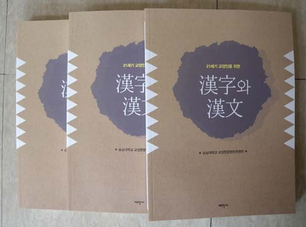

대학생들에게 한자와 한문을 가르칠 목적으로 <<21세기 교양인을 위한 한자와 한문>>이란 책을 새로 만들었습니다. '글자<단어<문장'으로의 단계별 교육내용을 담았고, 실습을 통해 매 단계의 배움을 체화(體化)시켜 나가려는 의도를 담았습니다. 그 뿐 아니라 풍부한 부록[간지/병첩한자/24절기/연령 한자어/세시풍속/차례상 진설용어/궁궐/사대문/전국행정구역/숫자/영수증과 차용증서/대한민국 성씨/기후/신체부위 명칭/구용 구사/호칭에 관한 한자/한중일 한자(3500자) 훈음(訓音)]을 붙여 일반인들도 생활 속의 참고서로 활용할 수 있게 꾸며보았습니다. 학교의 교육현장이나 일상생활에서 많이 활용될 수 있길 바랍니다.

태학사, 2015. 2. 26. 값 13,000원

참고로 아래쪽에 이 책의 의미를 압축하고 있는 머리말을 들어 놓겠습니다.

머리말

지식과 정보의 양이 매순간 폭발적으로 늘어나고 그 소멸 속도 역시 따라잡기 어려운, 이른바 ‘지식기반 정보화 사회’의 한복판에 살고 있다. 이런 상황에서 왜 우리는 ‘구시대의 유물’로 여겨지는 한자나 한문을 배워야 하는 것일까?

한자나 한문이 지닌 ‘지식 생산과 저장의 기능’은 놀랍다. 한자나 한문은 우리네 사유의 기반으로 수천 년간 지속되면서 지혜의 두께와 폭을 늘여왔다. 아무리 첨단의 지식과 정보가 넘쳐도 한자나 한문을 모르고서는 인간의 내면과 세상 변화의 이치를 깨치기 어려운 이유가 여기에 있다.

한자와 한문은 우리 민족이 수천 년 동안 사용해온 표기체계다. 그러나 지배계층의 독점욕과 교육기회의 불평등으로 대다수 민중은 상당기간 한자와 한문으로부터 먼 거리에 있었다. 그럼에도 그들은 한자와 한문이 조성한 사유체계로부터 한순간도 자유로울 수 없었다.

지식기반 정보화 사회의 선두에 서려면 한자와 한문이 지닌 ‘지식 생산과 저장의 원리’를 체득해야 한다. ‘중국의 한자나 한문’을 배우고 가르치려는 게 아니다. 수천 년간 우리 민족이 써왔고, 동아시아인들이 써온 표기체계의 한 축을 익히려는 것이다. 그걸 가르치는 것은 ‘지식정보의 고속도로를 달리는’ 젊은 세대에게 고성능 엔진을 하나 더 달아주는 일이다.

다년간 강단에서 한자와 한문을 지도해온 젊은 학인들[정영문 박사‧서지원 박사‧김성훈 박사‧ 윤세형 선생‧양훈식 선생]이 함께 엮어서 더 의미가 크다. 가르치는 자의 욕심을 적절히 깎아내고 배우는 자의 고단함을 헤아려, 아담하게 만들어낸 책이 더욱 아름답다.

을미년 새봄

조규익

공유하기

게시글 관리

**백규서옥\_Blog ver.**

[저작자표시 비영리 변경금지
(새창열림)](https://creativecommons.org/licenses/by-nc-nd/4.0/deed.ko)