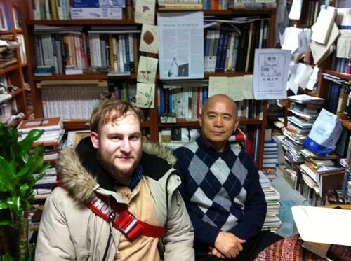
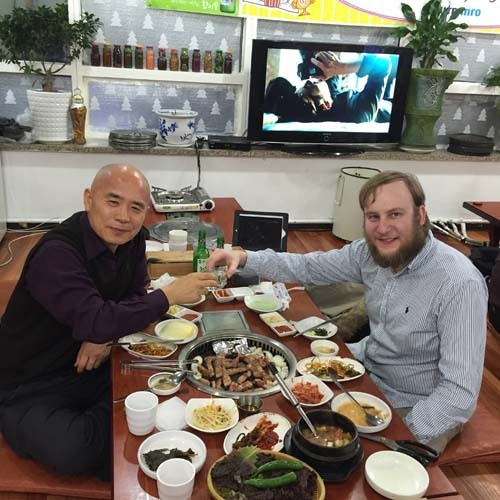
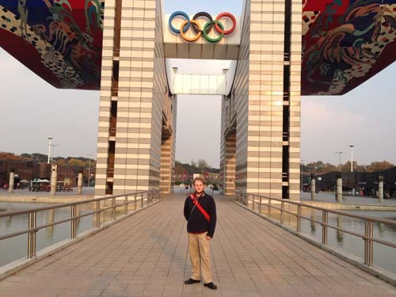
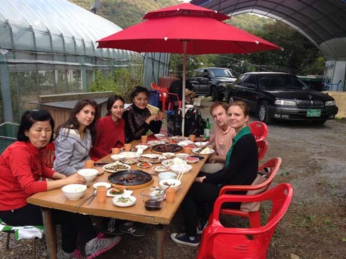
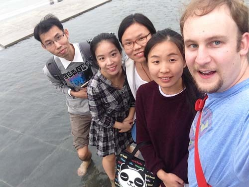

  
백규서옥에서

한국의 친구들에게

                                                                                              게리 영거

누구나 한국에 와 보고 갖게 되는 첫 인상들 가운데 하나는 ‘서두른다는 것’이다. 커피를 마시거나, 버스를 타고 여행을 하거나, 음식을 먹는 등 무엇을 하든 한국인은 항상 급하다. 한국인들은 항상 서둔다. 그러나 밖에서 친구들과 만날 땐 서두르지 않는다. 예컨대, 한국인 친구들과 저녁을 먹을 때 어떤 이는 먹고 이야기하느라 두 시간까지도 소비하지만, 반면에 점심시간으로 20분을 길다고 여긴다. 버스들은 한국인의 ‘빨리빨리’가 가장 극적으로 드러나는 사례들 가운데 하나다. 버스 운전사가 지그재그로 차를 몰아대고, 승객이 교통카드를 스캔하자마자 차를 출발시킬 땐 무섭다. 그리고 때로 모퉁이들을 휭하고 돌 때, 그들은 흡사 버스를 충돌시키려는 것 같다. 항상 서두르는 행동양식은 외국인들이 급히 서두는 한국인 누구에게서나 목격하는 첫 모습이다. 그리고 점차 시간이 지나면서 친구들과 함께 있을 때 약간 느긋해지는 한국인들을 목격하기 시작한다.

그 다음의 역설은 외국인들의 눈에 뚜렷이 보인다(특히 서양 사람들에게). 한국인들은 친절하기도 하고, 접촉을 꺼리기도 한다. 어떤 이는 내 말을 이상하게 여길지도 모른다. 한국인들은 외국인들에게 길을 가르쳐 줄 때, 헛갈리는 외국인 여행자들을 도와 줄 때 매우 친절하다. 그리고 그들이 음식을 주문할 때도 참을성이 있다. 그러나 이처럼 특수한 경우들 외에 한국인을 친구로 사귀는 일은 약간 어렵다. 백인으로서 나는 한국인들이 침범하려 하지 않는, 나를 두르고 있는 보이지 않는 경계선과 함께 여행을 한다. 버스나 지하철을 탈 때, 내 좌석엔 항상 나 혼자다. 장을 보고, 관광을 하고, 혹은 캠퍼스에서 공부를 할 때, 한국인들은 우리들(외국인)로부터 의식적인 거리를 유지한다. 이것이 복잡한 군중 속에서 편히 돌아다닐 수 있게 하긴 하지만, 그것은 (한국인과 외국인 사이의) 상호작용을 최소한으로 축소시키기도 한다. 그것은 때로 약간씩 짜증나는 일이기도 한데, 예컨대 엘리베이터를 탈 때 한국인들은 나를 보곤 그들 스스로 외국인인 나와 거리를 유지하기 위해 뒤로 물러선다. 최악의 경우 식당이나 상점에 들어갈 때 외국인들을 상대하게 되는 것을 피하려 달리기도 하고 숨기도 하는 한국인들을 보게 된다. 이것이 아마 한국 여행에서 가장 좌절감을 주는 일들 가운데 하나일 것이다. 외국인들은 한국인으로부터 배우고, 한국문화를 경험하고, 한국 역사를 공부하고, 한국인의 사고방식을 관찰할 목적으로 한국에 온다. 한국인들이 외국인들을 가까이 오게 하지 않는다면 이런 일들을 하기는 어렵다.

그 다음은 절이나 역사 유적 근처에서 가장 잘 목격되는 일들이다. 한국은 갑자기 근대화 되고, 서구화 되고, 기술 대국이 되었지만, 한국을 방문한 외국인들로 하여금 끊임없이 한국이 겪어온 사건과 역사들을 떠올리게 하는, ‘고풍스런 나라’이기도 하다. 예컨대, 한국을 여행할 때, 외국인들은 커피숍, 서양의 음악, 의상, 음식, 그리고 서양문화의 변종들을 발견하게 된다. 이제 한국인들은 당당하게 그들의 기술적 성취를 자부하고, 그들의 큰 기업들을 외국 관광객들에게 기꺼이 자랑한다. 어떤 사람들은 그들의 역사나 그들이 만들어낸 것들을 위해 박물관들을 짓기도 한다. 우리는 한국의 어느 곳에서나 많은 박물관들, 역사적 현장들, 고대의 건축물들, 그리고 문화유적들을 발견할 것이다. 그러나 그런 고대의 유적들을 둘러보는 순간, 거대한 건물들, 서구식 레스토랑들, 유럽풍의 커피점들이 그 지역을 둘러싸고 있음을 깨닫곤 놀라게 된다. 관광산업으로부터 얼마간의 득을 볼 수는 있겠지만, 고층빌딩과 스타벅스 커피점들이 이런 아름다운 유적들을 에워싸고 있다는 것은 실망스런 일이다. 이런 것들이 한국 경험의 한 부분이고, 그 독특함이다. 일상생활 속에 역사와 모더니티가 융합되어 있고, 최신의 고층빌딩으로부터 걸어 나와 고궁으로 들어갈 수 있는 경우는 한국이 유일한 듯 하다. 

현대와 고대의 융합은 오늘날의 한국을 정의하는 측면들 가운데 하나다. 그러나 한국에서 경험할 수 있는 최고의 순간은 박물관들과 고궁들에 접근할 때다. 거의 모든 박물관들은 무료로 입장할 수 있고, 고궁들의 경우 무료로 입장할 수 있는 날들이 있다. 이것은 미국이나 유럽 국가들과 분명히 대비되는 점이다. 그 지역의 나라들에서 당신은 그 나라들의 과거를 배우기 위해 돈을 지불해야 한다. 과거를 이해하고 대중들이 역사를 친숙하게 만들기 위해, 서구의 국가들은 한국의 방식을 제대로 모방해야 할 것이다. 당신이 주의하지 않는다면 쉽게 잃어버릴 수 있는 것이 과거에 대한 지식이고, 과거의 보존이야말로 어떻게 현재에 대처해야할지를 알려주기에 중요하다. 그렇긴 하지만, 한국은 외국인들을 대하는 데 있어서는 서양 국가들로부터 배워야 한다.

거품을 부수는 일은 한국인들이 국제적인 기업과 세계 공동체를 통합하기 위해 반드시 우선적으로 해야 할 일들 가운데 하나다. 외국인들에게 다가가 말을 걸고, 그들로 하여금 부담 없이 한국을 환영할 수 있도록 만들어야 한다. 외국인에게 다가가고 버스에서 그들 곁에 앉으며 날씨에 관해 묻는 것만으로도 한국에 대한 외국인의 인지도를 높이는 일이 될 것이다. 내가 만난 많은 연구자들과 외국 학생들은 자신들 가운데 소수만이 한국인들과 이야기를 나누고 만날 수 있었을 만큼 한국이 ‘은자의 왕국[Hermit Kingdom]’이라는 점을 계속 강조했다. 이제 수년 동안 한국에 있어온 그들은 비즈니스 중심으로서의 한국에 대한 최신의 관점을 갖게 되었다. 그러나 그런 학생들마저 한국 사회의 거품 안에서 방황한다. 한국어와 영어로 기꺼이 묻고 대답하는 것은 한국의 이미지를 엄청나게 확장시킬 것이고, 그것은 한국의 낡은 이미지를 깨부수고 외국인들이 한국에 머무는 동안 환영받는다는 느낌을 주게 될 것이다.

그렇긴 하지만, 나는 몇몇 한국 친구들을 사귀었다. 그리고 그들과 계속 접촉하면서, 다음 번 한국에 돌아왔을 때 그 만남이 다시 지속되기를 희망한다. 나는 조규익 교수님과 이완범 교수님께 감사드리고 싶다. 그들의 도움이 없었다면, 나는 한국에 올 수 없었을 것이고 내 개인 연구에서 이만큼의 진전을 이룰 수도 없었을 것이다.

My Impression of Korea

Gary Younger

One of the first things that one notices in Korea is the speediness of everything. No matter what you are doing Korean are always in a hurry, whether drinking coffee, traveling on the bus, or eating food. Koreans are always in a hurry. However, Koreans also take their time when they are out with friends. For example, when having dinner with Korean friends one might spend up to two hours eating and talking, while Koreans consider a long lunch twenty minutes. The busses are one of the most dramatic demonstrations of the Korean balli balli. For the first month the buses are terrifying as the driver weaves in and out of traffic, takes off as soon as you scan your card, and at times seems as if they are going to crash the bus as they zoom around corners. This style of hurry up all the time is the first thing that foreigners notice about Korea everyone is in a hurry and as time passes you start to notice the people and groups that slow down a little when they are with friends.

The next paradox is apparent to foreigners(westerners especially). Koreans  are both friendly and closed off from contact.One mightwonderwhatImean. Koreans are very nice to foreigners, when it comes to giving directions, helping the confused foreigners travel around, and are patient when they order food. However, outside of these particular instances making Korean friends is a little difficult. As a Caucasian, I travel with an invisible boundary around me that Koreans will not cross. When taking the bus I always have a seat to myself, the same on the subway. When shopping, sightseeing, or working on campus Koreans maintain a conscious distance between us. While this makes traveling through a crowd easy, it does keep interactions to a minimum. It is also slightly annoying at times, for example when taking the elevator and Koreans step onto the elevator, see me, and step back off the elevator to avoid having to get closer to the foreigner. In the worst cases, one can see Koreans run and hide when you walk into a restaurant or store to avoid having to deal with the foreigners. This is probably one of the most frustrating things about traveling to Korea. Foreigners come to Korea to learn from Koreans, experience Korean culture, study Korean history, and observe the Korean mindset. This is difficult to do when Koreans will not allow you to approach.

The next point is noticeable mostly around the temples, and historical sites. Korea is at once a modern, western, technological powerhouse, and also an ancient country constantly reminding the people that visit of the events and history that Korea has lived through. For example, when traveling around Korea, one finds coffee shops, western music, clothing, food, and variations of western culture. Now, Koreans are justifiably proud of their technological accomplishments and love to show off their large firms to tourists. Some have even gone so far as to create museums dedicated to their history or their products. At the same time, one will find hundreds of museums, historical sites, ancient buildings, and cultural relics around every corner in Korea. However, when traveling around the ancient sites one will suddenly realize that tall buildings, western restaurants, and European style coffee shops surround the location. While in part this is to benefit from the tourist industry, it is disappointing that skyscrapers and Starbucks surround these beautiful areas. That said this is part of the experience and the uniqueness of Korea. Only in Korea is there such a fusion of history and modernity in everyday life, where one can walk out of a brand-new skyscraper into an ancient palace.

This fusion of modern and ancient is one of the defining aspects of modern Korea.  However, the best part of Korea is how accessible the museums, and ancient palaces are. Almost all of the museums are free and the palaces have days that one can enter for free. This is a stark contrast to America and the European countries where you have to pay to learn about the past of those countries. This desire to understand the past and to make history accessible to the populace is something that western countries would do well to copy from Korea. Knowledge of the past is something that can be easily lost when if you are not careful, and the preservation of said past is important as it shapes how one deals with the present. That said Korea could take a page from the western nations in dealing with foreigners.

Breaking the bubble is one of the first things that Koreans need to do to integrate into the international business and global community. Approach the foreigners, talk to them, and make them feel welcomed to the country. Just by approaching a foreigner, sitting by them on the bus asking about the weather will help to improve the foreigner’s perception of Korea. Many of the researchers and foreign students that I have meet continue to focus on Korea as the Hermit kingdom as few have found a group of Koreans that they can speak with or meet. Now those that have been in Korea for multiple years have a more up to date view of Korea as a business center, but even those students move about within a bubble in Korean society. A willingness to ask and answer questions in both Korean and English would benefit Korea’s image abroad tremendously as it would start to break down this old image of Korea and will also make the foreigners feel welcomed during their stay in Korea.

That said, I have made a few Korean friends and I hope to stay in touch with them and to meet them again when I return to Korea the next time. I would like to thank Dr. Cho, Ku Ick and Dr. Lee, Wan Bom as without their assistance I would have been unable to travel to Korea and progress so far in my own personal research.

  
게리와 함께 소주 한 잔!

  
올림픽 공원에서

  
함께 공부하던 외국인들과 야외파티를

  
외국인 동료들과

공유하기

게시글 관리

**백규서옥\_Blog ver.**

[저작자표시 비영리 변경금지
(새창열림)](https://creativecommons.org/licenses/by-nc-nd/4.0/deed.ko)